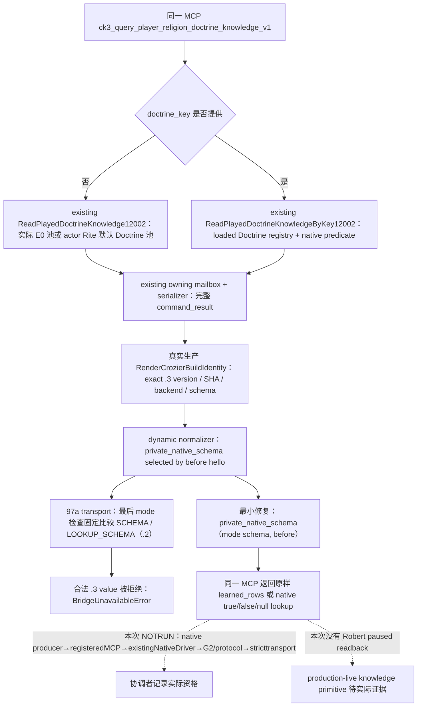
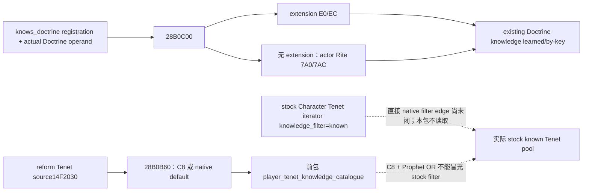

# CK3 1.20.0.3：同一 Doctrine knowledge MCP 的 schema 修复

本包解除一个实际源码故障：合法 `.3` 的 learned/by-key Doctrine knowledge 响应已通过动态 normalizer，却在 transport 最后的 mode 检查中被固定 `.2` schema 拒绝。修复复用同一 MCP、原生读取器和 DTO；没有新增 knowledge getter。

- 冻结来源：`97a2a77da0359ceb1215e1ee8ce57831cda5f531`，隔离树 `C:/codex-ck3-background/parallel-integrations-20261007/faith-postreform`。
- 冻结游戏：CK3 `1.20.0.3`，EXE SHA-256 `94B55397ABB687A3DCD436805A5D885E6BE90FA6C693FEB44A9E3BBEEADE02A6`；同一旧 `.2` schema 继续由其实际 build 身份选择。
- 实际研究开始：2026-10-07 00:25:45 Asia/Shanghai（2026-10-06 16:25:45 UTC）。本专题在 Oct7 新日施工，未倒填为 Oct6 早会计划。
- 当前资格：源码故障和最小修复路径已定位；本代理 build/native FIRST/consumer/live 全部 `NOTRUN`。协调者执行唯一 joint FIRST 后另录实际结果，不能把本页方案当成新实机资格。

## 原生树与 transport 故障



[static-confirmed/source] Native 路由把同一 step 交给 `HandlePlayerReligionDoctrineKnowledgePrivate12002`，复用 `ExecutePlayerReligionDoctrineKnowledgeMailbox12002`。无 key 时直接读真实 played Character 的完整 learned collection；有 key 时遍历已加载 Doctrine registry 并调用 `native_knows_doctrine`。available 结果仍核对 owning frame 的实际 actor/date；原生读取器两次读取并比较完整 rows。

[static-confirmed/source] Serializer 使用现有 `.2` 命名空间和 schema 常量，生产 bridge 的 `write_frame` 再调用 `RenderCrozierBuildIdentity`。该函数对实际 `.3` descriptor 替换 schema 前缀、版本、backend 和 EXE 身份。源码文件名及 DTO namespace 为复用实现的名字，不能据此把实际 `.3` wire 改回 `.2`。

[static-confirmed/source] `normalize_player_religion_doctrine_knowledge_v1` 已用 `private_native_schema(SCHEMA, snapshot)` / `private_native_schema(LOOKUP_SCHEMA, snapshot)` 识别动态 schema，再检查 exact build、字段集合、typed values、actor/date 和 availability。97a transport 随后仍比较固定 `.2` 常量：

```python
value["schema"] != (SCHEMA if mode == "learned_rows" else LOOKUP_SCHEMA)
```

`.3` 的两个合法值分别为 `ck3_12003_played_doctrine_knowledge_v1`、`ck3_12003_played_doctrine_knowledge_lookup_v1`，必然与这两个固定 `.2` 常量不同。修复只把这次比较的期望值改为：

```python
private_native_schema(SCHEMA if mode == "learned_rows" else LOOKUP_SCHEMA, before)
```

这是实际生产查询路径中的确定性源码故障；此页没有声称已运行修复前后案例。normalizer 和 exact identity 检查继续复用，未放宽 payload 的来源或数据含义。

## 已有字段的实际含义

| 模式/状态 | 真实原生输入与输出 | 本包复用方式 |
|---|---|---|
| learned，extension 存在 | Character `+1C8` → extension `+E0` pointer array / `+EC` count；`knowledge_source=character_extension` | 保留原生顺序、重复项、每项 Doctrine/group key 与 typed `native_knows_doctrine`；不排序或去重 |
| learned，无 extension | 实际 actor Rite → `+7A0` array / `+7AC` count；`knowledge_source=rite_default` | 原生对象可读且 count=0 是合法 `available=true, learned_rows=[]`；无法读对象仍有实际 unavailable reason |
| by-key，定义存在 | 已加载 Doctrine registry `+50/+5C`，命中稳定 `doctrine_key` 后调用 `28B0C00` | `definition_found=true`；native result 为真实 `true` 或 `false` |
| by-key，完整 registry 中无 key | 实际遍历后无命中 | `available=true, definition_found=false, definition=null, native_knows_doctrine=null` |
| source 不可读 | reader/owning frame 给出的失败 | 保留 `available=false` 与具体 reason；不能当成未学会 |

共同字段仍是 `schema/game_version/executable_sha256/available/unavailable_reason/capture_epoch/date_raw/played_character_id`。learned 另含 `rite_id/knowledge_source/learned_rows`；by-key 另含 `requested_doctrine_key/definition_found/definition/native_knows_doctrine`。`capture_epoch` 为 owner pump epoch；transport 增补的 query revision/date、backend 和 provenance 继续沿原路径发布。

## E0 Doctrine 与 C8 Tenet 的类型校正

[static-confirmed/cached source] `knows_doctrine` registration `0x592AA0` → factory `0x2B30020` → trigger Evaluate `0x2B2C130` → `0x28B0C00`。此 predicate 的 extension 分支读 `E0/EC`；无 extension 分支读实际 Rite 的 `7A0/7AC` Doctrine pointer list。现有 Doctrine knowledge reader 和本次修复的 MCP 已覆盖这两种来源。

[static-confirmed/cached source] 旧 conversion outcome manifest 把 `0x28B0CD0` 命名为 `Character.add_known_tenet_entry`。其实际 caller `28B09DA–28B0A06` 从 Rite `7A0/7AC` 取元素，再交给 writer 的 `E0/EC` collection；结合已消歧的 Doctrine registration 和实际 reader，该旧名称不能证明一个缺失的 Tenet 知识池。旧 conversion gates manifest 对 `28B0A30` / `28B0C00` 的 Doctrine/Tenet 名称同样不能覆盖后续 registration/type 消歧。

[static-confirmed/cached source] Tenet source 使用另一个 getter `0x28B0B60`：Character `+1C8` → extension `+C8`，无 extension 返回原生 default collection。该 getter 的 `.3` 完整 154B 已在前包闭合，本包直接复用其证据，新增 PE 读取为 0。`28B0A30` 的旧 `.2` body 读取 C8，或无 extension 时读取当前 Rite `788/794` 非零状态；本包没有新增该 body 的 `.3` 资格，也没有强读它。



`Doctrine learned knowledge`、`Tenet C8 source`、`Prophet OR`、stock `knowledge_filter=known` 和最终 `shown/selectable` 是不同输入。此修复只恢复已有 Doctrine knowledge 数据到 consumer 的可达性；不会增加最终 reform legality 或 action readiness。actual draft slots/blank rows、最终 validator/reasons、aggregate/base cost、creation kind 和 current/main/personal/effective Tenet 状态全部复用已有能力，未在本包重做。

## 最小文件与 FIRST

生产修改只有既有 Python transport 的一行 schema 比较，由协调者负责。新增本专题、一个使用真实 reader/mailbox/serializer/`.3` renderer 的 whole native fixture、一个消费其完整 wire 的 sole registered MCP fixture及 CMake 接线，按既定文件归属分工；没有新增 getter、API、FeatureFlag 或 Gateway。

冻结 native wire 文件：

1. `learned-e0-order-duplicates.json`：E0 原生顺序和重复项保留。
2. `learned-rite-default-empty.json`：实际 actor Rite fallback，合法空集合。
3. `lookup-known-true.json`：`doctrine_a` 存在且 native predicate 为 true。
4. `lookup-known-false.json`：`doctrine_c` 存在且 native predicate 为 false。
5. `lookup-definition-not-found.json`：完整 registry 中没有 `doctrine_absent`，保留 null。

FIRST 的 producer 必须走真实 owning collector/serializer/`.3` renderer；sole consumer 直接读 native 生成的五个完整文件，再走 `registeredMCP → existingNativeDriver → G2/protocol → stricttransport`，不能手拼 flat payload 替代。既有 MCP 直接调用 Driver，Driver 直接调用现 transport，本包不增加 forwarder。修复前的拒绝可由同一实际 schema 比较说明，实际执行结果由 Root joint FIRST 记录。本代理未运行 FIRST，不新增游戏日、native/live 信用或 cleanup 信用。

新 fixture 冻结 target `xar_ck3_12003_doctrine_knowledge_schema_mailbox_test`，consumer 文件 `test_doctrine_knowledge_schema_12003.py`，wire 目录变量 `XAR_DOCTRINE_KNOWLEDGE_SCHEMA_12003_NATIVE_WIRE_DIR`。其合成 owner actor `50331652`、date `53175816`、native revision `701`、actor Rite `0x82000002`；capture epoch 使用实际 fixture pump epoch且不等于revision。E0 rows 为 `doctrine_b/doctrine_a/doctrine_b`（`group_a`、均 true）；fallback 案例读取空的 actor Rite Doctrine list，另一个 main Rite 的 `doctrine_c` 不应混入。by-key `doctrine_c/group_b` 为真实 false，absent key 保留 null。以上是冻结 fixture 输入，尚未执行；不是 Robert29829 的 live frame。

## 来源入口与外置报告

- [原生研究前置](README.md)、[既有 Doctrine knowledge 合同](religion_doctrine12002_choices.md)、[创建/改革原生树](religion-conversion-and-reformation-native-ai-12003.md)。
- 原生读取器：[religion_doctrine12002_choices.cpp](../../ck3_autonomous_player/native_bridge/src/religion_doctrine12002_choices.cpp)；[mailbox/完整 serializer](../../ck3_autonomous_player/native_bridge/src/religion_doctrine12002_choices_mailbox.cpp)。
- 路由：[ck3_12002_nonwar_router.cpp](../../ck3_autonomous_player/native_bridge/src/ck3_12002_nonwar_router.cpp)；生产写入：[bridge.cpp](../../ck3_autonomous_player/native_bridge/src/bridge.cpp)；实际 `.3` renderer：[ck3_12003_adapter.cpp](../../ck3_autonomous_player/native_bridge/src/ck3_12003_adapter.cpp)。
- consumer：[原有 transport](../../ck3_autonomous_player/src/xar_autoplayer/bridge/player_religion_doctrine_knowledge_private_transport.py)、[dynamic schema/build helper](../../ck3_autonomous_player/src/xar_autoplayer/bridge/nonwar_private_build.py)、[已注册 MCP](../../ck3_autonomous_player/src/xar_autoplayer/bridge/mcp_server.py)。
- [独占 known-input 研究与类型账本](Z:/ck3_mod_rewrite_process_assets/g2-parallel-20261007/faith-postreform/known-input-research/SOURCE-TREE.md)；[本代理 ROOT fields](Z:/ck3_mod_rewrite_process_assets/g2-parallel-20261007/faith-postreform/known-input-research/ROOT-DELIVERY.json)；[Oct7/W41 fields](Z:/ck3_mod_rewrite_process_assets/g2-parallel-20261007/faith-postreform/known-input-research/OCT7-W41-FIELDS.json)。
- [Python 真实 source coverage](Z:/ck3_mod_rewrite_process_assets/g2-parallel-20261007/faith-postreform/consumer-gap-research/SOURCE-COVERAGE.md)。

本代理实际成本：cached/source-only；outer `cmd.exe`, `login=false`；新增 PE 字节 0、hash 0、游戏/SDK/pipe 0、build/test/project import 0、commit/diffcheck 0。写入范围仅本新专题及独占外置研究目录。
