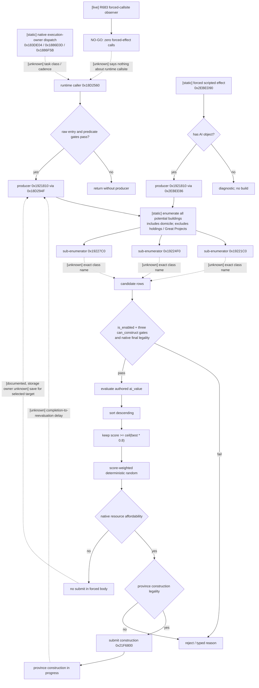

# CK3 1.19.0.6 直辖领地建设与升级原生 AI 树

## 状态与范围

- **[static-confirmed]** 本专题冻结 CK3 `1.19.0.6` 的原版建筑候选门、`ai_value` 评分、头部
  `80%` 入围带、带权随机选择、预算储备背景、施工提交边以及原版对“存钱等目标”的明确说明。
- **[research / contract-ready]** 文末定义 `domain-construction-candidates-v1` 最小只读输入合同，供和平治理
  planner 选择玩家直辖领地中的新建或单级升级目标。合同尚未实现，不能标记为 `static-ready` 或 live。
- **[BUILD2 static-ready + R683 bounded live NO-GO]** 本施工包实现了默认关闭的私有
  `g2_domain_construction_candidate_observer_v1`，在 BUILD1 已冻结的候选 producer 返回边界采集调用上下文和原始
  `0x28` 行。R683 证明 DEV4 readiness 与 observer 安装均正常，但冻结的强制 effect callsite 在 60 秒 paused 窗口中零次经过，
  因而按预定口径收口为 `NO-GO / no_producer_return_observed`。它不新增公共 bridge/MCP/schema，也不发布候选语义。
- **[unknown]** 正常 AI scheduler 把建设挂在哪一种 task tick、多久重新评估一次、已选存钱目标保存于何处及何时
  失效，当前 exact-build 证据尚未闭合。原版通用 task tick 只能作为背景，不能冒充建筑专用 cadence。
- 范围只包括省份建筑的新建与升级。新建 holding、Great Project 和 domicile 动作不进入 v1；原版 AI 的共同候选池
  会把 domicile building 与省份建筑一起比较，这一竞争关系仍记录在原生树中。
- 本包没有启动 CK3、没有新增 bridge/MCP/action，也没有改变现有 campaign-root。当前 campaign-root 只有玩家
  gold、monthly income 与 domain size/limit；它不能回答 holding、slot、building、施工队列或候选合法性。

## Exact-build 冻结

| 资产 | SHA-256 |
|---|---|
| `binaries/ck3.exe` | `2D00FF3101EF70B566F2FCBAE292F09263199C80E9DC8F139B82D7D96F83DB86` |
| `game/common/buildings/_buildings.info` | `90C339547C755EF976D6A5F8F99A1B7AD3DED61BC75073FEA50CC4215B571780` |
| `game/common/defines/ai/00_ai.txt` | `C78F9CD8DF9938CC9F38E817BCB6E32CD13720B5BD9DE077B85E3E1C6F030293` |
| `game/common/scripted_modifiers/00_building_modifiers.txt` | `C7CC953FD11EC3017F26C57B6165C385E82FA0F541CF88CEAA99C75DF47A3866` |
| `game/common/buildings/00_standard_economy_buildings.txt` | `355445C46F70B9015A5E2BE68EE9DDC1F4E3EEB8BE368D34A37FD8A8CC0F7153` |
| `game/common/script_values/00_building_values.txt` | `F436F7D9D5AC5506B38D715F0CE02C4F4257EEF3ADDF56597C18A526A6F66825` |
| `game/common/holdings/_holdings.info` | `763082E08CF8BB87945B40E9D3CD8C414EF972027A5801C4EED54BAD4249417E` |

以下文件行号和 RVA 均绑定这组字节。任一 hash 或 EXE 变化后，结论先降回未验证，再重新冻结脚本与调用链。

## 原版公开定义

### 候选与合法性

`_buildings.info:100-130` 给出四层门：

1. `is_enabled` 为 false 时建筑不生效且不可建；
2. `can_construct_potential` 决定建筑是否进入菜单/潜在候选；
3. `can_construct_showing_failures_only` 表达玩家可以克服的暂时失败；
4. `can_construct` 表达完整已满足和未满足条件。

原版文档明确写明，可施工必须让三个 `can_construct*` 都为 true；`is_enabled` 会和
`can_construct_potential` 一起检查。具体建筑还会把地形、holding 类型、创新、文化参数、特殊槽位和当前状态写进这些
trigger。例如 `00_standard_economy_buildings.txt:26-188` 的一级 caravanserai 同时检查地形/holding、创新、县内数量、
county-capital 位置和互斥建筑，再计算成本与 `ai_value`。所以只看“有空槽”或照抄几条常用 trigger 都不能构成最终合法性。

`_buildings.info:418-424` 对原版 AI 候选池作出更窄而关键的说明：

1. 汇集所有 potential building，包括 domicile building；
2. 排除 holding、Great Project 等非 building construction；
3. 对所有候选计算 `ai_value` 并排序；
4. 丢弃低于最佳分 `80%` 的候选；
5. 从余下候选随机选择；
6. 能承担成本就开工，否则为该目标存钱。

这里的 potential list、最终 constructability 和当前能否承担成本是不同阶段。v1 不能把入池误写成可立即开工，也不能把
“钱够”误写成所有 trigger 均已通过。

### 评分不是固定建筑类型表

`ai_value` 的 root 是 Province，`scope:character` 是付款角色，主建筑时另有 `scope:holding`。评分会读取玩家、地块、
文化、兵种驻扎和当前经济状态，不能离线按 building key 写死。

代表性原版规则足以说明动态性：

- `00_building_modifiers.txt:3-15` 对非首都省份减 `2`；征服者 gold 未越过安全支出线时减 `1000`；
- `:17-22` 给首都的一级建筑加 `20`；
- `:24-57` 给经济繁荣人格/经济倾向 flag 的一级经济建筑加 `5`，并按理性、财富/领地 focus 或收支压力叠加
  `ai_economic_preference_value`；
- `:59-69` 的虔诚偏好会读取 zeal、builder personality 与收支压力；
- 同一建筑链的基础分会随升级下降。一级 caravanserai 是 `10`，后续常见等级为 `9, 8, ...`；
- 建筑还能用 `factor=0` 等规则彻底取消当前评分，而合法性本身仍是另一套 gate。

因此合同应发布 exact-build 原生最终分及其比较结果，planner 不重写这些 authored modifier。最终分是“原版偏好证据”，
不等于玩家的长期 ROI；v1 第一条可见循环可以先利用它，后续再用结构化建筑收益替换粗糙效用。

## Exact-build 原生调用链

EXE 中 `ai_attempt_to_build_building_effect` 的说明是：强制 AI 评估其 domain 内可建/可升级建筑，并在承担得起时开始施工。
RTTI 与 vtable 把 effect 绑定到以下路径：

| 证据 | exact RVA / 结论 |
|---|---|
| `AIAttemptToBuildBuildingEffect` type descriptor | `0x55D6178`；name `0x55D6188` |
| complete object locator | `0x4AB91C8` |
| vtable | `0x44559F8` |
| effect 执行槽 | vtable slot 24 -> `0x2EBED90` |
| 候选生产 | `0x2EBEE86` 调 `0x1921810` |
| final legality helper | `0x2EBF4FC` 调 `0x295CD60` |
| 施工提交 | `0x2EBF509..0x2EBF54E`，最终调 `0x21F6800` |
| `BUILDING_MIN_SCORE_COMPARED_TO_BEST` 字符串 | `0x4194000`；define registration xref `0x2FF4D6` |

`0x2EBED90` 先解析 effect scope 的 CharacterID 并要求角色有 AI 对象。没有 AI 对象时走诊断分支并记录
“Trying to force non-AI character ...”，不会把该 effect 当作玩家只读查询使用。原版脚本中该 effect 只在
`tgp_story_cycle_mandala.txt:361,432,515` 显式出现，用来强制故事角色额外评估；常规 scheduler 并未以脚本调用暴露。

候选生成后的 exact-build 数据流为：

1. `0x1921810` 返回步长 `0x28` 的候选行；
2. `0x2EBEF50..0x2EBEFD7` 按行首有符号 score 降序排列；
3. `0x2EBEEDC..0x2EBF030` 读取阈值并计算 `ceil(best_score * ratio / 100000)`；
4. `0x2EBF030..0x2EBF159` 找到低于 cutoff 的边界；
5. `0x2EBF159..0x2EBF17D` 累加入围行 score；
6. `0x2EBF188..0x2EBF228` 用引擎确定性 RNG/hash 对总分取模，再按累计分选择一行；
7. `0x2EBF4BC..0x2EBF4DD` 执行八槽资源向量的 affordability gate；失败直接从本次强制 effect 返回；
8. `0x2EBF4FC` 再做最终合法性，随后解析 slot/holding 并调用 `0x21F6800` 提交施工。

这比 `_buildings.info` 的“randomly”更具体：**入围带内按候选 score 带权随机**，不是均匀随机，也不是固定取第一名。
八槽资源的字段映射和相等边界尚未逐槽闭合，不能从这段汇编臆造公开 ABI；v1 只发布已经能用原生 evaluator 得到的
gold/prestige/piety 成本以及最终 affordability，任何未映射非零槽都必须让成本 readiness 失败。

`0x1921810` 还调用 `0x19221C0`、`0x19224F0`、`0x19227C0` 等子枚举器，并把结果继续交给候选评分/合法性帮助函数。
这些子枚举器的普通建筑、domicile 与其他 building class 映射尚未全部命名，图中保留为 unknown；不能凭调用顺序给类型贴标签。

只读 bridge 不得调用 `0x2EBED90`、`ai_attempt_to_build_building_effect` 或 `0x21F6800` 来“查询”：前两者要求
AI 上下文且路径可产生施工，后者就是 mutation seam。正确入口是只读枚举、评分、成本与 legality evaluator，并在同一 paused
application-main frame 内序列化结果。

## BUILD2：默认关闭的候选 producer 私有 observer

### 目的与开关

BUILD2 只回答一个逆向问题：`0x1921810` 返回的 `0x28` 字节候选行在真实 exact-build 进程里如何承载身份和评分数据。
它不尝试回答“玩家现在该建什么”，也不构造 `domain-construction-candidates-v1` 的公开结果。

- CMake 开关固定为 `XAR_CK3_ENABLE_G2_DOMAIN_CONSTRUCTION_CANDIDATE_OBSERVER_V1`，默认必须为 `OFF`；
- 私有 heartbeat/object key 固定为 `g2_domain_construction_candidate_observer_v1`；
- 候选产物目录名固定为 `g2-domain-construction-candidate-observer-v1`；
- 默认构建中不得出现私有 object、字段 token、安装分支或额外 capability；开关为 `ON` 的 DLL 也不得改变公共 heartbeat、
  readiness、MCP tool、action step 或 schema；
- 安装只允许 CK3 `1.19.0.6`、EXE SHA-256
  `2D00FF3101EF70B566F2FCBAE292F09263199C80E9DC8F139B82D7D96F83DB86`，并要求 primary thread 处于可证明的 suspended
  安装窗口。callsite 原字节、目标 `0x1921810`、补丁长度与 continuation 必须在 BUILD2 ABI fixture 中逐字节冻结后才能写入；
  本文不从一个 call RVA 猜 anchor 或 continuation。

observer 只包围 BUILD1 已证明的 `0x2EBEE86 -> 0x1921810` producer 调用。它保留并执行原调用一次，随后记录返回边界；
不得主动再调用 producer，不得进入 `0x2EBED90` 强制 effect，不得调用 `0x295CD60` final-legality helper，也不得触及
`0x21F6800` 施工提交。后续排序、`80%` cutoff、带权 RNG、八槽 affordability 和 final legality 都在本 observer 范围之外。

### 私有采集字段与未映射账本

私有记录只保存完成字段映射所需的有界原始证据：

| 私有字段 | BUILD2 可声称的含义 |
|---|---|
| `schema_version`, `private_key`, `artifact_stem`, `installed`, `failure_flags` | 私有 observer 生命周期与产物身份；不能投影成公共 query readiness |
| `game_version`, `exe_sha256`, `callsite_rva`, `callee_rva` | exact-build 与 BUILD1 调用边绑定；持久化记录只使用 RVA，不输出进程绝对地址 |
| `producer_calls`, `accepted_captures`, `rejected_application_main`, `rejected_paused`, `capture_read_failures` | 调用与 fail-closed 拒绝计数；拒绝发生在读取 producer 容器之前 |
| `proof_epoch`, `date_raw`, `thread_id`, `timestamp_qpc` | 当前 hook 返回点重新读取 live paused/date，并与 application-main mailbox 的 owner 和同一会话指针核对后的证明 |
| `vector_capacity`, `vector_count`, `captured_row_count`, `rows_truncated` | producer 返回容器的有界计数；任何负数、逆序、空 data 或异常容量均停止读取 |
| `score_raw`, `row_bytes_hex`, `row_bytes_fnv1a64` | 同一 hook frame 内复制进 observer 自有存储的 `0x28` 行；只命名已证明的行首有符号 score，其余字节保持 opaque |
| `candidate_identity_decoded`, `native_legality_decoded` | 私有 readiness，BUILD2 固定为 `false`；不得投影成公共 query readiness |

BUILD1 只确认候选行步长 `0x28`，以及后续代码会按行首的有符号 score 排序。BUILD2 live 前仍把下列内容保留为
`unknown`：

- 行内 building definition、province、holding、slot、owner 和 action kind 的具体偏移与 identity 类型；
- `0x19221C0`、`0x19224F0`、`0x19227C0` 各自生产的 building class，以及普通建筑和 domicile 行的区分位；
- 行内非首字段是值、指针、句柄还是复合对象；不得仅凭“看起来像 ID”发布 full-generation identity；
- 八槽资源向量的 gold/prestige/piety 对应关系、相等 affordability 边界和预算桶；
- final legality、四层 scripted gate、施工队列、选中行和最终提交结果。它们位于 producer 返回之后，不能由 raw row
  observer 反推为已验证字段。

observer 不保存 producer owner、vector data、candidate/container 绝对地址，也不在 hook frame 结束后重新解引用任何原始地址。
opaque 行可能包含形似地址的 qword，但它们只作为未解释字节保存，不能作为 typed pointer 使用。一次 live 只能提供映射候选；
字段语义仍需和 exact-build 指令用法、RTTI/accessor 或独立同帧 identity 交叉验证后才允许进入公开合同。

### 一次 paused capture 的准备与产物

BUILD2 实现完成后只安排一次有界 capture，不为一个未命中的 observer 做长跑：

1. 分别构建默认 `OFF` 与显式 `ON` 的 Release DLL。默认 DLL 必须证明不存在私有 marker；私有 DLL 的 native fixture 必须覆盖
   exact-build gate、anchor 校验、一次 pre/post 返回、行边界拒绝、上限截断、安装失败回滚和 quiescent uninstall。
2. 冻结只读 `ready-manifest.json`：记录源 commit、EXE、默认/私有 DLL、injector、ABI fixture、runner/verifier 的 SHA-256，
   以及 callsite/callee、anchor、最大调用数、最大行数、最大字节数和超时。建议上限为一个完整 producer return、最多
   `64` 行和 `2560` bytes row bytes；超过行数时只保留有界前缀并显式写 `rows_truncated=true`。
3. 在 CK3 单实例负责人名下取得新轮次，先证明其他受管环境没有 CK3；恢复冻结 checkpoint 后建立 paused/map-ready、
   snapshot/revision/date/player 的基线。observer 只能被动等待原生路径，禁止为了制造 hit 调用强制 effect、producer、
   legality helper 或施工提交。
4. runner 在第一个完整 producer return、typed terminal 或 `60` 秒观察上限中最先发生者处停止；捕获完成后立即回到暂停，
   不推进第二次调用。若暂停现场没有自然 hit，记录 `no_producer_return_observed` 并结束本次，不用延长时间掩盖 NO-GO。
5. 产物固定放在
   `artifacts/live/g2-domain-construction-candidate-observer-v1/<attempt-id>/`，至少包含
   `ready-manifest.json`、`preflight.json`、`observer.jsonl`、`report.json`、`cleanup-inventory.json` 和
   `sha256sums.json`。报告必须绑定轮次、CK3 PID/创建时间、checkpoint、进程清单、私有开关、安装/回滚状态、snapshot identity、
   调用计数、捕获行数、截断状态及每个文件的 SHA-256。
6. 私有 DLL 仍遵守 bridge 的 process-lifetime 边界；本包不新增远程卸载接口。capture 收口后由 CK3 单实例负责人关闭该进程并
   证明 CK3、injector 和 runner 进程归零。observer 自身的安装/恢复事务由 suspended non-CK3 fixture 验证，但不能冒充 live
   进程中的远程卸载证据。

### 验收分类

| 实际结果 | 分类 | 可得结论 |
|---|---|---|
| exact build/anchor/安装/同会话均成立，且取得一个有界完整 pre/post return，容器和每个 `0x28` 行通过边界检查 | `GREEN / producer_return_captured` | 可开始行内字段映射；仍不是公共 reader 或 live planner |
| observer 安装成功但观察窗内零 hit | `NO-GO / no_producer_return_observed` | 当前 paused 形状未暴露调用；不得重复相同长跑或调用 mutation 路径造 hit |
| 只有 pre-call、返回缺失或采集超过行/字节上限 | `RED / incomplete_or_out_of_bounds_capture` | 原始行不可用于字段映射；保留 evidence 并停止 |
| build/hash/anchor/session 漂移，安装、回滚或 cleanup 失败 | `RED / admission_or_lifecycle_failure` | 候选不可用；不得降级成 fixture GREEN |

只有 `producer_return_captured` 才能推动下一轮静态字段映射。即便 GREEN，`domain-construction-candidates-v1` 仍保持
`research / contract-ready`：BUILD2 不读取 final legality、成本/预算、施工队列，也没有证明任何候选属于玩家。fixture 只验证
observer 和解析器，不得冒充生产 hit；没有真实 `observer.jsonl` 与同会话 `report.json` 时不得写 `production-live`。

## R683 结果与 native runtime 入口

### R683：有界 NO-GO，不是 RED

R683 的最终自包含 artifact manifest SHA-256 为
`C3D2301E647BBDEF1A7CFB33CF2795EA9905BFBC98671371DD2C5D66055DFABC`；其中
`previous_manifest_sha256=177F4F3EAB41570F005132E294ADEEBBEEA6DD7E1BF704CF004DB0F00F846DF4` 是复制四个 exact
candidate binary 前的历史 seal。`report.json` SHA-256 为
`E1E8A7C7C829E0AC9191D8E9E745EC5D176BA0CEA6291AA4F7EBBC4E6BA1CC75`。现行结论只使用最终 seal。

| R683 事实 | 结果 |
|---|---|
| exact build / source | CK3 `1.19.0.6`，EXE SHA 同本文冻结值；source commit `50b69df3e40115520dcc49c6a63ac8634101907d` |
| DEV4 readiness | **live GREEN**：`map_ready=true`、`paused=true`，`played_character_id=29829` 与 `episode_character_id=29829` 同时匹配 |
| observer 生命周期 | `installed=true`、`failure_flags=0`，结束时 cleanup proven |
| 观察结果 | 60 秒内 `producer_calls=0`、`accepted_captures=0`，`NO-GO / no_producer_return_observed`，`red=null` |
| 游戏状态变化 | UI 输入 `0`；日期未推进；源/目标存档 SHA 均未变化 |

这个 NO-GO 的解释范围比“producer 没运行”更窄。BUILD2 observer patch 在 forced effect 的
`0x2EBEE86 -> 0x1921810` callsite，而不是 producer 函数入口。R683 只证明该 paused 场景没有经过这个强制 effect；它没有观察
另一个直接调用 producer 的 native runtime callsite。重复同一 paused 等待不会增加信息量，也不能通过调用 effect 或 producer
制造命中。

### 第二个 direct xref：native runtime caller

对 exact EXE `.text` 做指令对齐反汇编后，`0x1921810` 只有两个 direct `CALL` xref：

| callsite | caller | 证据边界 |
|---|---|---|
| `0x2EBEE86` | `AIAttemptToBuildBuildingEffect::execute` `0x2EBED90` | 已由 BUILD2 observer 覆盖；需要脚本强制 effect |
| `0x18D294F` | native runtime 函数 `0x18D2560..0x18D2B89` | 与 effect 无关的第二条原版入口；scheduler 名称与 cadence 仍 unknown |

`0x18D2560..0x18D2B89` 共 `1577` bytes，SHA-256
`4D94C8EB8EF3AC2AC0F5CB6720E89350D431150E9B12EDBF8B93236643CE3923`。producer call 前的 exact 指令为：

```text
0x18D2948  lea rdx,[rbp+0x60]    ; caller-local RawVector40
0x18D294C  mov rcx,rsi           ; retained producer owner
0x18D294F  call 0x1921810
```

该 `0x18D2948..0x18D2954` span 为 `12` bytes，hex
`488D5560488BCEE8BCEE0400`，SHA-256
`7AD8DDEEE17F6EDCFCB58B1D8987E22B40B35CBEF217A334B84B33E76E9922FB`。返回后从 `0x18D2954` 开始把同一 local
vector 交给 `0x18D17E0` 消费；这证明 runtime path 与 forced effect path 共享同一个 producer，但不证明两者后续选择和提交逻辑相同。

producer 自身为 `0x1921810..0x19219BA`，共 `426` bytes，SHA-256
`E33EF0DFAB7E16B10523D3BE71C4C7B37EA27B20D1A12728AF9DEC3E60D83A12`。其
`0x1921810..0x19218BD` dispatch head 的 SHA-256 为
`4E5B138871EA0E88D7249525585F2D374E06817D4A84DE8D247E1E986FB54876`，并确认三个 direct child call：
`0x192189C -> 0x19221C0`、`0x19218AA -> 0x19224F0`、`0x19218B8 -> 0x19227C0`。子枚举器的类型名仍不猜。

### 已冻结的触发前置

下列条件只按指令语义记录；字段和 predicate 的业务名称尚未闭合：

1. `0x18D2584` 要求 `byte[owner+0x16] & 0x0A != 0`，`0x18D258E` 要求
   `byte[owner+0x2A] == 0`，否则直接走公共返回点 `0x18D2B6E`。
2. `0x18D25AC..0x18D25D1` 要求从 `[owner+0x18]+0x1B8` 选择的 opaque substate（或 global fallback）在
   `+0x318/+0x0C` 的计数为零。当前不得把它命名为“施工队列”或 cooldown。
3. `0x18D26AA -> 0x19017F0` 必须返回 false；true 会写 `byte[state+0x142]=1` 并退出。若
   `0x18D2781` 的 deterministic threshold 进入条件分支，`0x1900640` 与 `0x18FE5E0` 也必须都返回 false。
4. 最后一段可见 gate 是 `0x18D2821..0x18D2862`：先由 `0x1879280(owner, 3, scratch)` 准备 scratch，随后
   `0x1922BF0([owner+0x18], scratch, flag)` 必须返回 true。该 span SHA-256 为
   `B96B5175AC183091A9890BC990A89961F1875FC27ACC70A280B44DC86DB4BF21`。
5. `0x18D2560` 的执行所有权有三条已确认入口：`0x183DE04` 在 `[owner+0x20]` 非空且
   `byte[state+0xC2] != 0` 时调用；`0x1886E0D` 与 `0x1886F5B` 在 state 为空或该字节为零、且 global
   `0x4F54C2F != 0` 时调用。它们证明原版在不同路径间路由执行权，不足以命名 task class 或推出重评天数。

完整机器可读账本位于
`ck3_autonomous_player/native_bridge/research/fixtures/g2_domain_construction_producer_entry_v1.json`。原始字段含义、
正常 scheduler cadence、候选 identity、资源槽、预算 owner、final legality 和队列仍保持 `unknown`。

### 唯一下一施工点

下一包只实现 default-off 私有 `g2_domain_construction_native_runtime_callsite_observer_v1`，把被动观察点移到
`0x18D2948..0x18D2958`。这个 `16` bytes anchor 为
`488D5560488BCEE8BCEE0400488D45D0`，SHA-256
`8534255F75D4595B57E2093C6F67AC196C7FF71D596C2122258DED90151F31A6`。stub 必须按原顺序重放：

1. `lea rdx,[rbp+0x60]`、`mov rcx,rsi`；
2. 原生 `call 0x1921810` **恰好一次**；
3. 在同一返回帧把 local vector 有界复制到私有存储；
4. 重放 `lea rax,[rbp-0x30]`，从 `0x18D2958` 继续。

这条 seam 不调用 forced effect，不主动调用 producer，不碰 `0x21F6800`，也不修改公共 bridge/MCP/schema/action/planner。
先完成 source-contract、exact anchor 和 suspended focused tests；不得重跑 R683 的 forced-effect paused wait。将来若安排 live，
只等这个不同 native callsite 的第一次自然经过即收口，仍不强制触发 producer。

## 预算储备与“存钱”边界

`00_ai.txt:100-168` 冻结了通用 AI 财政背景：

| 定义 | exact 值 | 已证明语义 |
|---|---:|---|
| `BUDGET_CATEGORY` | reserved `0`, war chest `0`, long-term `0.20`, short-term `0.80` | 通用预算分桶比例 |
| `BUDGET_CATEGORY_MAX` | long/short 均 `5000` | 超过后尝试向其他桶分配 |
| `BUDGET_CATEGORY_SHORT_TERM_MIN` | `25,25,200,200,400,400,400` | 按 tier；低于时会犹豫在其他类别支出/存钱 |
| `MIN_WAR_CHEST` | `25,25,50,100,200,300,400` | 按 tier 的最低战争储备 |
| `MONTHS_OF_MAINTENANCE_IN_WAR_CHEST` | `18` | 战争储备还取 18 个月最大维护费与最低值的较高者 |
| `PERCENTAGE_INTO_WAR_CHEST` | `0.6` | 未填满战争储备时，收入的 60% 进入该桶；reserved 优先 |
| `BUILDING_MIN_SCORE_COMPARED_TO_BEST` | `0.8` | 入围分数阈值，即最佳分的 80% |

spiritual head 和 holy order 另有 `750`、`500` 的最低 reserved gold。它们是通用角色预算例外，不授权本项目展开
faith/doctrine/tenet、holy order 或其他宗教域。若当前玩家确实命中这类原生预算规则，v1 只发布最终
`native_budget_allowed` 与 opaque reason，不公开或重建通用宗教状态。

当前证据**没有**闭合“building construction 确切消费哪个预算桶”及其 normal scheduler 的持久化 owner。
`_buildings.info` 明确证明 AI 会为选中但暂时买不起的目标存钱，并警告高分昂贵建筑可能令 AI 永久储蓄、停止其他投资；
`0x2EBED90` 的强制 effect body 只证明本次买不起就不提交。存钱目标的地址、生命周期、失效条件与重试 cadence 保持
unknown。planner 不应复制这种可能锁死经济的行为，应使用自己的最低应急金和最长等待期。

## 队列与冷却

- EXE 精确字节包含诊断 `Province '%s' already has a construcion in progress`（RVA `0x4452D68`）。施工提交前的
  final legality 因此必须消费当前省份施工状态；v1 要把该状态作为原生最终结果发布，不在 Python 猜槽位是否空闲。
- `_buildings.info:394-406` 定义 `on_start/on_cancelled/on_complete`，说明施工有开始、取消、完成生命周期。Great Project
  使用自己的进度，明确不属于普通 building slot construction。
- 没有找到建筑专用 authored cooldown。`00_ai.txt:1-50` 的 SHORT/MEDIUM/LONG/RARE/STRATEGY task tick 是全局按
  title tier 的通用调度定义；目前没有 exact callsite 把建设归入其中某一类，因此不得写成“每 N 天建一次”。
- 施工中的省份形成真实队列占用；其他空闲省份是否会在同一 scheduler turn 连续开工、存钱目标是否跨省阻挡，以及完成后
  到下一次重评之间的具体延迟仍为 unknown。

`00_building_values.txt:1784-1874` 的 `fill_building_slot_chance` 与 `upgrade_building_chance` 只用于 bookmark 开局生成。
它们不是运行时建设 AI、冷却或候选概率，不进入 planner 合同。

## 决策树

实线为 exact-build 脚本/调用链已确认边，虚线为尚未闭合的 native 调度或类型映射：



## 最小只读输入合同：`domain-construction-candidates-v1`

### 目标

这个 query 只解决一件事：在同一 paused frame 内回答“玩家亲自持有的哪些省份建筑可以新建或升一级、成本与工期是多少、
原版最终分和合法性是什么、现在是否允许付款并排入施工”。它是独立按需查询，不把大批 holding/building 行塞进每回合必读的
campaign-root。

建议公共 capability 为 `game.command.query-domain-construction-candidates-v1`，MCP 为
`ck3_query_domain_construction_candidates_v1(expected_revision)`。payload 的 schema 名固定为
`domain-construction-candidates-v1`。本专题只冻结合同，不宣称这些入口已经存在。

### 顶层字段

| 字段 | 必要性 |
|---|---|
| `schema_version`, `contract_stage`, `reader_mode` | 区分 frozen contract、fixture 与 production reader；未实现时必须 typed-unavailable |
| `build_version`, `exe_sha256`, `native_revision`, `snapshot_id`, `date`, `paused` | exact-build 和同帧绑定；禁止拼接跨帧 gold、holding、候选与队列 |
| `player_character_id` | full-generation identity；与 campaign-root player 交叉校验 |
| `status`, `unavailable_reason`, `readiness` | 任何必要 reader 缺口 fail closed；空候选只有在完整枚举成功时才是合法空集 |
| `scope` | 固定 `directly_held_landed_domain`；v1 明示排除 domicile、new holding 与 Great Project 动作 |
| `budget_state` | 玩家 gold/prestige/piety raw、原生 building spend eligibility、opaque block reason；不由 Python 重算预算桶 |
| `construction_rows` | 玩家直辖省份当前普通建筑施工状态，绑定 province/slot/target/开始与预计完成日期 |
| `candidates` | 下表的完整、同帧、原生评估行 |
| `stock_reference` | 阈值 raw=`80000`、选择模式=`score_weighted_random_within_top_band`；仅作原版行为参考 |

`scope` 排除 domicile 动作，但 stock 原版比较把 domicile building 放入共同池。为防止消费者误读，`stock_reference` 必须带
`combined_pool_includes_domicile=true` 和 `combined_pool_complete`。若 bridge 尚不能闭合 domicile 子枚举器，就让
`combined_pool_complete=false`、所有 `stock_combined_pool_*` 派生字段为 unavailable；这不妨碍 landed candidates 本身供玩家
planner 使用，但不得宣称完整复现原版入围概率。

### 候选行

| 字段 | 必要性 |
|---|---|
| `candidate_id` | 仅在当前 snapshot/revision 有效的 opaque token；后续 action 不接受任意 building string |
| `province_id`, `barony_title_id`, `county_title_id`, `holder_character_id` | full-generation identity 与玩家直辖校验 |
| `slot_index`, `action_kind` | 精确区分 `build_new` / `upgrade_one_level` 与目标槽 |
| `current_building_key`, `target_building_key` | 稳定内容身份；空槽的 current 为 null，升级必须形成合法 next-building edge |
| `holding_type_key`, `is_realm_capital`, `is_county_capital` | 最小定位和首都偏好输入；holding type 只作 stable opaque key |
| `is_enabled`, `potential`, `showing_failures_only`, `can_construct`, `native_final_legal` | 保留四层 gate；planner 只执行全部通过行 |
| `native_failure_reasons` | 稳定 typed reason 列表；不能可靠分类的原版文本以 `native_requirement_unmet_opaque` 返回 |
| `native_ai_value_raw` | exact evaluator 的最终分；禁止按 building key 在 Python 重建 |
| `landed_best_score_raw`, `within_landed_top_band` | landed v1 内的可审计比较；不冒充 combined stock pool |
| `stock_combined_pool_top_score_raw`, `within_stock_combined_top_band` | 仅 `combined_pool_complete=true` 时 available |
| `cost_gold_raw`, `cost_prestige_raw`, `cost_piety_raw` | 同帧原生 evaluator 得到的最终应付成本；原版建筑定义实际使用这三种成本形状，保留定点 raw |
| `unmapped_nonzero_cost` | 任一未映射资源槽非零即 true，并令该行 `cost_ready=false`、不可执行 |
| `construction_time_days`, `province_construction_status` | 发布应用角色/省份 modifier 后的最终工期，并拒绝已有施工的省份 |
| `native_affordable_now`, `native_budget_allowed_now`, `budget_block_reason` | 区分钱不够、原生储备不允许与其他合法性失败 |
| `row_ready` | identity、合法性、score、cost、queue 均 ready 时才为 true |

宗教建筑不被假删。其 building key、piety cost、最终 native legality、最终 `ai_value` 与 opaque reason 可以进入合同；
faith、doctrine、tenet、fervor、改宗和 holy-order 细节不进入 schema。`ai_pious_building_preference_modifier` 的内部输入也不展开，
只消费最终分。这满足当前圣战/婚姻以外通用宗教域继续暂缓的项目边界。

### Readiness

建议最小 gate：

```json
{
  "readiness": {
    "exact_build_ready": true,
    "same_frame_ready": true,
    "player_identity_ready": true,
    "domain_enumeration_ready": true,
    "building_slot_identity_ready": true,
    "native_legality_ready": true,
    "native_score_ready": true,
    "cost_and_budget_ready": true,
    "construction_queue_ready": true,
    "actionable_candidates_ready": true,
    "stock_combined_pool_reference_ready": false
  }
}
```

前九项全部为 true 才允许 `status=available`。最后一项是可选原版行为解释项：false 时仍可做 landed player planner，
但 UI/报告必须说“原版 combined-pool 概率未闭合”，不能声称复刻 stock AI。生产 reader 缺失时固定返回
`status=unavailable`、`unavailable_reason=reader_not_implemented`、空候选和 readiness=false；fixture 不能进入生产模块冒充 live。

## 和平治理 planner 的第一条可见循环

v1 到位后先交付最小确定性策略，而不复制原版随机和无限存钱风险：

1. paused query 取得同帧候选；
2. 过滤 `row_ready && native_final_legal && native_affordable_now && native_budget_allowed_now`；
3. 保留一笔 planner 自己的应急储备，优先填玩家 realm capital 的空普通槽，再按
   `native_ai_value_raw / gold_cost` 粗排；相同结果用 province ID、slot、building key 固定排序；
4. semantic action 消费 `candidate_id + expected_revision`，native 端重验 full-generation identity、holder、slot、成本、预算与
   final legality，只提交一次施工；
5. ACK 只表示命令已受理。新的 paused snapshot 必须看到同 province/slot/target 的 construction row，并核对对应资源减少，
   才算 `applied`；拒绝或状态未变保留失败结果。

这条循环能产生玩家可见的“选中一个直辖建筑并开始施工”，并形成完整观察、决策、操作、验证。它不是长期经济最优策略：
完整 ROI 仍缺建筑最终税收、development、兵种驻扎和全域 modifier 的结构化收益。先把该差距记为 planner quality gap，等真实
construction loop 跑通后再扩展 outcome delta，不把收益解析提前做成 v1 blocker。

验收只做与改动相称的代表场景，不为单个建筑安排长跑：

- 空槽新建：一个经济建筑，验证候选、成本、action 与施工 row；
- 单级升级：一个已有普通建筑，验证 current/target edge 与相同 slot；
- 阻塞：一个已有施工的省份和一个资金不足候选，验证 typed reason；
- 宗教依赖代表项：只验证 opaque native result 与 piety cost，不展开宗教 schema；
- 同帧与 stale candidate：revision 改变后旧 candidate 必须拒绝。

## 对 G2-M4 的直接结论

1. 原版的核心并非“永远建最高分”：它先取最佳分 80% 带，再在正分候选中按分数带权随机。planner 可以保留最终 native
   分作为起步证据，同时使用确定性排序保证可复现。
2. 原版明确存在存钱锁死风险。玩家代理必须有应急储备和等待上限，不能因一个高分昂贵建筑无限阻塞所有低价投资。
3. 当前 gold/income/domain count 足以说明“有多少直辖容量”，不够定位任何可施工槽。下一施工入口就是本专题的按需只读
   candidate query；其下一静态施工入口已收窄为 `0x18D2948` native runtime callsite 的 default-off 被动 observer，
   不是继续靠 GUI 图像猜按钮，也不是先写 mutation。
4. 新建 holding、Great Project、domicile 与完整建筑收益另开能力包；不应把它们混入 v1，亦不能把 v1 宣称为完整十年经济治理。

## 证据边界

- **[static-confirmed]** 建筑定义、四层 gate、原版公开 AI 流程、0.8 define、通用预算参数、代表性评分 modifier 与 bookmark-only
  概率边界来自上述 exact-build 文件。
- **[exact-callsite-confirmed]** effect RTTI/vtable、候选生产、排序、cutoff、带权随机、资源 gate、final legality 和 mutation seam
  来自相同 EXE 的静态反汇编。
- **[inference]** “province 已施工会阻止新施工”由 exact diagnostic、施工状态与 final legality 位置共同支持；仍要求未来只读
  queue reader 和代表性 paused snapshot 互证。
- **[unknown]** normal scheduler cadence、建设预算桶的精确绑定、八槽资源全映射、存钱状态 owner/lifetime、子枚举器类型名、
  多省同轮调度和完成后重评延迟。
- **[bounded live NO-GO]** R683 已证明 DEV4 readiness、observer admission 与无状态改动边界，但只观察了 forced-effect callsite，
  没有取得候选行；不能把它写成 candidate reader live。
- **[live pending]** 没有 `domain-construction-candidates-v1` 生产 reader 或 MCP fixture，故本专题仍是 exact-build tree +
  contract-ready，不提升为 production-live primitive。
