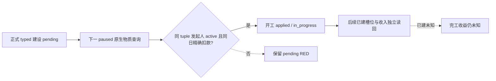
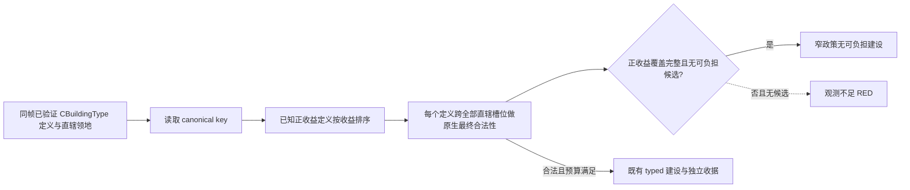
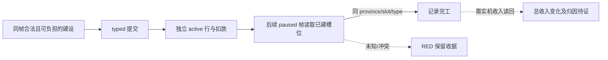
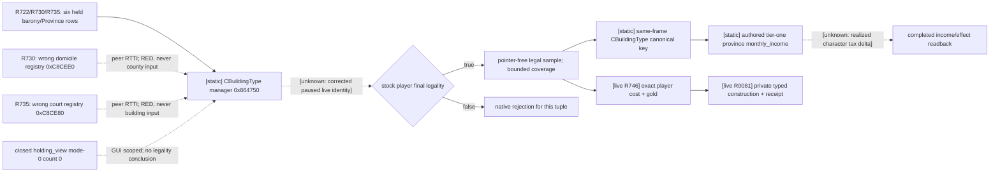
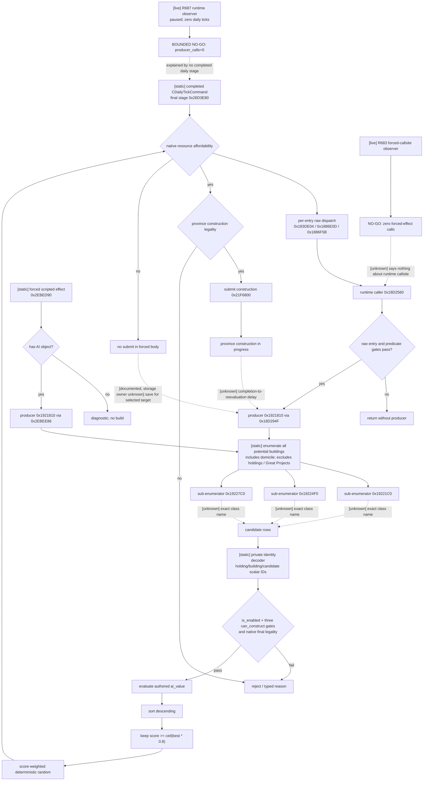

# CK3 1.19.0.6 直辖领地建设与升级原生 AI 树

## 状态与范围

- **NW-ECON-C6-APPLIED（2026-09-26，正式冷恢复漏掉完工 watch；源码修复待新 PID 复验）**：Robert c5 的 `state/construction-formal-pending-v1.json`（SHA-256 `A21E5D735831EB6477C079D4B0E24D091C48D3998F45E6CEBBF6B24CC8514F17`）保存了 `pending=null`、已验证 `applied/in_progress` 的 `hill_farms_01` 开工收据和最后检查日期；完工日期与实际收入增量仍为 `null`。c5 h106 及 c6 h125 的 driver 都保留同一请求的正式提交 history index 95、物质收据 history index 103，均早于各自 checkpoint index 106/125。c5 `recovery-pair-h106` 仅含 save/driver，旧 `prepare-state` 只从 sample_dir 寻找 sidecar 且只接受 pending；c6 配对回执因此没有建设 sidecar，新 state 也没有，随后 10 个正式 turn 没有 `construction_receipt_consumed` 或完工 watch。修复后可向官方 `prepare-state` 明确提供 `--construction-sidecar <c5/state/construction-formal-pending-v1.json>`：验证同一 actor、episode、请求、已验证 receipt 与提交 tuple 都属于 checkpoint 前历史，再原样复制、核 SHA 并在 no-launch 回执记录 `ledger_status=applied`。若保存的 driver 已有 `applied/in_progress` 而来源目录无 sidecar 且未显式指定，准备阶段报缺失，避免静默失去 watch；原 pending 配对仍可用。复制本身只恢复策略收据，下一新 PID 正式 paused 帧仍须走现有 `construction_cold_applied_requery` 的原生状态读回，不重复付款；只有后来确实读到已建槽位和收入变化才能记完工/实际收益。c6 h125 尚未由此源码修复后的匹配候选实机复验，不能将本项称为完工或收益 live。

- **NW-ECON-R0227（2026-09-26，R0227 实机开工后置 RED → Python 收据修复；待独立恢复复验）**：Robert c4 的 exact 源码为 `816df2026e2cdd3cce86ec3ab20bb3b81d8b2cba`、DLL SHA-256 `4B648D965B219B8A05B11BD9277393B502319824ED0EABFEF71D64507D4E304E`。正式策略于同一和平 paused 帧选择并 typed 提交 `hill_farms_01`（玩家 29829、barony 2174/province 2629、type 628、slot 1），原生成本 100 金、提交前现金 344.90601 金；动作 ACK 仍为 pending。下一 paused 原生查询读得同 tuple 的 `active=true`、发起人 29829，现金 244.90601 金，即同日精确减少 100 金；同时 `completed_buildings_observed=false`、`completed_buildings=null`。既有 Python transport 把已建槽位不可读当作**开工收据**的来源 RED，导致尚未执行 active/扣款后置，h96 pending checkpoint（SHA-256 `7AAFEC6D5942FE1ECDFCC7104CDF449D12164F96BFF96B46E643CA0C149B05DB`）保留且运行停止；此处的 `null` 不能解释为未完工或已完工。现在将合法的已建未知投影放行至私有 `material_source`，仅有同 tuple/发起人 active 行且同日现金恰好减少原生成本时，才把**开工**收据标记 `applied/in_progress`；单独的 ACK 或现金差额仍不能通过。若无 active 且已建仍未知，继续保留 pending，不把旧存档分类为动作前回退。完工及收入仍需后续已建槽位和收入读回，不能由本次开工证明。聚焦 fixture 覆盖同形状同进程后置、新 PID 冷恢复、缺扣款仍 pending；尚需根协调者在唯一实例中以匹配候选从 h96 按正式恢复器复核，不能手改 ledger 或重提同笔建设。

  对 h96 冷恢复，独立 `construction-formal-pending-v1.json` 是必要的策略状态，c4 原件 SHA-256 `9344B3273A5144E0987CA4E59B8181F4882FF94D5300BF3254BD1AB75EF1D55E`；仅复制 save/driver 会丢失这笔未决动作。在 R0227 当时，官方 `prepare-state` 只从给定 sample_dir 寻找 pending sidecar，按 schema、请求 ID、玩家/episode、checkpoint 前的同一正式提交历史行核对，再逐字节复制到新 state；普通无 sidecar 配对沿旧流程。本次新增的显式 `--construction-sidecar` 来源也按同一配对合同核对后复制。准备回执记录副本路径、SHA 和请求 ID，后续仍以官方 no-launch/save/driver 检查及新 PID paused 原生后置决定是否可恢复，不把复制成功当作动作生效。exact 原版 `hill_farms_01` 在 `00_standard_economy_buildings.txt:8672-8688` 使用 `standard_construction_time`、`cheap_building_tier_1_cost` 和 `normal_building_tax_tier_1`；脚本基础为 1095 天、100 金、标称省份月收入 +0.35。当前仅已见开工与扣款，**尚未见完工或玩家实际收入增加**。



- **NW-ECON-R0225（2026-09-26，R0225 实机漏判 → 源码/fixture 修复；未复验实机）**：Robert c2 候选在和平 paused 帧已读出 4 个直辖 barony、981 个原生建筑定义、玩家现金 344.906 金，仍以 512 次最终合法性上限在首个 barony 仅留下四个 `hospices_01` 样本（每个成本 150 金；保留 200 金后均不可负担），`checks_truncated=true`，随后错误地给出全局 `no_legal_budgeted_building` 并推进 18 天。此证据只能证明**已观察样本**不可负担。exact-build 原生树沿已验证 `CBuildingType` manager 的 canonical key 将现有 19 个标称正月收入一级建筑放在检查前列，按标称收入降序，对每个定义先遍历所有直辖 holding/slot，再花有界预算检查其他定义；每项仍经玩家同帧原生最终合法性、原生成本、现金与 200 金储备。新增 `positive_income_coverage_complete` 仅在 manager 所有 key 均可分类且正收益定义的全部直辖槽位已查完时为真；样本上限或检查上限截断正收益阶段时为假。无可选候选且此位为假返回 `evidence_insufficient`，和平正式消费者保留 RED、不推进日期；战前仲裁也阻止原战争步骤，service 先给独立婚配评估机会，无婚配动作则保留建设观测 RED。无候选且覆盖为真才可说该**现有 19-key 窄政策**没有可负担正收益建筑，不能扩大为所有建筑无经济价值。原版动态 AI `ai_value` 与真实完工税收增量未因此计算；本包还需 c3 匹配 DLL 的 paused live 验证，不把源码 GREEN 当新建设动作。



- **NW-ECON-NATIVE-RED（2026-09-26，R0224 实机 RED → 源码/fixture 修复；未复验实机）**：Robert 匹配候选 `g2-robert-nonwar-prewar-r0149-20260926-c1`，DLL SHA-256 `675C3DFE525AEE2692F9FE19B045400944D83EF1E905553DDE3F3BBB983C52ED`，在和平 paused 帧读得玩家直辖 4 个 barony/Province，却于建设正式评估前返回 `player_world_building_sources.failure=construction_state`，无动作、无日期推进。`definition_source_count=null` 是失败结果整体清空后的序列化值，不证明 manager 读取失败。与 e7bfe8a 的源码差异把新加入的**已建槽位**读取锁定为本次相对旧正式建设源的新增阻断路径；原报告未记录失败 province/槽位，不能进一步指称具体坏指针或建筑类型。现在把已建槽位读回单独标为 `completed_buildings_observed`：缺阵列、单项读失败或 manager 无对应定义时，清空不完整已建列表并序列化 `completed_buildings=null`，不将其当作空槽；原生最终合法性、成本、现金及 active 施工读回仍独立评估。正式候选可继续进入原有建设选择；物质 receipt 若需完工状态仍要求已建观察成功，否则保留 `source_red` 与 pending，不冒充完工或收益。此为 exact-build 原生候选阻断的最小源码修复，仍需新 DLL/合法配对 paused 实机确认 R0224 原故障已解除及具体合法候选、动作、后置。

- **NW-ECON-PREWAR（2026-09-26，源码/fixture，未新增实机）**：R0223 和正式入口核查暴露和平战前漏消费：`service` 已把建设 snapshot/history 交给 consumer，但正常 `plan_construction_private` 仅在 `selected_step=life-advance` 时评估；当策略在和平帧查询可宣战争或选择 typed 宣战，正收益建设此前完全不进入比较。现给该 consumer 增加默认关闭的 `prewar_arbitration=True`，只匹配原生 `query-declarable-wars` 或格式合法的 `declare-war-*`；独立同帧 feudal/peace root、玩家实际现金、原生最终合法且可负担的正收益候选、未决建设收据和既有 200 金储备全部满足时，返回现有 typed 建设提交步骤与原始 query，保留原宣战步骤以供下一正式 turn 重评。无正收益或预算不足则保留战争步骤，观测缺项另记 status；pending/cold receipt 仍先恢复。战前战争后续现金成本与额外共享资源承诺保持 `None`，不填零或声称完成战争和建设的完整联合效用比较。当前包只提供模块入口，service 同帧调度与匹配 Robert 实机仍待接线/验收；原 M5 和平 source 的 `life-advance` 门及独立选择器未由此绕开。原生 AI 的 `ai_value`、80% 带与随机施工树未改，建设仍按已冻结的同帧 final-legal/标称月收入窄政策。

- **NW-ECON-COMPLETION（2026-09-26，static-ready-private；未新增实机）**：exact EXE SHA-256 `2D00FF3101EF70B566F2FCBAE292F09263199C80E9DC8F139B82D7D96F83DB86` 的玩家最终合法性 `0x295CD60` 在 `0x295CECA..0x295CEED` 从 `Province+0x620+0x18` 取模式 0 的槽位数组，`+0x24` 为数量，每项 `0x10` 字节，首个 qword 与候选 `CBuildingType*` 比较。原有 `+0x70/+0x78/+0xE0` 是**施工中**定义/槽位/发起人；二者独立。新私有只读投影按数组索引记录已建 `province_id/barony_title_id/slot_index/building_type_id`，仅接受同一已验证 manager 中的定义；原版初版实现曾把数组缺失或定义不匹配上升为整个 source 的 `construction_state` RED，后续 R0224 修正边界见上方。此数组的实机含义仍须匹配候选 paused snapshot 验证，静态 fixture 不等于真实完工。

  正式建设收据在开工后保留原 `active` 证据，后续每隔至少 30 游戏日以同一 paused frame 查询已建槽位；同 tuple 从 active 转为已建时，记录独立 `completion_status=completed` 与日期。新 PID 冷恢复若施工已完工，也可由已建槽位核对，不再因 active row 消失而无限停在“未见物质状态”。若已建与 active 同时匹配同一 tuple，或二者均不可读，仍保持 RED；旧存档回退继续单独分类。该结果只证明同槽建筑存在，**不证明当前玩家月收入增加，也不推断边际税收/ROI**。正式入口复用已有 `campaign_root_context.player_monthly_gold_income`：开工前保存同帧实际玩家总收入 raw，完工观察前先请求同帧 root，若前后读数均有效则记录总收入差值 raw；收入缺项保持 null，不阻断独立完工读回。其间战争、领地和其他 modifier 的变化仍须单独排除，不能把差值自动归因于建筑。Robert 当前战争中，既有 `life-advance` 与 peace gate 仍会拦截新建设，战时资源分配需另包处理。



- **NW-ECON-VALUE（2026-09-26，static-ready-private；未新增实机）**：先前审计发现私有 `legal_samples[]` 只有 ID、槽位、原生成本，Python `_candidate` 一律选择最便宜样本，故 R746 的 ID `12`/`24` 与 R0081 开工都不能证明经济收益。exact EXE `CBuildingType` RTTI 层级经同版 PE 读取为 `CBuildingType → CGameDatabaseObject → CPersistent`；已验证的数据库对象身份布局为 `+0x10` ordinal、`+0x14` hash、`+0x18` MSVC canonical-key string。现于原生最终合法样本的**同一 paused revision**、同一 definition/Province/slot 读取并序列化 `building_key`，不把进程局部 ID 猜成稳定建筑类型。缺失或无效 key 使私有来源 unavailable；公共 query/action 广告仍关闭。

  对 exact 原版 `common/buildings/00_standard_economy_buildings.txt` SHA-256 `355445C46F70B9015A5E2BE68EE9DDC1F4E3EEB8BE368D34A37FD8A8CC0F7153` 与 `common/script_values/00_building_values.txt` SHA-256 `F436F7D9D5AC5506B38D715F0CE02C4F4257EEF3ADDF56597C18A526A6F66825`，一级经济建筑的无条件 `province_modifier.monthly_income` 有标称正值：poor `0.25`、normal `0.35`、good `0.50`、excellent `0.70`。Python 私有正式查询和 mailbox 调用的 native action selector **两处**只在原生合法、原生成本可负担、无施工且保留 200 金时选这些可识别的 tier-one key；按**脚本标称月收入**降序、实际成本升序排序。两者对同一六样本 fixture 的 tuple/cost 选择一致，随后仍沿 R0081 原有 typed submit/receipt/下一 turn 合同。未映射 key 的估值保持 `None`，native 标 `economic_value_unknown`，不当成零收益或默认可行动；原版动态 `ai_value` 与实际角色税收增量均没有据此求出。

  这项增量的证据为 exact EXE/原版脚本静态绑定、normal/optimized 原生读口与 JSON 序列化 fixture、Python 与 native action 对同一 paused-revision 形状选择相同 tuple/cost 的双模式聚焦测试，以及 Debug/Release 私有 action focused object no-launch 构建。**尚无本候选的 paused live key、动作、日期或实际完工收入**；R0081 仍只证明旧私有开工/收据/恢复。下一实机门为匹配 DLL 的同帧 key/ID/slot/cost 读回，随后正式策略选择、typed 开工、独立 active row 与扣款、下一 turn、冷恢复；完工后另读实际建筑效果和收入。标称 `monthly_income` 不冒充实际边际税收或 ROI，也不提升 M4/M5 完整里程碑。
- **NW-ECON（2026-09-26，源码/fixture，未新增实机）**：R0081 已证明一次私有建设的物质收据、下一 turn 消费与新 PID 冷恢复；新源码核查发现 `applied` 收据曾令同一 episode 的后续合法建设永远跳过查询，提交层也永久拒绝第二次动作。现在仅在原收据已经核实、同一进程进入更晚游戏日及更新 native revision 后重查同帧原生候选；pending、同帧和冷进程仍先走原收据/恢复路径。聚焦 unit 以第一省份收据、下一 turn、后一游戏日另一可负担省份的第二次 typed submit 验证调用链。**这不是第二次建设的 live 证据**；此入口仍须显式 `allow_private_construction_formal_trial` 与 bounded contract，公共能力不因此开启。现有私有 source 提供成本、gold、槽位占用与合法性，却没有完整工期或建筑收入/效果字段；R0081 只证明开工，不证明完工或经济收益。该轮次原有的完工后冷恢复缺口由上方 NW-ECON-COMPLETION 静态方案承接，仍待匹配实机验证。
- **COST-GATE1（2026-09-15，static-ready/read-only，未实机）**：在已冻结的 native selected-row 成本 helper `0x18D17E0` 中，`0x18D18F3` 前的 `rdi`、`rbp-0x41`、`rbx` 分别是同步借用的 `0x28` 目标行、八槽成本、八槽资源余额；同一 native command 以后从 `[r14+0x18]` 写入 actor ID，因此 collector 要求它等于当帧玩家，排除 AI 的建设候选。exact EXE 和 helper span 的 SHA-256，以及对应寄存器来源指令，保存在 `native_bridge/research/domain_construction_cost_gate_collector_v1_abi.json`；独立 C++ collector 在该调用尚未返回时复制身份/成本/余额。`cost == balance` 在原生严格 `<` 判定下成为可观测的 `insufficient_resource` 拒绝；余额足够却尚未观察最终 native validator 时只记录 `final_observation`，不能进入 construction action。normal/optimized 聚焦 fixture 与 exact-build source verifier 已验证静态来源，**没有 paused live capture**。自然调用属于 AI scheduler；该 collector 没有可证的玩家调用，当前不接 AI hook 或广告公共建设动作。玩家建设的下一输入转向下文原版县视图与底层定义枚举。
- **VIEW-PROBE1（2026-09-15，static-ready-private，未实机）**：`player_construction_view_probe_v1.hpp/.cpp/_process.cpp/_mailbox.cpp` 复用 exact root/idler/handler 路径，借用 `handler+0xD0` 的 `CHoldingView`，在 paused application-main 中同步读取 `+0x118/+0x120/+0x124` 候选缓存。返回 `view_candidate_cache_empty` 与 `view_candidate_cache_present`，其中 cache empty **不是**“玩家没有可建建筑”。源码 ABI `native_bridge/research/player_construction_view_probe_v1_abi.json` 与 exact source verifier GREEN，normal/optimized MSVC `/W4 /WX` 聚焦 fixture GREEN。`bridge.cpp` 有只在 `XAR_CK3_ENABLE_G2_PLAYER_CONSTRUCTION_VIEW_PROBE_PRIVATE_V1=ON` 时路由的私有 `execute_step`，CMake 默认 `OFF`；Debug/Release DLL 候选已链接。尚无真实 paused query、候选成本/合法性、策略动作或后置结果；不提升 M4/预览能力。

- **[static-confirmed]** 本专题冻结 CK3 `1.19.0.6` 的原版建筑候选门、`ai_value` 评分、头部
  `80%` 入围带、带权随机选择、预算储备背景、施工提交边以及原版对“存钱等目标”的明确说明。
- **[research / contract-ready]** 文末定义 `domain-construction-candidates-v1` 最小只读输入合同，供和平治理
  planner 选择玩家直辖领地中的新建或单级升级目标。合同尚未实现，不能标记为 `static-ready` 或 live。
- **[BUILD2 static-ready + R683 bounded live NO-GO]** 本施工包实现了默认关闭的私有
  `g2_domain_construction_candidate_observer_v1`，在 BUILD1 已冻结的候选 producer 返回边界采集调用上下文和原始
  `0x28` 行。R683 证明 DEV4 readiness 与 observer 安装均正常，但冻结的强制 effect callsite 在 60 秒 paused 窗口中零次经过，
  因而按预定口径收口为 `NO-GO / no_producer_return_observed`。它不新增公共 bridge/MCP/schema，也不发布候选语义。
- **[DEV7 static-ready + R687 bounded live NO-GO]** 默认关闭的私有
  `g2_domain_construction_native_runtime_callsite_observer_v1` 已把观察点移至正常运行时 direct callsite
  `0x18D294F`。fixture 证明它不要求暂停、只在存活会话的 application-main 线程同步复制有界原始行。R687 中 observer
  安装与 admission 均无失败，但存档始终停在同一日期，没有完成原生日更，故 `producer_calls=0` 并按合同收口为
  `BOUNDED_NO_GO`；这不是 hook 失效证据。DEV8 已把它接入默认 `OFF` 的私有 bridge 构建和 heartbeat；私有构建只发布
  `advertised=false` 的诊断对象，不进入 hello capability、公共 MCP/schema 或 planner。
- **[DEV16 static-ready private decoder]** 私有 `native_runtime_candidate_cost_affordability_and_final_legality_decoder`
  已静态闭合 selected candidate 的八槽 raw cost、同序 resource balance、严格 affordability 边界以及两种候选的 native-final
  legality 结果，并把结果绑定到 candidate identity、generation、proof epoch 和 date。它尚无 paired live capture，不提升公共
  candidate reader、MCP 或 action readiness。
- **[DEV17 static-ready private live-observer core]** `native_runtime_candidate_cost_legality_live_capture_observer` 的私有 source adapter
  和双采样 publication core 已实现：它能从 exact application-main collector frame 的借用地址同步复制并发布真正
  `available=true` 的 pointer-free 候选，所有 identity/binding/branch/payload 漂移保留旧 generation 并产生 typed RED。该核心尚未
  接入 shared default-off collector，也没有 production live capture。
- **[DEV18 static-ready private action core]** 私有 construction semantic action core 已能双采样筛选 DEV17 的 available/actionable
  building 与 new-holding 候选，以 candidate ID 确定性选一项并只 submit 一次。accepted ACK 只进入 `pending_receipt`；必须由 fresh
  receipt 证明匹配目标状态或八槽资源精确扣减后才能成为 `applied`。该核心尚未接入 shared action/bridge。
- **[DEV19 static-ready private native-submit adapter]** `static-ready-private-construction-native-submit-adapter-unwired`
  已冻结 building/new-holding 的 command context、两个 final validator、materialize/ownership、`0x341D990` receiver queue 和
  fresh receipt source。receiver 返回 true 只形成 pending ACK；offline executor fixture 不能声明 production。exact native executor
  仍未接入 application-main，未产生 CK3 命令。
- **[DEV20 static-ready shared glue]** `static-ready-shared-construction-glue-candidate-ready-native-live-pending` 已把 DEV18/DEV19
  编入 shared runtime，并提供 concrete publication 双采样到 pointer-free semantic candidate、一次性 backend stage、typed RED 与 fresh
  receipt 的最小 glue。公共 action/schema/MCP 未注册；真实 candidate 与 exact native backend 仍待新轮次。
- **[DEV21 static-ready private application-main runtime]** `static-ready-private-application-main-runtime-live-pending` 已把同步
  borrowed-frame collector、DEV17 四读/双 publication、DEV20 shared glue 与 DEV19 exact validator/materialize/receiver backend 编入默认
  bridge。offline fixture 仍保持 `candidate_live=false`、`production_native_path=false`；只有新 CK3 轮次的 exact application-main 调用可提升。
- **[static-confirmed cadence boundary]** `CDailyTickCommand` final stage `0x26D3E80` 每次完成日更时调用一次
  `CAIManager` update `0x18876D0`，建设 runtime entry 位于该 pass 的内部列表路由。每条通过 raw gates 的 runtime entry
  调用 producer 恰好一次；全局每日至少/至多命中多少个 owner、存钱目标何时重试仍未闭合，不能写成“每个角色每天必建”或
  某个建筑专用 every-N-days cooldown。
- 范围只包括省份建筑的新建与升级。新建 holding、Great Project 和 domicile 动作不进入 v1；原版 AI 的共同候选池
  会把 domicile building 与省份建筑一起比较，这一竞争关系仍记录在原生树中。
- 本包没有启动 CK3、没有新增 bridge/MCP/action，也没有改变现有 campaign-root。当前 campaign-root 只有玩家
  gold、monthly income 与 domain size/limit；它不能回答 holding、slot、building、施工队列或候选合法性。

## Exact-build 冻结

| 资产 | SHA-256 |
|---|---|
| `binaries/ck3.exe` | `2D00FF3101EF70B566F2FCBAE292F09263199C80E9DC8F139B82D7D96F83DB86` |
| `game/common/buildings/_buildings.info` | `90C339547C755EF976D6A5F8F99A1B7AD3DED61BC75073FEA50CC4215B571780` |
| `game/common/defines/ai/00_ai.txt` | `C78F9CD8DF9938CC9F38E817BCB6E32CD13720B5BD9DE077B85E3E1C6F030293` |
| `game/common/scripted_modifiers/00_building_modifiers.txt` | `C7CC953FD11EC3017F26C57B6165C385E82FA0F541CF88CEAA99C75DF47A3866` |
| `game/common/buildings/00_standard_economy_buildings.txt` | `355445C46F70B9015A5E2BE68EE9DDC1F4E3EEB8BE368D34A37FD8A8CC0F7153` |
| `game/common/script_values/00_building_values.txt` | `F436F7D9D5AC5506B38D715F0CE02C4F4257EEF3ADDF56597C18A526A6F66825` |
| `game/common/holdings/_holdings.info` | `763082E08CF8BB87945B40E9D3CD8C414EF972027A5801C4EED54BAD4249417E` |
| `game/gui/window_county_view.gui` | `E4121041153486379D813BC0154718F48446EA5F2143BFF4ADF06D7E9B8C4E8E` |

以下文件行号和 RVA 均绑定这组字节。任一 hash 或 EXE 变化后，结论先降回未验证，再重新冻结脚本与调用链。

### 玩家建设的只读查询入口（静态脚本证据，native ABI 未闭合）

原版县视图在 `window_county_view.gui:2305` 以
`HoldingView.GetPotentialBuildings` 提供 `GUIPotentialBuildingItem` 的玩家可见候选。
每项通过 `GetBuilding.GetTypeName` 显示建筑，`GetCost`、`GetPrestigeCost`、
`GetPietyCost` 与 `GetConstructionTime` 显示当前费用/工期；`CanAffordCost(GetPlayer.Self)`
判断资金，`CanConstruct` 控制施工按钮，`Construct` 才是变更动作
（同文件 `:2343-2459`）。这是玩家路径的来源，不能用 AI scheduler 的
`0x18D294F -> 0x1921810` 被动调用替代。

exact EXE 的 `CIngameInterfaceHandler` 在 `0xA74DD7..0xA74E14` 创建/替换
`handler+0xD0` 的 `CHoldingView`（RTTI、vtable 与单一 constructor xref 已静态核对）。
GUI binding `GetPotentialBuildings` 的一条 core `0xCCC4D0` 仅返回
`view+0x118`，不产生候选；该字段在 view 构造时初始化为空。GUI
registry 中 `0x412E670` 的字符串是完整方法名
`CanConstructBuilding`，它不是 `:2456` 的 `CanConstruct`。真正的
`GUIPotentialBuildingItem.CanConstruct` 注册使用字符串 RVA
`0x4101200`、callback `0x11A62F0`；后者从 row 取
`view/building/mode`，在 `0x11A632E` 调原生最终判定
`0x295CD60`。`GetCost` 注册使用字符串 `0x412E560`、callback
`0x11A6530`，其 core `0x119B930` 会从当前省份/建筑重新计算费用，
不是从 AI scheduler 的八槽栈值读取。

该玩家 callback 的冻结调用参数进一步定位为：`ecx` 是
`module+0x4FE7EE0` 的当前玩家完整 CharacterID，`edx` 来自
`[row->view+0x1F0]+0x10` 的当前县视图省份身份，`r8=[row+8]`
是建筑定义，`r9d=[row+0x10]` 是候选 mode；两个栈参数为
`true, null`。因此独立候选查询需要把省份、建筑定义和 mode
绑定到同一个 paused frame，不能只拿建筑 key 调最终判定。
`0x119B930` 的金钱费用 core 同样以 `row->view` 和
`[row+8]` 为输入，在 `0x119B9BB` 调 `0x2918AF0`。

`view+0x118` 的 `data/capacity/count` 分别在 `+0x118/+0x120/+0x124`。
`0x11A32B0` 先清除旧 row，随后在 `0x11A364F..0x11A3732`
按筛选结果生成新 row。row 的生命周期由 view 管理，只能在同一
 application-main callback 同步读取。
其 mode 0 定义输入从 `[view+0x108]->+0x628/+0x60` 的指针向量读取，
先经过 `0x21F6380` 和 definition 的 enabled/scripted gate，
再构造 GUI row。定义向量是候选来源线索，但这一步还没有证明
任意玩家省份和建筑槽位可建；关闭县视图时 cache 为零不能解释为
「当前玩家没有合法建设」。

私有 paused 查询需要当前原生 snapshot `revision`，发送
`execute_step` 的 `step=g2_player_construction_view_probe_v1` 与
`expected_revision`；成功 `command_result.result.private_probe` 仅有
`status/failure/view_present/candidate_capacity/cached_candidate_count`
及执行次数，`advertised=false`。这是一项有界分叉观测：若关闭县视图的
实机 cache 非空，下一项是同帧解码 typed row、费用和最终 CanConstruct；
若 cache 为空，下一项应直接沿上述模型定义向量与玩家实际持有的
省份/holding 枚举，不得把空 cache 解释为合法 no-op，也不得延长同一
paused 等待或为这个探针另开永久运行。

R717 的同一暂停帧私有实机读数（详见
`player_held_construction_model_enumerator_v1_abi.json` 的哈希锚点）已经证明
`holding_view` 有效可见性为 false、GUI cache count 为零；该轮没有建设动作、
游戏日期或 revision 变化。这关闭了私有 executor 故障，但没有回答玩家是否
能建造。现在已按 exact EXE 新增独立的只读来源实现
`player_held_construction_model_enumerator_v1.cpp`：沿既有 campaign-root
原生路径从玩家 `CCharacter+0x1B8` land state 的 `+0x1E0` 完整 TitleID
向量枚举 personally held tier-1 barony；每条称号校验完整 ID 和 holder，
由 `CLandedTitle+0x460` 的 Province pointer 回读 Province 数组身份。原版
`0x2606812..0x260681E` 对非 county tier 直接读取这个指针。同一查询另外
从 `module+0x57BFBA8` 的模型单例，依 `CHoldingView` 构造时 `0x119DEE8`
复制到 `view+0x108` 的来源关系，读取 `+0x628/+0x60` 的 mode-0
建筑定义指针向量；原版 materializer `0x11A35B8..0x11A35D5` 按这个
向量迭代。测试以关闭 GUI、两个 fixture 持有 barony、省份数组和定义
向量验证：缓存数据完全不存在时仍能读到来源；holder 不符、省份指针不
回读或暂停帧改变时返回 unavailable。这里的定义指针只允许在同一
application-main callback 内借用，输出可迁移账本只记录来源顺序/数量、
完整 TitleID、ProvinceID、revision、日期，不跨帧保存原生地址。

这个施工包状态仍是 **static-ready private source**，没有新来源的 CK3
paused live 证据、合法性、费用或物质建设结果。来源向量为空只能记录为
当前来源读数为空，不能当作「没有合法建设」或自动治理 no-op。下一有界
实机门是在同一普通标准封建存档中经私有 default-OFF application-main
适配读取玩家持有 barony/Province 与 mode-0 定义，再对有来源的
`province + definition + mode` 调 exact 玩家最终判定 `0x295CD60`，
取得合法候选和费用后才接正式策略/typed 动作。`query/action` 维持
未注册、未广告。

### R722 关闭县视图后的真实来源分叉（未闭合建设候选）

在 CK3 `1.19.0.6`、EXE SHA-256 `2D00FF3101EF70B566F2FCBAE292F09263199C80E9DC8F139B82D7D96F83DB86`
的同一 paused `native_revision=3`、`date_raw=53178312`、玩家 CharacterID `29829` 中，私有 slot42
查询确证六个真实直辖男爵领 TitleID→ProvinceID：`2103→2635`、`2106→2644`、`2143→2619`、
`2146→2617`、`2174→2629`、`2175→2625`。`holding_view` 有效可见性为 false、GUI cache 为零、
`CHoldingView` mode-0 definition source count 为零，且未评价合法建设；R722 报告 SHA-256 为
`11892CBE9B6F70EC65F90BAF4360A9E286C82139741815DEFC22B1F30208DF1F`。没有动作或日期变化。
这里的零是关闭县视图的 GUI 来源读数，**不是**全局建筑定义计数，更不是无合法建设。

R730 对旧私有 world source 的同版实机诊断揭示一个原版类型混淆：旧 accessor `0xC8CEE0`
指向 `module+0x57BFFD0` 的 `CDomicileBuildingType` 注册表，计数 `1620`；第一条 vtable
RVA `0x4172FA8` 的 exact RTTI hierarchy 为 `CDomicileBuildingType → CGameDatabaseObject →
CPersistent`，与 `CBuildingType` 是平级而非继承关系。旧 `0x1922305` / `0x15ABC4B` 调用链是
domicile 定义迭代，不可将这些指针送入县建筑判定，也不能靠跳过第零条推断县建筑来源。
R730 report SHA-256 `FDBBC6512A6C422CDA3CEDD12DBB5DDC75C2D9C7B89CC58AE3E792C34A594334`、
private read SHA-256 `AB0022FBFFD3D5F8C081C39E7C3FBE02842A55A1F2C6D67813A39BA6D93741B6`；
`definition_identity` RED、零动作和日期不变均保留。

R735 同版 paused 复验再次使 `definition_identity` RED：此前选作“县表”的
`0xC8CE80 → module+0x57BFFF8` 实际有 7 条；首条 vtable `0x441EF38` 的 exact RTTI 是
`CCourtTypeSetting → CGameDatabaseObject → CPersistent`。`0x176EFD5` 的 GUI source refresh
迭代的是 court type settings，不能当建筑来源。R735 report SHA-256
`B58DFA61975BF8FC155113FE7F50716C18CC1944BD7427A85836C2A9D7E05A58`、private read
SHA-256 `90CF5A4C1A1AC6D4EBC81C1887B57F18CF0BD51146D54F7BA53BF74D86059DF0`；
同一玩家 `29829`、日期 `53178312`、native revision `3`，零动作，CK3 回收。

真正的原版 `CBuildingType` 来源由构建调用链而非相邻注册表证明：县建筑迭代
`0x1922C52` 调 manager getter `0x864750`，该 getter 读取
`module+0x570C108`，迭代器随即读 manager `+0x68` 指针向量和 `+0x74` 计数，
在 `0x1922C70` 起逐项消费定义对象。原版定义 parser 在 `0x2C605CE` 将
`CBuildingType` 构造结果压入同一 manager `+0x68` 向量；typed ID 索引随后使用
manager `+0x190`。`CBuildingType` RTTI、primary vtable `0x44046C0` 和
constructor `0x2C543F0` 写入均按同一 EXE 锚定。玩家 GUI 的
`GUIPotentialBuildingItem.CanConstruct` 在 `0x11A632E` 调最终判定 `0x295CD60`，输入是当前玩家
CharacterID、当前 ProvinceID、同步借用的定义对象、施工 slot index；原版自身核对省份 slot 数。
`player_world_building_definition_source_v1.cpp` 的私有修复改从 manager 向量取定义，继续逐条要求
`CBuildingType` primary vtable 与非负、唯一 BuildingTypeID；未知类型仍 RED。同一 paused
application-main 帧把 manager 定义向量与上面玩家直辖 Province 配对，只复制 pointer-free
`TitleID/ProvinceID/BuildingTypeID/slot_index` 的**有界**最终合法性结果，明确记录截断。
原版 `GetCost` 经 view/row 范围的 `0x119B930→0x2918AF0` 计算，世界向量和最终合法性
结果均不给出实际费用；在获得玩家原生费用与资源后，建设策略和 typed 动作才有输入。
ABI、exact span 哈希与未闭合费用分支见
`native_bridge/research/player_world_building_definition_source_v1_abi.json`。接线已过 normal/optimized
聚焦测试；R730 与 R735 都是错误来源的 live RED，manager 来源仍待同版 paused 短复验。
公共 query/action 与 MCP 广告继续关闭；新增私有 receipt 不改变 `open_kaishek` 公开
协议，未来公共只读 MCP 需独立版本合同和兼容适配。



本包没有改变现有公开 ABI、协议或 `open_kaishek` 输入，因此当前跨仓
组合无需适配 push。接通私有 typed receipt 后应同步给 `open_kaishek`
最小版本合同；公开查询前还须提供同版本只读 MCP 查询口，供下游与
其他机器复用，且区分可查询接口和宿主能否运行 CK3。此处只沉淀 exact
来源/失败语义，不借 MCP 义务扩展通用宗教或非必要框架。

来源 producer 已以最终 master `56bad93` 集成。后续私有接通包在既有
slot 42 executor 中以相同 `expected_revision` 读取这些来源；原来
`private_probe` 的 cache/可见性字段继续保留，只加
`player_model_sources` typed 子回执。它在返回 pipe 前销毁借用的建筑
定义原生指针，只给出 definition_source_count；并在 identity 已验证的
`CHoldingView+0x108` 与 `module+0x57BFBA8` 当前模型单例相等时才把
来源标为 available。来源失败会由受控 owner runner 记 RED，来源向量
空则记证据不足，均不伪作成功 no-op。这个 adapter 已通过聚焦静态双
模式和协议 fake-driver 验证；**未有它自身的 paused 实机回执**，因此
公开能力与建设决策门仍保持关闭。私有子回执是增量格式变化，现有
`open_kaishek` 公开 schema 未变；正式公开前必须给最小兼容适配及
只读 MCP 版本合同，详见 `slot42_player_model_source_read_v1_abi.json`。

## 原版公开定义

### 候选与合法性

`_buildings.info:100-130` 给出四层门：

1. `is_enabled` 为 false 时建筑不生效且不可建；
2. `can_construct_potential` 决定建筑是否进入菜单/潜在候选；
3. `can_construct_showing_failures_only` 表达玩家可以克服的暂时失败；
4. `can_construct` 表达完整已满足和未满足条件。

原版文档明确写明，可施工必须让三个 `can_construct*` 都为 true；`is_enabled` 会和
`can_construct_potential` 一起检查。具体建筑还会把地形、holding 类型、创新、文化参数、特殊槽位和当前状态写进这些
trigger。例如 `00_standard_economy_buildings.txt:26-188` 的一级 caravanserai 同时检查地形/holding、创新、县内数量、
county-capital 位置和互斥建筑，再计算成本与 `ai_value`。所以只看“有空槽”或照抄几条常用 trigger 都不能构成最终合法性。

`_buildings.info:418-424` 对原版 AI 候选池作出更窄而关键的说明：

1. 汇集所有 potential building，包括 domicile building；
2. 排除 holding、Great Project 等非 building construction；
3. 对所有候选计算 `ai_value` 并排序；
4. 丢弃低于最佳分 `80%` 的候选；
5. 从余下候选随机选择；
6. 能承担成本就开工，否则为该目标存钱。

这里的 potential list、最终 constructability 和当前能否承担成本是不同阶段。v1 不能把入池误写成可立即开工，也不能把
“钱够”误写成所有 trigger 均已通过。

### 评分不是固定建筑类型表

`ai_value` 的 root 是 Province，`scope:character` 是付款角色，主建筑时另有 `scope:holding`。评分会读取玩家、地块、
文化、兵种驻扎和当前经济状态，不能离线按 building key 写死。

代表性原版规则足以说明动态性：

- `00_building_modifiers.txt:3-15` 对非首都省份减 `2`；征服者 gold 未越过安全支出线时减 `1000`；
- `:17-22` 给首都的一级建筑加 `20`；
- `:24-57` 给经济繁荣人格/经济倾向 flag 的一级经济建筑加 `5`，并按理性、财富/领地 focus 或收支压力叠加
  `ai_economic_preference_value`；
- `:59-69` 的虔诚偏好会读取 zeal、builder personality 与收支压力；
- 同一建筑链的基础分会随升级下降。一级 caravanserai 是 `10`，后续常见等级为 `9, 8, ...`；
- 建筑还能用 `factor=0` 等规则彻底取消当前评分，而合法性本身仍是另一套 gate。

因此合同应发布 exact-build 原生最终分及其比较结果，planner 不重写这些 authored modifier。最终分是“原版偏好证据”，
不等于玩家的长期 ROI；v1 第一条可见循环可以先利用它，后续再用结构化建筑收益替换粗糙效用。

## Exact-build 原生调用链

EXE 中 `ai_attempt_to_build_building_effect` 的说明是：强制 AI 评估其 domain 内可建/可升级建筑，并在承担得起时开始施工。
RTTI 与 vtable 把 effect 绑定到以下路径：

| 证据 | exact RVA / 结论 |
|---|---|
| `AIAttemptToBuildBuildingEffect` type descriptor | `0x55D6178`；name `0x55D6188` |
| complete object locator | `0x4AB91C8` |
| vtable | `0x44559F8` |
| effect 执行槽 | vtable slot 24 -> `0x2EBED90` |
| 候选生产 | `0x2EBEE86` 调 `0x1921810` |
| final legality helper | `0x2EBF4FC` 调 `0x295CD60` |
| 施工提交 | `0x2EBF509..0x2EBF54E`，最终调 `0x21F6800` |
| `BUILDING_MIN_SCORE_COMPARED_TO_BEST` 字符串 | `0x4194000`；define registration xref `0x2FF4D6` |

`0x2EBED90` 先解析 effect scope 的 CharacterID 并要求角色有 AI 对象。没有 AI 对象时走诊断分支并记录
“Trying to force non-AI character ...”，不会把该 effect 当作玩家只读查询使用。原版脚本中该 effect 只在
`tgp_story_cycle_mandala.txt:361,432,515` 显式出现，用来强制故事角色额外评估；常规 scheduler 并未以脚本调用暴露。

候选生成后的 exact-build 数据流为：

1. `0x1921810` 返回步长 `0x28` 的候选行；
2. `0x2EBEF50..0x2EBEFD7` 按行首有符号 score 降序排列；
3. `0x2EBEEDC..0x2EBF030` 读取阈值并计算 `ceil(best_score * ratio / 100000)`；
4. `0x2EBF030..0x2EBF159` 找到低于 cutoff 的边界；
5. `0x2EBF159..0x2EBF17D` 累加入围行 score；
6. `0x2EBF188..0x2EBF228` 用引擎确定性 RNG/hash 对总分取模，再按累计分选择一行；
7. `0x2EBF4BC..0x2EBF4DD` 执行八槽资源向量的 affordability gate；失败直接从本次强制 effect 返回；
8. `0x2EBF4FC` 再做最终合法性，随后解析 slot/holding 并调用 `0x21F6800` 提交施工。

这比 `_buildings.info` 的“randomly”更具体：**入围带内按候选 score 带权随机**，不是均匀随机，也不是固定取第一名。
八槽资源的业务字段名尚未逐槽闭合，不能从这段汇编臆造 gold/prestige/piety 映射。DEV16 已静态证明原生循环按固定八槽顺序
比较 signed qword，并使用严格条件 `cost <= 0 || cost < balance`；正成本等于余额也会被拒绝。公共 v1 仍须在未映射非零槽存在时
让成本 readiness 失败。

`0x1921810` 还调用 `0x19221C0`、`0x19224F0`、`0x19227C0` 等子枚举器，并把结果继续交给候选评分/合法性帮助函数。
这些子枚举器的普通建筑、domicile 与其他 building class 映射尚未全部命名，图中保留为 unknown；不能凭调用顺序给类型贴标签。

只读 bridge 不得调用 `0x2EBED90`、`ai_attempt_to_build_building_effect` 或 `0x21F6800` 来“查询”：前两者要求
AI 上下文且路径可产生施工，后者就是 mutation seam。正确入口是只读枚举、评分、成本与 legality evaluator，并在同一 paused
application-main frame 内序列化结果。

## BUILD2：默认关闭的候选 producer 私有 observer

### 目的与开关

BUILD2 只回答一个逆向问题：`0x1921810` 返回的 `0x28` 字节候选行在真实 exact-build 进程里如何承载身份和评分数据。
它不尝试回答“玩家现在该建什么”，也不构造 `domain-construction-candidates-v1` 的公开结果。

- CMake 开关固定为 `XAR_CK3_ENABLE_G2_DOMAIN_CONSTRUCTION_CANDIDATE_OBSERVER_V1`，默认必须为 `OFF`；
- 私有 heartbeat/object key 固定为 `g2_domain_construction_candidate_observer_v1`；
- 候选产物目录名固定为 `g2-domain-construction-candidate-observer-v1`；
- 默认构建中不得出现私有 object、字段 token、安装分支或额外 capability；开关为 `ON` 的 DLL 也不得改变公共 heartbeat、
  readiness、MCP tool、action step 或 schema；
- 安装只允许 CK3 `1.19.0.6`、EXE SHA-256
  `2D00FF3101EF70B566F2FCBAE292F09263199C80E9DC8F139B82D7D96F83DB86`，并要求 primary thread 处于可证明的 suspended
  安装窗口。callsite 原字节、目标 `0x1921810`、补丁长度与 continuation 必须在 BUILD2 ABI fixture 中逐字节冻结后才能写入；
  本文不从一个 call RVA 猜 anchor 或 continuation。

observer 只包围 BUILD1 已证明的 `0x2EBEE86 -> 0x1921810` producer 调用。它保留并执行原调用一次，随后记录返回边界；
不得主动再调用 producer，不得进入 `0x2EBED90` 强制 effect，不得调用 `0x295CD60` final-legality helper，也不得触及
`0x21F6800` 施工提交。后续排序、`80%` cutoff、带权 RNG、八槽 affordability 和 final legality 都在本 observer 范围之外。

### 私有采集字段与未映射账本

私有记录只保存完成字段映射所需的有界原始证据：

| 私有字段 | BUILD2 可声称的含义 |
|---|---|
| `schema_version`, `private_key`, `artifact_stem`, `installed`, `failure_flags` | 私有 observer 生命周期与产物身份；不能投影成公共 query readiness |
| `game_version`, `exe_sha256`, `callsite_rva`, `callee_rva` | exact-build 与 BUILD1 调用边绑定；持久化记录只使用 RVA，不输出进程绝对地址 |
| `producer_calls`, `accepted_captures`, `rejected_application_main`, `rejected_paused`, `capture_read_failures` | 调用与 fail-closed 拒绝计数；拒绝发生在读取 producer 容器之前 |
| `proof_epoch`, `date_raw`, `thread_id`, `timestamp_qpc` | 当前 hook 返回点重新读取 live paused/date，并与 application-main mailbox 的 owner 和同一会话指针核对后的证明 |
| `vector_capacity`, `vector_count`, `captured_row_count`, `rows_truncated` | producer 返回容器的有界计数；任何负数、逆序、空 data 或异常容量均停止读取 |
| `score_raw`, `row_bytes_hex`, `row_bytes_fnv1a64` | 同一 hook frame 内复制进 observer 自有存储的 `0x28` 行；只命名已证明的行首有符号 score，其余字节保持 opaque |
| `candidate_identity_decoded`, `native_legality_decoded` | 私有 readiness，BUILD2 固定为 `false`；不得投影成公共 query readiness |

BUILD1 只确认候选行步长 `0x28`，以及后续代码会按行首的有符号 score 排序。BUILD2 live 前仍把下列内容保留为
`unknown`：

- 行内 building definition、province、holding、slot、owner 和 action kind 的具体偏移与 identity 类型；
- `0x19221C0`、`0x19224F0`、`0x19227C0` 各自生产的 building class，以及普通建筑和 domicile 行的区分位；
- 行内非首字段是值、指针、句柄还是复合对象；不得仅凭“看起来像 ID”发布 full-generation identity；
- 八槽资源向量的 gold/prestige/piety 对应关系、相等 affordability 边界和预算桶；
- final legality、四层 scripted gate、施工队列、选中行和最终提交结果。它们位于 producer 返回之后，不能由 raw row
  observer 反推为已验证字段。

observer 不保存 producer owner、vector data、candidate/container 绝对地址，也不在 hook frame 结束后重新解引用任何原始地址。
opaque 行可能包含形似地址的 qword，但它们只作为未解释字节保存，不能作为 typed pointer 使用。一次 live 只能提供映射候选；
字段语义仍需和 exact-build 指令用法、RTTI/accessor 或独立同帧 identity 交叉验证后才允许进入公开合同。

### 一次 paused capture 的准备与产物

BUILD2 实现完成后只安排一次有界 capture，不为一个未命中的 observer 做长跑：

1. 分别构建默认 `OFF` 与显式 `ON` 的 Release DLL。默认 DLL 必须证明不存在私有 marker；私有 DLL 的 native fixture 必须覆盖
   exact-build gate、anchor 校验、一次 pre/post 返回、行边界拒绝、上限截断、安装失败回滚和 quiescent uninstall。
2. 冻结只读 `ready-manifest.json`：记录源 commit、EXE、默认/私有 DLL、injector、ABI fixture、runner/verifier 的 SHA-256，
   以及 callsite/callee、anchor、最大调用数、最大行数、最大字节数和超时。建议上限为一个完整 producer return、最多
   `64` 行和 `2560` bytes row bytes；超过行数时只保留有界前缀并显式写 `rows_truncated=true`。
3. 在 CK3 单实例负责人名下取得新轮次，先证明其他受管环境没有 CK3；恢复冻结 checkpoint 后建立 paused/map-ready、
   snapshot/revision/date/player 的基线。observer 只能被动等待原生路径，禁止为了制造 hit 调用强制 effect、producer、
   legality helper 或施工提交。
4. runner 在第一个完整 producer return、typed terminal 或 `60` 秒观察上限中最先发生者处停止；捕获完成后立即回到暂停，
   不推进第二次调用。若暂停现场没有自然 hit，记录 `no_producer_return_observed` 并结束本次，不用延长时间掩盖 NO-GO。
5. 产物固定放在
   `artifacts/live/g2-domain-construction-candidate-observer-v1/<attempt-id>/`，至少包含
   `ready-manifest.json`、`preflight.json`、`observer.jsonl`、`report.json`、`cleanup-inventory.json` 和
   `sha256sums.json`。报告必须绑定轮次、CK3 PID/创建时间、checkpoint、进程清单、私有开关、安装/回滚状态、snapshot identity、
   调用计数、捕获行数、截断状态及每个文件的 SHA-256。
6. 私有 DLL 仍遵守 bridge 的 process-lifetime 边界；本包不新增远程卸载接口。capture 收口后由 CK3 单实例负责人关闭该进程并
   证明 CK3、injector 和 runner 进程归零。observer 自身的安装/恢复事务由 suspended non-CK3 fixture 验证，但不能冒充 live
   进程中的远程卸载证据。

### 验收分类

| 实际结果 | 分类 | 可得结论 |
|---|---|---|
| exact build/anchor/安装/同会话均成立，且取得一个有界完整 pre/post return，容器和每个 `0x28` 行通过边界检查 | `GREEN / producer_return_captured` | 可开始行内字段映射；仍不是公共 reader 或 live planner |
| observer 安装成功但观察窗内零 hit | `NO-GO / no_producer_return_observed` | 当前 paused 形状未暴露调用；不得重复相同长跑或调用 mutation 路径造 hit |
| 只有 pre-call、返回缺失或采集超过行/字节上限 | `RED / incomplete_or_out_of_bounds_capture` | 原始行不可用于字段映射；保留 evidence 并停止 |
| build/hash/anchor/session 漂移，安装、回滚或 cleanup 失败 | `RED / admission_or_lifecycle_failure` | 候选不可用；不得降级成 fixture GREEN |

只有 `producer_return_captured` 才能推动下一轮静态字段映射。即便 GREEN，`domain-construction-candidates-v1` 仍保持
`research / contract-ready`：BUILD2 不读取 final legality、成本/预算、施工队列，也没有证明任何候选属于玩家。fixture 只验证
observer 和解析器，不得冒充生产 hit；没有真实 `observer.jsonl` 与同会话 `report.json` 时不得写 `production-live`。

## R683 结果与 native runtime 入口

### R683：有界 NO-GO，不是 RED

R683 的最终自包含 artifact manifest SHA-256 为
`C3D2301E647BBDEF1A7CFB33CF2795EA9905BFBC98671371DD2C5D66055DFABC`；其中
`previous_manifest_sha256=177F4F3EAB41570F005132E294ADEEBBEEA6DD7E1BF704CF004DB0F00F846DF4` 是复制四个 exact
candidate binary 前的历史 seal。`report.json` SHA-256 为
`E1E8A7C7C829E0AC9191D8E9E745EC5D176BA0CEA6291AA4F7EBBC4E6BA1CC75`。现行结论只使用最终 seal。

| R683 事实 | 结果 |
|---|---|
| exact build / source | CK3 `1.19.0.6`，EXE SHA 同本文冻结值；source commit `50b69df3e40115520dcc49c6a63ac8634101907d` |
| DEV4 readiness | **live GREEN**：`map_ready=true`、`paused=true`，`played_character_id=29829` 与 `episode_character_id=29829` 同时匹配 |
| observer 生命周期 | `installed=true`、`failure_flags=0`，结束时 cleanup proven |
| 观察结果 | 60 秒内 `producer_calls=0`、`accepted_captures=0`，`NO-GO / no_producer_return_observed`，`red=null` |
| 游戏状态变化 | UI 输入 `0`；日期未推进；源/目标存档 SHA 均未变化 |

这个 NO-GO 的解释范围比“producer 没运行”更窄。BUILD2 observer patch 在 forced effect 的
`0x2EBEE86 -> 0x1921810` callsite，而不是 producer 函数入口。R683 只证明该 paused 场景没有经过这个强制 effect；它没有观察
另一个直接调用 producer 的 native runtime callsite。重复同一 paused 等待不会增加信息量，也不能通过调用 effect 或 producer
制造命中。

### 第二个 direct xref：native runtime caller

对 exact EXE `.text` 做指令对齐反汇编后，`0x1921810` 只有两个 direct `CALL` xref：

| callsite | caller | 证据边界 |
|---|---|---|
| `0x2EBEE86` | `AIAttemptToBuildBuildingEffect::execute` `0x2EBED90` | 已由 BUILD2 observer 覆盖；需要脚本强制 effect |
| `0x18D294F` | native runtime 函数 `0x18D2560..0x18D2B89` | 与 effect 无关的第二条原版入口；scheduler 名称与 cadence 仍 unknown |

`0x18D2560..0x18D2B89` 共 `1577` bytes，SHA-256
`4D94C8EB8EF3AC2AC0F5CB6720E89350D431150E9B12EDBF8B93236643CE3923`。producer call 前的 exact 指令为：

```text
0x18D2948  lea rdx,[rbp+0x60]    ; caller-local RawVector40
0x18D294C  mov rcx,rsi           ; retained producer owner
0x18D294F  call 0x1921810
```

该 `0x18D2948..0x18D2954` span 为 `12` bytes，hex
`488D5560488BCEE8BCEE0400`，SHA-256
`7AD8DDEEE17F6EDCFCB58B1D8987E22B40B35CBEF217A334B84B33E76E9922FB`。返回后从 `0x18D2954` 开始把同一 local
vector 交给 `0x18D17E0` 消费；这证明 runtime path 与 forced effect path 共享同一个 producer，但不证明两者后续选择和提交逻辑相同。

producer 自身为 `0x1921810..0x19219BA`，共 `426` bytes，SHA-256
`E33EF0DFAB7E16B10523D3BE71C4C7B37EA27B20D1A12728AF9DEC3E60D83A12`。其
`0x1921810..0x19218BD` dispatch head 的 SHA-256 为
`4E5B138871EA0E88D7249525585F2D374E06817D4A84DE8D247E1E986FB54876`，并确认三个 direct child call：
`0x192189C -> 0x19221C0`、`0x19218AA -> 0x19224F0`、`0x19218B8 -> 0x19227C0`。子枚举器的类型名仍不猜。

### 已冻结的触发前置

下列条件只按指令语义记录；字段和 predicate 的业务名称尚未闭合：

1. `0x18D2584` 要求 `byte[owner+0x16] & 0x0A != 0`，`0x18D258E` 要求
   `byte[owner+0x2A] == 0`，否则直接走公共返回点 `0x18D2B6E`。
2. `0x18D25AC..0x18D25D1` 要求从 `[owner+0x18]+0x1B8` 选择的 opaque substate（或 global fallback）在
   `+0x318/+0x0C` 的计数为零。当前不得把它命名为“施工队列”或 cooldown。
3. `0x18D26AA -> 0x19017F0` 必须返回 false；true 会写 `byte[state+0x142]=1` 并退出。若
   `0x18D2781` 的 deterministic threshold 进入条件分支，`0x1900640` 与 `0x18FE5E0` 也必须都返回 false。
4. 最后一段可见 gate 是 `0x18D2821..0x18D2862`：先由 `0x1879280(owner, 3, scratch)` 准备 scratch，随后
   `0x1922BF0([owner+0x18], scratch, flag)` 必须返回 true。该 span SHA-256 为
   `B96B5175AC183091A9890BC990A89961F1875FC27ACC70A280B44DC86DB4BF21`。
5. `0x18D2560` 的执行所有权有三条已确认入口：`0x183DE04` 在 `[owner+0x20]` 非空且
   `byte[state+0xC2] != 0` 时调用；`0x1886E0D` 与 `0x1886F5B` 在 state 为空或该字节为零、且 global
   `0x4F54C2F != 0` 时调用。它们证明原版在不同路径间路由执行权，不足以命名 task class 或推出重评天数。

完整机器可读账本位于
`ck3_autonomous_player/native_bridge/research/fixtures/g2_domain_construction_producer_entry_v1.json`。原始字段含义、
正常 scheduler cadence、资源槽的业务命名、预算 owner、final legality 和队列仍保持 `unknown`；候选行的
holding/building/candidate 标量 identity 由下文 DEV15 私有 decoder 静态闭合。

### DEV7：native runtime callsite observer

DEV7 已实现 default-off 私有 `g2_domain_construction_native_runtime_callsite_observer_v1`，把被动观察点移到
`0x18D2948..0x18D2958`。这个 `16` bytes anchor 为
`488D5560488BCEE8BCEE0400488D45D0`，SHA-256
`8534255F75D4595B57E2093C6F67AC196C7FF71D596C2122258DED90151F31A6`。stub 必须按原顺序重放：

1. `lea rdx,[rbp+0x60]`、`mov rcx,rsi`；
2. 原生 `call 0x1921810` **恰好一次**；
3. 在同一返回帧把 local vector 有界复制到私有存储；
4. 重放 `lea rax,[rbp-0x30]`，从 `0x18D2958` 继续。

这条 seam 不调用 forced effect，不主动调用 producer，不碰 `0x21F6800`，也不修改公共 bridge/MCP/schema/action/planner。
source-contract、exact anchor、`/W4 /WX` unit fixture 与 suspended non-CK3 transaction 均已通过。capture admission 要求
同一 application-main 线程和存活会话；暂停状态只记录，不作为正常运行时入口的过滤条件。fixture 中 `paused=false` 的命中用于
防止把 R683 的暂停前提错误移植到 scheduler 路径。将来若安排 live，只等这个不同 native callsite 的第一次自然经过即收口，
仍不强制触发 producer。DEV8 候选使用
`XAR_CK3_ENABLE_G2_DOMAIN_CONSTRUCTION_RUNTIME_OBSERVER_V1=ON` 单独启用，并在 heartbeat 的
`g2_domain_construction_native_runtime_callsite_observer_v1` 私有对象中保留安装、失败计数、会话拒绝、暂停状态和原始行；
默认构建仍为 `OFF`。生产命中前，状态保持 `candidate-ready / live pending`。

### DEV12：R687 零命中的 exact 原因与自然触发

R687 最终 artifact manifest 的 SHA-256 是
`D8E543DF1B2C43EC87FAC174C16B6042FDA8B77901D14FF7BC0C7E94090F32D2`；其中 live manifest SHA-256 是
`4406AC5C3858F7F6F93DB7610780FDA4D16113A9F9260EE3DB06DE5782824D19`。实机事实为：

- `installed=true`、`failure_flags=0`、`capture_read_failures=0`；
- `producer_calls=0`、`accepted_captures=0`；
- readiness 为 `date_raw=53178264`、`paused=true`，没有请求日期推进；
- UI 输入和游戏动作均为 `0`，源/目标 save SHA-256 始终为
  `9104CCB8AE9D5776166FBBAEDA9B43BD08CBAA2CB5C057332EB8B7A1A212CC63`，cleanup proven。

这组证据现在可以精确解释。正常调用链不是“载入地图后初始化一次”，而是：

1. `CDailyTickCommand` final/post stage `0x26D3E80..0x26D3FAA`（SHA-256
   `5306C7F0F30BC4CF8DA6B29DCA0B2D869C588CEDDEF819713608D4D60B293790`）在 `0x26D3EE1` 调
   `CAIManager` update `0x18876D0`。此时 stage 1 已把 `date_raw` 增加 `0x18`，stage 2 已运行当日 managers/tasks。
2. `0x18876D0..0x188817E`（SHA-256
   `3ECAAE0A02249B0F7539E66594A384A6A21918F97FB7983D8AA732303C439E67`）是已由 RTTI/vtable 交叉确认的
   `CAIManager` secondary-interface update slot；其 `0x1887FB2..0x1888069` 列表循环在 `0x1888057` 调
   per-entry dispatcher `0x183DD40`。
3. dispatcher 只在 `[owner+0x20]` 非空且 `byte[state+0xC2] != 0` 时从 `0x183DE04` 进入
   `0x18D2560`；另外两条 raw route `0x1886E0D/0x1886F5B` 在 state 为空或 `+0xC2==0`、且 global
   `0x4F54C2F != 0` 时进入同一 runtime entry。
4. `0x18D2560` 继续执行本节“已冻结的触发前置”；全部通过后才在 `0x18D294F` 调 producer `0x1921810`
   恰好一次。一个 completed daily pass 因此可能跨 manager entries 产生零到多次 producer call；目前不能证明跨列表 actor
   去重或每个 landed AI 都会进入建设路由。

R687 一直暂停，没有完成第 1 步，所以零 producer call 是该运行形状的预期结果。继续在同一暂停帧延长等待没有信息增益，
也不能据此替换已经位于正常 runtime direct call 的 observer。

下一次最小实机方案只跨一个原生日更：从 paused/map-ready 基线先封存 raw heartbeat，使用现有
`tactical_daily_sentinel_v1` 以 date-only terminal mode 绑定 `target_date_raw=start+0x18`，speed `3`，只提交一次 resume。
sentinel 在 `0x26D3E80` 中先执行 original，因此会先经过本页的 `CAIManager`/建设链，再在同一日终边界自动暂停。
边界固定为：

- 最长 readiness `300` 秒，resume 后单日事务 `30` 秒，总上限 `330` 秒；
- UI 输入 `0`、gameplay action `0`、日期精确前进 `1` 天、无 save mutation、forced effect/GUI/producer/build submission 均为 `0`；
- `producer_calls>=1 && accepted_captures>=1` 且所有 failure 为零才是 GREEN；有 producer call 但 capture/admission 失败、日期越界、
  重复 CK3 或 cleanup 失败为 RED；完成恰好一个 daily final stage 仍为零 call 时收口 `BOUNDED_NO_GO`，同轮不重试、不延长。

只有上述一日事务仍得到干净的零 call，才有实证需要把最小 fallback 改为 default-OFF 的 `0x18D2560` entry/gate-mask
私有 observer；它只记录 raw gate mask，不主动调用 producer、不修改游戏状态。本包没有触发该条件，因此不改 native/CMake/bridge。
机器可读证据与下一轮合同见
`ck3_autonomous_player/native_bridge/research/fixtures/g2_domain_construction_runtime_trigger_analysis_v1.json`。

### DEV14：R691 一日事务候选的无启动重冻结

DEV14 将 DEV13 的 construction one-day 候选按唯一下一轮 `R691` 重新物化到
`Z:\ck3_mod_rewrite_process_assets\g2-m4-dev14-r691-construction-one-day-candidate-e08f4a1`。冻结源仍是
`e08f4a1b5a807f176b29ce280383d93d9c051879`，exact-build EXE、save 和 8 个 native 二进制均逐哈希复用；没有重编译或改动
公共 MCP/schema/shared bridge/CMake。旧 R690 candidate 在冻结前后保持不变：其 `candidate-manifest.json` SHA-256 仍为
`7FE54643ED8E117F9802327C987BC4C6E36B4C767F8A470DE6983464D07B7584`，`prep-manifest.json` SHA-256 仍为
`BD2410AA0302E133B1AFDBBAC6132FD7B2556316E50F0E026FED9F999C753A64`。

R691 候选把 mutable state、live output 与进程端点分别固定为 `state-r691`、`live-r691` 和
`\\.\pipe\xar_ck3_bridge_g2_m4_dev14_r691_construction_one_day_e08f4a1`；Python entry 默认只做 seal、exact-build、profile、
save、source commit、全局 CK3 零实例与合同一致性检查。实际执行必须显式使用 `--execute`，并额外提供由唯一 CK3 owner 写入的
`R690 -> R691` authorization；当前候选没有该授权，也没有分配或启动 R691。候选 manifest SHA-256 为
`B19047BC31B819E5C8F0532366D2FA2C3EFDEFBC9220D6FBCB0782303C86C243`，sealed manifest SHA-256 为
`9F1806CBC4F4BC4ABAAFBCBF7A9898EC7292DFDD9682CFBE360D9E04122B5260`，封印清单包含 4,749 个文件、
550,091,594 bytes。独立 normal 与 `-O` no-launch 复验均为 `GREEN_NO_LAUNCH`，两次均观测 `ck3_processes=[]`、
`ck3_launched=false`。此证据只把下一轮候选提升为 `static-ready / live pending`；R691 后续仍须由唯一 CK3 owner 按单实例规则启动，
并依据 DEV12 的 `GREEN / RED / BOUNDED_NO_GO` 一日边界收口。

## 预算储备与“存钱”边界

`00_ai.txt:100-168` 冻结了通用 AI 财政背景：

| 定义 | exact 值 | 已证明语义 |
|---|---:|---|
| `BUDGET_CATEGORY` | reserved `0`, war chest `0`, long-term `0.20`, short-term `0.80` | 通用预算分桶比例 |
| `BUDGET_CATEGORY_MAX` | long/short 均 `5000` | 超过后尝试向其他桶分配 |
| `BUDGET_CATEGORY_SHORT_TERM_MIN` | `25,25,200,200,400,400,400` | 按 tier；低于时会犹豫在其他类别支出/存钱 |
| `MIN_WAR_CHEST` | `25,25,50,100,200,300,400` | 按 tier 的最低战争储备 |
| `MONTHS_OF_MAINTENANCE_IN_WAR_CHEST` | `18` | 战争储备还取 18 个月最大维护费与最低值的较高者 |
| `PERCENTAGE_INTO_WAR_CHEST` | `0.6` | 未填满战争储备时，收入的 60% 进入该桶；reserved 优先 |
| `BUILDING_MIN_SCORE_COMPARED_TO_BEST` | `0.8` | 入围分数阈值，即最佳分的 80% |

spiritual head 和 holy order 另有 `750`、`500` 的最低 reserved gold。它们是通用角色预算例外，不授权本项目展开
faith/doctrine/tenet、holy order 或其他宗教域。若当前玩家确实命中这类原生预算规则，v1 只发布最终
`native_budget_allowed` 与 opaque reason，不公开或重建通用宗教状态。

当前证据**没有**闭合“building construction 确切消费哪个预算桶”及其 normal scheduler 的持久化 owner。
`_buildings.info` 明确证明 AI 会为选中但暂时买不起的目标存钱，并警告高分昂贵建筑可能令 AI 永久储蓄、停止其他投资；
`0x2EBED90` 的强制 effect body 只证明本次买不起就不提交。存钱目标的地址、生命周期、失效条件与重试 cadence 保持
unknown。planner 不应复制这种可能锁死经济的行为，应使用自己的最低应急金和最长等待期。

## 队列与冷却

- EXE 精确字节包含诊断 `Province '%s' already has a construcion in progress`（RVA `0x4452D68`）。施工提交前的
  final legality 因此必须消费当前省份施工状态；v1 要把该状态作为原生最终结果发布，不在 Python 猜槽位是否空闲。
- `_buildings.info:394-406` 定义 `on_start/on_cancelled/on_complete`，说明施工有开始、取消、完成生命周期。Great Project
  使用自己的进度，明确不属于普通 building slot construction。
- 没有找到建筑专用 authored cooldown。exact native chain 已确认建设 route 位于每个 completed daily tick 的
  `CAIManager` update 内，但 raw flags/predicates 可以令某个 owner 当日不进入 producer。`00_ai.txt:1-50` 的
  SHORT/MEDIUM/LONG/RARE/STRATEGY task tick 仍不能直接套到建设上；不得把“manager 每日 pass”误写成“每个角色每天评估/施工”。
- 施工中的省份形成真实队列占用；其他空闲省份是否会在同一 scheduler turn 连续开工、存钱目标是否跨省阻挡，以及完成后
  到下一次重评之间的具体延迟仍为 unknown。

`00_building_values.txt:1784-1874` 的 `fill_building_slot_chance` 与 `upgrade_building_chance` 只用于 bookmark 开局生成。
它们不是运行时建设 AI、冷却或候选概率，不进入 planner 合同。

## 决策树

实线为 exact-build 脚本/调用链已确认边，虚线为尚未闭合的 native 调度或类型映射：



### DEV15-CANDIDATE-IDENTITY-DECODER：候选行身份静态闭合

状态为 `static-ready-private-candidate-identity-decoder`。1.19.0.6 exact-build 中的两个行构造器共同证明
0x28 行是一个带空对象哨兵的 tagged union：`0x1921A3A..0x1921A85` 写已有 holding 的建筑候选，
`0x19220B0..0x19221A6` 写新 holding 候选。两者都写低 dword 原生分、三个对象槽 `+0x08/+0x10/+0x18`、
`+0x20` candidate selector 和 `+0x24=1`。`0x18D3E96..0x18D3EC0` 又逐字节复制完整 0x28 行，所以下游
解码不能只保存 score。

`0x18D299C..0x18D29E8` 在建筑提交支路读取 holding/province 对象与 building-type 对象的 `+0x10` 标量身份，
并携带 `+0x20` selector；`0x18D2A95..0x18D2B09` 在新 holding 支路把 `+0x18` candidate province 与同一
selector 送回原生 validation。私有 decoder 因此只在下面两个互斥形状之一成立时返回 ready：

- `holding_province_id >= 0 && building_type_id >= 0 && candidate_province_id < 0`，生成
  `building:<holding_province_id>:<candidate_selector>:<building_type_id>`；
- `holding_province_id < 0 && building_type_id < 0 && candidate_province_id >= 0`，生成
  `holding:<candidate_province_id>:<candidate_selector>`。

其他组合、`selector=-1`、非 `+0x24=1`、地址溢出或读失败都是 typed unavailable，不返回成功的 `unknown`。
输出只含自有标量和确定性 candidate ID，不保留任何进程内指针。实现、ABI、source contract、fixture 与 normal/optimized
`/W4 /WX` standalone runner 全部位于 `native_bridge/research/`，未接入 shared CMake、bridge、schema 或 MCP。

R687 仍是 paused、`producer_calls=0` 的 `BOUNDED_NO_GO`；本包没有启动 CK3，也没有把 offline fixture 冒充 runtime row。
身份 decoder 的下一入口 `native_runtime_candidate_cost_affordability_and_final_legality_decoder` 已由 DEV16 静态闭合；身份结果本身
仍可独立使用，不依赖后续 live capture。

### DEV16-COST-LEGALITY-DECODER：成本、余额与最终合法性静态闭合

状态为 `static-ready-private-candidate-cost-legality-decoder`。selected-row consumer 的
`0x18D1828..0x18D18F3` 对两个候选形状分别调用成本 builder：已有 holding 的建筑候选在 `0x18D184F` 调
`0x29190F0`，新 holding 候选在 `0x18D18C3` 调 `0x275D680`。两条路径都把结果投影为相同的八个 signed-qword
本地槽，源结构偏移依次为 `0x00, 0x08, 0x10, 0x20, 0x28, 0x30, 0x40, 0x48`。槽的业务名称仍未证明，decoder
因此发布固定顺序的 raw 数组，不伪造资源名称。

`0x18D18F3..0x18D1924` 严格按槽 `0..7` 比较。非正成本直接通过；正成本只有在 `cost < resource_balance`
时通过，所以 `cost == resource_balance` 是确定的 `insufficient_resource`。decoder 返回全部失败槽 bitmask 和原生循环首先失败的
槽位。资金不足是已知业务拒绝：此时 native 在 final gate 前返回，`final_legality.observed=false` 合法，结果为 ready 但不可执行。

资金充足时，已有 holding 的建筑候选必须绑定 `0x18D2A05 -> 0x26CD410` 的 bool 结果，新 holding 候选必须绑定
`0x18D2B09 -> 0x275C7F0` 的 bool 结果。分支匹配且结果为 false 时分别返回
`building_native_final_legality_rejected` 或 `holding_native_final_legality_rejected`。这些是 exact 控制流派生的稳定 typed reason，
并非原版本地化诊断字符串。资金充足但 final 结果未观测、候选 kind 与 gate 分支不匹配、地址/读取失败都会返回 typed
unavailable，不能用 `null` 或成功的 `unknown` 收口。

每项结果同时携带 DEV15 的 pointer-free `candidate_id` 和一个完整 binding：expected/observed `generation` 必须相同、非零且为偶数，
`proof_epoch` 必须相同且非零，`date_raw` 必须相同。任何漂移都拒绝 actionable 结果。decoder 输出只保存自有标量和八槽数组，
不保留成本、余额或候选对象地址。实现、ABI、source contract、fixture 与 normal/optimized `/W4 /WX` runner 均为
`native_bridge/research/` 私有资产；本包没有改 shared CMake、bridge、schema 或 MCP，也没有启动 CK3。

R687 的 `BOUNDED_NO_GO` 不变，因为该轮没有产生候选行。DEV16 只闭合 exact-build static decoder 与 offline fixture；其下一入口
`native_runtime_candidate_cost_legality_live_capture_observer` 已由 DEV17 完成私有核心，在 shared collector 接线和真实 capture 前仍
不得宣称 production-live 或公共 candidate query ready。

### DEV17-COST-LEGALITY-LIVE-OBSERVER：application-main 双采样 publication core

状态为 `static-ready-private-cost-legality-live-observer-core-unwired`。source adapter 接受 exact-build admission、非零
application-main owner/current thread、live session、expected/observed binding，以及 collector frame 中借用的 selected `0x28`
row、八槽 projected cost、八槽 resource balance 和 native-final `observed/branch/allowed`。它在同一次同步调用中复制 row，调用
DEV15 identity decoder，再调用 DEV16 cost/legality decoder；输出仅保留 candidate ID、kind、binding、两个 owned 八槽数组和 typed
结果。row/object/cost/balance 的进程地址及 raw row bytes 都不会进入 publication。

observer core 对两个完整 source sample 分别执行上述读取，再逐项比较 candidate identity、generation、proof epoch、date、final
branch/observed/allowed、全部 cost/balance、affordability 和最终 actionability。只有两份完整结果一致时才把 generation 先置奇数，
复制 owned candidate，最后以新偶数 generation 发布 `available=true`。`candidate.actionable=true` 是可立即执行候选；原生已知的
`insufficient_resource` 或 final gate rejection 仍发布为 available candidate，并以 `actionable=false` 和 typed rejection 表示，
不能折叠成 unavailable。

identity、generation、proof epoch、date 或 branch 不一致分别设置对应 typed RED bit；application-main/session/read failure、cost、
balance、final observation/result 漂移也都有独立 RED。任一 RED 都不覆盖上一份完整 publication，也不推进 complete generation。
fixture 覆盖 actionable available、资金不足但 available、五类必要 drift RED、payload drift、application-main rejection 与旧 generation
保留。因此核心能够产生非空 available candidate，而非以 `null` 收口。

本包仅新增 `native_bridge/research/` 私有 adapter/observer/ABI/source contract/fixture/standalone tests 和本专题增量，没有修改 shared
CMake、bridge、schema 或 MCP，没有启动 CK3。R687 仍为 `BOUNDED_NO_GO`，offline source-memory fixture 也不计作 production live。
DEV17 observer 的下一集成入口仍为 `wire_private_cost_legality_live_observer_into_default_off_exact_application_main_collector`；只有接线后的
获授权新轮次取得 paired application-main capture，才能提升相应 live readiness。DEV18 已独立完成其下游 private action core，不能
反向替代这个 live 前置。

### DEV18-CONSTRUCTION-ACTION-CORE：确定性单次提交与 fresh receipt

状态为 `static-ready-private-construction-semantic-action-core-unwired`。输入是两份完整 candidate publication sample。每份 row 必须
`available && ready && actionable && native_affordable && native_final_legal`，且无 rejection/unavailable；known native rejection 仍
保留在输入中供观察，但不进入提交候选。两个 sample 按 pointer-free `candidate_id` 排序，并逐项核对 building/new-holding kind、
publication/candidate generation、proof epoch、date、八槽 cost、八槽 resource balance、affordability 和 native-final 结果。缺项、重复
identity 或任一漂移都在 submit 前失败。

通过双采样的 actionable rows 以 `candidate_id` 字典序稳定排序并选第一项。因此输入枚举顺序不影响结果，且 building 与 new holding
走同一选择合同。semantic request 复制 candidate ID/kind/binding/cost/resource-before，不保存 publication 或进程指针。一个 action state
只允许调用 submit callback 一次；transport 失败或 rejected/zero ACK 进入明确失败态，accepted ACK 只记录 token 并进入
`pending_receipt`，`applied` 仍为 false，再次调用 begin 不会产生第二次 submit。

receipt 必须匹配 ACK token、candidate ID 和 kind，并携带严格更新的非零偶数 generation、严格更新的 proof epoch 以及不早于提交时的
date。fresh receipt 只有满足以下任一证据才进入 `applied`：building 候选观察到匹配 target building 状态；new-holding 候选观察到匹配
target holding 状态；或八槽余额全部可读，所有正成本槽恰好减少相应 raw cost，零/负成本槽保持不变。仅有 ACK、stale receipt、错误
identity、未观察目标且资源没有精确扣减时都继续停在 pending，不能冒充成功。

standalone fixture 覆盖乱序候选的确定选择、known rejection 排除、single submit、ACK pending、stale receipt、building target receipt、
new-holding exact-resource receipt，以及 identity/generation/proof/date/cost/resource/native-final 双采样漂移。normal/optimized runner 只编译
research 私有核心；没有修改 shared CMake、bridge、schema 或 MCP，没有启动 CK3，也没有产生真实命令 ACK/receipt。R687 的
`BOUNDED_NO_GO` 不变。下一唯一入口为
`wire_private_construction_semantic_action_core_after_live_candidate_collector`，须在 DEV17 live collector 接线并取得真实 available candidate
之后执行。

### DEV19-CONSTRUCTION-NATIVE-SUBMIT：exact command、receiver 与 receipt 边界

状态为 `static-ready-private-construction-native-submit-adapter-unwired`。DEV19 从 DEV18 的 pointer-free semantic request 解析两种
确定形状，并逐项绑定 candidate ID/kind、非零偶数 generation、非零 proof epoch 和 date；observed binding 有任何漂移都在 native
executor 前失败。已有 holding 的 building command 在 `0x18D29A0..0x18D2A1B` 构造：command `+0x20/+0x24/+0x28/+0x2C`
依次承载 actor/holder identity、holding/province identity、candidate selector 和 building-type identity，随后调用
`0x26CD410` final validator。新 holding command 在 `0x18D2A5C..0x18D2B1B` 构造：`+0x20/+0x24` 保存 actor/holder identity 和
selector，`+0x28` 只在同步调用期借用 candidate native object，随后调用 `0x275C7F0`。持久化 command context 不保存该指针。

validator 通过后，两条路径都通过 command vtable `+0x40` materialize heap command，把 ownership 从 wrapper 移入 transfer holder，
以固定 flags `7` 调用 `0x341D990`。receiver 的 exact span `0x341D990..0x341DA8A` 显示：拒绝时销毁 command 并把 holder 清零；
受理时先把 `[receiver+0x3EC]` 序号写入 command `+0x0C`，再把 command 移入 `[receiver+0x3D0]` 所属 queue，通过
`0x8154D0` 插入并清理余留 ownership。caller 的 `0x18D2B57..0x18D2B6E` 只销毁仍非空的 wrapper。因而 receiver 的 bool/sequence
只能解释为“本次 command 已受理入队”的 pending ACK，不能解释为 building/holding 已创建。

private adapter 对每个 state 最多调用 executor 一次，并要求 execution trace 中 validator、materialize、receiver 各恰好一次，ownership
holder 已清零且 leftover wrapper 生命周期闭合。standalone runner 的 callback 明确是 `offline_fixture`；即使 fixture 自称使用 exact
地址，也无法把 state 标为 `production_native_path`。生产路径还必须由 exact-build application-main executor 使用本合同地址完成绑定；
本包没有用 callback seam 或 `unknown` 冒充 production。

receipt source 复用 DEV18 的 fresh verifier。accepted queue ACK 后仍停在 `pending_receipt`，只有同 identity 与 receiver sequence、严格
更新的偶数 generation/proof epoch、非更旧 date，并观察到匹配 target building、匹配 target holding 或八槽余额精确扣减之一，才进入
`applied`。ACK、queue callback、stale binding 或没有状态/资源证据都不能关闭动作。normal/optimized `/W4 /WX` standalone 与 exact-span
normal/`-O` 验证均为 GREEN；实现仅新增 private research adapter/test/ABI/source contract 和本专题增量，没有修改 shared CMake、
bridge、schema 或 MCP，没有启动 CK3。R687 的 `BOUNDED_NO_GO` 不变。下一入口为
`bind_exact_construction_native_executor_on_application_main_then_validate_in_new_ck3_round`。

### DEV20-CONSTRUCTION-SHARED-GLUE：shared candidate/backend 接线

状态为 `static-ready-shared-construction-glue-candidate-ready-native-live-pending`。CMake 现将 DEV18 semantic core、DEV19 native-submit
adapter 与 `domain_construction_shared_glue_v1.cpp` 编入 `xar_ck3_bridge`，但不新增公共 capability、action、schema 或 MCP。shared glue
接收两份 DEV17 publication sample，直接复用 DEV18 的完整双采样和确定性选择，生成一个 pointer-free semantic candidate request。
这使后续 exact collector 取得 concrete publication 后已有共享 request 生成入口；当前 fixture/static candidate 明确保持
`candidate_live=false`，没有把 R687 零命中解释成真实候选。

backend glue 以四个窄 stage 接口承接 DEV19：native final validator、command materialize、固定 flags `7` 的 receiver transfer，以及仅用于
余留 ownership 的 release。glue 自己生成 execution trace，validator/materialize/receiver 每个 state 各最多调用一次；receiver 接管后
仍只进入 `pending_receipt`。重复 submit 在进入 backend 前设置 `duplicate_submit` RED。candidate/binding、exact build、application-main、
backend 未接线、validator、materialize、receiver、ownership lifecycle 与 receipt 各保留独立 RED bit，同时保留 DEV18/DEV19 的具体 typed
failure。receiver 没有清空 holder 时，glue 会尝试释放余留 ownership，但仍保留 lifecycle RED，不能以成功清理掩盖合同漂移。

默认 shared runtime 没有把 concrete native backend 标成 bound，也没有从 `bridge.cpp` 暴露入口。offline fixture backend 只验证 glue；
DEV19 仍将 `production_native_path=false`，因此 callback seam 不能冒充 production。fresh receipt 继续要求更新后的 identity/generation/
proof/date 与 target-building、target-holding 或八槽精确扣减证据；stale/缺失 receipt 记录 RED 并保持 pending，允许后续真实 fresh observation
完成验证。focused normal `/Od` 与 optimized `/O2` 均以 `/W4 /WX` 验证。未启动 CK3，R687 `BOUNDED_NO_GO` 不变。下一入口为
`bind_concrete_domain_construction_candidate_collector_and_exact_native_backend_then_validate_in_authorized_new_round`。

### DEV21-CONSTRUCTION-BACKEND-BIND：同步 collector 与 exact application-main backend

状态为 `static-ready-private-application-main-runtime-live-pending`。新增 private runtime 只接受 application-main 同步调用期内有效的
borrowed frame；每个候选连续执行两组 publication、每组两次完整 sample，共四读。每次 sample 都通过 DEV17 source adapter 立即复制
selected `0x28` row、八槽 cost、八槽 resource balance 与 final-legality 结果；两份 pointer-free publication 再进入 DEV20/DEV18 的完整
集合漂移检查与确定性选择。expected binding 必须是非零偶数 generation，proof epoch 与 date 必须精确等于当前 mailbox stamp。
identity、binding、payload 或 final branch 漂移在构造 command 前保留 typed RED。runtime result 不保存 row、cost、balance、候选对象或
其他 engine pointer；new-holding candidate object 只在同一个同步 validator 调用期内借用。

exact backend 按 `0x18D29A0..0x18D2B6E` 冻结形状构造 `0x30` 字节 building/new-holding command。building primary/secondary vtable
分别为 `0x432F050/0x432F0E8`，new-holding 为 `0x4333128/0x4333060`；两个 validator 继续使用 DEV19 的
`0x26CD410/0x275C7F0`。materialize 只调用 command vtable `+0x40` 一次，再把 heap command 交给
`module+0x57621F0` receiver singleton 的 `0x341D990`，flags 固定为 `7`。receiver 未清空 holder 时才走 deleting destructor 回收并保留
ownership RED；receiver true 仍只产生 pending ACK，不能解释成施工完成。

默认 `xar_ck3_bridge` 现在链接 DEV15/16/17 collector 链、DEV18/19、DEV20 glue 与 DEV21 runtime，但仍不注册公共 capability、action、
schema 或 MCP。fixture 的低层 native calls 只核对两种 command 的 exact 字段、四读、单次 validator/materialize/receiver、漂移 RED 与
pointer-free result，并明确保持 `candidate_live=false`、`production_native_path=false`。focused normal `/Od`、optimized `/O2` 均以
`/W4 /WX` 通过，fresh Release 默认 DLL 链接通过；本包没有启动或接触 CK3，R687 仍为 `BOUNDED_NO_GO`。

唯一剩余 live 步骤是在获授权的新 CK3 轮次中，让 exact application-main hook/feed 提供一份真实同步 borrowed frame，观察 exact
receiver pending ACK，再用更新后的匹配 construction state 或八槽精确资源扣减 fresh receipt 收口。该步骤之前不得把本状态提升为
production-live，也不得开放公共 action/MCP。

## 最小只读输入合同：`domain-construction-candidates-v1`

### 目标

这个 query 只解决一件事：在同一 paused frame 内回答“玩家亲自持有的哪些省份建筑可以新建或升一级、成本与工期是多少、
原版最终分和合法性是什么、现在是否允许付款并排入施工”。它是独立按需查询，不把大批 holding/building 行塞进每回合必读的
campaign-root。

建议公共 capability 为 `game.command.query-domain-construction-candidates-v1`，MCP 为
`ck3_query_domain_construction_candidates_v1(expected_revision)`。payload 的 schema 名固定为
`domain-construction-candidates-v1`。本专题只冻结合同，不宣称这些入口已经存在。

### 顶层字段

| 字段 | 必要性 |
|---|---|
| `schema_version`, `contract_stage`, `reader_mode` | 区分 frozen contract、fixture 与 production reader；未实现时必须 typed-unavailable |
| `build_version`, `exe_sha256`, `native_revision`, `snapshot_id`, `date`, `paused` | exact-build 和同帧绑定；禁止拼接跨帧 gold、holding、候选与队列 |
| `player_character_id` | full-generation identity；与 campaign-root player 交叉校验 |
| `status`, `unavailable_reason`, `readiness` | 任何必要 reader 缺口 fail closed；空候选只有在完整枚举成功时才是合法空集 |
| `scope` | 固定 `directly_held_landed_domain`；v1 明示排除 domicile、new holding 与 Great Project 动作 |
| `budget_state` | 玩家 gold/prestige/piety raw、原生 building spend eligibility、opaque block reason；不由 Python 重算预算桶 |
| `construction_rows` | 玩家直辖省份当前普通建筑施工状态，绑定 province/slot/target/开始与预计完成日期 |
| `candidates` | 下表的完整、同帧、原生评估行 |
| `stock_reference` | 阈值 raw=`80000`、选择模式=`score_weighted_random_within_top_band`；仅作原版行为参考 |

`scope` 排除 domicile 动作，但 stock 原版比较把 domicile building 放入共同池。为防止消费者误读，`stock_reference` 必须带
`combined_pool_includes_domicile=true` 和 `combined_pool_complete`。若 bridge 尚不能闭合 domicile 子枚举器，就让
`combined_pool_complete=false`、所有 `stock_combined_pool_*` 派生字段为 unavailable；这不妨碍 landed candidates 本身供玩家
planner 使用，但不得宣称完整复现原版入围概率。

### 候选行

| 字段 | 必要性 |
|---|---|
| `candidate_id` | 仅在当前 snapshot/revision 有效的 opaque token；后续 action 不接受任意 building string |
| `province_id`, `barony_title_id`, `county_title_id`, `holder_character_id` | full-generation identity 与玩家直辖校验 |
| `slot_index`, `action_kind` | 精确区分 `build_new` / `upgrade_one_level` 与目标槽 |
| `current_building_key`, `target_building_key` | 稳定内容身份；空槽的 current 为 null，升级必须形成合法 next-building edge |
| `holding_type_key`, `is_realm_capital`, `is_county_capital` | 最小定位和首都偏好输入；holding type 只作 stable opaque key |
| `is_enabled`, `potential`, `showing_failures_only`, `can_construct`, `native_final_legal` | 保留四层 gate；planner 只执行全部通过行 |
| `native_failure_reasons` | 稳定 typed reason 列表；不能可靠分类的原版文本以 `native_requirement_unmet_opaque` 返回 |
| `native_ai_value_raw` | exact evaluator 的最终分；禁止按 building key 在 Python 重建 |
| `landed_best_score_raw`, `within_landed_top_band` | landed v1 内的可审计比较；不冒充 combined stock pool |
| `stock_combined_pool_top_score_raw`, `within_stock_combined_top_band` | 仅 `combined_pool_complete=true` 时 available |
| `cost_gold_raw`, `cost_prestige_raw`, `cost_piety_raw` | 同帧原生 evaluator 得到的最终应付成本；原版建筑定义实际使用这三种成本形状，保留定点 raw |
| `unmapped_nonzero_cost` | 任一未映射资源槽非零即 true，并令该行 `cost_ready=false`、不可执行 |
| `construction_time_days`, `province_construction_status` | 发布应用角色/省份 modifier 后的最终工期，并拒绝已有施工的省份 |
| `native_affordable_now`, `native_budget_allowed_now`, `budget_block_reason` | 区分钱不够、原生储备不允许与其他合法性失败 |
| `row_ready` | identity、合法性、score、cost、queue 均 ready 时才为 true |

宗教建筑不被假删。其 building key、piety cost、最终 native legality、最终 `ai_value` 与 opaque reason 可以进入合同；
faith、doctrine、tenet、fervor、改宗和 holy-order 细节不进入 schema。`ai_pious_building_preference_modifier` 的内部输入也不展开，
只消费最终分。这满足当前圣战/婚姻以外通用宗教域继续暂缓的项目边界。

### Readiness

建议最小 gate：

```json
{
  "readiness": {
    "exact_build_ready": true,
    "same_frame_ready": true,
    "player_identity_ready": true,
    "domain_enumeration_ready": true,
    "building_slot_identity_ready": true,
    "native_legality_ready": true,
    "native_score_ready": true,
    "cost_and_budget_ready": true,
    "construction_queue_ready": true,
    "actionable_candidates_ready": true,
    "stock_combined_pool_reference_ready": false
  }
}
```

前九项全部为 true 才允许 `status=available`。最后一项是可选原版行为解释项：false 时仍可做 landed player planner，
但 UI/报告必须说“原版 combined-pool 概率未闭合”，不能声称复刻 stock AI。生产 reader 缺失时固定返回
`status=unavailable`、`unavailable_reason=reader_not_implemented`、空候选和 readiness=false；fixture 不能进入生产模块冒充 live。

## 和平治理 planner 的第一条可见循环

v1 到位后先交付最小确定性策略，而不复制原版随机和无限存钱风险：

1. paused query 取得同帧候选；
2. 过滤 `row_ready && native_final_legal && native_affordable_now && native_budget_allowed_now`；
3. 保留一笔 planner 自己的应急储备，优先填玩家 realm capital 的空普通槽，再按
   `native_ai_value_raw / gold_cost` 粗排；相同结果用 province ID、slot、building key 固定排序；
4. semantic action 消费 `candidate_id + expected_revision`，native 端重验 full-generation identity、holder、slot、成本、预算与
   final legality，只提交一次施工；
5. ACK 只表示命令已受理。新的 paused snapshot 必须看到同 province/slot/target 的 construction row，并核对对应资源减少，
   才算 `applied`；拒绝或状态未变保留失败结果。

这条循环能产生玩家可见的“选中一个直辖建筑并开始施工”，并形成完整观察、决策、操作、验证。它不是长期经济最优策略：
完整 ROI 仍缺建筑最终税收、development、兵种驻扎和全域 modifier 的结构化收益。先把该差距记为 planner quality gap，等真实
construction loop 跑通后再扩展 outcome delta，不把收益解析提前做成 v1 blocker。

验收只做与改动相称的代表场景，不为单个建筑安排长跑：

- 空槽新建：一个经济建筑，验证候选、成本、action 与施工 row；
- 单级升级：一个已有普通建筑，验证 current/target edge 与相同 slot；
- 阻塞：一个已有施工的省份和一个资金不足候选，验证 typed reason；
- 宗教依赖代表项：只验证 opaque native result 与 piety cost，不展开宗教 schema；
- 同帧与 stale candidate：revision 改变后旧 candidate 必须拒绝。

## 对 G2-M4 的直接结论

1. 原版的核心并非“永远建最高分”：它先取最佳分 80% 带，再在正分候选中按分数带权随机。planner 可以保留最终 native
   分作为起步证据，同时使用确定性排序保证可复现。
2. 原版明确存在存钱锁死风险。玩家代理必须有应急储备和等待上限，不能因一个高分昂贵建筑无限阻塞所有低价投资。
3. 当前 gold/income/domain count 足以说明“有多少直辖容量”，不够定位任何可施工槽。下一施工入口就是本专题的按需只读
   candidate query；其下一静态施工入口已收窄为 `0x18D2948` native runtime callsite 的 default-off 被动 observer，
   不是继续靠 GUI 图像猜按钮，也不是先写 mutation。
4. 新建 holding、Great Project、domicile 与完整建筑收益另开能力包；不应把它们混入 v1，亦不能把 v1 宣称为完整十年经济治理。

## 证据边界

- **[static-confirmed]** 建筑定义、四层 gate、原版公开 AI 流程、0.8 define、通用预算参数、代表性评分 modifier 与 bookmark-only
  概率边界来自上述 exact-build 文件。
- **[exact-callsite-confirmed]** effect RTTI/vtable、候选生产、排序、cutoff、带权随机、资源 gate、final legality 和 mutation seam
  来自相同 EXE 的静态反汇编。
- **[inference]** “province 已施工会阻止新施工”由 exact diagnostic、施工状态与 final legality 位置共同支持；仍要求未来只读
  queue reader 和代表性 paused snapshot 互证。
- **[static-confirmed cadence boundary]** completed daily final stage 每次调用一次 `CAIManager` update；建设 runtime entry
  位于其内部 per-entry route。每个 passing runtime entry 只调用 producer 一次。每日 actor 去重/命中下界、建设预算桶的精确绑定、
  八槽资源全映射、存钱状态 owner/lifetime、子枚举器类型名、多省同轮调度和完成后重评延迟仍 unknown。
- **[bounded live NO-GO]** R683 已证明 DEV4 readiness、observer admission 与无状态改动边界，但只观察了 forced-effect callsite，
  没有取得候选行；不能把它写成 candidate reader live。
- **[bounded live NO-GO]** R687 证明 runtime observer 安装、private heartbeat 和 cleanup 正常，但 paused shape 没有完成日更；
  `producer_calls=0` 与现已闭合的 daily call chain 一致，不能据此声称 runtime hook 已 live 命中。
- **[static-ready / live pending]** DEV14 已把 unchanged DEV13 candidate 重冻结到唯一 `R691` round/path/pipe 合同，并由 normal 与
  `-O` 全量 seal verifier 证明 no-launch GREEN；这不是 R691 实机证据，也不改变 R687 的 bounded NO-GO。
- **[live pending]** 没有 `domain-construction-candidates-v1` 生产 reader 或 MCP fixture，故本专题仍是 exact-build tree +
  contract-ready，不提升为 production-live primitive。
