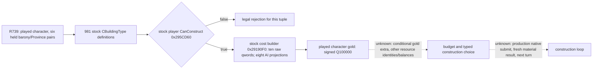

# CK3 1.19.0.6 player building cost: direct stock observer

This is an additive construction branch of [the frozen native construction tree](domain-construction-ai.md). It addresses the B0 left by R739: the closed county GUI supplied zero candidate rows, while the stock manager supplied 981 `CBuildingType` definitions and the played character directly held six barony/Province pairs. The private paused query performed 512 stock player final-legality calls and recorded six actual legal samples (eight was only the configured maximum), but had no cost or executable action. R739 did **not** construct a building.

The exact CK3 EXE SHA-256 is `2D00FF3101EF70B566F2FCBAE292F09263199C80E9DC8F139B82D7D96F83DB86`. The source, caller and selected-row affordability spans and hashes are in `native_bridge/research/player_world_building_cost_direct_v1_abi.json`; `verify_player_world_building_cost_direct_v1.py --exe <frozen CK3 EXE>` checks them without launching CK3. This ABI remains bound to that EXE, independent of future agent commits.

At RVA `0x295DCAA..0x295DCC0`, the stock player `GUIPotentialBuildingItem.CanConstruct` predicate `0x295CD60` passes the borrowed Province pointer, `CBuildingType+0x6F590` field address and its `+0x6F588` context to the cost builder `0x29190F0`. The native AI selected 0x28-row helper `0x18D184F` calls that same builder using row+0x08 Province and row+0x10 `CBuildingType`. Thus the builder can be called for an R739 legal played-character tuple in the same paused application-main callback, without requiring the county GUI to be opened. It returns the caller's full 80-byte value. Stock selected-row code `0x18D186A..0x18D18A5` projects qwords `[0,1,2,4,5,6,8,9]` into eight spend slots and `0x18D1900..0x18D1924` rejects a positive cost when `cost >= balance`; equality is insufficient. The direct player predicate calls `0x2CDCFF0` at `0x295DCF4`; its first resource branch compares gold at `CCharacter+0x1A8+0x100` against raw cost qword 0, **sometimes adding qword 7** under an actor flag. The flag and other resource identities are not yet mapped. Discarding qword 7 as the AI projection does would understate a possible player cost, so the private receipt retains all ten native qwords as well as the eight-slot projection.

The played `CCharacter` gold observation uses the previously established stock character lookup, `CCharacter+0x1A8` extension then `+0x100` signed Q100000 gold. A null extension is the stock zero case; a failed memory read is unavailable. The private receipt publishes only player ID, TitleID/ProvinceID/BuildingTypeID/slot, full native ten-vector and selected-row eight-vector, gold raw/scale and frame scalars. Native pointers are borrowed inside the callback and do not appear in the receipt. Any failed native cost call is typed `native_cost` failure, preserving the RED rather than treating the build as free. The receipt remains `advertised=false`, `read_only=true`, `cost_ready=false`, `construction_action_ready=false`.

The private cost source passed normal `/Od` Debug and optimized `/O2` Release `/W4 /WX`, and R746 later supplied a real paused cost receipt on exact `master@4ec36943` (report SHA-256 `CBCC51B030FCCD54A44217B12BFF1E2DE6EA7AA4AB8569FB1CEE6F713C889F61`): six gold-only legal tuples and played raw gold `50035659`. R746 changed no game action or date. The separate [stock cost-to-action branch](domain-construction-world-cost-to-action.md) maps its narrow command and independent Province material-result route; neither R739 nor R746 alone satisfies the two-game-year construction gate. Public MCP/query registration, formal next turn and cold restore remain pending.
