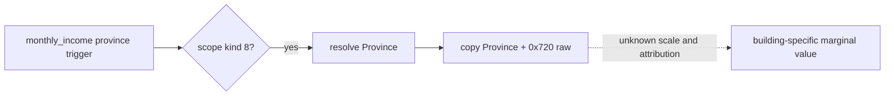

# C97: province monthly income raw source for construction readback

Status: exact-build static source and focused fixture only; paused CK3 readback pending. Game: CK3 1.19.0.6, `ck3.exe` SHA-256 `2D00FF3101EF70B566F2FCBAE292F09263199C80E9DC8F139B82D7D96F83DB86`.

The original `monthly_income` **province trigger** is registered at RVA `0x53FEA0`. Its name and description references are `0x53FEB1 -> 0x429B6E8` and `0x53FF04 -> 0x4382F88`. RTTI identifies `CMonthlyIncomeTrigger` (`0x5504D90`); vtable slot 32 at `0x4383CE8` points to getter `0x2857680`. The getter checks scope kind `8`, resolves its province, and copies a 64-bit value from `Province+0x720` to the trigger output (`0x28576B7` through `0x28576C1`). The frozen getter bytes have SHA-256 `F7C7529CBC9B0DF23E424CD1D3C8A3B3D5747669C1EED7A76F4091939089E313`. `verify_player_world_building_definition_source_v1.py` checks these anchors against the exact executable.

The private world construction source uses its already validated held `Province*` and reads `+0x720` on each held province row, even when the active construction has completed. The JSON fields are `native_province_monthly_income_observed` and nullable `native_province_monthly_income_raw`. A failed read gives `false`/`null`, without changing construction legality or claiming zero income. The private transport already binds the world query to one paused snapshot, actor, episode and revision. This source is an **aggregate**: other buildings, modifiers, ownership and elapsed game time may change it. Its scale and owner tax relationship remain unknown. It is not a building-exclusive effect, not an ROI input and not a proof of construction completion. The existing same-slot completed-building receipt and player total monthly-income read remain separate evidence.

Next live step: on the already scheduled construction completion watch, read the same barony/province row before and after the completed slot appears, with date and other changes recorded; confirm the field is readable and compare alongside the independent completed-slot and player-income sources. No extra CK3 run is needed solely for this field.
