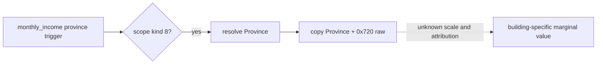

# C97: province monthly income raw source for construction readback

Status: exact-build static source and focused fixture only; paused CK3 readback pending. Game: CK3 1.19.0.6, `ck3.exe` SHA-256 `2D00FF3101EF70B566F2FCBAE292F09263199C80E9DC8F139B82D7D96F83DB86`.

The original `monthly_income` **province trigger** is registered at RVA `0x53FEA0`. Its name and description references are `0x53FEB1 -> 0x429B6E8` and `0x53FF04 -> 0x4382F88`. RTTI identifies `CMonthlyIncomeTrigger` (`0x5504D90`); vtable slot 32 at `0x4383CE8` points to getter `0x2857680`. The getter checks scope kind `8`, resolves its province, and copies a 64-bit value from `Province+0x720` to the trigger output (`0x28576B7` through `0x28576C1`). The frozen getter bytes have SHA-256 `F7C7529CBC9B0DF23E424CD1D3C8A3B3D5747669C1EED7A76F4091939089E313`. `verify_player_world_building_definition_source_v1.py` checks these anchors against the exact executable.

The private world construction source uses its already validated held `Province*` and reads `+0x720` on each held province row, even when the active construction has completed. The JSON fields are `native_province_monthly_income_observed` and nullable `native_province_monthly_income_raw`. A failed read gives `false`/`null`, without changing construction legality or claiming zero income. The private transport already binds the world query to one paused snapshot, actor, episode and revision. This source is an **aggregate**: other buildings, modifiers, ownership and elapsed game time may change it. Its scale and owner tax relationship remain unknown. It is not a building-exclusive effect, not an ROI input and not a proof of construction completion. The existing same-slot completed-building receipt and player total monthly-income read remain separate evidence.

`_ck3_query_construction_province_income_private_v1` is the local MCP facade seam over that same-frame transport. It is deliberately absent from the registered/public MCP tool list and does not advertise a construction effect capability. Its `observed` status only means the raw province aggregate was read from the matched province row.

Next live step: on the already scheduled construction completion watch, read the same barony/province row before and after the completed slot appears, with date and other changes recorded; confirm the field is readable and compare alongside the independent completed-slot and player-income sources. No extra CK3 run is needed solely for this field.

## 2026-09-28 formal receipt connection

The formal construction submit now saves the selected province's aggregate
from its existing same-frame native candidate query. Each subsequent material
receipt saves the matching province's current raw aggregate and its source
snapshot, revision and date. Only a matching completed slot with both observed
raw values gets a before/after aggregate delta. A completed receipt with an
unreadable field keeps the previous observed value on cold recheck, preserving
its original observation date. Old ledgers without a pre-submit province
reading retain `null` for the delta. This adds no native query or action and
does not change the 30-game-day completion watch.

The delta measures the **province aggregate** across elapsed time; it is not
a building-specific tax effect or a measured increase in the player's gold.
The completed slot and public player-income read remain separate receipts.
Focused production-path fixture tests cover submit, active start, completion,
durable ledger and cold recovery. No new CK3 paused frame, completed building
or realized income is claimed by this source change.

## 2026-09-28 completed-frame unavailable read

On source `77e1950318fa51c5e06e1a747a1398b7c503c4e2`, the formal receipt
could first see the exact completed slot while the province aggregate read was
unavailable. Its cold-recheck fallback then reused the last **in-progress**
province reading and computed a false zero completed delta. A focused test
reproduced this through the production transport. The fallback now preserves
an older aggregate only if the prior receipt was already completed and that
aggregate was observed on or after its recorded completion frame. Otherwise
the completed slot remains valid, but the aggregate delta stays `null`.

A completed receipt with an unreadable aggregate now gets a new material read
after 30 game days, using the existing private source and the original slot
identity. A new PID's normal cold recheck can read sooner. The retry changes
neither construction legality nor the original completed-slot proof. Normal
and optimized focused tests cover the false-zero reproduction, a non-due
turn, the due retry and recovered raw delta. This is source/fixture evidence;
no CK3 completion or realized building income was observed.

R0284's separate h90 derivative last read `hill_farms_01` at barony 2174,
province 2629, slot 1 as `in_progress` on raw date 53157696, with remaining
work raw 91277796 and province aggregate raw 87000. Its durable checkpoint
date 53157768 is 27 game days before the ordinary next watch at raw 53158416;
the next qualified PID must first requery the applied receipt. A completion
acceptance needs the same building type and slot in `completed_buildings`, no
matching active tuple, the original request/actor/episode binding, and a
same-frame observed province aggregate. The public root's player monthly
income is a separate actual total. Changes in either aggregate are not by
themselves building-exclusive causal effects; other changes during elapsed
time must be accounted for before attributing an increase to this building.
