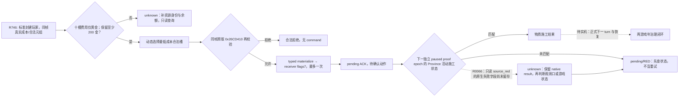

# CK3 1.19.0.6：玩家真实建筑成本到受控施工

这是 [原生建设决策树](domain-construction-ai.md) 的 G2-M4 标准封建窄分支。冻结 CK3 EXE SHA-256 为 `2D00FF3101EF70B566F2FCBAE292F09263199C80E9DC8F139B82D7D96F83DB86`；[ABI](../../ck3_autonomous_player/native_bridge/research/player_world_building_action_private_v1_abi.json) 和只读 [PE 校验器](../../ck3_autonomous_player/native_bridge/research/verify_player_world_building_action_private_v1.py) 固定原版调用及写入区间。其他 CK3 build 未验证。2026-09-16 R746 的真实 paused report SHA-256 为 `CBCC51B030FCCD54A44217B12BFF1E2DE6EA7AA4AB8569FB1CEE6F713C889F61`，来源为 exact agent `master@4ec36943` 的只读 slot42，仍没有施工动作。

R746 在相同玩家、日期和 paused 帧取得 981 个原版 `CBuildingType` 定义、6 个玩家亲自持有的 barony/Province 对、512 次原版玩家 `CanConstruct` 判断，以及 **6 个实际合法成本元组**。六个元组是 barony 2103、Province 2635、建筑定义 12 或 24、槽位 1 至 3；数字只记录证据，正式候选从当帧原版 source 动态选出。玩家黄金是 signed Q100000 `50035659`。建筑 12 原版成本 `40000000`，建筑 24 为 `15000000`；十槽原始费用的其余九槽（含 `raw[7]`）都是零。按至少预留 `20000000` raw 黄金的确定预算规则，建筑 24 留下 `35035659` raw；建筑 12 只留下 `10035659` raw，故不选它。纯黄金之外的资源身份仍未映射；当任一非黄金 raw 槽非零时，本窄分支不提交，继续补原生观测。

原版 building command validator `0x26CD410` 在 `0x26CD475..0x26CD4AB` 使用 `+0x2C` 的 BuildingTypeID 查 `0x864750/0x26D0F50` 原版定义管理器，并将 `+0x20` 玩家、`+0x24` Province、`+0x28` 施工槽及定义指针交给同一个 `0x295CD60` 玩家最终合法性/可负担性判定。R746 的槽位与 command selector 因此是同一个字段，仍须在**提交当帧**重新通过 validator。原版可负担性 `0x2CDD09D..0x2CDD0EF` 在一条条件分支将 `raw[7]` 加进黄金；R746 `raw[7]=0` 使该条件不改变六个元组的黄金费用，不需要猜触发标志。其他资源槽位在本候选都是零，不能借此宣称所有建设成本已解码。

原版 command materializer 是 building 主 vtable `+0x40 → 0x26D0C60`。receiver `0x341D990` 以 flags 7 把 command 入队并给 sequence；受理只表示 `pending_receipt`。第二 vtable 的原版执行器 `0x26CD290` 经 `0x21F6860` 写入 Province `+0x620` 的活动施工：`+0x70` 为 `CBuildingType*`、`+0x78` 为施工槽、`+0xE0` 为发起 CharacterID。私有只读查询在下一独立 paused application-main proof epoch 中，将活动 pointer 与同帧已经验证的原版管理器指针配对后只序列化 scalar BuildingTypeID。只有活动施工的 Province、槽、定义与发起人都匹配前一提交，才可证明物质结果；同帧缓存值、队列 ACK 或单纯进程存活都不满足。后续正式 turn 消费与 checkpoint/cold restore 还须实机取得。

私有 action CMake 选项 `XAR_CK3_ENABLE_G2_PLAYER_WORLD_BUILDING_ACTION_PRIVATE_V1` 默认 OFF，且仅能与已存在的 read probe 选项一同启用。实际运行前用 source save、EXE/DLL SHA、DLC/mod/profile、轮次与有界断言封候选；只有 CK3 唯一操作负责人可以运行。R746 只读结果不能被新代码的静态验证冒充为提交或后置结果。公共 query/action、MCP 广告与 G2-M4 完成状态仍关闭。新增 private receipt 字段为向后兼容的附加字段；当前没有公共 open_kaishek 适配器依赖，正式接口开放前须独立确认兼容矩阵。

R0060（2026-09-22，agent `fadc2e5b`）的正式 `native-auto-run` 20 turn 技术完成，但无建设 query/submit/receipt；这是建设正式闭环的证据不足，不是成功。driver-state 第 444、448、450、455、461、465 条公共 root query 均确认同一封建玩家；原生帧 `native_revision` 与 public `revision` 分别为 3/4、8/9、14/15、21/22、28/29、35/36。Python 和平封建 scope 错将两种 revision 要求相等，因而在 private 建设查询前返回 `scope_unavailable`。R0060 形状回归已证明这一失败，并改用 `snapshot_id = native:<native_revision>` 与 root 的原生 `snapshot_revision`、日期、角色共同绑定同一帧，同时只要求 public revision 有效。此补丁仍待新版本实机正式动作、独立后帧、下一 turn 消费及冷恢复复验，公共能力继续关闭。

R0066（2026-09-22，agent `be53794f`）正式 turn 1 选择 barony 2103/Province 2635/building 24/slot 1，并获得原生 receiver sequence 1 的 `pending_receipt` ACK；`applied=false`，不能算物质结果。turn 5 在独立 `native:9`、date 53178528 尝试只读 receipt，`query_construction_private` 返回 `source_red`，但旧 Python 路径将多种原生/帧失败压成泛化 `construction material source unavailable`，未把实际 `native_result` 留在 driver/report，故**具体失败字段与游戏中是否曾生效均未查明**。进程已回收，当前配对游戏 save 的 SHA 仍为动作前的 `D8BDC3C4…01474`，不能从旧 ACK 或原始 save 推断运行中后置状态。最小诊断补丁只在 private 失败 receipt 持久记录原 native result、只读 query request ID、读前/读后帧绑定与原 action request ID，保持 `ok=false`、pending 与 RED；normal/`-O` 聚焦测试通过，仍待实机读取。唯一实机负责人应先在冷恢复中核对实际状态，不得盲目重复提交。若原生状态确实不可观测，再按 exact build 补最小只读 bridge/MCP 查询；公共能力继续关闭。

R0066 的 driver 已记录动作提交和后续 turn，但现存 `D8BDC3C4…01474` 游戏存档仍是原始 R753 动作前版本，二者不是可以继续同一动作的配对 checkpoint。私有 `native-query-private-construction-source-v1` 只从原始配对动作前存档冷启动，调用已有 `g2_player_construction_view_probe_v1` 一次，不进入策略规划、typed 动作或日期推进；完整 `source_red` 原生结果和起止帧写入独立报告。它回答动作前源/ABI 是否可读，**不重建 R0066 动作后游戏状态，也不将 pending ACK 转为成功**。真实物质结果仍需从安全配对起点重新进行有界正式动作，并在动作后立即保存可恢复的游戏与 driver 对，再作独立 paused frame/下一 turn 核验。该诊断入口不注册或广告为公共能力；如后续需要通用 MCP，只迁移已验证的只读查询合同，不扩大此轮框架工作。

R0066 还暴露正式 runner 的动作后配对缺口：建设 typed submit 留下 `submitted_verification_pending` 和原生 receiver ACK 后，旧 runner 未立即保存游戏；turn 5 的 `source_red` 中止运行时只剩动作前游戏存档和动作后 driver，不能冷恢复为同一事实状态。最小补丁仅在该正式 submit 已返回时，于下一 turn 的只读 receipt 或日期推进前保存 paused 游戏 checkpoint，并要求相邻历史行为是同一个 `action_request_id` 的 ACK 行、持久 pending ledger 与角色/日期/episode 相符。checkpoint 只证明可恢复的待核验动作，不证明建筑生效；后续 `source_red` 仍是 RED、不得再次提交同一动作。聚焦 normal/`-O` 验证后仍须同版本实机证明该 fence、原生物质后置状态及下一 turn 消费；公共广告继续关闭。

R0073（2026-09-22）只读诊断在 CK3 启动前因私有 CLI 轮次正则拒绝项目分配器的规范零填充 `R0073` 而 RED；CK3 未启动、存档及 driver 未变。分配器使用四位最小宽度 `R{sequence:04d}`，因此此入口改为接受 `R0001…R0999` 与 `R1000…`，兼容既有非填充轮次，同时拒绝零号、错误长度/字符。该修复仅解除启动前格式阻断，原生建设源与 R0066 后置结果仍待独立实机证据。

R0076（2026-09-22，protected `0e251b2`、private ON DLL）从原始 R753 成对存档作一次只读源查询，原生返回 `source_available`，同一 paused `native:3` 帧选出 (barony 2103, Province 2635, building 24, slot 1)：完整十槽原生费用 `[15000000,0,…,0]`、金币 50035659、`native_cost_observed=true`、原生最终合法性已执行。`checks_truncated=true` 表示全候选枚举达到既定上限；原生 serializer 对公共能力明确固定 `cost_ready=false`、`construction_action_ready=false`，不因这个私有单候选已验证而开放公共广告。私有动作实现会在提交时重新绑定同帧、相同 tuple、成本和空闲槽；本轮**没有提交动作**。R0076 总报告仍是 RED：只读 runner 复用了旧的“一次恢复后仅 checkpoint prefix + 一条 restore”账本断言，而正式 driver 会保留此前同一 checkpoint 的已证明 restore 谱系。原始 driver 在 checkpoint index 441 后有旧 restore 442 和四条未落盘 gameplay/query；冷恢复正确地舍弃四条尾、保留旧 restore 442、添加当前进程 restore 443。暂停帧、无 gameplay、原存档未变和进程回收均已证明，但旧断言误报 `single_cold_restore=false`。需只修此私有诊断的谱系计算并重新受控复验；R0076 原 RED 不追改，R0066 动作后物质结果仍未知。
