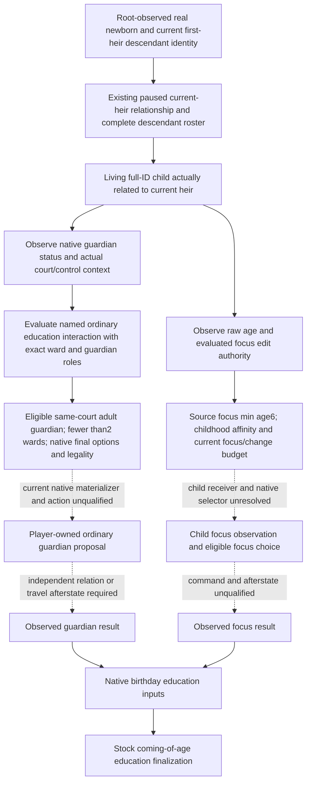

# Ordinary child education and guardians after a real birth

Source-first topic, 2026-10-08 / 2026-W41. The child age/sex and childhood-trait
publication is **static-ready / FIRST_NOTRUN**; guardian and child focus
remain **research**. Publication source base
`6ee7dea1b4d2fa4ecb05223f12c66b7afe72ac2d`; native identity is Root's
canonical CK3 1.20.0.4 / Steam25734779 freeze. This package performs no
Game/SDK work, new EXE read/hash, production import, build or test. The
supplied Robert29829 baseline has heir38822, spouse38718 and children0.
There is no new child, guardian operation, education focus or natural
succession credit. Pregnancy33 is a separate qualification package and is
not rechecked here.

Source packets:

- [Stock decision tree](Z:/ck3_mod_rewrite_process_assets/g2-parallel-20261008/post-birth-child-education34/stock/SOURCE-TREE.md)
- [Existing interface map](Z:/ck3_mod_rewrite_process_assets/g2-parallel-20261008/post-birth-child-education34/interfaces/INTERFACE-MAP.md)
- [Named GUI source entries](Z:/ck3_mod_rewrite_process_assets/g2-parallel-20261008/post-birth-child-education34/gui/GUI-NAMED-ENTRY-PROOF.json)

## Native tree and material value

Guardian assignment and education focus have different gates. In current
stock `common/character_interactions/00_education_interactions.txt:124–206,
280–504`, the ordinary same-court `educate_child_interaction` requires a
physically eligible child without a guardian and an eligible adult with
fewer than two wards. Its inspected script has **no numeric minimum ward
age**. The focus minimum is separately six, with at most one focus change
(`common/defines/00_defines.txt:240–241`). A newborn's focus age gate therefore
does not establish a newborn guardian prohibition. The complete evaluated
native interaction still decides whether a particular child is eligible.

The guardian is secondary_actor and the ward secondary_recipient; recipient
is the ward's liege (`00_education_interactions.txt:15–18`). `offer_ward`
reverses the secondary roles (`:847–850`); cross-court actions are separate
branches. A child of Robert's first heir may be Robert's grandchild and may
live in another court. The existing player-child marriage receiver cannot
silently stand in for this descendant or establish same-court authority.

Solid edges are source dependencies, not a demonstrated live loop. Every
unclosed native/action/live edge is dashed. This topic adds no waiting gate
to normal calendar progression and estimates no conception or education
probability.

## What stock AI considers

Same-court AI `ai_will_do` has base100 plus ward age; it favors personally
educating one's heir (+900), a rank3/rank4 educator of one's heir (+200),
same Dynasty (+200) and close friendship/romantic relations (+100).
It has further rival, lowborn, relationship, `player_educated`, conversion
and university branches (`00_education_interactions.txt:691–832`). Selected
conversion branches distinguish Rite and Culture, not only Faith. Player
redirect's random-courtier weights at`:46–83` are a different selection
path. Neither table demonstrates an optimal educator or native tie-breaking.

Education outcome inputs also differ from this guardian heuristic:
the education support source uses the guardian, otherwise court
tutor, otherwise court guru; its source reads educator focus skill×0.4 and
learning×0.2, intellect traits, childhood affinity/disaffinity and Culture/
House parameters (`common/scripted_effects/00_education_effects.txt:249–438`;
`common/script_values/00_education_values.txt:3–6`). These weights explain
future useful candidate observations; no outcome model is implemented.

Age3 assigns a childhood trait; age6 initializes default education. Five
focuses are `education_diplomacy`, `education_martial`,
`education_stewardship`, `education_learning` and `education_intrigue`,
with default markers curious/rowdy/bossy/pensive/charming. Their affinity
and disaffinity definitions are in `00_education_triggers.txt:195–248`;
auto-selection weights are in `00_education_focuses.txt`. Native
`set_default_education` selection and tie behavior remain unknown.
Birthday source dispatches child education acquisition after the age
increase (`common/on_action/birthday.txt:1–31`); the effect's older half-year
comment is not used to assert an observed cadence. Age16 finalization and
delayed cleanup are source events, not completed childhood progression.

`natural_education_progression` marks education initialization/catch-up
(`childhood_education_events.txt:828–837,1313–1337`); it does not prove a
natural birth. Existing observed descendant identity and Root's birth
outcome remain the target authority. No new biological-father prerequisite
or guessed newborn ID is introduced for ordinary guardianship.

## Existing capabilities and concrete gaps

| Input | Existing source and boundary | Next construction |
| --- | --- | --- |
| Actual child receiver | Current-heir query publishes complete raw descendant occurrences, full-ID validity, alive, parent slots, child-of-heir and lineage | Derive distinct living actual children from that observation; preserve the original raw roster and unavailable occurrences |
| Child age/sex | Actual4-bound `family_value::ReadCharacterValue(id, read_fertility=false)` is a generic full-ID reader | Source-ready `descendants.child_inputs` publishes raw values for those child receivers; reading failure remains separate from zero |
| Childhood trait subset | Actual4 HasTrait `0x28BB1D0` and TraitDB `0x89E5B0` are retained source; LIFE's fixed subset contains adult education/personality only | Source-ready child helper binds the five named childhood traits as a bounded subset with independent availability |
| Current child focus | Held LIFE ObjectGetter `0x29194B0`, focus fallback `0x5D1E308`, stable key+0x18; present producer uses played_character only | Close its actual child-focus receiver/absence semantics; do not hard-apply the full player LIFE reader |
| Guardian presence | Stock `Character.HasGuardian` in `gui/shared/lists.gui:1591` | Resolve its actual4 named registration and underlying Character predicate before implementing a boolean |
| Guardian identity | `CharacterWindow.GetRelationsOfType(GetRelation('guardian'))` at `window_character.gui:2956` | Follow the window wrapper to the real Character relation direction/collection; no guessed `GetGuardian` ABI |
| Native candidate/legal result | Current stock named `educate_child_interaction`, exact secondary roles/options | Adapt a current-build evaluated interaction query; hand filters do not replace final native legality |
| Education action/result | DIPLO4/5 education payload/materializer scaffolds are private 1.19.0.6 source | Current-build capture/materializer and command qualification, then independent guardian/travel/focus afterstate |

The registered owner is
`ck3_query_current_first_heir_relationship_private_v1(expected_native_revision)`.
Its native `observe_descendants12004` path and
`current_first_heir_relationship_v1.cpp` serializer are the existing owning
hooks; the strict transport already retains optional observations. Its
reproductive leaf's role list is exactly heir/spouses/betrothal. Adding
child rows to that leaf would violate the existing receiver contract. An
additive child observation must use its own derived child receivers in the
same envelope, keeping the existing relation and raw descendant leaf.
The additive source implementation below follows that boundary. It adds no
new MCP tool or command and has not yet been qualified in a compiled fixture
or published to a real CK3 process.

### Same-query child input publication

The optional `descendants.child_inputs` leaf derives its rows from
generation-valid, living, `child_of_heir=true` occurrences. Rows are distinct
full IDs in original first-occurrence order and carry every contributing
`occurrence_indices` value. Dead, stale, duplicate and non-child occurrences
remain in the original descendants leaf. A complete raw roster with no
eligible child produces an available, empty child leaf; an unavailable
roster produces an unavailable leaf, not a guessed empty household.

Each child row has two independent observations:

- `values`, source `native_character_age_and_sex`: signed16
  `age_measure_raw` and the native 0/1 `sex_selector_raw`. The existing
  generic `ReadCharacterValue(..., false)` is reused twice for a stable
  result and retains its full-ID/liveness/lineage/employer read semantics.
  A legitimate age zero is available; no conception/fertility gate is read.
- `childhood_traits`, source `native_character_has_trait`: fixed queried
  keys curious, rowdy, bossy, pensive and charming, and their canonical
  present subset. An available empty subset differs from unavailable/null.
  This is a five-key observation, not a complete Character trait census.

The source helper reuses only the public actual4
`BindPlayerLifestyleSnapshotEnvironment12004V1` TraitDB/HasTrait callbacks
and its stable-key decoder. Trait DB pointer span+0x50/count+0x5C and Trait
key+0x18 retain their qualified generic meaning. Definitions are resolved
once per query; the two five-key presence samples use the actual resolved
child pointer. Missing definitions or changed trait values leave this
sub-result unavailable independently of age/sex. The original descendants
status, reproductive receiver roles and normal calendar plan are unchanged.

Source construction points:

- `ck3_12004_first_heir_child_inputs.hpp` owns the minimal reader;
  `current_first_heir_child_inputs_v1.hpp` owns the distinct-child DTO.
- The existing application-thread descendant hook binds the generic trait
  environment from the admitted actual4 adapter descriptor and attaches
  the child read in the same relationship envelope.
- The existing serializer and Python descendants validator retain the
  optional leaf. Strict validation relates full child IDs and grouped raw
  occurrence indices back to the original native roster.

The source preparation is at
[child-observer35 packet](Z:/ck3_mod_rewrite_process_assets/g2-parallel-20261008/post-birth-child-observers35/ROOT-SOURCE-DELIVERY.json).
This publication does not establish biological birth cause, a guardian,
child education focus, focus-change authority or a completed education
operation. No family wait gate, success probability or new script is added.

A full player LIFE snapshot also demands current lifestyle/progress and
focus→lifestyle bindings. Its qualification does not establish child
education-focus semantics or child focus-control authority. The authored
GUI uses `Character.GetFocus` and `PlayerCanManageFocus`, but those names
alone are not a native receiver contract. Likewise, window-specific
`OnClickFocusButton` and `CanClickFocusButton` are not typed child commands.

Retained qualification is reused from
[runtime27 observer index](runtime27-background-observers-2026-10-08.md) and
[Root retained Runtime32 DLL receipt](Z:/ck3_mod_rewrite_process_assets/g2-background-20261007/upstream-build-migration/entry-live-fix32/ROOT-PARENT-RUNTIME-INCREMENTAL-DLL.json),
source `1dc2abf0d6d0342b12f634bd27cee70c4331e146`, 720 mixed owners.
This does not claim that all LIFE branches were retested in32 or that a
child has been observed. Historical religious-option deferral in the old
education materializer is not an active authorization restriction.

## Unique next source FIRST

The highest unclosed ordinary guardian input is actual guardian presence.
[Root's single named-entry recipe](Z:/ck3_mod_rewrite_process_assets/g2-parallel-20261008/post-birth-child-education34/ROOT-HAS-GUARDIAN-NAMED-FIRST-RECIPE.json)
is **SOURCE_NOTRUN**, ID
`actual4_child_has_guardian_named_entry34_FIRST0`. Prefer a retained actual4
named cache if Root already has one. Otherwise the committed research
capture reads only the metadata-defined `.rdata` section once, 17124352
bytes, searching the exact stock `HasGuardian` literal and its VA64
references/72-byte neighbors in that same buffer. It performs no whole
EXE read, hash, new PE parse, `.text`/`.data` read or raw section dump.
Root may combine other independently needed names before its unique pass.

The actual hit references must determine the next precise callback/body
capture. No RVA, relation layout or getter ABI is guessed. HasGuardian
would establish presence only; guardian IDs, control and final native
interaction remain their separate next source seams. No GUI wrapper is
invoked as an arbitrary Character observer.

The independent child input FIRST preparation uses the existing native
descendant target with `--child-observer-wire-dir`: five new whole-envelope
scenes cover empty children, legal age-zero with no childhood traits,
distinct children and all five trait keys across duplicate/dead/stale/
non-child raw occurrences, values unavailable with traits available, and
traits unavailable with values available. One new registered-consumer
method consumes those five wires plus a legacy copy with the optional
child leaf absent. Both preparations are **SOURCE_NOTRUN**, not newly
passed tests; existing descendant, household and pregnancy scenes are not
replayed. The fixture uses the canonical adapter descriptor. Raw native
wire identity still comes from the existing transport's descriptor and
`private_native_provenance`, not an invented SHA field in raw JSON.

Guardian presence/identity and current child focus remain separate named
source seams with the bounded Root recipe above. Native command ACK,
source fields or a compiled fixture never supply birth/guardian/live-loop
credit. Existing calendar, family and war execution continue independently.
