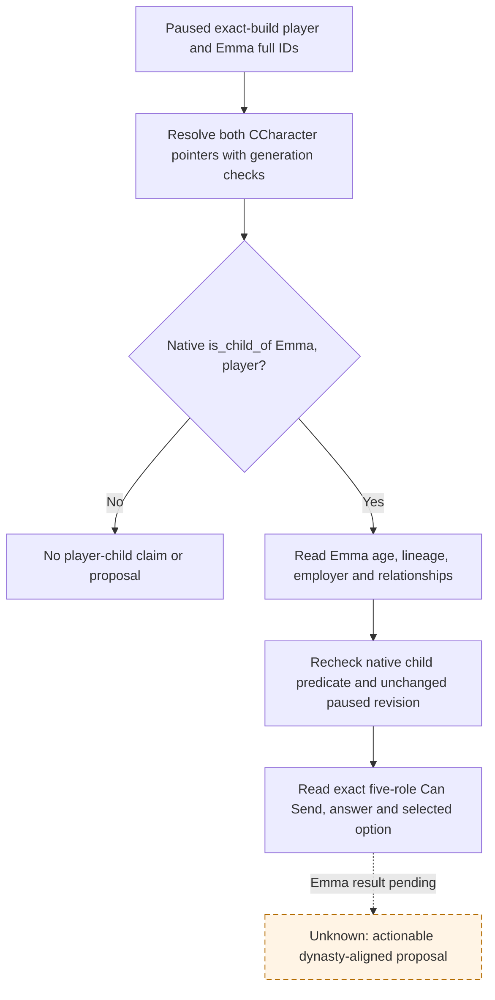
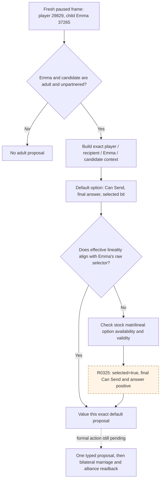
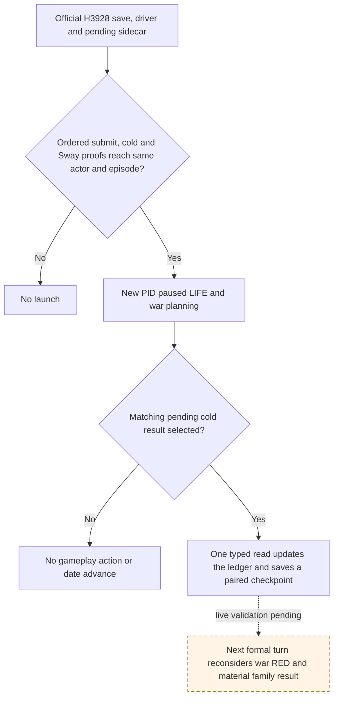

# Emma 37265: default marriage versus dynasty-aligned option

Status: R0323 production-frame private read confirms Emma as player 29829's adult, unpartnered child. R0324 reads the default Gerard 37267 context with effective matrilineal false, so that proposal was withheld. R0325 selected `true` on a disposable context and independently read complete Can Send and final answer positive for the same adult pair. No proposal or game outcome has yet been observed. The frozen CK3 build is `1.19.0.6`, EXE SHA-256 `2D00FF3101EF70B566F2FCBAE292F09263199C80E9DC8F139B82D7D96F83DB86`. The stock `00_marriage_interactions.txt` SHA-256 is `681A9B669E5A16642A197B6FE16085193DFBB99A398D0E20E86173F5AC6DE219`.

## R0323: specified child and default final legality

The official R0323 private read on recoverable Robert h3911 at paused `raw53219928` returned `player_child_verified=true` from the native `is_child_of` predicate for Emma `37265`. Emma was adult at measure `23/16`, House/Dynasty `174`, employed by player `29829`, and bilaterally unpartnered. All `154` returned final-legal rows have default-context complete Can Send and an answer allowing send; the row count is an inventory, not a value or action result. The highest raw acceptance among ten adult external-Dynasty candidates with age gap at most ten was candidate `37267` (age measure `23`, Dynasty `2052`, matchmaker `32440`, raw acceptance `5,300,000`). The second was `36701` (measure `25`, raw acceptance `1,700,000`). These compact rows omit candidate sex, House, kinship, the selected matrilineal bit, effective lineality, and actual alliance pairs. The [immutable verdict](Z:/family-child-h3911-predicate-v6/evidence/R0323/VERDICT.json) has SHA-256 `FAEC831D43F9D5BC1C5816D2D68E1086CB332204321AEC1A111FF8A2DDB318C3`; the full report has SHA-256 `A041D0E2D00A088780E64DDC4B843D5820D12DCA8C35CC20B6F8E3023046EC6A`. One query, zero gameplay actions or date advances, unchanged save, minimized window and process cleanup were observed.

The next bounded private read should reuse `ReadMarriageCandidateAlliancePrivateV1` for one specified native-child and one default-final-legal candidate, first `37267`. That function samples raw selectors, House/Dynasty, default selected matrilineal bit, ordinary outcome and possible alliance pairs on an unchanged paused revision; its existing relationship reader also supports a bilateral candidate partnership read. Its existing transport is limited to five current-first-heir rows by the bridge, so a one-row specified-child transport must rebind the child and the legal row without borrowing first-heir authority. If the default effective bit does not align with Emma's raw selector, the selected-option validity and answer remain unknown until an exact-build option selector is bound and observed. The existing typed submit remains first-heir-only.

R0324 resolved that default-context question on the same paused h3911/raw53219928 frame and native revision 3. Emma 37265 was a verified child, adult 23, selector 1, House/Dynasty 174; Gerard 37267 was adult 23, selector 0, House/Dynasty 2052; both were bilaterally unpartnered. The default context predicted `marriage`, with both selected and effective matrilineal bits false. Its sole projected alliance pair 29829–37267 had `would_attempt_if_accepted=false`; no alliance benefit is counted. The [immutable R0324 verdict](Z:/family-child-h3911-value-v7/evidence/R0324/VERDICT.json) has SHA-256 `5E6BDE2F6EC28BBECC468AB9C6A8677751216E404A3EC69966A78A3C23C7DB25`; full report SHA-256 `5A7D984BFB19FB5E721CF4ED253C3CDED009CE8A086AA670B496A61CC42627D8`. The game save stayed unchanged, with zero gameplay actions/date advances, minimized window and proven process cleanup. This observation identifies the selected `true` option as the next narrow read; it is not an accepted proposal.

R0325 completed the selected `true` read on a separate official H3911 pair at the same paused raw53219928/native revision 3. The disposable context read back `requested=true`, `selected=true` and effective lineality `true`; complete Can Send was true, recipient acceptance raw `5,300,000`, final answer status `0`, and the predicted adult outcome remained `marriage`. Both parties were still adult and bilaterally unpartnered, with Emma House/Dynasty 174 and Gerard House/Dynasty 2052. The sole projected pair 29829–37267 still had `would_attempt_if_accepted=false`; alliance value is zero for this observed proposal. The [R0325 immutable verdict](Z:/family-child-h3911-selected-v8/evidence/R0325/VERDICT.json) has SHA-256 `AF80A40D2836EAACBBB965C9A8C8DE72843EAEDCC37A5517AE38155D8B4A1A53`, and the full attempt report SHA-256 is `7038F77003E3519364A125D51DE8953C65A50E7EE9D5A81D4D7738AE86065BDD`. No action or date advance occurred; save SHA-256 `5EFB3B3CF3EE7368C6C12D4C984B4A0366AA8A971409165016E3DC24725A4746` stayed unchanged and CK3 was minimized and cleanly recovered. This is a narrow positive family-value opportunity, not a marriage result.

## R0320: native child membership reader contradicted by the paired save

R0320 read one paused Robert h3860 frame (`raw53219784`, actor `29829`) with the private specified-child query. The query returned `status=unavailable`, `unavailable_reason=not_player_child` for Emma `37265`; it did not reach native marriage Can Send, submit any proposal, or advance the game date. The same-run checkpoint was unchanged and the CK3 process tree was recovered. Its [formal attempt report](Z:/family-child-h3860-dispatch-v4/operator-runs/xenoamess-full-tower-eb9d2c1186--eternal-recurrence--R0320/attempt-report.json) has SHA-256 `DAD792355249F2A864DA10C296EC453DC7DB77BA62FCA29781896D40AB29CAB9`. This result is a failure of the **bridge's preliminary child membership read**, not evidence that CK3 denied Robert's marriage authority.

The qualified R0319 h3860 save (SHA-256 `7133DCE3B04C47CF27F0DF4D23F2871494EEA71DDC3EC9ACA209AD59D43C372A`) was independently melted with local Rakaly 0.8.19 (EXE SHA-256 `E154AF990AAED2C2F44284946772188C9749AD3F6B641B41F6C23456A6F1633D`). The melted file at `Z:\ck3_mod_rewrite\.task-tmp\NW-FAMILY-R0320-RELATION\h3860-melted.ck3` has SHA-256 `AD028A0359DC91AED93017A44528EFD9947D6D4CE7FCA4D8B1529A068245E353`. Robert's `family_data.child` lists `37265 37675 38293 38822 38988 39131 39308`; Emma's record is alive, born `1052.1.2`, in House `174`, has empty `family_data` (no spouse or betrothal), and has employer `29829`.

`ReadPlayerChildMarriageSubjectV1` currently treats `played+0x1A0 -> family+0x50` as a native `int32` child array. The exact-build source record had **not** proven the child semantics/layout of `family+0x50`; its focused test populated that assumed slot by hand. The h3860/R0320 pair disproves relying on this read for Emma. Exact EXE analysis still proves the family pointer and spouse/betrothal offsets, but has not yet resolved a callable native `GetChildren` accessor. Until a corrected reader has both ABI and paused-frame evidence, retain `player_child_verified=false` and do not borrow the first-heir action or send a marriage proposal. A default-off private diagnostic now samples typed array headers and at most 16 generation-checked IDs at family offsets `0x20..0x70` in one paused revision, without changing the action gate. Its live result will identify the next exact-build reader fix; it is not proposal eligibility by itself.

## R0322: exact paused layout and existing native child predicate

R0322 queried Emma on the recoverable Robert h3911 pair at one paused `raw53219928` / native revision `3`. The bounded diagnostic found `family+0x20` contains the independently read spouse `34730`, while `family+0x50` is a valid **empty** native int array. `+0x30/+0x40/+0x60/+0x70` did not have native int-array headers. The query still returned `not_player_child` at the preliminary bridge gate, without invoking marriage Can Send. It used one read-only query, zero actions and zero date advances, left the checkpoint unchanged, minimized the window, and recovered the process tree. The [small immutable verdict](Z:/family-child-h3911-probe-v5/evidence/R0322/VERDICT.json) has SHA-256 `15A9D7D933E2E723393331E2C876532D8C53A025D943FA7AC8F9C4B42FEEB068`; the full attempt report has SHA-256 `407E02A23F68B866E5F3BDD2F3F72DF138F31D6110607235234F4EDAA921DA55`. The checkpoint SHA-256 stayed `5EFB3B3CF3EE7368C6C12D4C984B4A0366AA8A971409165016E3DC24725A4746`; driver state changed during startup as recorded in the verdict.

The already frozen [native `is_child_of` ABI](prisoner-child-of-private-abi-2026-09-28.md) resolves the stock predicate at RVA `0x26085E0` on this exact EXE. It accepts `(child CCharacter*, parent CCharacter*)`, validates the parent's generation-bearing ID, then compares the child's two full parent IDs at `child+0x1A0 -> family+0x00/+0x04`. The private prisoner reader already binds this function, and R0296 obtained a real negative prisoner relation through it. The next private Emma reader can reuse this predicate for the **same specified pair**, sampling twice within the paused revision. A positive Emma result still needs the downstream five-role native Can Send/final answer and option-specific value; R0322 itself proves none of those.

## Exact native branch

The stock `arrange_marriage_interaction` uses player `actor` and the recipient matchmaker as `recipient`; the people who marry are `secondary_actor` and `secondary_recipient` (`_character_interactions.info:576-587`). Its `matrilineal` send option is at `00_marriage_interactions.txt:877-967`. `is_shown` excludes the both-male pair. `is_valid` has a TGP ceremonial-house exception, so visible does not imply selectable. `can_be_changed` also depends on whether the pair is already betrothed and excludes a both-female change. `starts_enabled` first preserves an existing matrilinear betrothal, then handles a **female player marrying herself**, then tests the actor/recipient/secondary pair conditions. Emma as the player's child is a distinct secondary actor: neither her name nor a default context proves that the option starts enabled or is legal. Faith is consumed only through these stock final conditions.

The compiled marriage dispatch `0x2282DE0` reads both participants' raw selectors at `CCharacter+0x199`. The exact-build call chain at `0x2282E76/0x2282E86` chooses the first selector for equal-selector pairs; otherwise `0x2282E99` reads the selected `matrilineal` option. That effective bit is passed to marriage at `0x2282F10-0x2282F1D` or betrothal at `0x2283047-0x2283057`. This proves the bit passed to the native marriage operation, not a future child's House/Dynasty or inheritance result. The `0/1` selector has not been mapped to a published male/female ABI; policy must compare raw selectors and the effective bit without renaming them.

Current `PrepareArrangeMarriageContext` in `native_bridge/src/ck3_11906.cpp` constructs, refreshes and finalizes a context with **default options**. `ReadMarriageCandidateAlliancePrivateV1` rebuilds that context and checks its complete Can Send, recipient raw acceptance and final answer before reading the selected bit and possible alliance pairs. `marriage_candidate_alliance_projection_v1` already binds the option-ID slot at RVA `0x57EB680`, selected-option reader at `0x2C40770`, alliance-pair projection at `0x22846B0` and current-alliance getter at `0x2661E00`. These read bindings say what the default context selected. They do not choose `matrilineal=true` or prove that the selected-option context would pass final legality. The first-heir typed action also binds the campaign-root first heir; it does not grant permission to submit for Emma.

Bounded exact-EXE disassembly after R0324 identifies the stock UI toggle callback at RVA `0x126E360`: it loads the same matrilineal flag ID slot `0x57EB680`, reads the current bit through `0x2C40770`, flips it, then calls setter RVA `0x2C407D0` with Windows x64 `(context RCX, option ID EDX, requested bool R8B)`. The setter scans option definitions by ID and invokes the row's native predicate before applying the state change, then refreshes the context. Its void return does not prove selection. A disposable context must read the bit back as true and independently re-evaluate complete Can Send and the final recipient answer; it must be destroyed without sending. The setter path is a source-supported next read-only probe, not an action authorization.

## Minimum same-frame observation and value threshold

For one bounded Emma action, bind full generation-validated IDs for player/actor, recipient matchmaker, Emma/secondary actor and candidate/secondary recipient on the same paused revision. Recheck that Emma is the player's child, alive, adult, currently unpartnered, in the player's current House/Dynasty and eligible to be represented by the player. Read the candidate's alive/adult status, bilateral spouse/betrothal state, House/Dynasty and raw selector. A different candidate Dynasty, ordinary adult `marriage` result, no grand-wedding promise or paid hook/piety/influence/herd option, and an effective lineality bit aligned to Emma's raw selector define the **narrow positive opportunity**: an adult child gains an actual partnership with a lineality choice compatible with her current dynasty. This is an opportunity value, not a prediction that a child will be born or inherit land.

The exact **selected-option** context must have the stock option available/valid, complete Can Send true, final recipient answer allowing send and positive acceptance raw. A default-option final-legal row is insufficient when the intended lineality differs. Project actual possible alliance pair IDs, pre-existing alliance, realm-data guards and `would_attempt_if_accepted` from that selected context. Reserve each proposed ally once if an attempt is projected; mark future call-to-war obligation and its value unpriced. A pair with no alliance attempt can establish the narrow family value independently of an alliance claim. Do not assign Emma title inheritance value from her child identity: that requires her actual successor/claim position. Do not assert future child Dynasty from the lineality bit.

## Conditional focused source patch and action gate

R0324 meets this condition. The source candidate binds stock setter `0x2C407D0` on a disposable context and requires selected-bit readback before sampling native complete Can Send and the final recipient answer. The setter itself evaluates the stock option-row predicate; an unselected readback is `selected_option_unavailable`, never a legal row. Compare default and `matrilineal=true` contexts for the same four roles and same paused revision, including grand-wedding flag, acceptance/raw final answer, ordinary marriage classifier and alliance pair projection. A fixture proves only the binding mechanics; a real paused row must show the selected-option result before a formal consumer uses it. No public capability or religious strategy follows from this probe.

The later action must use the exact selected-option context and independently recheck legality before submission, with a durable pending entry keyed by Emma, candidate, matchmaker and option. ACK means pending only. On a later paused revision, confirm **both** spouse lists name the other person, check the native proposal resolution and compare actual alliance pairs to the saved pre-state. A later turn must consume the result. Official checkpoint/cold restore must reread Emma and candidate under a new PID before releasing their reservation; relation absence alone cannot prove refusal or authorize a duplicate proposal. The existing first-heir ledger and action remain separate.

The next private source candidate applies that boundary generically to one specified player child. It retains R0325's selected proof only for the same native revision and final-legal row, rechecks the exact child predicate, full row and selected context on application-main before calling the existing typed five-role binder, and rechecks the selected bit again in the copied native send command. The ordinary first-heir action has a separate pending slot. Python writes `player-child-matrilineal-formal-v1.json` with subject, candidate, actor, recipient, selected option, source PID/date and `may_have_submitted` **before** the native call; a missing ACK cannot license replay. A material marriage requires bilateral spouse readback on a later paused frame. Cold restore checks child authority again and reads the outbound pending interaction if no bilateral relation exists. Actual alliance is a separate bilateral read after marriage. This remains source and fixture evidence until a distinct official paired action, later turn and new-PID restore complete.

At the H3911 war scene, the ordinary planner selects the paused read-only `query-war-termination-options-16777231`. The bounded child consumer may defer only the `query-war-termination-options-{currently active WarID}` form for one selected proposal; it preserves the original step and exact war/date/revision in the plan and pending ledger. It cannot replace a gameplay war action, modal decision, another family pending action or an unrelated query. The next planned turn resumes normal war arbitration once the proposal result is consumed. This private scene target is supplied by the formal runner; it does not add a general candidate search or cross-family resource allocator.

R0328 on the official H3911 pair submitted the selected maternal-line Emma37265/Gerard37267 proposal through that private route. The native ACK was accepted and a same-date H3915 checkpoint saved the `receipt_pending` ledger; it did **not** observe a marriage or an alliance. The immutable `Z:\family-child-h3911-action-v9\evidence\R0328-VERDICT.json` (SHA-256 `F7C5E5539045C7212AB6B4200E127AE6F4DBCB2CAE0A740A73863FF94F1E87B5`) binds the full formal report, save, driver and child ledger. The official state preparer previously had no child-ledger input. Its explicit `--child-matrilineal-sidecar` and `--child-matrilineal-proof-report` route now pairs the exact pending record with that submitted turn, saved checkpoint and driver before carrying the ledger into a new state. A cold new-PID read remains required to determine the material result and resume the deferred war query without repeating the proposal.

R0329 performed that first cold read on PID75760. Emma's proposal was still `pending`; the native outbound interaction was `active`, age 0 days with a 7-day AI reply cutoff. The same-date WarID16777231 termination query resumed, and H3922 retained the pending ledger. [The immutable verdict](Z:/family-child-h3915-cold-v10/evidence/R0329-VERDICT.json) has SHA-256 `17F0BE76ADE9D09AFEC5BB70A11EF4294079FB08FD327943C8F2399A382E7C9F`. The subsequent `query-army-strengths-v1` was intercepted by the bounded observer, so no date advance or later marriage result was observed. The formal consumer must read the pending result on the first **new** bridge PID and whenever a later native revision appears. Once the current PID has completed its cold read, a later revision uses the ordinary result path; only that path admits an explicit refusal or invalidation. The result read is paused and read-only, so it can precede a selected war action for one turn; the war action is chosen again from the next frame. On the unchanged R0329 revision, the existing war choice remains untouched. This recovery wiring cannot itself advance the seven days or bypass the unresolved war forecast.

H3922 exposed an official pairing gap: the child state preparer accepted only R0328's initial saved submit proof, while the R0329 cold read changed the pending ledger and saved a later checkpoint. The preparer now accepts the consecutive R0328 submit and R0329 cold proof reports, binding the latter's new PID, fixed seed, pending result, unchanged subject/candidate/option, lack of repeat submit, final save and final ledger. R0329's one-time wrapper still says `cold_result_not_qualified` because it classified the intercepted third read as a failure; its nested formal run says `candidate_terminal_intercepted`, `ok=true`, and records process cleanup. The source-stage H3922 `prepare-state`/ordinary no-launch probe at `Z:\family-child-h3922-proofchain-probe` passed with save SHA-256 `1BCB1FD30A097A2E8EBA9F96F013AB22A4B6490E0819CF8548B8F337473628A3` and child ledger SHA-256 `984F140CCAF733CA66A0377C271DFB0A8152EEE5D296E3DE245168A76FE331FC`. This is pairing readiness only; no new PID, date advance, relationship result or alliance was observed in that probe.

## Bounded formal pending recovery after the H3928 read

The existing `--private-child-matrilineal-pending-read` stops after one paused
observation and leaves the formal child ledger untouched. #564 added a
`GameplayBridgeService` route that can replace LIFE's wartime priority return
with the **existing pending** `RESULT_STEP`, preserving a blocked native-war
plan under `child_matrilineal_deferred_war_red`; it needs the specified pair in
`driver.child_matrilineal_target_v1`. The operator previously did not pass
that target. This source change adds a default-off operator route for one
paired cold result turn. It does not authorize a new proposal or advance time.

The operator reuses the official ordered R0328 submit and R0329 cold proof
chain. H3928 additionally needs the R0339 pending Sway continuation, R0342
applied report and resolved Sway sidecar to reach its save. The source-stage
H3928 chain was checked without launching CK3: the validator returned
candidate `37267`, pending Emma `37265`, actor `29829`, episode
`native-29829-2bc2d599f7f9`, save SHA-256
`A92073407D1CB2800EEF9C0C3EFEB9846D48398F679DC3163B71EF86C40CEC2C`
and raw source driver SHA-256
`9D381400574278BC4F1C736A48BB4B90CE1E12D8440A004AFBD1F5399A4204C0`.
The prepared driver has a different hash after official path rebinding; the
new operator prelaunch check compares raw source and prepared target to their
**separate** `ordinary-seed-rebind-v1` fields, then checks the actual prepared
driver and save against the manifest. A proof or pending-ledger mismatch
stops before live-run allocation or game launch. The native turn guard admits
only a cold `RESULT_STEP` for the same pending record. After that read, the
bounded runner saves a same-date, same-actor checkpoint beside the updated
pending or resolved ledger. No result, next turn,
marriage or alliance is claimed from this source verification.

