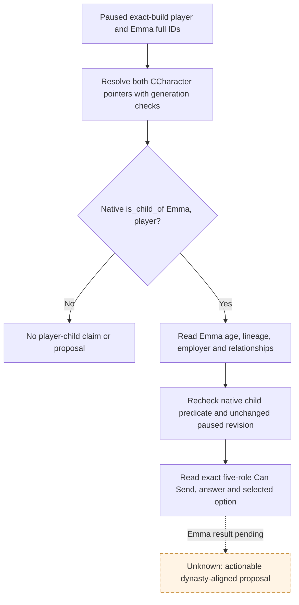
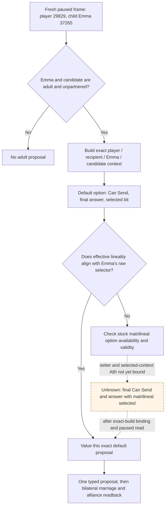

# Emma 37265: default marriage versus dynasty-aligned option

Status: exact-build source analysis only. No current paused Emma candidate, proposal, or game outcome is established here. The h3686 save identified Emma as player 29829's adult, unpartnered child in House 174; her current relationship and the player's right to arrange a particular match need a fresh paused read. The frozen CK3 build is `1.19.0.6`, EXE SHA-256 `2D00FF3101EF70B566F2FCBAE292F09263199C80E9DC8F139B82D7D96F83DB86`. The stock `00_marriage_interactions.txt` SHA-256 is `681A9B669E5A16642A197B6FE16085193DFBB99A398D0E20E86173F5AC6DE219`.

## R0320: native child membership reader contradicted by the paired save

R0320 read one paused Robert h3860 frame (`raw53219784`, actor `29829`) with the private specified-child query. The query returned `status=unavailable`, `unavailable_reason=not_player_child` for Emma `37265`; it did not reach native marriage Can Send, submit any proposal, or advance the game date. The same-run checkpoint was unchanged and the CK3 process tree was recovered. Its [formal attempt report](Z:/family-child-h3860-dispatch-v4/operator-runs/xenoamess-full-tower-eb9d2c1186--eternal-recurrence--R0320/attempt-report.json) has SHA-256 `DAD792355249F2A864DA10C296EC453DC7DB77BA62FCA29781896D40AB29CAB9`. This result is a failure of the **bridge's preliminary child membership read**, not evidence that CK3 denied Robert's marriage authority.

The qualified R0319 h3860 save (SHA-256 `7133DCE3B04C47CF27F0DF4D23F2871494EEA71DDC3EC9ACA209AD59D43C372A`) was independently melted with local Rakaly 0.8.19 (EXE SHA-256 `E154AF990AAED2C2F44284946772188C9749AD3F6B641B41F6C23456A6F1633D`). The melted file at `Z:\ck3_mod_rewrite\.task-tmp\NW-FAMILY-R0320-RELATION\h3860-melted.ck3` has SHA-256 `AD028A0359DC91AED93017A44528EFD9947D6D4CE7FCA4D8B1529A068245E353`. Robert's `family_data.child` lists `37265 37675 38293 38822 38988 39131 39308`; Emma's record is alive, born `1052.1.2`, in House `174`, has empty `family_data` (no spouse or betrothal), and has employer `29829`.

`ReadPlayerChildMarriageSubjectV1` currently treats `played+0x1A0 -> family+0x50` as a native `int32` child array. The exact-build source record had **not** proven the child semantics/layout of `family+0x50`; its focused test populated that assumed slot by hand. The h3860/R0320 pair disproves relying on this read for Emma. Exact EXE analysis still proves the family pointer and spouse/betrothal offsets, but has not yet resolved a callable native `GetChildren` accessor. Until a corrected reader has both ABI and paused-frame evidence, retain `player_child_verified=false` and do not borrow the first-heir action or send a marriage proposal. A default-off private diagnostic now samples typed array headers and at most 16 generation-checked IDs at family offsets `0x20..0x70` in one paused revision, without changing the action gate. Its live result will identify the next exact-build reader fix; it is not proposal eligibility by itself.

## R0322: exact paused layout and existing native child predicate

R0322 queried Emma on the recoverable Robert h3911 pair at one paused `raw53219928` / native revision `3`. The bounded diagnostic found `family+0x20` contains the independently read spouse `34730`, while `family+0x50` is a valid **empty** native int array. `+0x30/+0x40/+0x60/+0x70` did not have native int-array headers. The query still returned `not_player_child` at the preliminary bridge gate, without invoking marriage Can Send. It used one read-only query, zero actions and zero date advances, left the checkpoint unchanged, minimized the window, and recovered the process tree. The [small immutable verdict](Z:/family-child-h3911-probe-v5/evidence/R0322/VERDICT.json) has SHA-256 `15A9D7D933E2E723393331E2C876532D8C53A025D943FA7AC8F9C4B42FEEB068`; the full attempt report has SHA-256 `407E02A23F68B866E5F3BDD2F3F72DF138F31D6110607235234F4EDAA921DA55`. The checkpoint SHA-256 stayed `5EFB3B3CF3EE7368C6C12D4C984B4A0366AA8A971409165016E3DC24725A4746`; driver state changed during startup as recorded in the verdict.

The already frozen [native `is_child_of` ABI](prisoner-child-of-private-abi-2026-09-28.md) resolves the stock predicate at RVA `0x26085E0` on this exact EXE. It accepts `(child CCharacter*, parent CCharacter*)`, validates the parent's generation-bearing ID, then compares the child's two full parent IDs at `child+0x1A0 -> family+0x00/+0x04`. The private prisoner reader already binds this function, and R0296 obtained a real negative prisoner relation through it. The next private Emma reader can reuse this predicate for the **same specified pair**, sampling twice within the paused revision. A positive Emma result still needs the downstream five-role native Can Send/final answer and option-specific value; R0322 itself proves none of those.

## Exact native branch

The stock `arrange_marriage_interaction` uses player `actor` and the recipient matchmaker as `recipient`; the people who marry are `secondary_actor` and `secondary_recipient` (`_character_interactions.info:576-587`). Its `matrilineal` send option is at `00_marriage_interactions.txt:877-967`. `is_shown` excludes the both-male pair. `is_valid` has a TGP ceremonial-house exception, so visible does not imply selectable. `can_be_changed` also depends on whether the pair is already betrothed and excludes a both-female change. `starts_enabled` first preserves an existing matrilinear betrothal, then handles a **female player marrying herself**, then tests the actor/recipient/secondary pair conditions. Emma as the player's child is a distinct secondary actor: neither her name nor a default context proves that the option starts enabled or is legal. Faith is consumed only through these stock final conditions.

The compiled marriage dispatch `0x2282DE0` reads both participants' raw selectors at `CCharacter+0x199`. The exact-build call chain at `0x2282E76/0x2282E86` chooses the first selector for equal-selector pairs; otherwise `0x2282E99` reads the selected `matrilineal` option. That effective bit is passed to marriage at `0x2282F10-0x2282F1D` or betrothal at `0x2283047-0x2283057`. This proves the bit passed to the native marriage operation, not a future child's House/Dynasty or inheritance result. The `0/1` selector has not been mapped to a published male/female ABI; policy must compare raw selectors and the effective bit without renaming them.

Current `PrepareArrangeMarriageContext` in `native_bridge/src/ck3_11906.cpp` constructs, refreshes and finalizes a context with **default options**. `ReadMarriageCandidateAlliancePrivateV1` rebuilds that context and checks its complete Can Send, recipient raw acceptance and final answer before reading the selected bit and possible alliance pairs. `marriage_candidate_alliance_projection_v1` already binds the option-ID slot at RVA `0x57EB680`, selected-option reader at `0x2C40770`, alliance-pair projection at `0x22846B0` and current-alliance getter at `0x2661E00`. These read bindings say what the default context selected. They do not choose `matrilineal=true` or prove that the selected-option context would pass final legality. The first-heir typed action also binds the campaign-root first heir; it does not grant permission to submit for Emma.

## Minimum same-frame observation and value threshold

For one bounded Emma action, bind full generation-validated IDs for player/actor, recipient matchmaker, Emma/secondary actor and candidate/secondary recipient on the same paused revision. Recheck that Emma is the player's child, alive, adult, currently unpartnered, in the player's current House/Dynasty and eligible to be represented by the player. Read the candidate's alive/adult status, bilateral spouse/betrothal state, House/Dynasty and raw selector. A different candidate Dynasty, ordinary adult `marriage` result, no grand-wedding promise or paid hook/piety/influence/herd option, and an effective lineality bit aligned to Emma's raw selector define the **narrow positive opportunity**: an adult child gains an actual partnership with a lineality choice compatible with her current dynasty. This is an opportunity value, not a prediction that a child will be born or inherit land.

The exact **selected-option** context must have the stock option available/valid, complete Can Send true, final recipient answer allowing send and positive acceptance raw. A default-option final-legal row is insufficient when the intended lineality differs. Project actual possible alliance pair IDs, pre-existing alliance, realm-data guards and `would_attempt_if_accepted` from that selected context. Reserve each proposed ally once if an attempt is projected; mark future call-to-war obligation and its value unpriced. A pair with no alliance attempt can establish the narrow family value independently of an alliance claim. Do not assign Emma title inheritance value from her child identity: that requires her actual successor/claim position. Do not assert future child Dynasty from the lineality bit.

## Conditional focused source patch and action gate

Only if a fresh Emma row passes default native legality yet fails the dynasty-aligned lineality value gate, bind the exact-build native option-selection/availability/validity path. The existing option-ID slot and selected-bit reader can be reused; the **setter and option-validity ABI remain unbound**. On separate disposable contexts for the same four roles, compare default and `matrilineal=true` option identity, selected flags, grand-wedding/other paid flags, complete Can Send, recipient acceptance/raw final answer, ordinary marriage classifier and alliance pair projection. Bind both reads to the same paused revision and fail closed on any identity or option drift. A fixture may prove only the ABI; a real paused row must show the selected-option result before a formal consumer uses it. No public capability or religious strategy follows from this proposal.

The later action must use the exact selected-option context and independently recheck legality before submission, with a durable pending entry keyed by Emma, candidate, matchmaker and option. ACK means pending only. On a later paused revision, confirm **both** spouse lists name the other person, check the native proposal resolution and compare actual alliance pairs to the saved pre-state. A later turn must consume the result. Official checkpoint/cold restore must reread Emma and candidate under a new PID before releasing their reservation; relation absence alone cannot prove refusal or authorize a duplicate proposal. The existing first-heir ledger and action remain separate.
