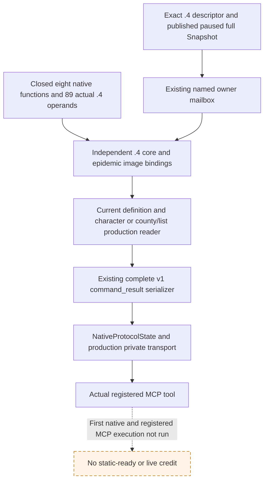

# 1.20.0.4 adopted epidemic queries: source migration

2026-10-07, ISO W41. This package migrates the two existing enabled private
queries for CE1 recovery material and treatment modifier presence. The native
topic/input ledger was read before changing their binders. No player policy,
selector, MCP registration condition or gameplay action is added.

The new identity is CK3 **1.20.0.4 / Steam 25734779**, EXE SHA-256
`98702F88A547CDE2EAF29A85F93B85F68EE4CF8148336A4F7AFAEB75319DD518`.
The immutable implementation baseline is source
`caa4adc3d1278e324cf4ec19774028e9b9138e28`. This child read source/held JSON
only; the sole native mapper owns actual old/new function and operand captures.

## Native input ledger and unchanged value semantics

The existing [recovery event tree](epidemic-events-0110-recovery.md) records the
`formerly_infected_counties` pre-action list and the original `.0110` option
semantics. An explicit full LandedTitleID remains necessary after the event
clears that list. The existing [treatment reader tree](ck3-1.20.0.2-epidemic-treatment-presence.md)
and [loaded definition ABI](ck3-1.20.0.2-epidemic-modifier-definitions.md) provide
the input contract, rather than a guessed `.4` AI policy.

| Input | Actual production use | Held old game operand source |
| --- | --- | --- |
| Played character/date/pause | existing current core and full generation ID | separately migrated `.4` core profile and 33 field operand pairs |
| Modifier definition | DB getter, stable key hash, loaded lookup, fallback and exact CString key | `event12002_loaded_modifier_definition_abi.json` |
| Treatment rows | Character+1B0, extension rows+188/count+194, stride48, definition pointer+0 | `event12002_treatment_modifier_rows_abi.json`, trigger 1AFA160 |
| Recovery county | title storage, full identity+10, type tag+14, definition+48/tier+64, sret16 presence getter | `event12002_recovery_county_modifier_abi.json` |
| Recovery list | scope context, variable table/lookup/name; context30/3C, rows48/key8/elements10/count1C, complete target16 | `event12002_recovery_variable_list_abi.json` and the identifier subset of `ck3_1_20_0_2_phase_definitions.json` |

Those four event metadata modules have a held historical `.3` PASS record in
`ck3_1_20_0_3_abi_reuse.json`. That historical result does not admit `.4`.
The finite new mapping request is
[FINITE-EPIDEMIC2-MAPPER-REQUEST.json](Z:/ck3_mod_rewrite_process_assets/g2-background-20261007/epidemic-actual4/FINITE-EPIDEMIC2-MAPPER-REQUEST.json):
eight actually called native functions, three global proof roots, and only the
named title/definition/treatment/list operand windows. Shared identifier and
hash mappings are reused by the mapper. The unrelated script-identifier
sentinel in the initial request projection is excluded from this package.

The sole mapper's final
[EPIDEMIC2-FUNCTION-AND-OPERAND-MAP.json](Z:/ck3_mod_rewrite_process_assets/g2-background-20261007/upstream-build-migration/epidemic-functions/EPIDEMIC2-FUNCTION-AND-OPERAND-MAP.json)
closes all eight called functions and **89 actual old/new game checks**:
30 treatment, four definition, 37 county and 18 list instructions. All
required nonrelative member/literal operands match; the actual named RIP roles
for database root `5C670F8`, title storage `5D1DAF8` and missing-modifier
fallback `5D1E0B0` are unchanged. The metadata inventory child read zero EXE
bytes; the separately authorized sole mapper added **3,878 bytes / 36 bounded
reads**, including only the missing 23-byte scope-context suffix per build.
Shared helpers and existing prefixes were not reread or decoded again.

| Profile role | Actual `.4` RVA |
| --- | --- |
| Static modifier database getter | `8FD4E0` |
| Stable key hash | `3F7E220` |
| Loaded modifier lookup | `AB8D20` |
| County sret16 presence getter | `1AF5D20` |
| Scope variable context | `370EAF0` |
| Variable identifier table | `3F8A7E0` |
| Variable identifier lookup | `3F8A660` |
| Variable identifier name | `3F8A6D0` |
| Full title storage slot | `5D1DAF8` |
| Missing modifier fallback slot | `5D1E0B0` |

Legal empty recovery targets remain `available` with `counties=[]`. A known
missing treatment modifier, null extension or zero rows remains `available`
with `present=false`. Failed definition/list/row reads remain `unavailable`
with `counties=null` or `present=null`. Both DTOs preserve `remaining_days`
as unavailable with `duration_abi_not_verified`; authored five years does not
become a measured expiry.

## Source delivery and qualification boundary

`ck3_12004_epidemic.hpp/.cpp` independently construct the two bindings using
`.4 BindCoreImage`. Only caller-owned software structs and the already
established current-process readers/DTOs are reused. The two domain mailboxes
select the `.4` builders only for the exact `.4` descriptor triple and retain
the existing `.2/.3` path. No whole-image historical binder or SHA substitution
is used. The finite epidemic profile now contains the ten actual `.4` literals
and is enabled from that complete receipt; no mapping residual remains for
these two adopted queries. Shared router/envelope/source-list integration and
first build/fixture qualifications remain separately owned.

The new `ck3_12004_epidemic_whole_query_test.cpp` authors eleven fresh whole
command-result scenes through the real recovery and treatment mailbox
controllers, current-process production readers and serializers. It uses an
exact `.4` fixture descriptor/owner profile and caller-owned synthetic native
callbacks; the historical fixture main is never invoked. It also exercises
the real domain handler rejection of a `.4` descriptor carrying the wrong
hash. It is **AUTHORED_NOTRUN**, not a paused CK3 artifact.

`test_ck3_12004_epidemic_whole_query_mcp.py` authors one new compound async
method. Root supplies only the newly produced native output directory through
`XAR_CK3_12004_EPIDEMIC_FIXTURE_DIR`. The actual complete packets pass through
`NativeProtocolState`, the production driver/private transport, the existing
recovery Service route, real `create_server` registration and `MCP Client`.
The `.4` hello/snapshot context and request correlation are explicit fixture
scaffolding; native results are unchanged. Missing fresh output is a skipped
unrun fixture, never a fallback to historical packets. This method is also
**AUTHORED_NOTRUN**.

[SHARED-HOOKS.json](Z:/ck3_mod_rewrite_process_assets/g2-background-20261007/epidemic-actual4/SHARED-HOOKS.json)
names the shared source-list/router/envelope hooks for the exclusive entry
owner. This child does not edit the shared adapter, bridge or main CMake and
does not build, run tests, contact the SDK, start CK3, or stage/commit/push.
The coordinating owner records the combined English commit and Oct7/W41
fields. Readiness is source implemented / research until the shared entry hooks
and separately owned first qualifications finish; there is no new game day,
production-live primitive, loop or epidemic outcome credit.
