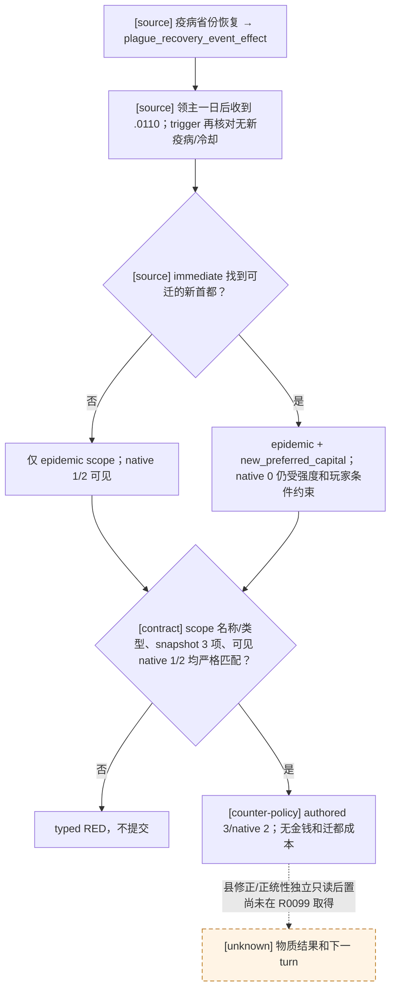

# `epidemic_events.0110`：疫后重建（R0099 自然 RED）

## 冻结原版决策树

CK3 `1.19.0.6`，EXE SHA-256 `2D00FF3101EF70B566F2FCBAE292F09263199C80E9DC8F139B82D7D96F83DB86`。`game/common/epidemics/00_epidemics.txt` SHA-256 `090607AC30E86817A709A6A8F5F2B5FC785AF11C352873B823CF2C3AA5A77E7F`，七种疫病的省份恢复回调均调用 `plague_recovery_event_effect`；该 effect 在 `game/common/scripted_effects/06_dlc_ce1_epidemics_effects.txt:854-885`（SHA-256 `0E27972D9F66348E462130F1EF0351BB18A4C646DB6E23DB237D79068E65DE98`）记录旧疫县，并对存活、未获十日通知标记的领主在一天后派发本事件。事件定义 `game/events/dlc/ce1/epidemic_events.txt:151-413`，SHA-256 `FEF2972BD4F778818CD3A414C337D036F5132C1598FEBAB0E2623E0252DB7A1E`。

事件要求 inherited `epidemic`、旧疫县列表、领内无新疫病，以及两年 cooldown 已过（灾难性黑死病除外）。`immediate` 仅在符合等级、旧疫县和法理条件时另存 `new_preferred_capital:landed_title`。选项 a/native 0 还要求该 scope、重大以上疫病和人类玩家；它花钱、转移县、迁都。选项 b/native 1 花钱换更强的五年县恢复修正；原版 AI 权重基数 100，但钱不足时权重归零。选项 c/native 2 不花钱、不迁都，给旧疫县较弱的五年恢复修正，有正统性时另有极小正统性损失；原版 AI 权重基数 50，并受性格修正。我方选择 c 是有限的持续游玩决策，不宣称与原版 AI 等价或长期最优。

## R0099 投影与修复边界

R0099 普通 production 运行在 `date_raw=53367864`、event instance `23` 自然出现本事件，正式 planner 选择前因 `direct_projection_support:optional_scope_types=false` 停止，没有事件动作。当前 paused scope 只有 `epidemic`（raw type 50/type `epidemic`），两个 shown+enabled 选项为 rendered/native `0/1` 与 `1/2`；这是已有 R375 真实物化过的 exact 形状。R0099 formal report SHA-256 `D8EBAC3FA6DDB959516F91293866B08B088690E71CAFF93A9C256ECDB6DD03C3`；最后物理配对安全存档为 h1023/raw53367816，后续 h1032 driver tail 尚未配对，恢复必须先核对/丢弃 tail。R375 的 authored3/native2、旧 instance 消失只证明历史 production-live primitive，不能代替 R0099 的动作、县修正/正统性物质后置或下一正式 turn。

最小消费者仅对 `.0110` 把当前实际存在、且在 source-reviewed optional 类型表中的 `new_preferred_capital` 加入本帧有效 `scope_types`。仍严格校验两种已见 scope 集、数量、类型、玩家 ROOT、唯一窗口、authored 三项与可见 native `(1,2)`；若出现 native 0 或其它 scope/选项形状继续 RED。此修复不注册通用 optional scope 消费，不改变公共 MCP/native ABI、`open_kaishek` 协议或能力广告。正式复验需要新 Python 制品版本，不能热改旧 ZIP；若恢复链不兼容须按 checkpoint 合同处理。独立 paused 县修正或正统性读取尚未确认可用，不得以 ACK 或弹窗消失冒充物质结果。

## 2026-09-22 R0101 自然消费与物质归因缺口

完整事件 ID 是 `epidemic_events.0110`。R0101 的普通战役正式报告在 raw `53367864` 先查询 instance `23`，再由正式策略提交 authored option 3/native index 2；独立 paused 后帧中旧 instance `23 -> null`，随后继续正式 turn。该选项在本 build 的 `epidemic_events.txt:365-396` 中，按疫情强度给 `formerly_infected_counties` 县列表添加五年 `county_epidemic_recovered_minor_modifier` 或 `county_epidemic_recovered_tiny_modifier`，并在 `has_legitimacy = yes` 时施加 `miniscule_legitimacy_loss`。冻结 `00_legitimacy_values.txt` 将该值定义为 `-20`。这确认来源脚本的条件效果路径；R0101 当时尚未读取正统性或县修正的同日动作前后值。

后续 R0113–R0116 用新只读 `player_legitimacy_v1` 两阶段冷恢复读取同角色 `36403`：h1023/raw `53367816` 为 `283`，h1094/raw `53368176` 为 `263`。两锚点相隔十五游戏日，中间虽然只记录了这一次 typed 事件选择和十五次一日行军推进，仍未排除日期流逝或其他世界效果，也未读取县修正。因此 `-20` 只是与来源效果一致的差值，不能单独证明事件的独占物质因果。[不可变只读清单](<Z:/ck3_mod_rewrite_process_assets/m2-0110-bounded-live-20260922/EVIDENCE-MANIFEST.md>)列出源 save/driver、四次 CK3 轮次及读数哈希；R0101 正式报告 SHA-256 为 `7A82922E808A368006402C15E6AD624F76BFC2A601C081DAAF1D8BF97CF60972`。

R0101 报告还记录了首个事件后 checkpoint：raw `53367888`、save SHA-256 `07D6D867C96A760CDECA760420E8C6F7FCC7B77AC2022521755D54A19C990198`。它已经晚于动作一天，并且报告中五个 checkpoint 共用 `state-final/profile/save games/xar_checkpoint.ck3` 路径；该物理文件现为 h1094/raw `53368176`、SHA-256 `2F6F3DCA9E9CD92D87FDE1CD296A581F6A3A38F11E2781765E99815B7769C39A`。首个 post 哈希仅是历史记录，不能把当前文件或未配对 autosave 改称为近邻配对。

下一次**自然** `.0110` 出现在本来就要继续的普通战役时，最小有界补证是：

1. 同一 paused 日期、同一玩家 CharacterID、同一 event instance 下，先冻结 `player_legitimacy_v1`、event key/native option、`scope:epidemic` 强度，以及 `formerly_infected_counties` 的县 ID 列表和各县现有目标修正；若县列表或修正不可读，明确记该县物质项为 `unknown`，只施工所需的只读 native/MCP 字段。
2. 正式策略仅提交一次本事件合法的 typed option，随后在日期未推进的独立 paused 帧再次读取同角色正统性及同一县 ID 列表对应的修正。核对旧 instance 消失、选项 receipt、正统性变化与 exact `has_legitimacy` 分支、疫情强度对应的五年 minor/tiny 修正。没有同日两帧或必要县 ID 时，不从十五日差值反推县效果。
3. 让下一正式 turn 消费新状态，并保留完整 save/driver 配对与动作身份。若期间另有正统性效果或条件分支不能独立排除，材料归因继续 pending；不通过重播旧随机时间线凑事件。
