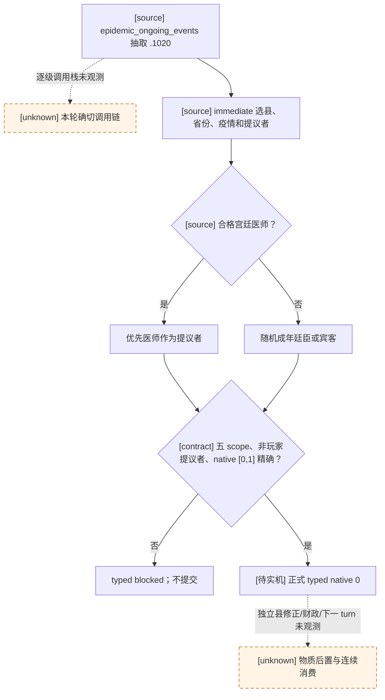

# `epidemic_events.1020`：疫病期间种花提议（R0094 自然 RED）

## Exact-build 原版决策树

- CK3 `1.19.0.6`，EXE SHA-256 `2D00FF3101EF70B566F2FCBAE292F09263199C80E9DC8F139B82D7D96F83DB86`。`game/common/on_action/ce1_on_actions.txt` SHA-256 `96B42FA1A542836171A2A608B7155A8A80D30B0D8F8D9742EBE8AFF231B85E16`，`:1-8` 在 `epidemic_ongoing_events.random_events` 中列出本事件，权重 `100`。`game/events/dlc/ce1/epidemic_events.txt` SHA-256 `FEF2972BD4F778818CD3A414C337D036F5132C1598FEBAB0E2623E0252DB7A1E`，`:1013-1149` 定义 trigger、immediate 和两条选项；R0094 已证实自然窗口，但单帧不证明每一级引擎调用栈。
- trigger 要求附近领内疫情与至少一名成年可用廷臣或宾客。immediate 选定疫病省份/县并保存 `epidemic_province`、`epidemic_scope`、`epidemic_county`；有合格宫廷医师时优先保存为 `miasma_courtier`，否则从廷臣/宾客随机选。事件另继承 `epidemic` scope。提议者须是可读的非玩家 Character；具体身份不能由 event key 猜测。
- authored/native `0` 种花：`remove_treasury_or_gold = minor_treasury_or_gold_value`，增加少量正统性，给选中县加 15 年 `flowers_planted` 修正，并按性格增减压力。native `1` 拒绝：损失少量正统性，部分性格会增压。选项 `0` 的 AI 权重还受资金门控制；我方既有 registry 的 native `0` 是源审阅后的确定性正向路线，不宣称原版 AI 等价、通用预算最优或零成本。

## R0094 冻结帧与消费者边界

R0094 从 R0093 h487 同一普通封建 campaign 恢复，turn `3`、date_raw `53361360` 自然出现 event instance `21`；玩家 `36403`，authored count `2`，原生两行 `[0,1]` 均 shown+enabled。旧正式 planner 因未单独准入既有合同的 `unique_character_scope_excludes` 而返回 `registered_contract_requires_extended_consumer`，未提交动作。formal report SHA-256 `321AFAB3EA936A65A96E987D7D882532A5FC97A59D4DD19F91FC3C06AAB3D04C`。本轮没有新的 checkpoint；来源游戏存档仍为 h487、SHA-256 `08CC5423B8150B9E8EA05EF4B7C58F8042215065565CB5138E39DAD19399DB2C`。故障后的 driver SHA-256 已变化，不可与来源存档直接假定配对；正式恢复须按既有 checkpoint 合同核验。

最小静态修复只让该 exact event key 使用现成的唯一 Character 排除检查。仍需单一窗口、玩家 ROOT、五个 saved scope 的准确名称和类型、`miasma_courtier != 玩家`、两行原生索引及唯一 enabled native `0`；不匹配则保持 blocked。normal 与 `-O` 聚焦测试覆盖合法选择和角色/县 scope/选项拒绝；这不关闭 R0094 的实机 RED。

下一次同版本单实例验收需证明单次 typed 提交、独立 paused frame 事件消失及县修正/财政或正统性物质结果、下一 turn 不重复、checkpoint 与 cold restore 语义。ACK 和窗口消失均不单独构成物质结果。无 native ABI、公共 MCP、open_kaishek 协议或广告变化；跨仓适配不需要。

## R0095 最小物质读回（未实机）

现有 B114 DLL 的 `played_character_gold` 是原生 `CCharacter` 扩展里的 Q100000 整数；`NativeHeadlessGameplayDriver._execute_event_option_step` 在 typed 选项提交前、独立事件消失后的暂停帧分别输出 `event_selection.starting_played_character_gold` 和 `ending_played_character_gold`。R0094 留存的 `driver-state.json` 已有角色 `36403` 的有效金币 `66365619` raw，且公共 campaign-root 证明 `feudal_government`、flags 不含 `government_has_treasury`。原版 `common/governments/00_government_types.txt:5-48` 的标准封建政府无 treasury 标志；`common/script_values/01_dynamic_values.txt:413-424` 的 `minor_treasury_or_gold_value` 因而走 `minor_gold_value`，该值下限见 `common/script_values/00_basic_values.txt:49`（15 金币）。此推论限当前标准封建支持范围，不能推广到有 treasury 的政府。

因此本包复用正式结果，不新增 DLL、MCP 查询或 CK3 重启：对精确 `epidemic_events.1020`/native `0`，同帧起点金币不可读则不提交；提交后要求同一角色、两端 `status=available`、Q100000、后帧 snapshot/revision 前进且金币 raw 严格下降。现有 driver 另核对 episode、连接代次、PID、暂停与旧 event instance 消失。只有比较器报告 `verified_change` 才给正式 turn 记 `event_material_change`；零变化、正变化、身份/帧漂移均保留 RED，不能用 ACK 或弹窗消失替代。后一正式 turn 必须消费已发生的选择，checkpoint/cold restore 仍按既有合同核验。若实机出现有 treasury 的政体或金币无下降，先保留现场，再补县 `flowers_planted` 只读读回；不把未知当成成功。
