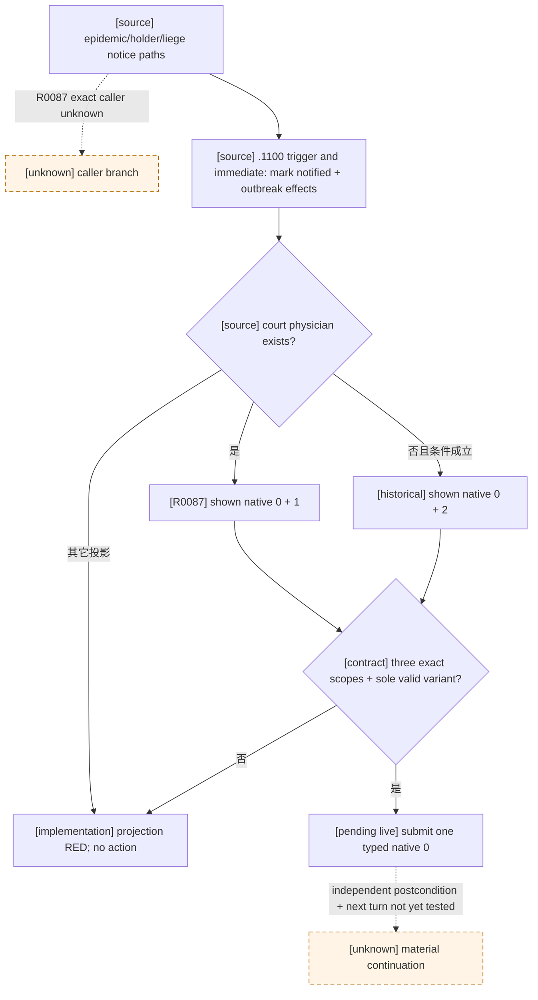

# `epidemic_events.1100`：疫情爆发通知（R0087 自然 RED）

## Exact-build 原版树

- CK3 `1.19.0.6`，EXE SHA-256 `2D00FF3101EF70B566F2FCBAE292F09263199C80E9DC8F139B82D7D96F83DB86`。`game/events/dlc/ce1/epidemic_events.txt` SHA-256 `FEF2972BD4F778818CD3A414C337D036F5132C1598FEBAB0E2623E0252DB7A1E`，`:3624-3916` 定义该事件。`common/scripted_effects/06_dlc_ce1_epidemics_effects.txt` SHA-256 `0E27972D9F66348E462130F1EF0351BB18A4C646DB6E23DB237D79068E65DE98`，`:165,195,219,231,238` 的不同 outbreak/holder/liege 通知分支均可调用 `.1100`；当前 R0087 帧不能区分本次实际调用分支。`common/defines/00_defines.txt:1719-1720` 另将其列为部分疫情严重度的默认感染通知事件，不是同帧调用证明。
- 原版 `trigger` 排除不应重复通知的同一疫情并要求 available；`immediate` 从 `scope:province.county` 保存 `infected_county`，记录 `plagues_notified`，并执行 outbreak/县 modifier（县持有人时还可能有 legitimacy tooltip）。因此已经发生的疫情效果不能靠三个选项回滚。
- authored/native `0` 是感叹/承受通知：只在 `is_governor=yes` 且有 `governor` trait 时额外扣 `2` governance XP；其余分支无后续事件。authored/native `1` 仅在有 court physician 时显示，调用该医生并在三天后触发 `physician_epidemic_events.1020`。authored/native `2` 仅在没有 court physician 且满足脚本条件时显示，设置 30 日求医标志并触发 `health.3001`。三项 authored `ai_chance.base=100`，不构成唯一原版偏好；native `1/2` 互斥，不能把 authored count `3` 当作三行均物化。native `0` 的条件 XP 代价需如实保留，不能称为零代价或语义最优；作为 bounded continuation，它不新开医生/求医链。

## R0087 同帧与最小正式选择

标准封建首种子百年前缀正式运行 turn `85`、date_raw `53350248` 自然出现 instance `19`。同一 paused `native:159`，玩家/ROOT Character `36403`；`epidemic` raw `50` / type `epidemic`、`province` raw `8` / type `province`、`infected_county` raw `5` / type `landed_title`，三个非 Character 的具体 identity 仍 opaque。snapshot 报告 authored option_count `3`，原生窗口只物化两行且均 shown+enabled：rendered `0` / native `0` 与 rendered `1` / native `1`；native `2` **不存在于本帧窗口**。两行 effect indicator 都为空且 preview 不完整，不得用空图标推断无效果。冻结 raw report SHA-256 `59B73E52F71B61FDBFD5D8440100963ADD4489D51719E1D49793606A8B921CD5`；故障后 driver SHA-256 `F150E5E7BB4E440DC4073E9AF202E8D7713866332734D1056C861AB1A558824D` 只供观察，不与安全存档混配。旧 consumer 因未准入已有 `option_variants` 返回 `registered_contract_requires_extended_consumer`，没有动作。

已有 registry 精确记录 `[0,1]`（有医生，本次）和 `[0,2]`（无医生的既有观察）两个互斥 variant，二者仅 source-bound 选择 authored `1` / native `0`。最小改动只准入本事件的既有 option-variant resolver；仍要求三 scope 名/类型完整、单窗口、每行原生索引及 shown/enabled 精确、authored count `3` 和 native `0` 唯一。此选择的代价是放弃可能有益的医生后续链，属于保守 B0 continuation，不替代未来疫情治理策略或宣称最优。

修补后的专用消费者用冻结 R0087 window **只读重算**得到 `recommended`、authored `1` / native `0`、variant `0`、`failed_checks=[]`；同帧正式 planner 离线返回 `select-event-option-1`，但均非实机动作。R0087 是保留的自然实机 RED。B0 续验至少核对单次 typed 提交、独立 paused frame 中旧 instance 消失、下一 turn 不重复提交、有效 checkpoint；若要求“疫情物质结果”，还须独立读取同一 outbreak 的县 modifier/通知状态（它们在 immediate 已改变）或可见 governor XP，不能由空 indicator、ACK、事件消失或日期推进推断。该物质读取未在本包验收，不能据此提高 G2-M2。此补丁不改 native ABI、MCP 公共接口、能力广告或 open_kaishek 协议。
