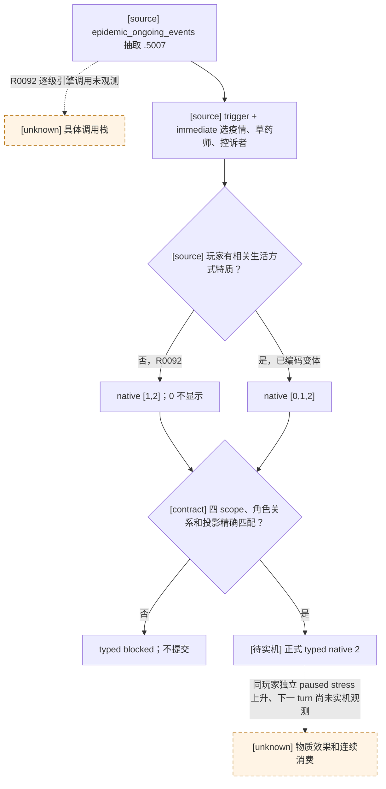

# `epidemic_events.5007`：草药师被控巫术（R0092 自然 RED）

## Exact-build 原版树

- CK3 `1.19.0.6`，EXE SHA-256 `2D00FF3101EF70B566F2FCBAE292F09263199C80E9DC8F139B82D7D96F83DB86`。`game/common/on_action/ce1_on_actions.txt` SHA-256 `96B42FA1A542836171A2A608B7155A8A80D30B0D8F8D9742EBE8AFF231B85E16`，`:1-26` 的 `epidemic_ongoing_events.random_events` 以权重 100 列出本事件；R0092 证明确有自然事件，但单凭暂停帧不能还原此前每一级引擎调用。`game/events/dlc/ce1/epidemic_events.txt` SHA-256 `FEF2972BD4F778818CD3A414C337D036F5132C1598FEBAB0E2623E0252DB7A1E`，`:6722-6962` 定义事件及三个 authored 选项。
- `trigger` 要求玩家信仰对 witch 为 shunned/criminal、领内附近有疫情，以及健康成年草药师/神秘主义者/医师/园丁和另一名可作控诉者的廷臣或宾客。`immediate` 分别随机保存 `epidemic_scope`、`herbalist`、`accuser`；后两者不能是同一人。事件从疫情 on_action 继承 `epidemic` scope。
- authored/native `0` 仅当玩家自己持有相关生活方式特质时显示；它给予草药师对玩家的感激好感、少量正统性，并有性格相关压力。选项中的 `trait = lifestyle_*` 是选项关联标签，不是 `add_trait` 效果。native `1` 给草药师 witch 特质并执行合法囚禁，增加虔诚和控诉者好感，同时也有压力分支。native `2` 给控诉者负面好感，条件成立时把草药师标记为潜在朋友，并有性格相关压力；它不附加 witch 特质或囚禁。三项 `ai_chance` 均非唯一确定选择；当前 bounded continuation 取 native `2`，不是原版 AI 等价、长期最优或零成本声明。

## R0092 冻结帧和最小消费者

普通封建正式运行 R0092 turn `40`、date_raw `53359920` 自然出现 instance `21`。玩家 `36403`，snapshot authored `option_count=3`；原生窗口只有两行，rendered/native 分别为 `0/1` 与 `1/2`，均 shown+enabled。native `2` 的 effect indicator 显示可能增压，但 preview 不完整；不能据此推算实际数值或后置结果。正式 planner 因 `character_scope_differs_from`、`option_variants`、`unique_character_scope_excludes` 未获 direct consumer 准入而 RED，**没有提交动作**。报告 SHA-256 `5BF2A0B7D72A1E0B04E50DB5A79E9462C23872C99355DFCFD2E9CF8A69FC96D3`；最近保存的游戏存档是 turn `24`/history `459`、save SHA-256 `28BAC454C043BE3DA7F188D12959C39880C76A1AAFB703AB68418C030170F359`，但故障后的 driver 已延伸到 history `477`，两者**未形成当前可直接使用的物理配对恢复输入**。正式恢复必须先核验并舍弃不相配的 driver 尾状态；不能把 turn40 尾帧冒充安全配对恢复点。

既有可迁移 registry 合同已给出两种完整原生投影 `[1,2]` / `[0,1,2]`，都选 native `2`；其 ROOT 用运行时玩家绑定，不固定旧种子人物。最小修复仅为本 key 准入已有的 variant resolver 和角色关系检查，仍要求单一窗口、四个 exact saved-scope 名/类型、herbalist 与 accuser 均非玩家且互异、authored count `3`、selected native `2` 唯一且 shown+enabled。任何漂移继续 blocked，不选“第一个按钮”。聚焦 normal 与 `-O` 测试覆盖两种投影和关系/选项拒绝；这只是 static-ready，R0092 RED 需真实同版本冷恢复后复验。

### 同帧 stress 指示器限定的物质核验

原版 native `2` 对控诉者的 `annoyed_opinion -20` 是必执行效果，但现有公共 paused event 结果**没有**任意控诉者对玩家的好感查询；不能把其脚本存在当作观测到的后置。玩家 stress 分支则依其性格可能上升、下降或不变，故不能对所有 `.5007` 帧静态宣称“stress 必上升”。R0092 所选 native `2` 的当前原生 effect indicator 是单行 `stress/increase/affected_by_trait=true`。按[原生 indicator ABI](event-effect-indicators.md)，该方向来自当帧玩家 stress effect 的 signed 聚合；它仍不提供数值，也不表示其它效果完整。

新增的 exact-key comparator 只在当前所选 native `2` 的单行 indicator 精确为上述上升形状、且原版定义 SHA-256 匹配时生成 `played_character.stress_points / strictly_increasing` 预期。正式 planner 还要求同帧玩家 stress 数值可读，否则**提交前阻断**，保持该事件 RED。正式 typed 动作后，必须由**同一玩家、独立 paused snapshot 和更大的 revision** 读取到严格正增量才给 `verified_change`；零增量、下降、角色或帧绑定变化均为失败，不把 ACK 或事件消失算物质成功。没有该 indicator 的其它变体也在提交前阻断，不能凭没有物质预期的窗口消失来宣布 GREEN；后续若需处理这些变体或证明好感变化，须另补最小只读 native 观测，不能凭空套用当前 stress 比较器。normal 与 `-O` 测试只证明该比较器和正式 planner 的静态接线，不代替自然实机复验。

不改 native ABI、公共 MCP 接口或 open_kaishek 协议；无需跨仓适配。下一次单实例验收必须核对动作只提交一次、独立 paused frame 旧事件消失、可观察的好感/关系/压力结果或明确不可观测边界、下一 turn 消费以及兼容 checkpoint。ACK、选项提交或旧事件消失均不能单独关闭物质后置门。
