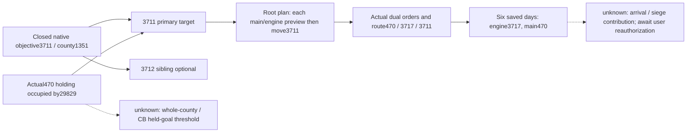

# Assault470 capture and stage3711, exact 1.20.0.3

Source-first: reuse the closed native objective tree in `episode03-occupation-war-score-1.20.0.3.md:28–44,106–109` and `war-occupation-targets-12003.md:321–334`. Province3711 is the native objective/capital, holding1352 of county1351;3712 is its sibling holding1353. Historical fort0 at3712 is not evidence that it can replace the primary objective. The native occupation getter counts eligible holdings n/N; one captured holding does not prove the whole county, held-goal threshold or ticking requirements. [Sealed objective receipt](Z:/ck3_mod_rewrite_process_assets/g2-resume-20261003/war-goal-capture-execution/post470-war-objective-v77/cb-objective/ROOT-DELIVERY.json), SHA256 `80e27447857418d0ddf89463d7d0037a739fb08444140b423f6cfecfabda916e`, is reused without rereading it. Exact EXE SHA256 remains `94B55397ABB687A3DCD436805A5D885E6BE90FA6C693FEB44A9E3BBEEADE02A6`.

The existing [first-day assault topic](episode03-assault-finite-loop-1.20.0.3.md), pushed by Root in `6f1ce14d`, remains sealed. Fresh native107/public2/date53265024 gives P470 holding1334/county1333/legal holder32309, while actual occupier is29829 on attacker side and counted against opposing territory. Occupation is observable and occupiedtrue, F6/G25/B0; siege observabletrue with active siege null. Legal holder32309 and occupier29829 remain distinct fields. War117440524 score changed25→38; the observed+13 is not a partition of score causes. This closes the actual Start → normal advancement → occupation-confirmed holding capture loop. It does not establish title transfer to Robert, whole-county control, CB goal completion or a war victory.

Latest Root normal12-day process12352 was CLOSED0GREEN: checkpoint h9020/date53265024/count5029; save99018510B/SHA256 `161a70d2196e5bc94e5aa74245454ffa8f1dd03bc6984fde1fcc524f66256fe7`. Historical normal stages are1day,10days,then12days:23 total, also5029−5006. Root owns those credits; this lane adds0days and does not replay them.

Fresh3711 rich metadata shows guard184549452/playertrue on full Siege486539314: still unoccupied with null occupier, F6/G500/B2912, current23699268/total55000000/remaining31300732 Q100000, progress43.089%, native ETA322. K0 and current ordinary work0.97436/day are actual inputs that make engine reinforcement a concrete value entry. Prepared phase18days/counter1/canAdvance true; breach0/wallsfalse/assaultfalse/canStartfalse/canStopfalse, assault work0 and casualty prediction0 are real observed zeros. Reinforcements have not arrived or increased K in this report, and the native ETA is not a fixed completion promise.

After the actual470 capture, Root plans main301989997 and engine268435481 separately toward3711. The existing MCP recipe is `ck3_execute_step(step="preview-move-army-301989997-to-3711", expected_revision=freshR)`, with engine literal `preview-move-army-268435481-to-3711`. Existing movement is `ck3_move_army(army_id=<that public FullCUnit>, target_province_id=3711, expected_revision=<that move's freshMoveR>)`. Registry references forwarded by native counterpart are `mcp_server.py:2309–2317,2429–2439`: keywords are `step` and `target_province_id`. These are recipes, with no preview success, movement, meeting or increased siege power claimed. Guard184549452 is already besieging per Root metadata and is retained.

Root's20965 capture and the Commander/Dynamic owners provide existing fresh actor and route inputs: actual presence/control/current provinces and formation, noncombat/retreat state, preview route/cost and current hostile/contact scope. Rich3711 siege is already supplied above as parent metadata. This package introduces no additional endpoint or gate and does not read those owners' originals. Arrival and contribution will be assessed from actual paused state rather than inferred from a plan.

Owner evidence is linked without opening bodies: [470 receipt](Z:/ck3_mod_rewrite_process_assets/g2-resume-20261005/siege-arrival-engine470-g76-readiness/actual-r46-assault470-capture01/470/ROOT-DELIVERY.json), SHA256 `71a13a2dbced5f6b70b20d35d173f13ae089df6ea33779678b04d97dc5ec4805`; [3711 receipt](Z:/ck3_mod_rewrite_process_assets/g2-resume-20261005/siege-arrival-engine470-g76-readiness/actual-r46-assault470-capture01/3711/ROOT-DELIVERY.json), SHA256 `df075ccffa306492e79ccd313a5801c590fdfaa7924d82b65fe8f6767168c5ae`.

Readiness is **production-live holding capture loop** for470 and a source-grounded planned next stage3711. This document and report fields use parent/native-counterpart metadata only; no SDK, raw/cache/source audit, tests, build, window, shared-source or Git operation was performed by this lane.

## 同日两军实际路线预览

470占领后，Root SDK44861正常CLOSED0；main301989997与engine268435481两份原件各唯一读取一次并封完整缓存。actualnative109/public2/generation10/raw53265024：两个 `preview-move-army-…-to-3711` 都 accepted=true/status=available，route_preview实际路线均为 `470 → 3717 → 3711`，2跳。province_supply 当前470限4562/用2054，目标3711限2625/当前用2912；这些是当前省份用量，未投影加入增援后的用量。

本预览没有独立 CanMove bool、金钱或行军时间 cost、route blocked_reason 字段；供给查询的 unavailable_reason 是明确 null。缺字段不补 true/0。`ck3_execute_step` 注册参数为 `step`；正式动作是 `ck3_move_army(army_id=301989997或268435481,target_province_id=3711,expected_revision=该次fresh公共R)`，每军分别执行现有原生最终校验与实际后态读回。guard184549452保持现有围城。当前只有真实 readonly preview primitive；新移动、抵达、K增强和3711占领尚未授予信用。本 lane SDK与游戏日新增均0；Root本次预览查询未推进游戏日期。

原件004 SHA `a12a215fe8d4ff2890f7f3a9ab033cf425332b8204331cd03fdfefbcba4c4e11`，006 SHA `bd8ff049753e3c39354266e136c634f8ae21ba0edbc456fc701eb8b9fab645b2`，各3339B；完整缓存 `OWNER-DUAL-PREVIEW-FULL-CACHE.json` 11800B SHA `4c7d81cae49906a045cd3b028eb96ada29921a2ab8cb5d7b6b491bb34818c379`，外置目录 `war-goal-capture-execution/capture470-stage3711-v73`。

## Normal dual orders and independent route SAVE

After actual470 capture and the two actor-specific native previews, Root submitted normal moves for main301989997 and engine268435481 toward3711, SDK76659CLOSED0. Engine's original typed result is acceptedtrue/statussubmitted, while its actual war_action is `moving` with `postcondition_verified=true`—the field is published here. Engine submission was native112/public3/generation11; readback was native113/public4.

The engine-exclusive view, consumed once, contains actual controllable player engine268435481 at470, target3711 observable, route[3717,3711], complete_nonempty/sourcecount2, moving state7, inCombat false and retreating false. Root's independent final metadata confirms that same state at date53265024/native113/public4. Parent separately reports main301989997 has the matching actual stored route and state; its original was not read by this lane. Guard184549452 remains at3711/state3 with route[].

Root normal SAVEh9030 is99018760B/SHA256 `9f98e796f0b82662a204a629e5a39695702f39b1022bb9b40db30ab7ed0bc7ee`, with0newdays/count5029. This extends the narrow actual loop through capture → two previews → two normal movement orders → independent stored-route verification → SAVE. It does not show arrival, formation merge or increased siege K. Root's normal6days SDK93322 was RUNNING at the parent update; that future result has no credit or outcome here.

Evidence: [engine order receipt](Z:/ck3_mod_rewrite_process_assets/g2-resume-20261003/war-goal-capture-execution/capture470-stage3711-v73/engine-move-consumption/ROOT-DELIVERY.json). Unique view2718B/SHA256 `1ed40975ee801634657ee8ad6e91d21e532b4a92b73554e43cb3ba0019c31f16`; original0066142B/SHA256 `60df92b66b7842ceb2483f3f36632a594bd74dcbde106673863b3c57f803b857` was Root-only. Exact API/source and previous preview remain sealed. This lane made0SDK/raw/otheractor/preview/source/test/build/window/shared/Git operations and0newdays.

## 六日实际行军与用户接管

Root normal6days/SDK93322 CLOSED0，完成6日/144h、partial0；raw53265024→53265168，累计5035/res1882/Oct5+377。最后 Root 元数据中，engine268435481 已到3717、余 route `[3711]`；main301989997 仍在470、route `[3717,3711]`；两军实际 state7/moving、目标3711，guard184549452继续3711围城。两军均尚未抵达3711；不计新到场、K2强化或3711占领。六日由Root计入，本 lane游戏日0。

行军正常SAVEh9048/99036288B 的完整Root SHA为 `9354912f261fca203aeda8e0cedaef6c5b579c210444556faefc590233db783d`（由Root既有结果缓存补齐，未读取游戏或存档）；最后83619只读查询CLOSED0后正常SAVEh9052，完整SHA `e0a7fb224723c62296a60ce6683c7b7f2e7614a6d6536e6a3ab8cbf2a5840cec`。这些均为Root提供的元数据，本 lane未读取查询、SAVE或其他owner原件。

用户开始自行游玩数小时；Root STOP自身R46上下文并确认 managed47337 CLOSED0，观测时间07:22:48UTC/北京时间15:22:48，已明确释放游戏控制。此后不得进行实机SDK、attach、窗口/进程操作、prepare-stage-build或profile修改；只保留纯后台轻量artifact/source工作。**恢复实际操作须用户再次明确授权，再读取其后真实状态**：不能沿用本快照假定当前阵容、位置、战况、未抵达、权限或路径仍有效，也不安排额外启动任务。

## 用户接管前最后围城冻结补充

Siege soleowner在总包封版后提供最后元数据：raw53265168/native140/public2，3711同 FullSiege486539314/guard184549452/playertrue，未占领/occupiernull；C24279868/T55000000/rem30720132、44.145%/动态ETA319、F6/G500/B2883/M85800/K0/D96432(Q100000)。phase18/18、counter7、levels0/2/0/4/0、breach0、assaultfalse、CanStartfalse、CanStopfalse。470仍Robert占领，F6/G47/B0/合法无activeSiege；G47属于此后六日冻结帧，先前capture G25保持原时间。main470、engine3717仍向3711移动，尚未到场。

唯一owner封包 `Z:/ck3_mod_rewrite_process_assets/g2-resume-20261005/siege-arrival-engine470-g76-readiness/actual-r46-march3711-day6-frozen01/ROOT-DELIVERY.json`，15658B SHA `020fe414839a42f5d16e1f3be9b519869c2c97a11599bddaea27ba9a0ba95f39`；本 lane只接收消息，不读原件、fullcache或receipt body。原总包SHA `4e1c146dc048e46e35e260e64612a6c0a987f5a6d3e9e9f092cea2e44aaed3a0` 不漂移，本补充可在其最后handoff EOF后追加。0新增SDK/游戏日；Root managed已停止，后续实机仍须用户再次明确授权并读fresh状态，本冻结不代替用户游玩后的世界。
