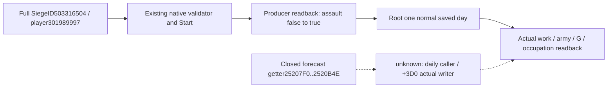

# P470 first-day assault loop, exact 1.20.0.3

Source-first reuse: the sealed native tree in `episode03-assault-1.20.0.3.md:48,57–59` binds Start/Stop to the full SiegeID, confirms native action validation and observed flag, and treats daily work/casualties as forecasts. Exact game EXE SHA256 is `94B55397ABB687A3DCD436805A5D885E6BE90FA6C693FEB44A9E3BBEEADE02A6`. Native getter `0x25207F0..0x2520B4E` is closed; the actual daily writer/mutator of `+0x3D0` remains unclosed. The next source entry is the getter caller/actual tick, recorded in [source-gap receipt](Z:/ck3_mod_rewrite_process_assets/g2-resume-20261003/war-goal-capture-execution/assault470-finite-loop-v73/source-gap/ROOT-DELIVERY.json), SHA256 `b6c3e59246fdc05fe16899d2088c38d4e6b1fe8229dadf6bda5266ce71837f86`. This gap does not block the current observed loop.

Root actual War117440524/P470 loop progressed from Start to one normal saved day and independent result readbacks. Work `36272855→37264295` gives `Δ991440/Q100000=9.9144`. Same full army301989997 changed `2994/3873→2919/3873`, net−75; engines remain7/11. Forecast75 and actual net−75 match numerically, but that equality alone does not establish exclusive assault loss. Likewise `(991440−247440)/620000=1.2` is arithmetic against pre-start inputs, not a proven tick multiplier or additive integration rule.

The independent rich result is raw date53264496/native13/public2, same Siege503316504/army301989997/player true. Remaining work is17735705 of total55000000 Q100000, progress67.753%, native ETA19, B2926/G550/F6. Current assault flag true; canStart false, canStop true, breach1 and walls breached true. Phase current/prepared16days, counter7, canAdvance true. Current formalDaily964620/Q=9.6462 belongs to the already assault-active state and must not be labelled current ordinary work. Current assault forecast is600000/Q=6work/day and73casualties. Neither forecast nor native ETA is a fixed whole-assault loss/completion promise.

P470 occupation is observable, `is_occupied=false`, occupier null: this first day has not captured it. Root has started at most10continuation normal days, SDK45827 reported RUNNING, with no duplicate Start; those future results are outside this receipt. Continue value assessment from fresh actual work, same-FullID strength, G and occupation; use existing Stop only when the actual same Siege is still active and native stop legality permits it. No early P3711 move follows from this first-day result.

Commander/Supply sole-owner metadata reports supply and raid LOSS0. Dedicated assault budget/B is outside that health scope; its currentSiege29 is not assault loss and does not exclusively attribute net−75. No additional observation construction is required for the current decision.

Evidence links were supplied as metadata and were not opened by this lane: [rich siege owner receipt](Z:/ck3_mod_rewrite_process_assets/g2-resume-20261005/siege-arrival-engine470-g76-readiness/actual-r46-assault470-postday01/470/ROOT-DELIVERY.json), SHA256 `afa611616ca3e0ba820a60c59eae592f50c4f4dd25a6b5f98cd39d04e1b4a50c`; [Commander/Supply compact](Z:/ck3_mod_rewrite_process_assets/g2-resume-20261005/army-post-assault-health-r46-day01/COMPACT-POST-ASSAULT-HEALTH-LOSS-PREPARED-CLOCK.json), SHA256 `7a31d20540a4eead751ca649a5a862d0415999a747d9c4e7cf67902410c6d327`. Root normal1day96712CLOSED0/h8948/date53264496/count5007 and post-normal saveh8951/98800507B/SHA256 `bef85e80f8fe636e777769ba512079771fcf45f8ffe1df3736939d691e9deb7f` are Root's evidence and ledger. This lane uses parent metadata only, performs no raw/cache/source/SDK/window/test/build/shared/Git operations and credits0newdays.

Readiness: limited **production-live loop** covering actual Start, first normal day, work/strength and independent rich siege/occupation readbacks. No capture, exclusive casualty causality or later ten-day outcome is claimed.
