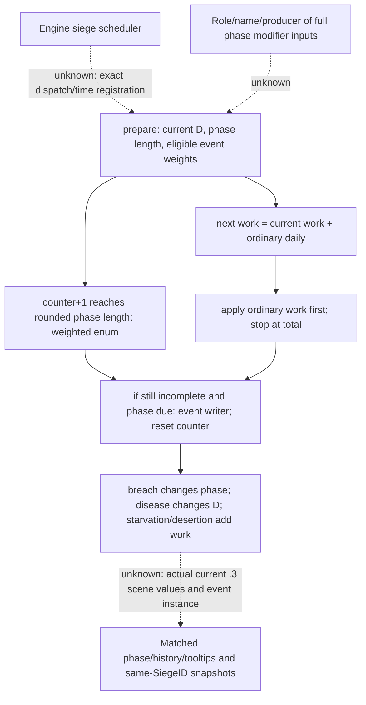

# 第三期围城：1.20.0.3 阶段与随机事件

2026-10-02，离线 exact-build 补研究。范围仅为本期一场常规围城的玩家解释，承接 [进度/日速专题](episode03-siege-progress-1.20.0.3.md)。**本文件没有当前 `.3` 实机事件证据**，不改已冻结的 progress 观测 plan/graph，也不更改 runtime、版本 pins、历史验收或失败 attempt。

## 可供剪辑使用的静态已闭合叙述

- “围城有每日进度，也有独立的阶段事件计时。事件尚未到期时，普通进度仍按日速累计。”原版每日 tooltip 与当前 native prepare/apply 两条写入路径互证；外层 scheduler 的完整注册/时钟频率仍保留下面的边界。
- “20 天是阶段间隔的基础值；军官、军队相关修正和城墙破口会改变实际间隔。”当前 scene 的具体间隔采用本场 phase tooltip，不把 20 天写成所有围城固定值。
- “破口缩短事件间隔，疾病改变日速，断粮与逃亡增加一次性进度。”这四类不是同一种加速，不能把所有工作量跳变都标成每天获得的进度。
- “断粮第一次加当时总工作量的 5%；第二次升级再加当时总工作量的 15%。”原生 writer 是逐次加量，第二级不是把历史累计奖励改成 15%。如果两次事件的总工作量相同且未触及完成上限，才可把两次合计写成该总量的 20%。
- “疾病在当前等级加入 10% 或 20% 的日速修正；城墙小/大破口在阶段时间因子加入 -10% 或 -30%。”等级二使用当前级值，不把两级的疾病项相加成 30%，也不把两级破口相加成 -40%。总日速/间隔还含其他项和固定点舍入，不能据此许诺最终总量恰好同比变化。
- “阶段抽取的事件有条件权重；器械等级和城防影响破墙机会，达到满级的破墙、断粮、疾病不再参加后续抽取。”基础 `[30,15,15,20,20]` 不是固定 `[30%,15%,15%,20%,20%]`。
- “僵持没有额外工作量奖励；这次事件无额外效果，不代表整个阶段没有普通日进度。”需要本场 history 指认这次结果，再配本场读数讲解。

这些是机制叙述的静态结论。旁白“这一天抽到了疾病/断粮/破口”“这场缩短到多少天”“这次多推进了多少”等场景事实，必须由本场同一 full SiegeID 的录像、UI history 和 native 快照互证。

## 文件身份与保全

本次独立重新核验安装 EXE SHA `94b55397abb687a3dcd436805a5d885e6be90fa6c693feb44a9e3bbeeade02a6`，101039736 bytes，CK3 1.20.0.3 Crozier。仅读安装 EXE/原版定义和 `D:/we3` 当前源码；解释器显式为 `D:/workspace/ck3_eternal_recurrence/tools/.venv/Scripts/python.exe`，使用已 probe 的 `pefile`/`capstone`。没有游戏进程读取、原生调用、游戏/Steam/桌面/MCP 操作或新动态 getter。

外置目录 `D:/ck3-war-episode03-20261002-a01/offline-siege-events/` 保全有限反汇编、jump tables、define accessor 对照和新检查回执。`event-static-check.json` SHA `ac3a5d1c851825b2f9c5a60a1923a00e86865da9a253467fb17484837f3cedb9`，对照本次实际 `.3` EXE 检查 6 个区域、3 份 jump table、6 个 define accessor；另复核 5 份当前原版源文件与之前冻结副本的 SHA 一致。它证明有限字节/文件相符；人工审阅承担下面的语义解释，不证明 scheduler、完整 modifier 生产链或任何实机事件发生。

本文件是冻结 progress plan 之后的补充研究。旧 plan 当时的 `event-producer unknown` 保持历史原样；下面闭合其阶段到期/选择/写入的有限内部链，旧 graph 不被重写成当时已经证明。

## 日进度与阶段事件是两条量

当前 native `0x251E200` 准备一个 siege 的更新输入，`0x2520E80` 在 manager 中逐个调用它；`0x2521060` 是配套的应用入口。manager vtable 的有限表中能见 preparer/applier 函数地址。vtable 本身不证明外层 engine dispatcher 的注册名与一天调用次数；原版 UI 明确把 `0x251F170` 的量标成每日进度，本期应以同一场的相邻日读数互证日推进。

内部非 debug、可推进路径已闭合：

1. prepare 调用阻塞判断 `0x251CF70`，把允许推进结果缓存到 `CSiege+0x18`；调用 phase getter `0x251E7A0`，缓存阶段长度至 `+0x20`。
2. 普通日速 `0x251F170` 的输出与 `current_work(+0x3D0)` 相加，放入 next-work `+0x30`。**这个加法不以阶段到期为前提**。另有 debug byte 分支直接缓存 total，本期常规解释明确排除该分支。
3. prepare 只在 `phase_counter(+0x43C)+1 >= ceil_fixed(phase_length)` 时构造事件候选、权重及抽取结果，缓存 event enum 到 `+0x28`。未到期用 sentinel 5，不当作实际 UI 事件。
4. apply 在允许推进时先递增 phase counter，写 `next_work → current_work`，并以当前 total 做完成上限；如果普通工作已经足够完成，就跳过本次阶段事件处理。
5. 尚未完成且 phase counter 到期时，apply 调用 `0x251CD00(siege,event)`，随后把 phase counter 清零；最后重新核对 current/total 并进入完成路径。本期不把该调用 ACK 单独当作占领实机证据。

因此到期日的 `C_after-C_before` 可以包含普通日进度与一次性事件奖励；不能把这个差值整体命名为普通日速。疾病/破口等级变化可能影响之后重新计算的 D/phase length；本次 prepare 使用的是更新前的输入，不能把事件后的新值倒灌解释同一天此前的普通累计。

阻塞路径不按上述允许推进分支递增 phase counter/current work，且会停掉正在进行的强攻。移动/战斗等 blocker 的完整判定仍承接进度专题边界；暂停期间不能等待新的日生产者，也不能用 UI 动画刷新当作游戏时间推进。

## 原生 phase length 的有限定义

`0x251E7A0` 的完整 2504-byte 区域 SHA `24580ef54fdccc823dab0a655dba8f83229ee7f6a5c7cf94f26d7845196bdb47`。对应 define accessor `0x2396C40` 绑定 `BASE_SIEGE_PHASE_LENGTH` 的 slot `0x5C69620`；当前原版值是 20。`0x2397010` 绑定 breach vector，当前值 `[-0.1,-0.3]`。

在普通非负、正常量级路径，phase getter 的固定点展示式为：

```text
factor = max(0, 1 + breach_current_level_adjustment
                  + character_modifier_0x11D
                  + siege_cached_modifier_0x11D
                  + province_side_modifier_0x11D)
phase_length = fixed_mul(base_20_days, factor)
phase_threshold = positive_fraction_round_up(phase_length)
```

多个项先相加，再乘基础天数，并非逐项连乘。phase_threshold 是对固定点天数的正小数向上取整，实际事件计数以此阈值比较。getter 对总 factor 做非负截断；本专题不承诺所有极值的溢出规避分支或最短实机间隔。

character 来自调用者解析的 army `+0x120` CharacterID，CSiege 缓存 modifier 项的 tooltip 标签为 `ACCLAIMED_KNIGHTS_IN_ARMY`，省份侧项从 Province `+0x200` 派生 modifier 容器。本次未完全闭合角色名、enum `0x11D` 与所有 script modifier 的注册映射，以及缓存各生产者，保留为 `unknown`。不会凭一个地址宣称新 dynamic getter 可安全调用。

原版 `military_engineer` 定义有 `siege_phase_time=-0.1`，其 XP track 33/66/100 各定义进一步的 phase modifier。它的字段属于阶段时间；不能讲成同百分比普通日速奖励，也不能从 trait 图标猜当前 XP、有效聚合或所属 army 角色。本场具体 phase 取当前原版 `GetSiegePhaseTooltip` 与 `GetSiegePhaseLength` 回读。若仅基础 20 与小破口 -0.1，其展示算术为 18；有其他有效 modifier 时不套用这个示例。

## 事件状态、写入和真实效果

原生 enum 与原版 tooltip helper `0x251B380` 相互核对：0 breach，1 starvation，2 disease，3 desertion，4 stalemate。对应 state 位置为 `+0x3D8/+0x3DC/+0x3E0/+0x3E4/+0x3E8`；这里只是 exact-build 离线对象字段，**当前公开 bridge 只发布 breach/assault 边界，不发布 starvation/disease/phase counter/history**。

| 事件 | 当前原版数值与 native writer | 玩家解释和边界 |
|---|---|---|
| 城墙破口 | enum0 提升 breach level；等级最多2。phase getter 使用当前 level 的 -0.1/-0.3；普通日速 getter不把 breach 当作自己的直接等级项 | 缩短后续阶段间隔，并达到强攻门槛的必要条件之一。不能直接讲普通 daily +10%/+30%；强攻仍有独立 native validator |
| 断粮 | enum1 先提升 starvation level，再按**新等级**索引 `[0.05,0.15]`，调用当前 total getter，加 `fixed_mul(total,percentage)`，把 current 限在 total 内 | 两次升级分别是一次性工作奖励；不会因为处于断粮图标状态就每天再加5%/15%。T可能变化，不用开始时T替代事件当时T |
| 疾病 | enum2 提升 disease level；daily getter把当前 level `[0.1,0.2]` 加入自身 multiplier accumulator | 当前级的日速修正，第二级20%替换等级项10%；其他修正、城防因子和最终0.5最低值会影响最终D，不保证最终显示恰好提高20% |
| 守军逃亡 | enum3 每次加 `DESERTION_MORALE_LOSS=5` 个工作量，并把 current 限在 total 内 | 额外固定工作量5，不是守军人数直接减5，也不是“5%”。本专题未发现该 writer 对garrison人数的写入 |
| 僵持 | enum4 会记录 event/history，但没有单独的 current-work 加量分支 | 本次没有事件额外奖励；普通日累计与下一阶段继续按其各自条件运行 |

event writer 会维护有限环形 history（当前 `ACTIONS_TO_REMEMBER=4`）。前三级满级后，正常 selector 排除对应事件；direct writer 对任意非法外部输入的行为不作为玩家场景或新端口合同。没有事件前后 full SiegeID/日期/total/history 样本时，不从截图亮度或进度跳变猜 enum。

## 随机抽取的已闭合范围

prepare `0x251E200` 在阶段到期前检测当前等级上限，到期时为 enum0..4 构造候选。breach/starvation/disease 已达到各自 vector 的 count2 时不参加；desertion/stalemate 没有相同的2级排除。它从 siege `+0x440` 状态经过整数混合得到伪随机数，对权重总和取模，再按累积权重选一个 enum；本专题不把该有限链升级为完整 replay RNG/跨存档 determinism 合同。

`0x251E6E0` 读取 `ACTION_WEIGHTS`。普通权重为定义值乘 fixed-point scale；破口有特殊计算：

```text
K = native current eligible highest siege tier (Province getter 0x247EFC0)
W_breach = 0, if K <= 0
W_breach = max(0, 30*K - 2*fort_level), otherwise
W_starvation = 15; W_disease = 15; W_desertion = 20; W_stalemate = 20
# Full-state and eligibility filtering precede normalization.
```

因此 30 只是破口基础权重，tier/fort 会改它，状态满级会改候选集合与分母；不能直接宣布每阶段30%破墙。这里只说明当前 native 权重与抽取算法，不根据一次事件推断分布、保证下一次结果，或对本场未采的 K/有效器械状态补默认值。

## 图与尚待实机闭合

本次外置静态研究 plan/graph 记录这些有限边；静态检查只检查声明与文件一致性。下一次实机仍使用已冻结的 [progress 观测计划](episode03-siege-progress-1.20.0.3.plan.json)，其中本就有 phase/history/tooltips 和事件案例，不因此扩大实机权限或暴露新命令。



root 的实机优先证据为同一暂停 endpoint 的 phase tooltip/长度/圆形计时、最新 action history、粮食/疾病/城墙状态 tooltip，加同一 full SiegeID/省份的 C/T/P/N 和 breach/assault；若录到事件，保留事件前后日期、total、普通日速 tooltip 与界面结果。phase UI 定位：`window_siege.gui` 1092 tooltip，1180/1181 phase timer frame/progress，1201 phase length，1232 latest history，1292/1367/1447 粮食/疾病/破口 tooltip。

当前 JSON 没有 phase length/counter、disease/starvation level 或完整 history；不填成零，也不调用未审 native getter。原版 UI binding 是定位依据，不是现成 native callback 能力证明。观测期间完成/重载/替换SiegeID即终止跨对象比较；若未录到特定事件，可讲静态机制，不能在成片中制造该场发生记录。

待闭合保留四项：外层 engine scheduler 的注册频率/时间身份，phase modifier 的完整角色与生产链，本场实际事件/phase变更，一次跳变中普通增量与事件奖励的精确分解。原片、JSON、tooltip、失败 attempt 和旧plan必须原样保全；本研究不修改 counter-policy，不声称 full siege simulator 或 `.3` 实机验收完成。
