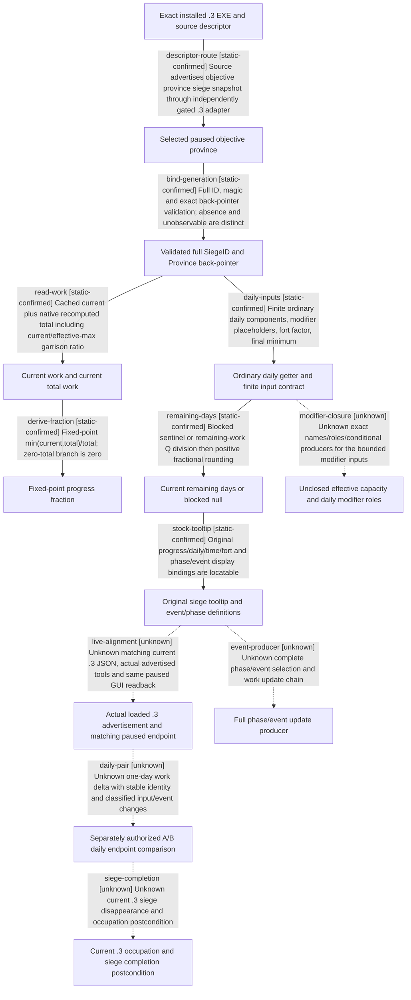

# Research plan: episode03-siege-progress-12003

GENERATED from the supplied research plan; no native semantics are inferred.

Question: For the single recorded .3 siege, how do current/total work produce progress and days, and which ordinary-speed inputs can be independently observed at the same paused endpoint?



| Edge | Declared status | Evidence IDs | Open question |
|---|---|---|---|
| descriptor-route | static-confirmed | semantic-ledger, descriptor-3, descriptor-2, exact-exe |  |
| bind-generation | static-confirmed | province-reader, static-receipt, semantic-ledger |  |
| read-work | static-confirmed | total-function, province-reader, defines, semantic-ledger |  |
| derive-fraction | static-confirmed | progress-span, semantic-ledger |  |
| daily-inputs | static-confirmed | daily-function, fort-function, maa-span, defines, semantic-ledger |  |
| remaining-days | static-confirmed | days-span, blocked-span, province-reader, semantic-ledger |  |
| modifier-closure | unknown | daily-function, total-function, semantic-ledger | Close capacity enum0x1D8 and daily enums0x11E/11F/120 with source role/producer evidence before any full-speed simulator claim. |
| stock-tooltip | static-confirmed | stock-gui, stock-zh, defines, semantic-ledger |  |
| live-alignment | unknown | public-route, descriptor-3, descriptor-2, semantic-ledger | Root must bind actual loaded DLL/features and record same-endpoint native/GUI bytes; source presence is not advertisement/live confirmation. |
| daily-pair | unknown | semantic-ledger | Optional A/B endpoints require separately authorized recording/date advancement, verified time units and no hidden event/input change to compare against getter D. |
| event-producer | unknown | defines, stock-zh, semantic-ledger | Stock effects are definitions; actual .3 event occurrence, work jump and producer chain still require bounded further evidence. |
| siege-completion | unknown | province-reader, semantic-ledger | Capture actual occupation plus active_siege disappearance and corresponding scene; 100 percent, date prediction or ACK alone does not establish completion. |

| Observation design | Value |
|---|---|
| mode | paused-snapshot |
| actor_kind | engine |
| owner_scope | Only the root-selected active WarID/objective province/SiegeID in the authorized episode03 recording run; no guessed or historical fixture IDs. |
| identity_kind | generation-id |
| identity_lifetime | Bind full WarID/SiegeID, exact Province back-pointer contract, nullable public ArmyID, episode/session/revision/date/frame; discard comparison on reload, siege completion/replacement or identity mismatch. |
| producer_trigger | paused-query |
| producer | Owning-thread paused rich ReadObjectiveProvince snapshot reads cached current work and current native total/progress/days getters; previous daily producer is not awaited in pause. |
| caller | Root-owned managed native snapshot via tools actually advertised by the loaded exact .3 DLL; ck3_take_snapshot({}) preferred, ck3_get_war_state({}) only as the existing slice. Never call an unreviewed RVA or historical province-local command. |
| consumer | Read-only comparison ledger and episode03 narration for this siege; no counter-policy implementation or automatic army decision. |
| cache_lifetime | The same paused endpoint, current full identities and loaded build only. Resume, reload, object replacement or changed endpoint invalidates cache reuse. |
| expected_signal | Native current/total/progress raw+scale, nullable days, garrison/eligible besiegers/fort/occupation and assault boundary, paired with same-endpoint original GUI normal daily breakdown, progress/time/fort/troop/phase/event tooltips. |
| zero_sample_meaning | siege_observable=false is unobservable; true with active_siege=null means validated no-siege sentinel. days_left=null is unavailable/blocked, not zero days. Missing normal daily JSON is an interface gap, not zero speed. |
| stop_condition | At most two snapshot reads and one GUI tooltip set per paused endpoint; missing fields, wrong build, inconsistent identity or unobservable graph stop that comparison. This plan neither advances date nor starts/stops assault. Any optional A/B daily endpoints are created separately by the root-authorized recording run. |
| runtime_window_ref | Root episode03 task delegation on 2026-10-02 authorizes preparation for its managed recording run; this agent and this check perform no runtime action. Root owns separate fresh offline/desktop/recording evidence and actual session binding. |

| Evidence ID | Declared layer | File | SHA-256 | Supports |
|---|---|---|---|---|
| exact-exe | exact-build | C:\SteamLibrary\steamapps\common\Crusader Kings III\binaries\ck3.exe | 94b55397abb687a3dcd436805a5d885e6be90fa6c693feb44a9e3bbeeade02a6 | Independently binds actual installed .3 EXE bytes, not a running process. |
| static-receipt | offline-fixture | D:\ck3-war-episode03-20261002-a01\siege-offline-static-check.json | 126888b8d05c016f8ecb8a2aa14e8b993bfb339f6f2790d7ee143c93cfa0e8bd | 13 .2 province anchors and 24 instruction slices match current .3 bytes; frozen source hashes and bounded span coverage only. |
| semantic-ledger | source-contract | D:\we3\docs\ck3-native-ai\episode03-siege-progress-1.20.0.3.md | 83517d2dff377371148c737dd1c944c7bf3d591778ec451822a75d0ffc1c3824 | Authored manual disassembly interpretation, finite fixed-point equations, input/capability boundaries and pending live cases; tool does not verify author truth. |
| defines | source-contract | D:\ck3-war-episode03-20261002-a01\offline-siege-sources\defines.txt | 8e430d77eb6e8767030f34b1c53d5dae84277fb354bd73cc42f93dc500be8982 | Current original NSiege/NHolding numeric constants; source comments may be stale and are checked against exact native accessors. |
| stock-gui | source-contract | D:\ck3-war-episode03-20261002-a01\offline-siege-sources\gui.gui | 8236d9d1ca373dc19d9e138948864b84887a4516756e1b293f26e2cd88c6b0b9 | Original siege bindings and tooltip locators; no callback registration or live GUI proof. |
| stock-zh | source-contract | D:\ck3-war-episode03-20261002-a01\offline-siege-sources\chinese.yml | d332a17e5facc1d231bf22ae1241c405bc1ae2fe1f2f399c9915755ff7844b59 | Original event/time/daily display contract, including one-decimal GUI normal speed. |
| province-reader | source-contract | D:\ck3-war-episode03-20261002-a01\offline-siege-sources\province-reader.cpp | 975c9db6743af49fbddc8fbc3afc12fde20265fa5a112dfe6fe656e84f3e1c15 | Validated generation/back-pointer rich read chain and JSON observation/null boundaries. |
| descriptor-3 | source-contract | D:\ck3-war-episode03-20261002-a01\offline-siege-sources\adapter-12003.cpp | f255c46744b7fc4cfd591b664ce791a4b78a0aa97ff06e132336602e935d2559 | Independent .3 SHA gate and explicit .2 descriptor capability reuse. |
| descriptor-2 | source-contract | D:\ck3-war-episode03-20261002-a01\offline-siege-sources\adapter-12002.cpp | 73d66ca49908aeabc9a172fe61214da797465bfa5b8a790c2573c73d4a37b38e | Inherited objective siege capabilities; no historical province-local command advertisement. |
| public-route | source-contract | D:\ck3-war-episode03-20261002-a01\offline-siege-sources\public-siege-route-contract.json | 7679f3a73a72826dbb292605b6a2e0c5aad893bb6d93bd52918cddfc8a7ef0c8 | Frozen source serializer and existing MCP snapshot/capabilities/war-state slices; source only, not loaded DLL advertisement. |
| progress-span | exact-build | D:\ck3-war-episode03-20261002-a01\offline-siege-functions\span-0251C9C0-progress_fraction.json | a6e0a2aebf8210190a26c87425ee3f18c3fb2313874641ab235f008253be52cc | Exact bounded progress fraction instructions, manually interpreted with semantic-ledger. |
| days-span | exact-build | D:\ck3-war-episode03-20261002-a01\offline-siege-functions\span-0251CB00-days_left.json | 9d6dfe27adb5519bc757c52c539f76afa54f92a1763eba4f13a483d75de65af2 | Exact bounded days getter including block check, current inputs, Q division and positive fractional rounding. |
| blocked-span | exact-build | D:\ck3-war-episode03-20261002-a01\offline-siege-functions\span-0251CF70-blocked.json | edb3f1d3031cae5393f5635826da8525586c57eac32d46cc28fbfcf71e1ad968 | Exact bounded less-than garrison and unresolved Province sentinel branches. |
| total-function | exact-build | D:\ck3-war-episode03-20261002-a01\offline-siege-functions\function-0251DD20.json | 4a4816d876085c3ec8bd800fefb09574914bdaf4b8ae635ab86de5ddca08ab04 | Total getter exact bytes with current/effective-max garrison ratio; full modifier name remains open. |
| daily-function | exact-build | D:\ck3-war-episode03-20261002-a01\offline-siege-functions\function-0251F170.json | 0d42394065f4e60bdad49a02e92f25931d8c7657c1f5eeff6c126bf903a20531 | Ordinary daily exact instruction sequence; modifiers remain bounded unknown inputs. |
| fort-function | exact-build | D:\ck3-war-episode03-20261002-a01\offline-siege-functions\function-0251FD60.json | b69688c8d8074ec5a0873e3495953a1a72f9e7edea11097fcb3e20270ae9fcd7 | Exact fort threshold loop and sequential fixed point multiplication. |
| maa-span | exact-build | D:\ck3-war-episode03-20261002-a01\offline-siege-functions\span-0247ECE0-eligible_regiment_siege_sum.json | add2296e119606c3a93a6e6079578d5250ffc45201ada4585a92b83126d02470 | Eligible effective regiment value and current count summation. |

Check result (file integrity and declarations only):

```json
{
  "schema": "xar.native-research-plan-check.v1",
  "result": "plan-consistent",
  "proof_layer": "record-structure-and-file-integrity",
  "semantic_correctness_verified": false,
  "live_execution_performed": false,
  "observation_plan_issues": [],
  "declared_edges_by_status": {
    "counter-policy": 0,
    "inference": 0,
    "live-confirmed": 0,
    "static-confirmed": 7,
    "unknown": 5
  },
  "enumerated_native_edges": 12,
  "declared_cases_by_status": {
    "pending": 7,
    "observed": 0,
    "not-applicable": 0
  },
  "checked_evidence_files": 17,
  "limitations": [
    "Evidence layers and conclusions are author declarations; hashes bind bytes, not their truth.",
    "Counts cover this enumerated graph only, not all CK3 branches.",
    "A consistent observation plan is not authorization to run or manipulate CK3."
  ],
  "plan_sha256": "3b8c051baf1dadccc6e5a5561a712328b518719fa9f7240b3dfba2d2ff7d4a1f"
}
```
