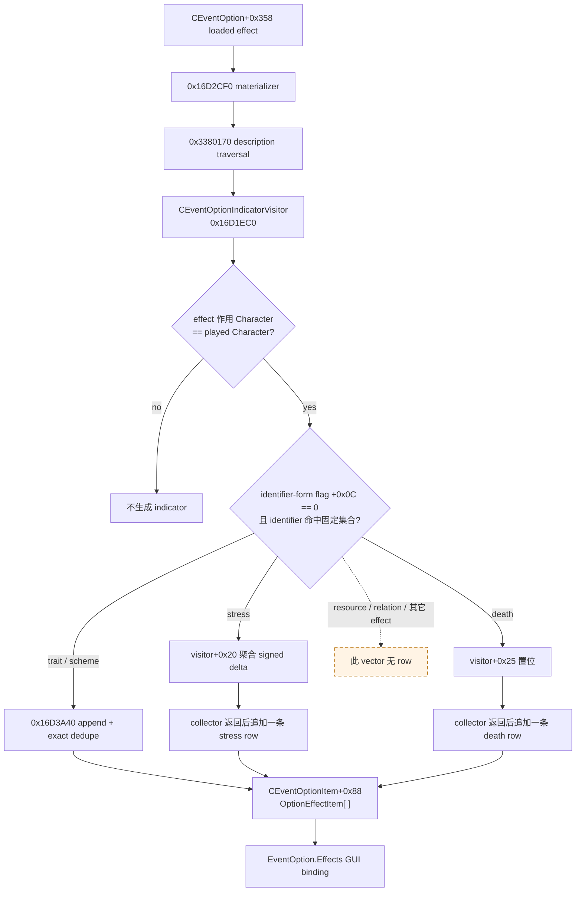
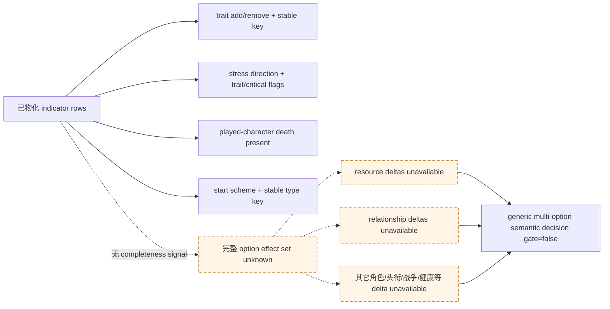

# 当前事件效果指示器：CK3 1.19.0.6 exact-build typed ABI

## 结论与边界

本文只绑定 CK3 `1.19.0.6` 的 64-bit Windows build：

| 输入 | SHA-256 |
|---|---|
| `Crusader Kings III/binaries/ck3.exe`（`95,206,008` bytes） | `2D00FF3101EF70B566F2FCBAE292F09263199C80E9DC8F139B82D7D96F83DB86` |
| `game/gui/shared/event_windows.gui` | `8668174191A58AECE3FBA57A0E65C7E7DC1384F1B3A7BA281EA6E801D76811F4` |
| `game/gui/event_windows/letter_event.gui` | `D93677E603C04827AE23DFFA6566E47984A8923FE77E89F02AC9291082A9CA88` |
| `game/gui/event_windows/scheme_preparations_event.gui` | `6B14FDAEC5FDEDB50442B4D141F7F2CC3E5EC724453E45C1960653163EC3E691` |
| 本文配套 `event_option_1_19_0_6_abi.json` | `FB2027F3D4E1A3EE48256531D35789243D31A2F8F6E2665C1A17A4C948549ABF` |

[static-confirmed] `CEventOptionItem+0x88` 的 `OptionEffectItem` vector 不是完整 effect preview。它是引擎专门为事件按钮绘制少量图标而生成的、面向当前玩家角色的有损 **effect indicator**：

- 可以无 OCR、无 tooltip 解析地发布 trait 的 add/remove、stress 的 increase/decrease、当前玩家角色 death，以及 start scheme 的稳定 scheme type key；
- stress 数值、death 次数、重复效果次数和原始执行顺序已经在物化时丢失；
- 金钱、威望、虔诚、关系等 resource/relation delta 不会生成这种 row；其它角色身上的同类效果也会被过滤；
- 因此空 indicator vector **不表示没有效果**，非空 vector 也**不表示已经获得完整效果集合**；
- 这项 capability 可以给 planner 新增真实语义，但不能单独把多选事件的 `readiness.semantic_decision_ready` 变为 `true`。

本文的 ABI 研究阶段没有启动或 attach CK3，只读取冻结 EXE 与原版 GUI；随后 2026-08-27 Attempt4 用 generic、
非宗教 fixture 对**空 indicator surface**完成 production bridge paused live。它没有命中任何非空 kind，也没有展开
faith/doctrine/tenet/fervor、改宗、宗教改革或 holy order。项目所有者允许的圣战战争 OODA 与婚姻必要 faith 判定两项
最小例外均未被本专题使用。

### 同轮闭合的 current EventData identity

[static-confirmed] current `SPlayerEventData/ActiveEvent+0x1B0 -> EventData*` 后，`EventData+0x10` 是 canonical
namespaced event key MSVC string，`+0x08 int32` 是 calculated event ID；另行观察到的 `+0x0C int32` 是 runtime
statistics ordinal，不能拿 ordinal 冒充稳定定义身份。

直接证据是 duplicate-event validator：完整 `.pdata` 为 `0x33D4DA0..0x33D5082`（`0x2E2` bytes，SHA-256
`33D9FF7EBF7BE4431285D0AE41262D5B2497057FAF2E2AB1718AB9CB5A5A727A`），其中语义 body
`0x33D4DA0..0x33D505A`（`0x2BA` bytes，SHA-256
`6466EE00D394D6A79F87BB48EEA00AF1257393A538FA5EE45EE4CF42D4548028`）遍历 receiver
`+0x40 data/+0x4C count` 的 `EventData*`，比较相邻/后续项 `+0x08`。重复时它把先前项 `+0x10` 作为 exact
error 的第一个 formatter 参数，并从新旧两项 `+0x240` 解析 source-location 参数。RVA `0x44D9E50` 的含 NUL
literal 为 `Duplicated event ID '%s' found. New Location: '%s', Previous Location: '%s'`，SHA-256
`85135404DB9CD9414603326956E1E12A82453B31676C95DB5ECCC87F96E93A42`。

这套 event definition identity 现已由 `current-event-window-context-v1` 发布。接入先匹配完整 event instance ID，再校验
`+0x10` MSVC bounds，并在同一 owning-thread query 内双重观察 ActiveEvent/EventData pointer、`+0x08/+0x0C/+0x10`；
任何 pointer 都不得出进程。available 帧要求 bounded nonempty key、两个 signed int32 与独立 identity readiness 同时存在；
unavailable 帧三者全部为 null。完整 getter、validator、语义 body 与 literal 已加入两个 event ABI 的 machine verifier；
production paused live 仍待执行。

## 原生物化链

`CEventOptionItem` 尾部 helper `0x16D2CF0` 在栈上构造 `CEventOptionIndicatorVisitor`，把真实 `SPlayerEventData`、`CEventOption+0x358` loaded effect 与 visitor 交给 `0x3380170`。visitor 只把识别出的少数 description 写入 owner item `+0x88` vector；reader 不需要、也不得再次调用 collector。



RTTI 直接把该 visitor 绑定为 effect-description visitor 的具体子类：

| 项目 | exact RVA / 值 |
|---|---|
| visitor vtable | `0x4181CF8`；前三槽为 `0x16D2380 / 0x16D1E90 / 0x16D1EC0` |
| CompleteObjectLocator | `0x4751848` |
| visitor TypeDescriptor | `0x52DC780`；`.?AVCEventOptionIndicatorVisitor@?A0xa89ec469@@` |
| base TypeDescriptor | `0x5210D00`；`.?AVCEffectDescriptionVisitorInterface@@` |
| visitor RTTI name（含 NUL）SHA-256 | `BE1F7355A53773A155DD48375FE6496412E8956998A0CEF71C71BD01C33F3A86` |
| base RTTI name（含 NUL）SHA-256 | `F4EE98D1EA248E7593CC46CBACC668FCF67D3EEA4708A2E3D3B0656063FB721B` |
| COL pointer + 三个 vtable slots，`0x4181CF0..0x4181D10` | `9AB852FEE6215CA887EA24536174D55540D6A30ED5AE4880441975B277DB9AF7` |

## visitor 识别的 exact effect 集合

`0x16D1EC0` 读取 description record `+0x08 int32 identifier`。当 record `+0x0C` 非零时，下面的 direct-identifier 分支全部不命中；该 byte 的业务名称仍 unknown。identifier 到稳定 effect key 的对应来自 EXE 内 `{uint64 identifier, const char* key}` registry row，而不是根据行为猜测：

| identifier | stable effect key | registry row RVA / row SHA-256 | string RVA / 含 NUL SHA-256 | indicator 结果 |
|---|---|---|---|---|
| `0x287B` | `add_trait` | `0x42BE730` / `730DAD9DF55EA9121BFC932FA32E6E129C270B19F92F160ECA0DBE6BC1EA860D` | `0x40F6C30` / `3199D0D20A976C68AD77B2F779ED34EAB7CF3C35A76F385E74EAD9F8C6B8FCBE` | trait add |
| `0x2C0F` | `add_trait_force_tooltip` | `0x42BFD70` / `8E12C1100A27589ACAF36D641212C2D86ACBA55055FF7F4BB9CDE0B11CEC9403` | `0x4299FC8` / `1AAFAD31C34C95D451C906FC9E2B95F00BC75AC2C5E4CF4667690118DE2D5F7B` | trait add |
| `0x287C` | `remove_trait` | `0x42BE740` / `D3FCF94BC7E94309798D501411A642955A286AEC9301B1D4F9429F437DDD9CE8` | `0x40F6AE8` / `E15FEA6C56FB9AFF6A4397A57E95690D6B74BF43F958611AEE48A9FBC75F51D7` | trait remove |
| `0x2FC9` | `remove_trait_force_tooltip` | `0x42C2890` / `F6477365C2D6D625BADF17DB27A5982BC7DFB756AAB1AC48A520F52E49CE4537` | `0x429D4F0` / `43DBF58D4180B3768C55E420257E3B2E82C60CF4BC222E3DF8F3796658217720` | trait remove |
| `0x28D2` | `add_stress` | `0x42BE7D0` / `67AAB20F62FA1BCDC90585DBC26ABA71CA46676BC9D97CF500455C367C139019` | `0x40F75B0` / `29E428364923835C7F7744D5F3D9CDE2057EDE9D2BE99F0B5C347D052491DCC2` | signed stress accumulator |
| `0x28D3` | `stress_impact` | `0x42BE7E0` / `46D5DA2D69D03C60EF8DEDEE3C52340220A19FC5C4C10B514F4ACB14696E8B09` | `0x4299168` / `1DDA67AECEB9DFFB2F3F247E9FA2C65E8722292593594D8ACF0D58F706B28A4C` | signed stress accumulator + trait marker |
| `0x2767` | `death` | `0x42BDE70` / `7CE31946343442E3FE1824EC8FD81D9585AA28ED3A6948903994B979324BBCC5` | `0x4095820` / `106B5B35A3759BA0F9693DCAAD18AC6E72213621326235891255F6CA8586C2A9` | death-present flag |
| `0x2920` | `start_scheme` | `0x42BEAE0` / `E95DBA80E6A867F62B11EF9EEF2300316467782906DF144FE72867E0E223FAA8` | `0x4298F60` / `711B5BD11336F8BCF4D84E815DFDFE2CFF1C640B148F5ECACBB24FDE4D6FCBAF` | scheme start |

该函数还有与 indicator 无关的内部 flag/scope bookkeeping；它们不会改变上述 row kind 集合。特别是，不能把“visitor 看到了某个 description”与“vector 中存在一条完整 effect row”混为一谈。

## `OptionEffectItem` typed ABI

vector 位于 `CEventOptionItem+0x88 data / +0x90 capacity / +0x94 int32 count`，row stride 为 `0x18`：

```cpp
struct OptionEffectItem11906 {
    std::uint64_t payload0;       // +0x00: kind==trait 时为 CTrait*
    std::uint64_t payload1;       // +0x08: kind==scheme 时为 CSchemeType*
    std::int32_t kind;            // +0x10: 0 trait, 1 stress, 2 death, 3 scheme
    std::uint8_t gain;            // +0x14: 仅 trait/stress 有 typed direction
    std::uint8_t affected_trait;  // +0x15: 仅 stress 有业务意义
    std::uint8_t critical;        // +0x16: 仅 stress 有业务意义
    std::uint8_t pad;             // +0x17
};
static_assert(sizeof(OptionEffectItem11906) == 0x18);
```

非对应 kind 的 payload slot 由 materializer 写入引擎 fallback/sentinel，不保证是零；reader 只能按 kind 解释活动 slot，绝不能把另一槽的数值发布为 ID。append `0x16D3A40..0x16D3BF1` 对 `+0x00/+0x08/+0x10/+0x14/+0x15/+0x16` 全字段做 exact dedupe，因此重复的完全相同行会折叠。

### GUI getter 与 flag accessors

`OptionEffectItem` 的 GUI 类型名 literal 位于 `0x417ED40`，含 NUL SHA-256 为 `458A82C7CE75A5DBB96A225B13C6743895AF8130EAF020B89D34C19FEBAEE284`。`GetTrait` 与 `GetScheme` 的注册函数分别把 getter callback 绑定到活动 payload：

| binding / accessor | exact span | SHA-256 | 已确认读取 |
|---|---|---|---|
| `GetTrait` property registration | `0x2AC850..0x2ACA28` | `07F67E98342F024D7A938E7E9A9C32252A393B7C63A0D9711B216BC2279C5672` | property 名、raw getter 与 callback 绑定 |
| `GetTrait` callback | `0x16A2580..0x16A25B4` | `537784016B293D6D8DB81059395383E88968B6673942CC4A6426CC412A04EB80` | `qword [row+0x00]` |
| `GetTrait` raw leaf（无 `.pdata`） | `0xA1BF50..0xA1BF54` | `92CA7142687BD5513BEA360E328CA1C00C3C3A9B71FFDDA7BFC2407DE7693978` | 返回 `[row+0x00]` |
| `GetScheme` property registration | `0x2ACA30..0x2ACC11` | `5D68EC52465000600D753E42CA7085E34F89D1444F3E95B36CFF0A36A752652E` | property 名、raw getter 与 callback 绑定 |
| `GetScheme` callback | `0x16A25C0..0x16A25F5` | `E9AAD91128FCC59C3A8AAA6AD0D296CFE7E9E82A95357500BBF9213906225232` | `qword [row+0x08]` |
| `GetScheme` raw leaf（无 `.pdata`） | `0x7F7EB0..0x7F7EB5` | `FC46EA8ACDF166D47F2230B3D3975FBD0A4A0F5C898B7C2B2EC854359CB94B85` | 返回 `[row+0x08]` |
| `IsTrait` | `0xE88760..0xE88795` | `6AC59B5D851033D8488628073F67D06E3111BBF8799FC497DCA69C6E127F998F` | `kind == 0` |
| `IsStress` | `0xE887A0..0xE887D5` | `24F61CEF118ED3AC90BC5FA79AD18DA19360950EE66A7F4D8ECAE20D54423177` | `kind == 1` |
| `IsDeath` | `0xE887E0..0xE88815` | `81FB6574087A13C047ECAA0CF26D734406ADCFE8AC9337816D59006C8CD12D0F` | `kind == 2` |
| `IsScheme` | `0xE88820..0xE88855` | `468FEE030E28C340DB7012399611EBE80B5F9C1CFAD197B1BDF4FB4C1717003A` | `kind == 3` |
| `IsGain` | `0xD494D0..0xD49504` | `AFE80C8B06E5DCA7AF8B293223D62B95F448762EEE4EE1ED6704046237F61612` | `gain != 0` |
| `IsLoss` | `0x16A2600..0x16A2635` | `A9F0844D1F68129031690532CF29F6B8AA9207910CA0F5B6E9BA31EBB202D6ED` | `gain == 0` |
| `IsAffectedByTrait` | `0xD9E8C0..0xD9E8F4` | `3A3C3A6668E9FD8A2C8C5F1DDA582502D7CD42133E8E6B8F2ABDBD48D7624E0F` | `affected_trait != 0` |
| `IsCritical` | `0xD9E900..0xD9E934` | `5C996710D6155015E305D69F792B9BDC845B2390D4E79CA13CAE8D936C4E5255` | `critical != 0` |

原版 GUI 对 trait 同时消费 `GetTrait` 与 gain/loss，对 stress 消费 gain/loss/affected/critical；death 只消费 `IsDeath`；scheme 消费 `IsScheme` 与 `GetScheme.GetIcon`。所以 death/scheme row 中机械写入的 `gain=1` 不是 UI 或策略意义上的“收益”。

### trait payload 的稳定身份

visitor 的 `0x2011950..0x2011987` 要求 generic scope type tag 为 `0x2D`，读取 scope `+0x08` ID，经 `0x8318F0 -> 0xBDC1D0` 解析 loaded `CTrait*`；非法 ID 返回引擎 fallback。对应 exact spans 为：

| helper | span | SHA-256 |
|---|---|---|
| indicator trait-scope resolver | `0x2011950..0x2011987` | `E3FD0D69274C43B934B857DE933687BEC40DAAD4F6043B4C82C383EF0C762A19` |
| Trait DB getter | `0x8318F0..0x831947` | `3401D867B1D37D0FEFF82D52643BA048DD538CD67B1ABF187D1D38FA5165423C` |
| trait ordinal resolver（leaf，无 `.pdata`） | `0xBDC1D0..0xBDC2BF` | `5FF5278C48A022BE77C100EF0CE1DE164CCBF8666AE201C80AF88D28D8A16B70` |

复用 [`combat-phase-events.md`](combat-phase-events.md) 已冻结的 concrete Trait DB ABI：DB pointer array/count 在 context `+0x68/+0x74`，`CTrait+0x10` 为 native trait ID，canonical stable-key `std::string` 在 `+0x18`（length `+0x28`、capacity `+0x30`、capacity `<16` 时 SSO）。production reader 只有在 payload pointer 在完整 loaded DB 中唯一命中、不是 fallback，且 ID/key/string bounds 全部合法时才发布：

```json
{"trait":{"status":"available","native_id":123,"key":"brave"}}
```

payload 不满足身份 gate 时，pointer 不得出进程；该 row 的 `kind=trait` 与 `operation` 可以保留，但 `trait.status=unavailable`，并且不能据此进行 trait utility 评分。

### scheme payload 是稳定 `CSchemeType`

[static-confirmed] `start_scheme` 对应的 concrete class RTTI 为 `CStartSchemeEffect`：TypeDescriptor `0x55D4C40`、primary vtable `0x4450D48`。其 initializer `0x2EB4D10`：

1. 从 effect `+0x60` 读取 authored scheme type key；
2. 调 `0x3B8B000` 计算原生 stable hash；
3. 通过 already-loaded scheme type DB getter `0x88F250` 与 lookup `0xA48C70` 解析 definition；
4. 把返回的 `CSchemeType*` 存入 effect `+0x80`。

visitor 的 `start_scheme` 分支逐字复制该 `effect+0x80` 到 row `+0x08`。同一 concrete class 的 `0x2EB5000` 又从 `[effect+0x80]+0x18` 读取 canonical MSVC string（length/capacity `+0x28/+0x30`），独立证明 payload 不是 active scheme instance，而是 scheme type definition。

| scheme identity 证据 | exact span / RVA | SHA-256 / 值 |
|---|---|---|
| `CStartSchemeEffect` RTTI name（含 NUL） | `0x55D4C50` | `D626CE15BAFA227D630E1FF6223C340EF06CCD8319849C78B57717B163FFDC33` |
| `CSchemeType` RTTI name（含 NUL） | `0x50D2C10` | `771541CB85735827773DB76CBEEECF58786642C7E62783349F1967B8D808439D` |
| `CSchemeType` primary/secondary vtables | `0x44081E8 / 0x4408208` | primary COL+5 slots `84061B6D2806913B89EA537E0E6036897E823BC7E1D412811E919BAA0154523E` |
| start-scheme initializer | `0x2EB4D10..0x2EB4FF7` | `6366D08F6A110701D3C111934F14B2D2F7E9248762F0209860804BFD3A699654` |
| scheme stable-key consumer | `0x2EB5000..0x2EB5116` | `8D910D404DDB79F5D2A0E867E9888BB8A3D5B27EDF96008BC099407422AAE8DB` |
| loaded scheme type DB slot / getter | `module+0x570BD98` / `0x88F250..0x88F2A7` | `6BF1CED387D5A16D140B82BD691C8758277BE9E6FE644F2CA187D52E5B4A383B` |
| scheme type lookup / fallback slot | `0xA48C70..0xA48DAA` / `module+0x570CB58` | `28D245F7B466840B3317DA2DE3751C0AEF7617D3D0DD3325A006AA91A7359D65` |
| pure stable-key hash | `0x3B8B000..0x3B8B087` | `E42410BF40CBE818FED8B771988E102AE129BCE08CD7F975EB7A1EB2E5CD70DD` |

`0x3B8B000(void *context, const char *bytes, uint32 size)` 在当前 exact build 的函数体中不读取首参；原调用点也没有为
hash 单独重装 `RCX`。production binding 仍按仓库内同 RVA 的既有 ABI 表达传入 loaded scheme DB，避免同一原生函数出现
两套不一致的签名，并由 source-contract test 固定该调用形状。

production reader 应要求 DB slot 已加载、payload 不是 fallback、primary vtable exact、`+0x18` canonical string 合法，并用相同 hash/table 规则做 pointer 与 exact key round-trip；不得调用会 lazy-init DB 的 getter。通过后只发布稳定 `scheme_type_key`，不发布 pointer：

```json
{"scheme":{"status":"available","operation":"start","scheme_type_key":"murder"}}
```

## 四种 row 的真实 typed 语义

| kind | typed 语义 | `gain` 的解释 | 其它 flags | 已永久丢失/不可推导 |
|---|---|---|---|---|
| `0 trait` | 当前玩家角色 add/remove 一个具体 trait | `1=add`，`0=remove`；这是操作方向，不是好坏评价 | affected/critical 固定无业务意义 | 重复次数；trait 的策略效用需按 key、角色和局势另算 |
| `1 stress` | 当前玩家角色的所有 `add_stress` / `stress_impact` 先求 signed 整数和，再生成一行 | `1=increase`，`0=decrease` | `affected_by_trait` 表示 `stress_impact` 至少命中一项玩家已有 trait；`critical` 表示应用聚合 delta 后的 stress level 高于应用前 | **delta magnitude 不在 row 中**；各 authored stress effect 与顺序 |
| `2 death` | 当前玩家角色存在 death effect | raw byte 机械为 `1`，typed wire 必须写 `direction=not_applicable` | 其它 flag 无业务意义 | death effect 数量、原因、继承后果；不能把 raw gain 当收益 |
| `3 scheme` | 当前玩家角色 start 一个 `CSchemeType` | raw byte 机械为 `1`，typed wire 必须写 `direction=not_applicable` | scheme type key 可按上节闭合 | target、成功率、成本、active instance（尚未创建）；不能把 raw gain 当收益 |

stress materializer 以玩家当前 stress point 与聚合 delta 计算前后 stress-level；新 point 在进入 level helper 前下限夹到零。`critical` 是严格的 `new_level > old_level`，不是“delta 很大”，也不会标记 stress decrease。所有 trait/scheme row 在 traversal 中立即 append；聚合 stress 与 death 则在 traversal 返回后依次 append，所以 vector 顺序不能当成 effect 执行顺序。

## 信息完备性与 semantic-policy gate

该 vector 没有“ignored effect count”或“indicator coverage complete”字段。visitor 虽在临时对象中计数 description callback，但该计数不保存在 `CEventOptionItem`，当前只读 query 也不会重跑 collector。因此任何 reader 都不能从现有 rows 判定 option 的全部 effects 是否属于四种已识别类型。



具体消费规则：

- `effect_indicators.status=available` 只表示成功复制这套 GUI indicator 子集；
- `effect_preview.status` 继续为 `unavailable`，reason 固定区分为 `indicator_subset_has_no_completeness_signal`；
- `resource_deltas.status` 与 `relationship_deltas.status` 继续为 `unavailable`，不能填空数组冒充 observed none；
- death、stress increase、trait add/remove 与 scheme start 都是事实语义，不是最终 utility。planner 必须结合 succession、trait value、stress strategy 与 scheme target 决定偏好；
- 恰好一个 enabled option 的既有 forced-presentation 规则可以继续使用，但多个 enabled option 不能仅凭 indicator 子集声称找到 semantic optimum。

建议的最小 wire 形状如下；pointer、raw fallback 与机械的 death/scheme gain byte不得上 wire：

```json
{
  "option": {
    "effect_indicators": {
      "status": "available",
      "coverage": "played-character-event-icon-indicators-1.19.0.6-v1",
      "complete_effect_set": false,
      "rows": [
        {
          "kind": "trait",
          "operation": "add",
          "trait": {"status": "available", "native_id": 123, "key": "brave"}
        },
        {
          "kind": "stress",
          "direction": "increase",
          "magnitude": {"status": "unavailable"},
          "affected_by_trait": true,
          "critical": false
        },
        {
          "kind": "death",
          "subject": "played_character",
          "direction": "not_applicable"
        },
        {
          "kind": "scheme",
          "subject": "played_character",
          "operation": "start",
          "direction": "not_applicable",
          "scheme": {"status": "available", "scheme_type_key": "murder"}
        }
      ]
    },
    "effect_preview": {
      "status": "unavailable",
      "reason": "indicator_subset_has_no_completeness_signal"
    },
    "resource_deltas": {"status": "unavailable"},
    "relationship_deltas": {"status": "unavailable"}
  },
  "readiness": {
    "effect_indicators_ready": true,
    "effect_preview_ready": false,
    "semantic_decision_ready": false
  }
}
```

## 最小 production implementation / readiness gate

`current-event-window-context-v1` 现已把本节的最小 typed indicator 子集接入 production bridge；下列第 1–8 项已由 exact-build binding、owning-thread reader、strict wire contract 与 synthetic fixture 静态闭合。第 9 项的空 surface 已 fixture-live，非空 kinds 仍待验：

1. **exact build**：启动时验证 EXE SHA-256；静态 verifier 复验下表所有代码 span、RTTI/vtable anchor 与 effect registry row/string。
2. **只读现有物化物**：复用 `current-event-window-context-v1` 的 application/UI owning-thread mailbox、完整 event instance ID、window vtable、owner backpointer 与 snapshot revision gate；只复制 item `+0x88` vector，不调用 `0x3380170`、trigger/name resolver、effect executor 或 option executor。
3. **vector 边界**：signed count 非负并受固定小上限约束，`count <= capacity`，count 非零时 data 非空，`count * 0x18` 无溢出且整段可读；query 前后 current event ID/revision/window ownership 必须相同。
4. **kind-specific decode**：只解释活动 payload；`kind 0..3` 按本文映射。出现其它 kind 时保留 `kind=unknown/raw_kind` 且不读取 payload，不把它静默丢掉，也不升级成完整 preview。
5. **稳定 identity**：trait 做完整 Trait DB pointer/ID/key gate；scheme 做 loaded DB、fallback、vtable、stable-key 与 lookup round-trip gate。任何 engine pointer 都在 callback 返回前丢弃。
6. **语义字段**：trait 只发布 add/remove；stress 只发布 increase/decrease、affected/critical，并明确 magnitude unavailable；death/scheme 忽略 raw gain。保留 engine row order仅用于确定性，不赋予执行顺序语义。
7. **独立 readiness**：新增 `effect_indicators_ready`，但不得改写 `effect_preview_ready=false` 或 generic `semantic_decision_ready=false`；resource/relation 仍是最高优先级 observation dependency。
8. **静态与 fixture**：source-contract test 覆盖每个 span/hash；synthetic reader fixture 覆盖四 kind、trait add/remove、stress increase/decrease/critical/affected、unknown kind、fallback identity、malformed span 与 revision drift。
9. **paused production live**：Attempt4 已在 seed/checkpoint/fresh-cold 中对三条 option 实读 available、精确 coverage、
   `complete_effect_set=false` 与 `rows=[]`，相邻 cold frame 严格一致。因此只把 empty-indicator wire 标为 fixture-live。
   下一步仍须用非宗教事件分别命中 trait、stress 与 scheme/death 中可稳定构造的类型，核对 GUI 图标与 typed row；另用
   有授权的选择 fixture 验证旧 instance 推进及真实后置状态。在此之前 nonempty-kind/lifecycle live readiness 保持 false。

关键代码 span：

| 语义 | exact span | `.pdata` 形状 | SHA-256 |
|---|---|---|---|
| visitor forwarding callback | `0x16D1E90..0x16D1EB6` | 单 row | `3C859ADBB27F08EFEF520063AE6C5765E56394EAB15673D14B24CEFEEE4AC31B` |
| visitor main indicator callback | `0x16D1EC0..0x16D2380` | 单 row | `379F0DC5E1EA524EEECF8E77372265450FA5130F9B82BAD966017CE7C6DFF2D0` |
| visitor deleting destructor | `0x16D2380..0x16D23A1` | 单 row | `B800D562135357D6D9040388A70E47F9C1AC281A3E35584746DDB3CB26E2C5C9` |
| indicator visitor construction + stress/death finalization | `0x16D2CF0..0x16D3076` | 单 row | `A38D1C098C6B7CCE65F47A4D4C7D5C4C65D9F2E846CF2BCB5BB77BE4236B45CE` |
| append/dedupe logical extent | `0x16D3A40..0x16D3BF1` | 三 rows：`0x16D3A40..0x16D3AE8`、`0x16D3AE8..0x16D3BCA`、`0x16D3BCA..0x16D3BF1` | `83CB8AAA50E164BE53B64F4C5AA8DC68D253F6B30EB54230E60211BED125A3C5` |

## Readiness / unknown 账本

| 项目 | 当前状态 | 依据 / 下一步 |
|---|---|---|
| indicator vector layout、四 kind、direction flags | static-confirmed | visitor、materializer、append 与 GUI accessors |
| trait stable identity | static-confirmed | `0x2011950` + 已冻结完整 Trait DB ABI |
| scheme stable type key | static-confirmed | `CStartSchemeEffect+0x80 -> CSchemeType+0x18`、DB/fallback/hash chain |
| stress magnitude | unavailable by materialized design | delta 只在临时 visitor/materializer 中使用，row 不保存 |
| effect repetitions / execution order | unavailable by materialized design | exact dedupe；stress/death 延迟 append |
| player之外角色的效果 | unavailable in this vector | visitor Character equality gate |
| resource delta | unavailable | 八个识别 identifier 中没有 resource row；不能用空数组表示 none |
| relationship delta | unavailable | 八个识别 identifier 中没有 relation row；不能用空数组表示 none |
| indicator subset completeness | unavailable | 临时 callback count 未持久化，ignored identifiers 无 row |
| full structured effect preview | unknown / next observation dependency | 需寻找另一 engine-owned structured visitor/output；不得扩义本 vector 或解析 tooltip/OCR |
| bridge indicator query | implemented / empty-surface fixture-live | 已并入 `current-event-window-context-v1` 的 production bridge/contract/service/MCP；Attempt4 SHA `690EB5EA...70B7B` 验证三条空 rows；full preview/completeness/resource/relation/semantic readiness 均保持 false |
| production paused nonempty kinds | pending | 分别命中 trait、stress、scheme/death，核对 GUI 与 typed row，并另验 selection lifecycle/postcondition |
| owner-deferred religious domain | deferred, not complete | 本专题不使用圣战/婚姻两项窄例外；其余宗教域等待项目所有者解除暂缓 |

冻结后的下一 exact 入口不是继续猜 `OptionEffectItem`：该结构已经证明没有 resource/relation 完备性。应从 `CEffectDescriptionVisitorInterface` 的其它具体 derived visitors 或事件 tooltip 的 engine-owned structured model 反查一个会保留 resource/relationship delta 与 target identity 的只读输出；在找到明确输出 ABI 前，完整 preview 和多选 semantic policy 保持 typed dependency。
