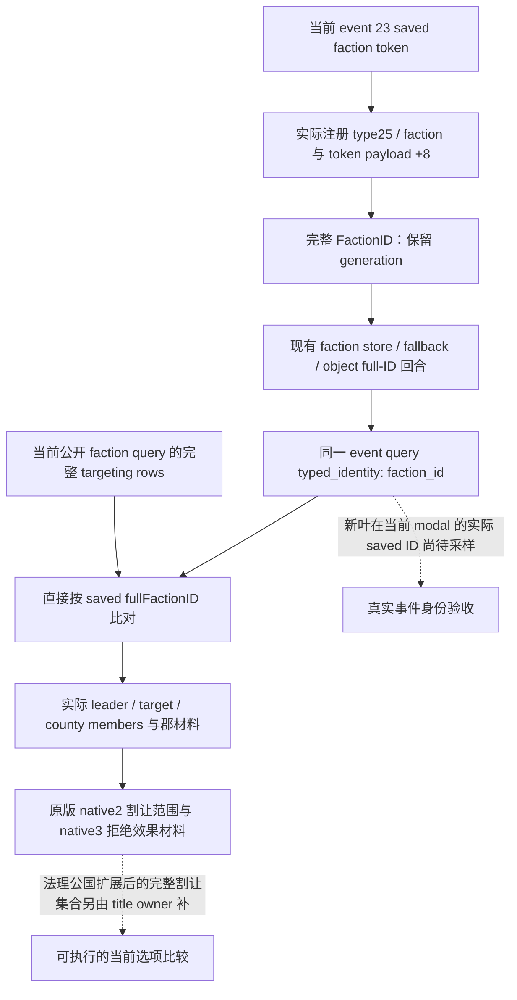

# CK3 1.20.0.3：当前派系索求事件的 type 25 身份

2026-10-03，罗贝尔原普通战役在真实日期 `53236608` 停于 `faction_demand.1001`，event instance **23**。已保存的事件窗口查询确认 actor **29829**，saved `faction` 的 type index **25**、type key `faction`，但 typed identity 仍为 `generic_scope_payload_identity_not_closed`；`peasant_leader` 与 `faction_leader` 的角色身份为 **70766**。当前可见选项是 rendered **0** / native **2** 的接受文本，以及 rendered **1** / native **3** 的拒绝文本；窗口的 indicator 不是完整效果预览。

冻结版本为 **1.20.0.3 / Steam 25652598**，EXE SHA-256 `94B55397ABB687A3DCD436805A5D885E6BE90FA6C693FEB44A9E3BBEEADE02A6`。本包只制作外置 source diff、字节依据、focused case 和查询配置，没有连接游戏、SDK、pipe、窗口、运行状态或 Git，也未编辑 canonical/shared 文件。当前只读实体查询已实机成功；新的事件 type 25 接线为 **static-ready**，实际 saved faction ID 待 ROOT 合并、构建与查询。

## 直接 payload 与现有实体来源

当前事件 token 已有 type index `+0x00`、subtype `+0x02` 和 scalar payload `+0x08` 的原生布局。既有事件 reader 正以同一 payload 解码 character；type/name 来自当前 generic registry，不能仅依据保存名猜类型。

type 25 的具体 payload 由既有 exact-build native producer 闭合：`0x2602570` 的 county score 最终接收者写入 type **0x19** 的 Faction scope，执行 `MOVSXD` 从当前 `CFaction+0x10` 取完整 FactionID，再将 qword 写到该 scope 的 `+8`。字节片段 `c744242019000000486347104889442428` 对应这个生产链。它存的是含 generation 的完整 ID，而不是数组 index、角色 leader、对象地址或历史派系常量。完整 receiver bytes/SHA 已在 `m4-sway/robert-county-final-score-native-01/NATIVE-RECEIVERS.json` 冻结，本次直接复用。

派系实体解析复用当前已实机的 faction reader：storage slot、fallback slot 与 expected vtable 来自 `BindPlayerFactionAlertsNativeEnvironmentV1`；slots 为 store `+0x20`，capacity 为 `+0x2C`，slot 为 `(full_id & 0x00FFFFFF) * 0x10 + 8`，对象 full identity 为 `+0x10`。新 helper 只读取并比较完整身份与既有 vtable，不修改派系、成员或事件。

## 最小现有接口扩展

新 `EventScopeTypedIdentityV1::faction_id` 为 optional int32；现有 `ck3_query_current_event_window_context_v1` 在实测解析成功时发布 `{status: available, kind: faction, faction_id: FULL_ID}`。失败继续保留事件 scope 的 type/name，并用 `faction_scope_identity_unavailable` 表示该次具体身份读取未完成。旧 .2 binder 不启用新 store bindings，原 generic 未闭合形状继续可消费。没有新 MCP、动作旗标或 policy gate，也没有把通用 `semantic_decision_ready` 改为 true。

外置 `ROOT-ONLY-TYPE25-FACTION.patch` 只增加 faction 字段和 type25 分支。type5/title 的并行工作与本包在 event 公共文件上存在独立 hunk，ROOT 合并时必须保留两者；本包不展开 title/法理领地公式。唯一新 helper 为 `event_faction_scope_identity_12003.hpp`。

`ck3_query_player_faction_alerts_v1(expected_revision: int)` 是现有公开 read-only 入口。MCP、service、native driver 和 native reader 要求实际暂停、相同 revision/frame、map/player identity；没有“必须清空 modal”条件。本包给 ROOT 的配置只动态绑定 fresh public revision，不传任何猜测派系或郡 ID。ROOT 已在这个实际 modal 下查询一次成功，不需重复查询。

## 当前完整派系与郡材料

真实公开查询 `actual-v32-current-peasant-faction-01/001-ck3_query_player_faction_alerts_v1.json` 的绑定为 date **53236608**、actor **29829**、public revision **2**、native revision **65**、paused。完整 targeting count 为 **3**。

| 当前完整 FactionID | 类型、leader 与风险 | 成员与当前材料 |
|---|---|---|
| **33554465** | populist；leader **70766**；power **158.154 / 75**；不满 **100**、每月 **+13**；dangerous；未 at-war | character member **70766**；县 **2102、2111、2115**，全部 holder **29829**；special title/character 均为原生 `null` |
| **50331692** | liberty；leader **33435**；power **38.105 / 70**；不满 **0**、每月 **-3**；watch | character members **33435、34333**；无郡成员 |
| **67108970** | populist；leader 原生 `null`；power **46.128 / 75**；不满 **0**、每月 **-3**；watch | 县 **2165**；holder **32716**；special title/character 均为原生 `null` |

| 郡完整 TitleID | 首府 ProvinceID | holder | 好感（int32 scale1） | native join score（原始 Q100000） | CanAdd / queued / leave threshold |
|---|---|---|---|---|---|
| 2102 | 2635 | 29829 | **-56** | **30300000** = 303 | true / false / **5** |
| 2111 | 2638 | 29829 | **-75** | **45500000** = 455 | true / false / **5** |
| 2115 | 2640 | 29829 | **-65** | **37500000** = 375 | true / false / **5** |
| 2165 | 2627 | 32716 | **-68** | **12700000** = 127 | true / false / **5** |

四行 `opinion_status` 与 `native_final_status` 都为真实 `available`。因此原郡材料 getter 的**非空 production-live primitive**现已闭合；这一观察不代表任何治理干预或收益。所有 targeting rows 的 target 都是 **29829**，county exposures 与 war handoff 均为空。

**不能从唯一 leader 70766 推断事件 saved faction 就是 33554465。** 公开行证明当前 33554465 的合法身份与 leader；新事件 payload 必须直接读取后才能把两个来源比对。也不能使用旧派系 188 代替该完整 ID。

原版效果负责人已从 native2 的割让 helper 得到明确范围：先由 member county 扩展到法理公国，再取该公国下 holder.top_liege 为 ROOT 的全部法理郡；持有的公国也可转移，随后按王国分割独立势力，超过半数法理郡还可能篡夺王国。当前公开派系行没有这组法理公国/同 ROOT 郡全集/王国计数，所以三个亲持郡只是可证实的最低损失，不能当成完整割让范围。此依赖已交 ROOT 与 type5/title owner；它有当前真实选项后果依据，不是通用战争或宗教探索。

## focused 验证与实际边界

新完整 ID resolver 经 **MSVC /W4 /WX /O2** 一次测试，使用实际 store/slot/object 布局保留 generation **33554465**，区分旧 generation、读取失败与原 generic 未闭合形状；实际 patched production serializer 输出三帧 JSON，由外置候选 production Python contract 消费，结果 **GREEN**。例值 33554465 在 focused fixture 中是布局例值；只有公开派系行的同号才是本次实际查询值，新事件 saved payload 的同号仍未观测。

证据 `focused/RESULT.json`，输出 `focused/producer.jsonl` SHA-256 `78a220515e480feb4707bcc669847c25dbc4882f15d5128e04e7ee41f151ca49`。没有重复旧 ABI、历史 fixture 或整套 native tests。ROOT 合并 type5/type25 后，在当前普通罗贝尔 modal 中实测现有事件查询，收集 saved faction 与 title 的具体身份及割让完整材料，再以已经闭合的原生效果比较接受/拒绝。当前未提交任何选项、未执行战争动作、未增加 G2 credit 或游戏日数。

收尾采用说明：本页新增代码如有，仅封存为外置补丁，尚未应用到生产 v32；实际读取以本文标注的 artifact/date 为准。接续入口：[度假交接](../handover/2026-10-03-g2-religion-v32-maintainer-vacation-handoff.md)。
