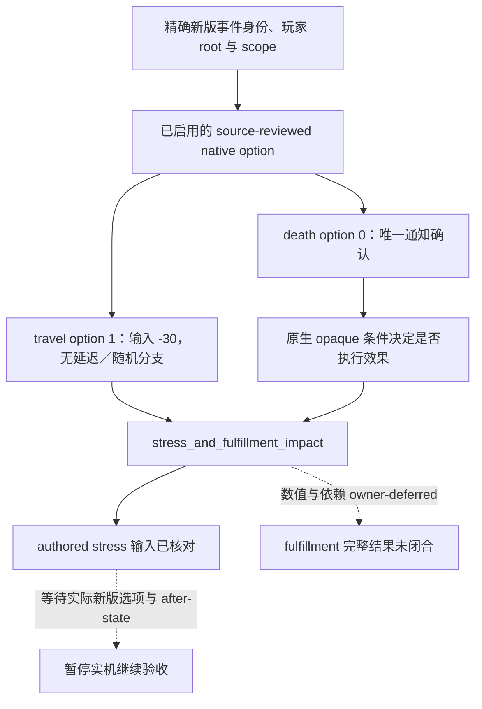

# CK3 1.20.0.2 非战争事件的 stress／fulfillment 原生效果边界

2026-10-01，状态为 **research**。本次仅读取磁盘上的原版脚本与冻结 EXE，未访问本地 CK3 进程、命名管道、桌面、存档或 checkpoint。机器证据为 `artifacts/nonwar-offline-1.20.0.2/events/stress-fulfillment-source-review.json`，SHA-256 `486d54b7b22d66e4920ecc3004dcf9b2b279e04744aae8dc2294fb594833c6b3`。

## 原生 API 已闭合的部分

冻结版本 `1.20.0.2`、Steam build `25588574`，EXE SHA-256 `AE1BA6FF060BA603842F6F4A2DED0AF4B7D3666B3DD271F75FB01B0DA8E81B2D`。证据来自 `artifacts/migrations/2026-09-30/post-update-1.20.0.2/installation/binaries/ck3.exe` 中以 NUL 结尾的原生 API 文档字符串，不是依据新命令名称推测。

| API 文档 | raw byte 区间，末端不包含 | RVA | 字符串 SHA-256 |
| --- | --- | --- | --- |
| `stress_impact` | `75970368..75970852` | `0x4874940` | `97959bf8fadbbcd551ceada6b54646f169cc6369fb34abbf31766156812ce4b2` |
| `stress_and_fulfillment_impact` | `75970864..75971524` | `0x4874b30` | `c9039e56242e4830934a0d916fb207dcb04e42f234025624b226cd11d8ef7724` |

两份文档均说明：可选 `base` 与当前角色拥有的对应 trait 项相加；正负项抵消。`base` 支持 script value，trait 项文档明确不支持 script value，同一 trait 只能出现一次。新命令还明确声明会依据角色是否依照／违背 trait，以及 trait 的 sinful／virtuous 分类，调整 spiritual fulfillment。因此可以保留已经核对过的 **authored stress 输入**，不能把旧 stress-only effect profile 换个 operation 名字后宣称完整结果相等。

本任务不追踪 spiritual fulfillment 的数值、trait 分类、宗教状态或一般宗教机制。这些是所有者暂缓的依赖，只记录此原生效果确实可能涉及第二个域。下列 stress 常量在两版本 `common/script_values/00_stress_values.txt:26–35` 保持相同：gain `10/20/40/80/100`，loss `-5/-15/-30/-65/-100`。整文件哈希不同：旧 `104a7ef94ee9da1092f23aeb2fd9dc971b08c695415f3b7ebfb628f381d26395`，新 `821a0b77244fc5ee2d87d339cb24dbef00787b83d44ec2df9215fc1a93aec2d4`。

## 两个已审阅的有界继续选项

| 事件／native option | 新版 authored 行为 | 可支持的继续条件 | 不能继承的旧结论 |
| --- | --- | --- | --- |
| `tgp_travel_events.0030`／`1` | `events/travel_events/tgp_travel_events.txt:483–495`，无条件 `stress_and_fulfillment_impact = { base = medium_stress_impact_loss }`，输入 `-30`；无 after | 精确事件身份、root、`travel_plan`／`poem_province` scope 与启用 option 已匹配后，沿用避开另一选项五日延迟与随机 duel 的有界继续路径 | 完整效果仅 stress；全局 campaign utility 恒为正；fulfillment 不变；实际 stress delta 恒为 `-30` |
| `death_management.1007`／`0` | `events/death_events/death_management_events.txt:2115–2139`，唯一通知选项；新增 `NOT has_personal_tenet_flag = consolamentum_grief_immunity` 条件，满足时调用新效果、输入 `+20`；after 仅 tooltip | 精确通知身份与既有 no-killer scope 形状已匹配、唯一 option 已启用时，可作通知确认；继续决策不需要知道该 opaque 条件的值 | 无条件 `+20`；必有 stress 物质变化；旧 non_decreasing 观测必能证明本次效果执行；完整效果只有 stress |

新 travel 整文件 SHA-256 `66edd7736e2fcd9979d59e6390ee6d83126ff54146bc610d00bb14313d4fdf24`；旧为 `42b8b1e56c029054fbc4e0b3964511a980d9b5053c47bff980cd3f5f3924db37`。新 death 整文件 SHA-256 `dfdab7ab6757c73980b82f5e3a6f23184160688b844558fce85d8ee5b9ef4c59`；旧为 `31591a2f2d3a61e65853cc43b9bef4b001feb75ea1502861d2fb9ac054ab1fb7`。原文行与各哈希均冻结在机器证据中。

## 现有观测与待实机部分

[新版事件窗](event-window-context-1.20.0.2.md)已提供物化的 `stress`、`fulfillment` 与 `stress_and_fulfillment` indicator。组合项的主方向为 stress，副方向为 fulfillment；幅度仍为 unavailable。这能用于保留窗口观测，不能填成完整效果预测：`complete_effect_set=false`、`effect_preview_ready=false`、`semantic_decision_ready=false`。

此次没有增加一般 fulfillment query、效果函数调用或宗教策略。两个具体事件在 1.20 的实际 materialized identity、启用 option、root／saved scopes 与选择后状态仍待可用实机时记录。旧版 live、原生文档和常量输入都不能代替该验收；无需为执行唯一通知选项而展开宗教系统。
