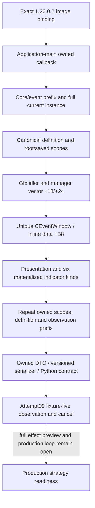

# CK3 1.20.0.2 当前事件窗：静态迁移与 typed wire

2026-10-01 已完成独立 `ck3_12002` reader、serializer、真实 C++ 对象图夹具与 Python consumer 回放；协调者的 attempt09 使六类 indicator、root/saved scopes、相邻一致性和取消 primitive 达到 **fixture-live**。准备代理只读取冻结磁盘 EXE、原版 GUI、本地合成对象与协调者保存的 JSON；游戏、注入、输入和实际命令由获得用户授权的协调者独占操作。

冻结版本为 `1.20.0.2 (Crozier)`、Steam build `25588574`，EXE SHA-256 为 `AE1BA6FF060BA603842F6F4A2DED0AF4B7D3666B3DD271F75FB01B0DA8E81B2D`。[机器 ABI 合同](../../ck3_autonomous_player/native_bridge/research/ck3_1_20_0_2_event_window_context.json) 固定实际函数区域、指令操作数和源码常量；旧版 live 记录不能替代本次验收。

## 实际布局变化

| 对象/字段 | 1.19.0.6 | 1.20.0.2 | 新构建证据 |
| --- | --- | --- | --- |
| GUI root | 旧 Jomini 全局 slot | `module+0x5C6A520 -> owner+0x10` | `0xB20148/0xB20158`，随后原生 RTTI dynamic cast |
| 图形 idler primary vtable | 旧构建专用 | `0x44BC408` | `0xB1FBFA` constructor；`0x44D6048` 是另一种非 Gfx idler |
| event-window manager | idler `+0x28` | idler `+0x28` | `0xB1FC97/0xB1FC9D` 原生创建并赋值 |
| manager window vector | data `+0x10`、count `+0x1C` | data `+0x18`、capacity `+0x20`、count `+0x24` | constructor `0xC454E4/0xC454E8`；tick `0xC457FD/0xC45801` |
| CEventWindow primary vtable | 旧构建专用 | `0x4597910` | constructor `0x1829F67` |
| window inline data | `+0xE8` | `+0xB8` | constructor `0x1829F95` 与 destructor `0x182A0E2` 互证 |
| EventData authored options | `+0x1B0/+0x1B8/+0x1BC` | `+0x1A0/+0x1A8/+0x1AC` | setup `0x1852903..0x1852914` 与 cancel consumer `0x19D62D5` |
| authored option cancel byte | `+0x47A` | `+0x412` | `0x19D62E0` 对确切 authored option 读取 |
| indicator flags | gain `+0x14`、trait `+0x15`、critical `+0x16` | primary gain `+0x14`、secondary gain `+0x15`、trait `+0x16`、critical `+0x17` | materializer `0x18590AA/0x18590B1/0x1859091/0x1859171`；append 按完整 `0x18` 字节复制 |
| loaded trait definitions | data `+0x68`、count `+0x74` | data `+0x50`、count `+0x5C` | native lookup `0xC85F37/0xC85F3C`；DB slot `0x5C67528` |

manager 新增的 `+0x10` 单 popup 是独立 `0xE0` 对象，primary vtable 为 `0x4596D38`，不能按 CEventWindow 布局读取。原生创建函数 `0xC45B30` 的普通事件分支在 `0xC45CF5` 分配 `0x8F0`、在 `0xC45D13` 调用 CEventWindow constructor、在 `0xC45D29/0xC45D2D` 加入 `manager+0x18` vector。本 reader 继续对应这个实际物化的 CEventWindow 分支；匹配实例没有同型窗口时报告未物化。

CEventWindowData 的实例 ID `+0x00`、option vector `+0x10/+0x18/+0x1C` 保持不变。CEventOptionItem stride `0x1B8`，owner `+0x160`、resolved name `+0x170`、unavailable reason `+0x190`、native index `+0x1B0`、enabled `+0x1B4`、fallback `+0x1B5` 由新版 constructor 与 vector walker 再次确证。effect vector 仍为 `+0x88/+0x90/+0x94`、row stride `0x18`。

## 新 indicator 枚举与显示语义

| native kind | 新 wire kind | 已物化的观测 |
| --- | --- | --- |
| 0 | `trait` | add/remove，加载中的 trait native ID 与 stable key |
| 1 | `stress` | primary direction、affected by trait、critical |
| 2 | `fulfillment` | primary direction；magnitude unavailable，trait/critical false |
| 3 | `stress_and_fulfillment` | primary direction 为 stress，secondary direction 为 fulfillment；保留 stress trait/critical |
| 4 | `death` | played-character death indicator |
| 5 | `scheme` | generation-independent scheme stable key |
| 其他 | `unknown` | 精确保留 raw kind，不套用已知 payload 布局 |

旧版 `2=death / 3=scheme` 已失效。新版 materializer `0x1858FF0` 同时检查 stress 和 fulfillment 聚合值：两者非零构造 kind 3，仅 fulfillment 构造 kind 2；death 在 `0x18592C9` 为 kind 4，scheme visitor 在 `0x18584C5` 为 kind 5。原版 `game/gui/shared/event_windows.gui` 的 `OptionEffectItem.IsFulfillment`（2476）、`IsStressAndFulfillment`（2498）及 `IsSecondaryGain/IsSecondaryLoss`（2505/2512）直接支持这些名称和双向显示。

组合项的示例 wire 为：

```json
{"kind":"stress_and_fulfillment","direction":"increase","secondary_direction":"decrease","magnitude":{"status":"unavailable"},"affected_by_trait":true,"critical":true}
```

此项只搬运窗口已经物化的 indicator。没有展开 spiritual fulfillment 的宗教机制、宗教策略或其他 owner-deferred 域。indicator 的 coverage 为 `played-character-event-icon-indicators-1.20.0.2-v1`；`complete_effect_set=false`。图标没有数值幅度或完整效果信号，因此 `effect_preview_ready=false`、`semantic_decision_ready=false`，不会把显示摘要当作完整效果预测。

## Definition identity 与 root/saved scopes

ActiveEvent 定义指针 `+0x1B0`、完整实例 ID `+0x1BC` 保持不变。EventData `+0x08` calculated ID 与 canonical key `+0x10` 经新 duplicate validator `0x37A1200` 闭合。loaded EventData rebuild `0x37A1400` 从其 pointer vector 取定义，在 `0x37A14D0` 将递增列表 ordinal 写入 `EventData+0x0C`。两个数值都是本次加载的元数据；跨进程定义身份使用 canonical key。

ActiveEvent constructor `0x29C6C20` 原样把 `this` 传给 scope constructor `0x889F60`，继续证明 zero-offset EventTargetScope。scope serializer `0x2333030` 读取 root token、`+0x18/+0x24` saved vector；row serializer `0x2613B20` 读取 name ID `+0x00`、token `+0x08`，stride `0x18`。reader 在窗口复制前后复制完整 owned root/saved inventory，并重新核对当前事件、定义和所属 core/event observation prefix。

类型 registry getter `0x3795A80` 返回 `module+0x54F2AF0`，data/count 为 `+0x00/+0x0C`、entry stride `0x50`。新 consumer `0x2253D50` 以 token type index 查 entry identifier，再调用 `0x3F4F900` 取得 stable type key。script-name table getter `0x3F8A800`、lookup-only `0x3F8A680` 与 resolver `0x3F8A6F0` 提供完整 signed name ID 的 round-trip；不会 intern 新 key。

type 4 registration `0x43FB20` 明确指向 Character resolver `0x225E000`。新 resolver 从 token `+0x08` 读 CharacterID，经 storage slot `0x5C67568`、slots `+0x20`、capacity `+0x2C`、stride `0x10`、object `+0x08` 与 character full ID `+0x18` 闭合代数。原生有效性现在直接比较 character `+0x1C` tag `0x43686172`；旧 secondary vtable 的 validity 调用已消失。本 identity reader 使用精确 storage/full-ID lookup，不调用旧版虚函数。

Character token 可以发布 typed CharacterID；其他类型继续发布 stable type key/subtype，typed payload identity 保持既有 `generic_scope_payload_identity_not_closed` 边界。它们的 raw payload 不被读取。本次迁移复用工作树原有、此前尚未提交的 scope DTO 声明，将其作为新版 reader 必要的稳定类型依赖纳入；同一 shared header 只额外增加两个 kind 和 `secondary_gain`，旧 reader/serializer/test 的其他工作树改动单独保留。



## 离线与实机结果

实现为 [typed header](../../ck3_autonomous_player/native_bridge/include/xar_bridge/ck3_12002_event_window_context.hpp)、[reader](../../ck3_autonomous_player/native_bridge/src/ck3_12002_event_window_context.cpp)、[serializer](../../ck3_autonomous_player/native_bridge/src/ck3_12002_event_window_context_serializer.cpp) 与 [fixture](../../ck3_autonomous_player/native_bridge/src/ck3_12002_event_window_context_test.cpp)。MSVC 19.51、C++20、`/EHsc /W4` 编译及运行 PASS。夹具调用真实 reader/serializer，覆盖新版对象图、完整 Character scope、signed saved name round-trip、非 Character scope、trait/scheme identity、六个已知 kind、未知 kind、组合双向 flags、旧 cancel 字节诱饵、错误非 Gfx idler、重复窗口与陈旧 Character generation。

统一 offline verifier 对本包为 GREEN：27 个独特签名、3 个 vtable 前缀、115 条语义指令、40 个精确代码区域、77 个源码常量和 4 个源码文件哈希。39 个代码区域来自 `.pdata`；`0x225E000..0x225E071` 是无 unwind record、逐条审阅到 ret 的完整 leaf。区域可以只是逻辑函数的一部分，合同不把 unwind region 冒充整个函数。

artifact 目录：`artifacts/migrations/2026-09-30/post-update-1.20.0.2/event-window/`。

- `event_window_test.exe` SHA-256：`D4F95B7E965A0616627C650264D76041C5B6EDEC6B7AC560FD6D6FE325317AAA`。
- `abi-verification-result.json` SHA-256：`2F2B6D69A75FB60DD6DC4E00A4CD169A4579AA640EC34B090C687EBD4B5C1C22`。
- `producer-context.json` SHA-256：`5F2A3DC5E04DDA2E650EEC4C337E9C6062849572CF1E4D8D35FD1C9DB0ECD230`；相同 native wire 冻结为 [Python fixture](../../ck3_autonomous_player/tests/fixtures/ck3_12002_event_window_native.json)，16 项迁移/consumer 回放 PASS。

协调者已在真实 paused attempt09 完成新版 fixture 验收：当前 event `15`、native revision `5`、root Character `29829`、saved target `30784`，两帧相同；11 个物化选项发布全部六类 indicator 和正反方向，public option `1` 提交 cancel native `0` 后旧事件消失。[完整 JSON 回放](../../artifacts/migrations/2026-09-30/post-update-1.20.0.2/live-1.20.0.2/attempt-09/events-window-validation-native-rule.json)两帧 GREEN。状态为 `fixture-definition playset + production native bridge` 范围的 `fixture-live primitive`。

实机同时闭合了 `show_as_unavailable` 的显示规则：`NGui.EVENT_OPTIONS_SHOWN_HIDE_UNAVAILABLE=4` 是禁用项补位上限，不是所有选项的数量上限。SetupOptions 第一遍统计全部 enabled，第二遍按 authored 顺序追加 enabled，并只在已统计数低于上限时追加 disabled。fixture 有 11 个 enabled，因此 native `1` 不显示；独立 selection 只有 2 个 enabled，因此该 disabled row 显示。原生注册 `0xB50880` 将 define 绑定到 `0x5C67B18`，caller `0x185150A` 读取、`0x1851722/0x1851732` 传入第四参数，`0x1852BD8/0x1852BDF` 判断并跳过超限 disabled。只有 `scheme_preparations_event` widget 使用另一个 stock 上限 `8`，本 fixture 不走特例。

原始 12 行 expectation 与 RED 已归档；修正为 `[0,3..12]` 的 11 行后，对同一冻结响应完整回放通过。没有改 reader、DLL 或游戏夹具内容，没有额外实机重跑。确切 define 行、文件哈希及 producer 指令保存在[原生显示规则证据](../../artifacts/migrations/2026-09-30/post-update-1.20.0.2/live-1.20.0.2/fixtures/events/window-revisions/attempt09-native-disabled-limit/native-materialization-proof.json)。

旧版已有的完整 structured effect preview、非 Character payload decoder 和完整事件选择策略缺口仍独立存在；本次 fixture 通过没有声称完成这些能力或 production OODA。总迁移和命令边界见[事件与互动迁移专题](ck3-1.20-event-interaction-migration.md)。
