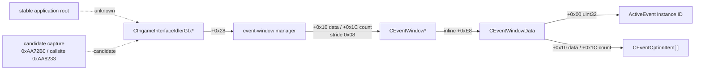
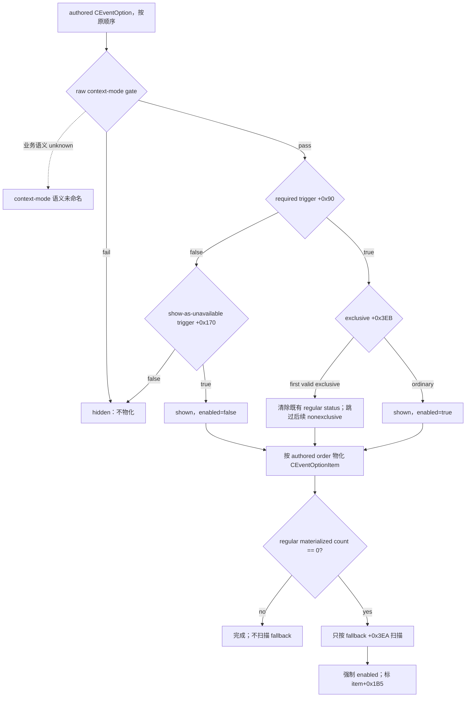
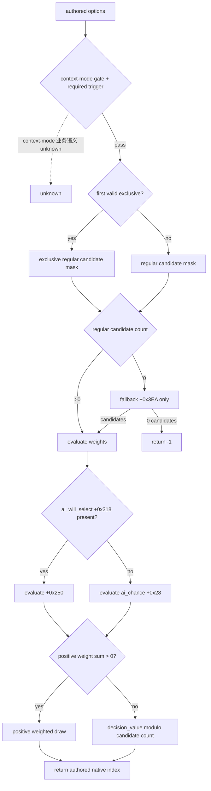

# CK3 1.19.0.6：current event window context

本文冻结通用、非宗教事件窗口的 engine-owned presentation context，目标是让自动玩家读取**当前实际展示给玩家的选项**，而不是只读取事件定义中的 authored option 数量。它同时记录原生 `SetupOptions` 与 AI selector 的决策树，以及 production locator 尚未闭合的边界。

宗教、faith、doctrine、tenet、fervor、改宗、宗教改革、圣战等专用语义依项目所有者要求暂缓。本文只保留对所有事件通用的 opaque 兼容边界。

## 版本与证据等级

- 游戏版本：`1.19.0.6`
- `ck3.exe` SHA-256：`2D00FF3101EF70B566F2FCBAE292F09263199C80E9DC8F139B82D7D96F83DB86`
- 架构：MSVC x64
- 证据来源：离线 exact-build 静态逆向；本轮未启动或附加 CK3
- 机器可复核契约：[`event_window_context_1_19_0_6_abi.json`](../../ck3_autonomous_player/native_bridge/research/event_window_context_1_19_0_6_abi.json)
- 既有 option/AI 契约：[`event_option_1_19_0_6_abi.json`](../../ck3_autonomous_player/native_bridge/research/event_option_1_19_0_6_abi.json)

本文采用三种标签：

- **静态确认**：exact-build 指令、`.pdata` 函数边界、构造/析构或 GUI accessor 能直接证明。
- **候选**：有精确 hook/callsite，但尚未用 production install/teardown 与实机 snapshot 验证。
- **unknown**：目前证据不足；不以字段名、邻接布局或 GUI 名称补猜。

Mermaid 实线表示静态确认，虚线表示 candidate/unknown。

## current ActiveEvent 与 current event window 不是同一层

现有 bridge 能通过 EventManager 的 current-event getter（RVA `0x2706AD0`）取得 `ActiveEvent*`，并从 `ActiveEvent+0x1BC` 读取 event instance ID。然而，最终展示状态由 `CEventWindowData::SetupOptions` 物化：隐藏的 authored option 根本不会进入 item vector；不可选但配置为展示的 option 会以 disabled item 出现；普通选项为空时才进入 fallback 路径。

因此 typed 查询必须同时匹配：

1. 当前 `ActiveEvent+0x1BC` 的完整 instance ID；
2. 窗口管理器中 `CEventWindowData+0x00` 的同一 instance ID；
3. 该窗口已经物化的 `CEventOptionItem` vector。

仅凭 `EventData` 的 authored option 数量不能代表玩家看见的选项，也不能代表 enabled 状态。

## locator 下半链与生命周期

### 静态确认的对象链



静态确认项：

- `CIngameInterfaceIdlerGfx` 构造函数 `0xAA3ED0..0xAA4065` 分配大小 `0xA8` 的 event-window manager，并把指针保存到 `this+0x28`。
- idler 的 per-frame 路径 `0xAA72B0..0xAA7B0D` 经 helper `0xAA80B0..0xAA855A`，在 callsite `0xAA8233` 取 `[idler+0x28]` 作为 `rcx` 调用 manager tick `0xBAB780`。
- manager `+0x10` 是 `CEventWindow*` vector data，`+0x1C` 是 `int32` count，元素步长 `0x08`。
- manager tick 在 `0xBAB9D4` 分配 `0x838` 字节的 `CEventWindow`，在 `0xBAB9F5` 调用构造函数 `0x16A1700`。
- `CEventWindow` 构造函数把 `this+0xE8` 传给 `CEventWindowData` 构造函数 `0x16CA380`；析构函数 `0x16A1AA0` 同样把 `this+0xE8` 传给 data 析构函数 `0x16CA980`。因此 data 是 window 的内联成员，生命周期严格由 window 包围。
- data 构造时把 `ActiveEvent+0x1BC` 的 instance ID 写入 `data+0x00`；setup `0x16CADC0..0x16CB8C3` 再用该 ID 解析 live `ActiveEvent`，并在 `0x16CB782` 调用 `SetupOptions`。

### manager tick 证明的 lifetime 约束

manager tick 在 `0xBAB920..0xBABA36` 扫描 UI active-event vector（data `+0x313D8`、count `+0x313E4`），按 event subtype 与本地 recipient 过滤，用 manager `+0x58/+0x64` 的已知 instance ID 去重，然后创建窗口。随后 `0xBABA53..0xBABB58` 调用窗口 keep-alive vslot，并释放、压缩已经关闭的条目。

因此同一帧内就可能发生窗口释放。production reader 必须在 owning application/UI thread 上完成一次性复制；不得把 window、data、vector、MSVC string 或 effect item 指针交给 mailbox worker 后再解引用。

### RTTI 边界

| 类型 | exact-build 证据 | 结论 |
|---|---|---|
| `CIngameInterfaceIdlerGfx` | TypeDescriptor `0x501EF50`、COL `0x45F5BC0`、vtable `0x40B1D30` | 可用于候选 capture 的动态类型校验 |
| `CEventWindow` | TypeDescriptor `0x50242C8`、primary COL `0x474D4F8`、primary vtable `0x417F758`；MI vtable `0x417F738`、`0x417F710` | 可校验 manager vector 条目 |
| `CEventWindowData` | 仅找到 reflection/template 名称 | 非多态内联对象；没有确认的 native RTTI，不能声称可独立 RTTI 校验 |

### 尚未闭合的 root

`CIngameInterfaceIdlerGfx` 在 `0x82813C` 被创建，随后保存到 application idler wrapper `+0x10` 并通过 `0x3555120` 注册；当前没有闭合从稳定全局根到该 wrapper/idler 的读取链。另有 frontend 路径在 `0xE30E78` 调用同类 manager tick，因此“搜到一个 manager”并不足以证明它属于 in-game UI。

可施工的候选 seam 是：在 idler per-frame entry `0xAA72B0` 捕获 `this`，或在精确 callsite `0xAA8233` 捕获 manager `rcx`；在 idler destructor `0xAA4070` 清除；查询时再校验 idler/window RTTI、vector bounds，以及 `data+0x00 == current ActiveEvent+0x1BC`。这仍是 **candidate**，不是 production locator。root→idler 未闭合且 capture 尚未验证前，不写 production reader。

## `SetupOptions`：最终展示选项的物化树

`CEventWindowData::SetupOptions` 位于 `0x16CC780..0x16CCE4C`。完整字段与 hash 冻结在既有 [`event_option_1_19_0_6_abi.json`](../../ck3_autonomous_player/native_bridge/research/event_option_1_19_0_6_abi.json)；这里记录 current-window 查询所依赖的最终结果。



关键点：fallback 路径不会重跑 required trigger、context gate、show-as-unavailable 或 exclusive。`shown` 不是独立 byte，而是 item 存在于物化 vector 这一事实。

## typed option context 的静态 ABI

### `CEventWindowData`

| 偏移 | 类型/语义 | 证据等级 |
|---|---|---|
| `+0x00` | `uint32` current ActiveEvent instance ID | 静态确认 |
| `+0x10` | `CEventOptionItem*` vector data | 静态确认 |
| `+0x18` | vector capacity | 静态确认 |
| `+0x1C` | `int32` vector count | 静态确认 |
| `+0x2C` | `int32` cancel native option index；负 sentinel 的 `-1/-2` 子语义未查明 | 部分静态确认 |

### `CEventOptionItem`（stride `0x1B8`）

| 偏移 | 类型/语义 | 证据等级 |
|---|---|---|
| `+0x88/+0x90/+0x94` | `OptionEffectItem` vector data/capacity/count | 静态确认 |
| `+0x160` | owning `CEventWindowData*` | 静态确认 |
| `+0x168` | clicksound resource | 静态确认；首个 typed query 不必发布 |
| `+0x170` | resolved name，MSVC string | 静态确认 |
| `+0x190` | unavailable reason，MSVC string | 静态确认 |
| `+0x1B0` | authored zero-based native option index | 静态确认 |
| `+0x1B4` | enabled byte | 静态确认 |
| `+0x1B5` | fallback-materialized byte | 静态确认 |
| vector membership | shown | 静态确认 |

`cancel` 应由 `item.native_option_index == data.cancel_option_index` 派生；不要把 rendered index 当成 native index。

## effect indicator seam，而非完整 effect preview

`CEventOptionItem` 构造过程通过 `0x16D2CF0 -> 0x3380170` 收集展示数据，最终 GUI 读取的是 item `+0x88` 的已物化 `OptionEffectItem` vector。append/dedupe 逻辑范围为 `0x16D3A40..0x16D3BF1`，元素 stride `0x18`。

原版 `letter_event.gui` 的 `EventOption.Effects` / `OptionEffectItem` binding 与 exact accessors 一起闭合了以下布局：

| 偏移 | typed 含义 | exact accessor |
|---|---|---|
| `+0x10 int32` | `0=trait`、`1=stress`、`2=death`、`3=scheme`；其他值 unknown | `0xE88760`、`0xE887A0`、`0xE887E0`、`0xE88820` |
| `+0x14 uint8` | 非零为 gain，零为 loss | `0xD494D0`、`0x16A2600` |
| `+0x15 uint8` | affected-by-trait | `0xD9E8C0` |
| `+0x16 uint8` | critical | `0xD9E900` |
| `+0x00 uint64` | opaque payload | unknown；不得发布或猜类型 |
| `+0x08 uint64` | opaque payload | unknown；不得发布或猜类型 |

这条 seam 只证明 GUI 已物化的**效果指示器**。它没有闭合金币、威望、关系、健康等完整数值 delta，也没有闭合任意 scripted effect 的文本或结构化预览。首个 reader 只能复制上述 kind/flags；不得调用 preview collector，更不得把 gameplay executor `0x3380410` 当预览函数。

## stable event key 与 scopes

`CEventWindowData.GetScope` 的 GUI property registration 位于 `0x2B8010` 附近，回调 trampoline 为 `0x16D6890`，实际 resolver `0x16D0990..0x16D0A36` 使用 `data+0x00` 经 EventManager 找回 live `ActiveEvent*` 并返回它。它证明窗口上下文能回到精确 active event，但返回的是进程内活对象指针，不是稳定 root-scope ID。

当前边界：

- current event instance ID：**静态确认**，`ActiveEvent+0x1BC == CEventWindowData+0x00`。
- stable event definition key：**unknown**。没有从 `EventData` 基址猜字段。
- stable root scope identity：**unknown**。
- stable saved-scope identities：**unknown**。
- event deadline/days remaining 的稳定 typed ABI：**unknown**。

这些字段在未来 schema 中可以显式 `null/unavailable`，但不能以长期 `null` 宣称完成依赖它们的策略。它们各自需要后续 exact-build reverse slice。

## 原生 AI selector 冻结

原生 selector 位于 `0x33E71B0..0x33E784E`；本节只是为 current-event typed context 固定依赖关系，不替换既有详细研究。



原生 AI 使用 authored native index，而 GUI vector 使用 rendered order。因此高智商 counter-policy 至少需要 `rendered_index` 与 `native_option_index` 同时存在，并以物化的 shown/enabled/name/reason 为玩家侧事实；不能用 authored list 猜 GUI 状态。

## `event-window-context-v1` 最小只读形状

下列是 production query 的建议形状，**尚未实现**：

```text
status / revision / availability
current_event_instance_id
window_match_count
event_definition_key          # null/unavailable until reverse-closed
root_scope                    # null/unavailable until reverse-closed
saved_scopes                  # null/unavailable until reverse-closed
options[]:
  rendered_index
  native_option_index
  shown                       # true for every materialized item
  enabled
  fallback
  cancel
  resolved_name
  unavailable_reason
  effect_indicators[]:
    kind                      # trait/stress/death/scheme/unknown
    gain
    affected_by_trait
    critical
```

读取必须满足：完整 instance ID 相等、恰好一个匹配窗口、vector/string bounds 合法、所有值在同一 owning-thread revision 内复制完成。零匹配、多匹配、销毁中或布局不合法均返回 unavailable；不得退回 authored options 假装展示状态。

## 最小 production capture slice

root→idler 尚未闭合，因此本轮停在 candidate，不实现 reader。下一 slice 按以下顺序施工：

1. 在 exact-build 绑定的 `0xAA72B0` entry 或 `0xAA8233` callsite 安装最小 capture，只保存 in-game idler/manager；在 `0xAA4070` teardown 清除。
2. capture 时验证 `CIngameInterfaceIdlerGfx` RTTI/vtable；query 时验证 manager bounds、`CEventWindow` RTTI/vtable，以及 `data+0x00` 与现有 current `ActiveEvent+0x1BC` 完整相等。显式拒绝 frontend `0xE30E78` 的同类 manager。
3. 把 snapshot 工作投递到 owning application/UI thread；在一个回调内复制 item vector、MSVC strings 与 effect indicator kind/flags，回调结束后不保留任何 engine pointer。
4. 首个 value slice 只发布已经闭合的 option presentation 字段。stable definition key、stable scopes、deadline 与完整 effect preview 分别作为后续 reverse slice，不猜布局。
5. 保持纯只读；不调用 trigger、name resolver、preview collector 或 effect executor，不执行事件选项。

## 测试门槛

在任何实机 acceptance 前：

- 静态 verifier 必须绑定 exact EXE SHA、全部 `.pdata` extent 与 byte-span SHA：

  ```powershell
  & "tools\.venv\Scripts\python.exe" "ck3_autonomous_player\native_bridge\research\verify_event_window_context_abi.py"
  ```

- C++ fixture 必须用合成 idler/manager/window/data/item/string/effect vectors 覆盖：零/一/多匹配、完整 ID 不同、非法 count/capacity、窗口销毁/teardown 后 unavailable、rendered/native index 不同、cancel 派生、disabled reason、fallback、四种已知 effect kind 与 unknown kind。
- capture install/uninstall 单测必须证明 exact-build mismatch 不安装、teardown 清空、frontend manager 被拒绝，并用确定性 ownership assertion 证明 worker 不直接解引用 engine pointer。
- 获准启动 CK3 后，paused generic nonreligious event 做两次相邻 same-revision typed query：完整 instance ID、option 顺序、enabled/name/reason/effect indicators 一致；关闭窗口后同一 ID 必须变为 unavailable。报告固定 EXE/DLL hash，且不执行默认 accept/reject/action。

本轮只完成离线静态研究与契约校验，没有启动 CK3，也没有进行宗教专用事件探索。

## Evidence / unknown 账本

| 项目 | 状态 | 主要证据或下一入口 |
|---|---|---|
| idler `+0x28` → manager | 静态确认 | ctor `0xAA3ED0`；callsite `0xAA8233` |
| manager vector → `CEventWindow*` | 静态确认 | tick `0xBAB780`；insert `0xBABE70` |
| `CEventWindow+0xE8` → inline data | 静态确认 | ctor `0x16A1700` / dtor `0x16A1AA0` |
| data lifetime | 静态确认 | manager same-tick keep-alive/remove/compact |
| data instance ID | 静态确认 | data ctor `0x16CA380`；setup `0x16CADC0` |
| shown/enabled/name/reason/native index/fallback | 静态确认 | `SetupOptions` 与 `CEventOptionItem` ABI |
| effect indicator kind/flags | 静态确认 | append `0x16D3A40` 与八个 GUI accessors |
| native `SetupOptions` / AI selector 树 | 静态确认 | existing event-option exact-build contract |
| stable global root → idler | unknown | 优先继续追 `0x3555120` 注册表，或验证 capture seam |
| per-frame/callsite capture | candidate | install/teardown、frontend collision、实机未验证 |
| stable event definition key | unknown | 继续追 EventData definition/serialization identity consumer |
| stable root/saved scopes | unknown | 从 ActiveEvent scope serialization/GUI binding 继续追，而非暴露指针 |
| full structured effect preview | unknown | opaque payload 与非 icon/danger-indicator 输出 consumer 未闭合 |
| production bridge query | 未实现 | 等 locator capture 闭合后进入最小只读 slice |
