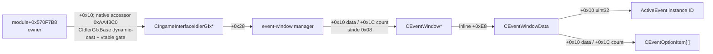
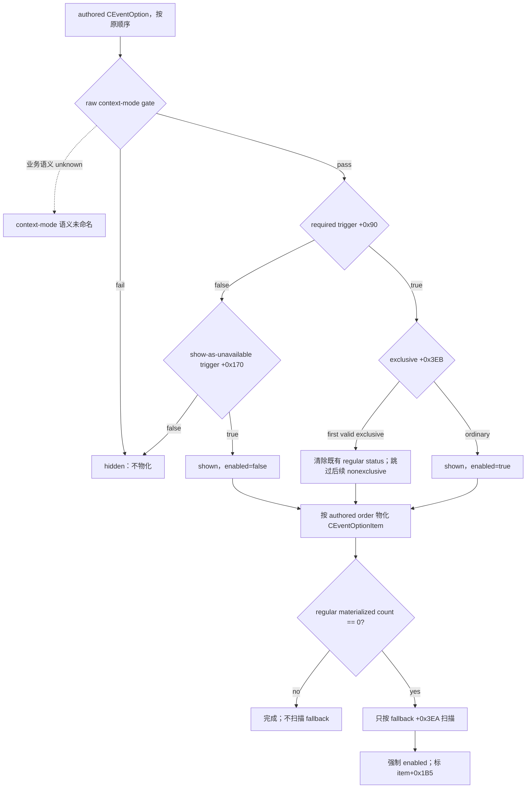
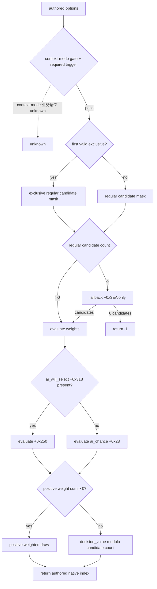

# CK3 1.19.0.6：current event window context

本文冻结通用、非宗教事件窗口的 engine-owned presentation context，目标是让自动玩家读取**当前实际展示给玩家的选项**，而不是只读取事件定义中的 authored option 数量。它同时记录原生 `SetupOptions` 与 AI selector 的决策树、已经闭合的 production locator，以及仍待实机验证的边界。

宗教、faith、doctrine、tenet、fervor、改宗、宗教改革、圣战等专用语义依项目所有者要求暂缓。本文只保留对所有事件通用的 opaque 兼容边界。

## 版本与证据等级

- 游戏版本：`1.19.0.6`
- `ck3.exe` SHA-256：`2D00FF3101EF70B566F2FCBAE292F09263199C80E9DC8F139B82D7D96F83DB86`
- 架构：MSVC x64
- 证据来源：离线 exact-build 静态逆向；2026-08-27 Attempt4 generic 非宗教 fixture 的 production bridge paused
  seed/checkpoint/fresh-cold 实机验收
- 机器可复核契约：[`event_window_context_1_19_0_6_abi.json`](../../ck3_autonomous_player/native_bridge/research/event_window_context_1_19_0_6_abi.json)
- 既有 option/AI 契约：[`event_option_1_19_0_6_abi.json`](../../ck3_autonomous_player/native_bridge/research/event_option_1_19_0_6_abi.json)

本文采用三种标签：

- **静态确认**：exact-build 指令、`.pdata` 函数边界、构造/析构或 GUI accessor 能直接证明。
- **实机确认（fixture-scoped）**：生产 bridge 在本文明确的外部 definition/localization fixture 中完成 paused live；
  不能外推为 stock event 或完整 effect/decision 覆盖。
- **候选**：有精确 hook/callsite，但尚未用 production install/teardown 与实机 snapshot 验证。
- **unknown**：目前证据不足；不以字段名、邻接布局或 GUI 名称补猜。

Mermaid 实线表示静态确认，虚线表示 candidate/unknown。

## current ActiveEvent 与 current event window 不是同一层

现有 bridge 能通过 EventManager 的 current-event getter（RVA `0x2706AD0`）取得 `ActiveEvent*`，并从 `ActiveEvent+0x1BC` 读取 event instance ID。然而，最终展示状态由 `CEventWindowData::SetupOptions` 物化：隐藏的 authored option 根本不会进入 item vector；不可选但配置为展示的 option 会以 disabled item 出现；普通选项为空时才进入 fallback 路径。

因此 typed 查询必须同时匹配：

1. 当前 `ActiveEvent+0x1BC` 的完整 instance ID；
2. 窗口管理器中 `CEventWindowData+0x00` 的同一 instance ID；
3. 该窗口已经物化的 `CEventOptionItem` vector。

仅凭 `EventData` 的 authored option 数量不能代表玩家看见的选项，也不能代表 enabled 状态。

## locator 下半链与生命周期

### 静态确认的对象链



静态确认项：

- `CIngameInterfaceIdlerGfx` 构造函数 `0xAA3ED0..0xAA4065` 分配大小 `0xA8` 的 event-window manager，并把指针保存到 `this+0x28`。
- idler 的 per-frame 路径 `0xAA72B0..0xAA7B0D` 经 helper `0xAA80B0..0xAA855A`，在 callsite `0xAA8233` 取 `[idler+0x28]` 作为 `rcx` 调用 manager tick `0xBAB780`。
- manager `+0x10` 是 `CEventWindow*` vector data，`+0x1C` 是 `int32` count，元素步长 `0x08`。
- production v1 不读取未在本契约闭合的 manager `+0x18` capacity；只把 signed count 限制为 `0..32`，count 非零时要求 data 非空。manager 的 keep-alive/remove/compact 链证明存储项是 live `CEventWindow` ownership rows，因此 null 或非 exact primary-vtable 条目是 layout drift，不得静默跳过。
- manager tick 在 `0xBAB9D4` 分配 `0x838` 字节的 `CEventWindow`，在 `0xBAB9F5` 调用构造函数 `0x16A1700`。
- `CEventWindow` 构造函数把 `this+0xE8` 传给 `CEventWindowData` 构造函数 `0x16CA380`；析构函数 `0x16A1AA0` 同样把 `this+0xE8` 传给 data 析构函数 `0x16CA980`。因此 data 是 window 的内联成员，生命周期严格由 window 包围。
- data 构造时把 `ActiveEvent+0x1BC` 的 instance ID 写入 `data+0x00`；setup `0x16CADC0..0x16CB8C3` 再用该 ID 解析 live `ActiveEvent`，并在 `0x16CB782` 调用 `SetupOptions`。

### manager tick 证明的 lifetime 约束

manager tick 在 `0xBAB920..0xBABA36` 扫描 UI active-event vector（data `+0x313D8`、count `+0x313E4`），按 event subtype 与本地 recipient 过滤，用 manager `+0x58/+0x64` 的已知 instance ID 去重，然后创建窗口。随后 `0xBABA53..0xBABB58` 调用窗口 keep-alive vslot，并释放、压缩已经关闭的条目。

因此同一帧内就可能发生窗口释放。production reader 必须在 owning application/UI thread 上完成一次性复制；不得把 window、data、vector、MSVC string 或 effect item 指针交给 mailbox worker 后再解引用。

### RTTI 边界

| 类型 | exact-build 证据 | 结论 |
|---|---|---|
| `CIngameInterfaceIdlerGfx` | TypeDescriptor `0x501EF50`、COL `0x45F5BC0`、vtable `0x40B1D30`；原生 accessor `0xAA43C0` 做 `CIdlerGfxBase*` → 本类型 dynamic-cast | production passive root 必须镜像为精确 primary-vtable gate |
| `CEventWindow` | TypeDescriptor `0x50242C8`、primary COL `0x474D4F8`、primary vtable `0x417F758`；MI vtable `0x417F738`、`0x417F710` | 可校验 manager vector 条目 |
| `CEventWindowData` | 仅找到 reflection/template 名称 | 非多态内联对象；没有确认的 native RTTI，不能声称可独立 RTTI 校验 |

### 已闭合的 stable root 与 frontend 排除

此前本专题漏用了已经在 [`prewar-encounter-inputs.md`](prewar-encounter-inputs.md) 与 `prewar_scope_v1_abi.json` 冻结的原生 accessor。exact `.pdata` slice `0xAA43C0..0xAA440A`（`0x4A` bytes，SHA-256 `1741A42D9B2425B66C2738B28128D9DA0CC95E46C37B118E74C646C74D209822`）直接执行：

```text
owner = *(module+0x570F7B8)
require owner != null
idler_base = *(owner+0x10)
idler = dynamic_cast<CIngameInterfaceIdlerGfx*>(idler_base)
require idler != null
handler = *(idler+0x88)
```

其中 cast 的目标 TypeDescriptor 是 `module+0x501EF50`，PMD `mdisp=0`。构造器 `0xAA3EEA..0xAA3EF1` 又把 `module+0x40B1D30` 写入新建 idler 的 primary vtable。因此只读 reader 不调用 dynamic-cast，而是镜像相同所有权链，并严格要求 `*(idler+0x00) == module+0x40B1D30` 后才读取 `idler+0x28`。

这条链不是把另一个 application wrapper 的 `+0x10` 类推到这里，而是原生函数自身对 `module+0x570F7B8`、`owner+0x10` 与目标 RTTI 的连续指令证据。frontend `0xE30E78` 的 generic manager tick 不从该 accessor/vtable-gated root 取得对象，因此不进入查询。查询还必须要求 manager 中恰好一个 primary-vtable 为 `module+0x417F758` 的 `CEventWindow`，且其 `data+0x00` 完整 instance ID 等于同帧 current `ActiveEvent+0x1BC`；不能只按低位 slot 或只凭 manager 指针匹配。

原计划的 `0xAA72B0` / `0xAA8233` capture 与 `0xAA4070` 清理不再是 production reader 的依赖，仅保留为后续实机诊断 seam。production v1 在 application/UI owning-thread mailbox 回调内从 stable root 开始读取、复制所有值并立即丢弃全部 engine pointer，不安装 capture，也不需要独立 teardown。

## `SetupOptions`：最终展示选项的物化树

`CEventWindowData::SetupOptions` 位于 `0x16CC780..0x16CCE4C`。完整字段与 hash 冻结在既有 [`event_option_1_19_0_6_abi.json`](../../ck3_autonomous_player/native_bridge/research/event_option_1_19_0_6_abi.json)；这里记录 current-window 查询所依赖的最终结果。



关键点：fallback 路径不会重跑 required trigger、context gate、show-as-unavailable 或 exclusive。`shown` 不是独立 byte，而是 item 存在于物化 vector 这一事实。

## typed option context 的静态 ABI

### `CEventWindowData`

| 偏移 | 类型/语义 | 证据等级 |
|---|---|---|
| `+0x00` | `uint32` current ActiveEvent instance ID | 静态确认 |
| `+0x10` | `CEventOptionItem*` vector data | 静态确认 |
| `+0x18` | vector capacity | 静态确认 |
| `+0x1C` | `int32` vector count | 静态确认 |
| `+0x2C` | `int32` timeout native option index；由 authored `CEventOption+0x478 timeout_option` 写入；负 sentinel 的 `-1/-2` 子语义未查明 | 部分静态确认 |

### `CEventOptionItem`（stride `0x1B8`）

| 偏移 | 类型/语义 | 证据等级 |
|---|---|---|
| `+0x88/+0x90/+0x94` | `OptionEffectItem` vector data/capacity/count | 静态确认 |
| `+0x160` | owning `CEventWindowData*` | 静态确认 |
| `+0x168` | clicksound resource | 静态确认；首个 typed query 不必发布 |
| `+0x170` | resolved name，MSVC string | 静态确认 |
| `+0x190` | unavailable reason，MSVC string | 静态确认 |
| `+0x1B0` | authored zero-based native option index | 静态确认 |
| `+0x1B4` | enabled byte | 静态确认 |
| `+0x1B5` | fallback-materialized byte | 静态确认 |
| vector membership | shown | 静态确认 |

`cancel` 不能从 `CEventWindowData+0x2C` 派生：该字段是 `timeout_option` index。正确链为用 item
`+0x1B0` 的 authored native index，在已做 count/bounds 与 owner 验证的 `EventData+0x1B0/+0x1BC`
`CEventOption*` 数组中定位定义，再读取 `CEventOption+0x47A is_cancel_option`。rendered index 只描述 GUI
顺序，不能拿来索引 authored 定义。

exact-build parser `0x25378D0..0x2537D4A` 把 token `timeout_option` (`0x3323`) 写到 `+0x478`、
`show_unlock_reason` (`0x3655`) 写到 `+0x479`、`is_cancel_option` (`0x36EA`) 写到 `+0x47A`；
constructor 默认分别为 `false/true/false`。`+0x47A` 的已知原版 consumer 是
`CEventWindowCustomWidgetNameCharacterController` 的 `0x182C3F0`，但 parser assignment 本身没有 widget gate。
多个 authored option 都可带 `is_cancel_option=yes`，reader 应逐项原样保留；不得再施加“最多一个 cancel”假设。
物化 vector 中 `native_option_index` 仍是 authored identity，production v1 要求其非负且唯一；重复 native
index 视为 layout invalid，不发布模棱两可的操作映射。

## effect indicator seam，而非完整 effect preview

`CEventOptionItem` 构造过程通过 `0x16D2CF0 -> 0x3380170` 收集展示数据，最终 GUI 读取的是 item `+0x88` 的已物化 `OptionEffectItem` vector。append/dedupe 逻辑范围为 `0x16D3A40..0x16D3BF1`，元素 stride `0x18`。

原版 `letter_event.gui` 的 `EventOption.Effects` / `OptionEffectItem` binding 与 exact accessors 一起闭合了以下布局：

| 偏移 | typed 含义 | exact accessor |
|---|---|---|
| `+0x10 int32` | `0=trait`、`1=stress`、`2=death`、`3=scheme`；其他值 unknown | `0xE88760`、`0xE887A0`、`0xE887E0`、`0xE88820` |
| `+0x14 uint8` | 非零为 gain，零为 loss | `0xD494D0`、`0x16A2600` |
| `+0x15 uint8` | affected-by-trait | `0xD9E8C0` |
| `+0x16 uint8` | critical | `0xD9E900` |
| `+0x00 uint64` | `kind=trait` 时为 `CTrait*`；其它 kind 不解释 | `GetTrait` callback `0x16A2580` / leaf `0xA1BF50` |
| `+0x08 uint64` | `kind=scheme` 时为 `CSchemeType*`；其它 kind 不解释 | `GetScheme` callback `0x16A25C0` / leaf `0x7F7EB0` |

payload、visitor 的八个 exact effect identifier、trait/scheme 稳定身份、stress 聚合与信息丢失边界详见
[`event-effect-indicators.md`](event-effect-indicators.md)。这条 seam 只证明 GUI 已物化的**效果指示器**：它没有闭合金币、
威望、关系、健康等完整数值 delta，也没有完整 scripted effect 集合或 completeness signal。后续 reader 可以复制并按 kind
验证上述 indicator，但不得调用 preview collector，更不得把 gameplay executor `0x3380410` 当预览函数；
`effect_preview.status` 仍须与 indicator 子集分开保持 unavailable。

## stable event key 与 scopes

`CEventWindowData.GetScope` 的 GUI property registration 位于 `0x2B8010` 附近，回调 trampoline 为 `0x16D6890`，实际 resolver `0x16D0990..0x16D0A36` 使用 `data+0x00` 经 EventManager 找回 live `ActiveEvent*` 并返回它。它证明窗口上下文能回到精确 active event，但返回的是进程内活对象指针，不是稳定 root-scope ID。

当前边界：

- current event instance ID：**静态确认**，`ActiveEvent+0x1BC == CEventWindowData+0x00`。
- stable event definition key：**静态确认**。current `SPlayerEventData/ActiveEvent+0x1B0 -> EventData*`；
  `EventData+0x10` 是 canonical namespaced MSVC string，`+0x08 int32` 是 calculated event ID，`+0x0C int32`
  是另行观察到的 runtime statistics ordinal，不能互相替代。Attempt3 进一步实证两个数值都随 process/playset 的
  loaded definition table 改变；它们只能用于同一加载进程内的双观察，不能充当跨进程 definition identity。
- stable root scope identity：**unknown**。
- stable saved-scope identities：**unknown**。
- event deadline/days remaining 的稳定 typed ABI：**unknown**。

event identity 的直接证据是 duplicate validator：其完整 `.pdata` 为 `0x33D4DA0..0x33D5082`（SHA-256
`33D9FF7EBF7BE4431285D0AE41262D5B2497057FAF2E2AB1718AB9CB5A5A727A`），业务 body
`0x33D4DA0..0x33D505A`（SHA-256 `6466EE00D394D6A79F87BB48EEA00AF1257393A538FA5EE45EE4CF42D4548028`）遍历
DB `+0x40/+0x4C` 的 `EventData*`，比较每项 `+0x08`；重复时把 `+0x10` 作为 exact error 的第一个 formatter
参数，并从新旧两项 `+0x240` 解析 source location。error literal 位于 `0x44D9E50`：
`Duplicated event ID '%s' found. New Location: '%s', Previous Location: '%s'`（含 NUL SHA-256
`85135404DB9CD9414603326956E1E12A82453B31676C95DB5ECCC87F96E93A42`）。production 扩展只能在完整 instance ID
匹配后校验 `+0x10` string bounds，并双重观察 EventData pointer、`+0x08/+0x0C/+0x10`；不得发布 pointer。

该扩展现已接入 production read-only query。current-local-event getter 的完整 `.pdata` 为
`0x2706AD0..0x2706C2D`（SHA-256
`4AAF5D5EE7438AFD1786185DD49F9D669957EB4268607261ECB272CCC3C9D71A`）。application-main callback 在复制窗口前后
各读取一次完整 `ActiveEvent*`、`EventData*`、instance ID、两个原生 `int32` 与 bounded nonempty key；任一 pointer、值或
字符串漂移都让整帧 unavailable，pointer 不进入 DTO、JSON 或 worker。两个数值字段只按完整 signed `int32` 发布，不推断
正负数的额外业务语义，也不要求它们跨不同 playset 的 cold process 相等；跨进程定义绑定只使用 canonical key 与逐字节
fixture/source 证明。

root/saved scopes 与 deadline 仍可在 schema 中显式 `null/unavailable`，但不能以长期 `null` 宣称完成依赖它们的策略。

## 原生 AI selector 冻结

原生 selector 位于 `0x33E71B0..0x33E784E`；本节只是为 current-event typed context 固定依赖关系，不替换既有详细研究。



原生 AI 使用 authored native index，而 GUI vector 使用 rendered order。因此高智商 counter-policy 至少需要 `rendered_index` 与 `native_option_index` 同时存在，并以物化的 shown/enabled/name/reason 为玩家侧事实；不能用 authored list 猜 GUI 状态。

## `event-window-context-v1` 最小只读形状

最小 production query 已实现为 capability `game.command.query-current-event-window-context-v1` / step `query-current-event-window-context-v1`：

```text
status / revision / availability
current_event_instance_id
window_match_count
event_definition_key          # available 帧必为 bounded nonempty canonical namespaced key
calculated_event_id            # signed int32；定义计算 ID，不推断符号语义
runtime_stats_ordinal          # signed int32；运行时统计序号，不是稳定定义 identity
root_scope                    # null/unavailable until reverse-closed
saved_scopes                  # null/unavailable until reverse-closed
options[]:
  rendered_index
  native_option_index
  shown                       # true for every materialized item
  enabled
  fallback
  cancel
  resolved_name
  unavailable_reason
  effect_indicators:
    status: available
    coverage: played-character-event-icon-indicators-1.19.0.6-v1
    complete_effect_set: false
    rows: []                  # 可含 typed trait/stress/death/scheme/unknown rows
  effect_preview:
    status: unavailable
    reason: indicator_subset_has_no_completeness_signal
  resource_deltas:
    status: unavailable
  relationship_deltas:
    status: unavailable
```

`readiness.event_definition_identity_ready`、`option_presentation_ready` 与 `effect_indicators_ready` 在 available 帧必须同时为
`true`；`effect_preview_ready` 与 `semantic_decision_ready` 必须为 `false`。unavailable 帧中 key、两个数值字段必须全部为
`null`，五项 readiness 也必须全部为 `false`。root/saved scopes、resource/relationship deltas 与完整 effect preview
继续保持各自的 null/unavailable 边界，不能因 definition identity 或有损 indicator 已就绪而扩义。

读取必须满足：完整 instance ID 相等、恰好一个匹配窗口、vector/string bounds 合法、所有值在同一 owning-thread revision 内复制完成。零匹配、多匹配、销毁中或布局不合法均返回 unavailable；不得退回 authored options 假装展示状态。

## 最小 production read-only slice

1. bridge 只在客户端提交的 `expected_revision` 等于当前发布 revision，且该 revision 的 snapshot 为 paused、map-ready、有存活 played character 与相同完整 `event_instance_id` 时接受查询。
2. 查询经 fixed typed main-thread mailbox 投递到 application/UI owning thread；callback 内再次读取 snapshot，沿上述 stable root 定位 manager，并一次性复制 option vector 与 MSVC strings。
3. 每个窗口要求 exact `CEventWindow` primary vtable，每个 option 要求 owner backpointer 等于匹配的 inline data；vector/count/string 均有硬上限。零匹配、多匹配、布局漂移或前后 snapshot 不同都返回 typed unavailable。
4. 当前 v1 同时发布 stable event definition key、calculated ID、runtime stats ordinal，以及 rendered/native index、shown、
   enabled、fallback、authored `+0x47A` cancel、resolved name、unavailable reason 与有损 GUI effect indicator 子集。
   root/saved scopes、resource/relationship deltas 与完整 effect preview 仍显式 unavailable。不得用 GUI indicator
   冒充完整 effect preview。
5. reader 不调用 trigger、name resolver、preview collector、loaded-effect executor 或事件选项 executor；它只复制已经物化的 UI 数据。

## planner typed-first 消费规则

`one-life-turn-v1` 仅在 snapshot 的 `snapshot_id`、public revision、native revision、`date_raw` 与完整 event instance ID 全部等于查询结果及其 context 时消费 `current-event-window-context-v1`。`history` 与 `native_command_history` 使用同一严格恢复逻辑；任一字段过期、错 ID 或 wire contract 漂移都会丢弃旧结果并重新查询。

当 backend 广告该 capability 时，active event 在没有同帧结果前只选择 query，不再从 snapshot `option_count` 合成 `enabled=true` 的选项；若当前尚未暂停则先选择 `pause-map`，若 capability 已广告但同帧 query step 异常缺席则 fail closed，二者都不会回落到盲选。same-frame `status=unavailable` 是一次完整查询结果：planner 明确报告 materialization dependency，不会无限重复 query。只有真正没有该 capability 的旧 backend 才保留既有 native/visual compatibility path。

available context 只把实际物化且 `shown=true && enabled=true` 的 rows 当作合法候选。提交命令使用 authored `native_option_index`，因此命令为 `select-event-option-(native_option_index+1)`；`rendered_index` 只描述 GUI 顺序，不能拿来提交。当前 `semantic_decision_ready=false`，故仅在恰好一个合法 row 时允许“forced presentation choice”，并显式标记这不是 semantic optimum；零个或多个合法 row 都停在 effect preview / semantic policy dependency，不能默认 first enabled、cancel 或 fallback。完整 effect/长期效用闭合后才允许多候选评分。

## 测试门槛

在任何实机 acceptance 前：

- 静态 verifier 必须绑定 exact EXE SHA、全部 `.pdata` extent 与 byte-span SHA：

  ```powershell
  & "tools\.venv\Scripts\python.exe" "ck3_autonomous_player\native_bridge\research\verify_event_window_context_abi.py"
  ```

- C++ fixture / source contract 必须覆盖 stable accessor root、非零 EventManager offset、idler/window vtable、完整 event ID、零/一/多匹配、manager 与 option vector 的非法 count/capacity、owner backpointer、MSVC string size/capacity、非法 bool byte、rendered/native index 不同、由 authored `CEventOption+0x47A` 读取的单/多 cancel、disabled reason 与 fallback；definition identity 还须覆盖空/越界/畸形 key、ActiveEvent/EventData pointer 漂移、calculated ID/runtime ordinal/key 漂移与 stale instance，并断言 owning-thread fixed mailbox 之外不解引用 engine pointer。
- Attempt4 已在 paused generic nonreligious fixture 中完成两次相邻 same-revision typed query：完整 instance ID、definition
  identity、option 顺序、enabled/name/reason/cancel/fallback、空 indicator rows 与完整 frame 一致；EXE/DLL/injector bytes
  固定且没有执行 option action。下一 live gate 是非空 indicator kinds 与另行授权的 selection/lifecycle 后置状态。

Attempt2 因旧 DLL 把 timeout index 错当 cancel 而成为 immutable capability RED；Attempt3 又因 runner 错把
process/playset-local calculated ID/runtime ordinal 当跨进程 identity 而成为 immutable harness RED。2026-08-27 Attempt4
已使用修正合同整体 GREEN：artifact SHA-256
`690EB5EA188B0903281E5F5DFDA343DA795117EE0FB1C83C3FCDC7F572170B7B`。因此
`event_definition_identity_wire_ready=true`、`bridge_query_static_ready=true`、`bridge_query_ready=true`，并在明确的
fixture 范围内 `live_validated=true`。非空 indicator kinds、stock event、lifecycle、scope identity、完整 preview 与
semantic decision 不在该 live 范围内；本轮也没有进行宗教专用事件探索。

## Evidence / unknown 账本

| 项目 | 状态 | 主要证据或下一入口 |
|---|---|---|
| idler `+0x28` → manager | 静态确认 | ctor `0xAA3ED0`；callsite `0xAA8233` |
| manager vector → `CEventWindow*` | 静态确认 | tick `0xBAB780`；insert `0xBABE70` |
| `CEventWindow+0xE8` → inline data | 静态确认 | ctor `0x16A1700` / dtor `0x16A1AA0` |
| data lifetime | 静态确认 | manager same-tick keep-alive/remove/compact |
| data instance ID | 静态确认 | data ctor `0x16CA380`；setup `0x16CADC0` |
| shown/enabled/name/reason/native index/fallback | 静态确认 | `SetupOptions` 与 `CEventOptionItem` ABI |
| effect indicator kind/flags/payload | 静态确认；空 surface fixture-live | visitor/append、GUI getters/accessors 与 [`event-effect-indicators.md`](event-effect-indicators.md)；Attempt4 三条 option 均实读 available/精确 coverage/empty rows，非空 kinds 待 live |
| native `SetupOptions` / AI selector 树 | 静态确认 | existing event-option exact-build contract |
| stable global root → idler | 静态确认 | native accessor `0xAA43C0..0xAA440A`；`module+0x570F7B8 → owner+0x10` dynamic-cast；ctor vtable write |
| frontend collision exclusion | fixture-scoped 实机确认 | Attempt4 通过 in-game accessor + exact idler/window vtable + complete current event ID 唯一命中；不读取 `0xE30E78` root |
| per-frame/callsite capture | 非 production 依赖 | `0xAA72B0` / `0xAA8233` / `0xAA4070` 只保留诊断用途 |
| stable event definition identity | fixture-scoped 实机确认 | getter `0x2706AD0..0x2706C2D` + duplicate validator `0x33D4DA0..0x33D5082`；Attempt4 跨进程绑定 canonical key，两个 process-local int32 各自在同进程双观察内稳定 |
| stable root/saved scopes | unknown | 从 ActiveEvent scope serialization/GUI binding 继续追，而非暴露指针 |
| full structured effect preview | unknown | indicator payload 已闭合，但 resource/relation 与 completeness output 未闭合 |
| production bridge query | fixture-scoped live | `current-event-window-context-v1` fixed mailbox；[generic fixture runner](current-event-window-context-live-fixture.md) Attempt4 seed/checkpoint/fresh-cold GREEN；完整 effect preview 与 semantic choice 仍 unavailable |
