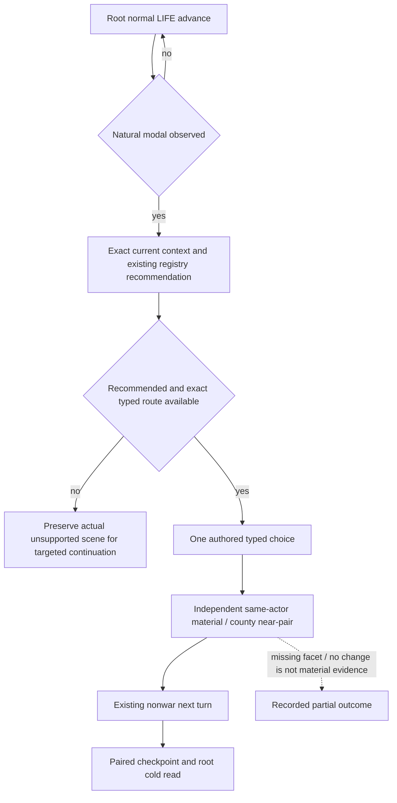

# 1.20.0.2 自然事件 M2 执行适配

2026-10-01，本包状态为 **static-ready execution adapter**。它交付能由实机 owner 使用的事件消费入口，准备代理没有连接 CK3、pipe、UI 或 Steam。自然出现、实际选择、材料后置、下一正式 turn 和 checkpoint/cold 都必须由 root 的真实 artifact 证明；本包不增加 G2 完成计分。

当前 exact build 为 `1.20.0.2 / Steam25588574`，EXE SHA-256 为 `AE1BA6FF060BA603842F6F4A2DED0AF4B7D3666B3DD271F75FB01B0DA8E81B2D`。输入复用冻结 L9/f54 的现有 event context、registry、typed selector、material reader/observer；root R10 从角色 `29829`、raw date `53169360` 的真实 checkpoint 继续普通时间推进。这里不制造事件，不调用控制台或 visual button。

## 可执行入口

外部包位于 `Z:\ck3_mod_rewrite\artifacts\g2-offline-2026-10-01\m2-natural-live-next`。

`natural_event_adapter.py` 默认只读。root 的当前 stdio plan 必须含 `argv`，使用当前 source tree、state、pipe 和已有 lifecycle 配置：

```powershell
& Z:\ck3_mod_rewrite\tools\.venv\Scripts\python.exe `
  Z:\ck3_mod_rewrite\artifacts\g2-offline-2026-10-01\m2-natural-live-next\natural_event_adapter.py `
  --source-tree <current-root-source-tree> --server-plan <current-MCP-plan.json> `
  --output <new-attempt-directory> --mode observe --expected-actor 29829
```

只读链为当前 paused snapshot → exact current-event context → 当前 build 的 registry knowledge / 原有 recommendation → exact advertised typed route。没有 modal 时保存 `no_natural_event_observed` 并返回，root 随即继续现有普通 LIFE advance；这不表示 unsupported、RED 或 M2 已完成。

自然事件匹配已有合同且原有 recommendation 为 `recommended` 后，root 可改用 `--mode resolve --checkpoint`。选择参数保持 authored native index 加一；rendered index 只用于展示，不能当作按钮号。选择后另外取实际 paused snapshot，读取同角色材料并确认旧 instance 已前进。每个原始 SDK packet、当前 context、recommendation、选择和独立后置都保存到新 attempt 目录。`--cold-restore` 是明确的 root 执行选项，调用现有 managed-session restore，不另起未管理的游戏进程。

server 的相关已有只读旗标是 `--private-player-epidemic-treatment-presence-query` 和 `--private-player-epidemic-recovery-query`。现有 `native-auto-run` 的 `.0110` 正式 before/after 旗标为 `--allow-private-epidemic-recovery-near-pair`。

## 同一个 owner 的消费接口

主模块还导出以下 async seam，供 nonwar dispatcher 使用已经拥有的 service/driver：

```python
result = await consume_natural_event_service(
    service, output_directory,
    source_tree=current_source_tree,
    mode="resolve",
    expected_actor=29829,
)
```

它不新建 pipe、MCP server 或游戏 session；receipt 明确是已有 service 返回值，不冒称 SDK packet。它只使用现有事件专用 recommendation，不调用 `plan_turn`、`auto_turn` 或战争 planner。返回 `event_instance_advanced`、`same_actor_and_date`、`independent_material`、`recovery_material` 与原始 receipt 路径，供同 owner 的下一回合继续消费。

root 的 nonwar dispatcher 已提供 `run_nonwar_turn(driver,service,domains,allow_submit=...,allow_advance=...)` 和 `run_normal_advance_turn(driver,service,allow_advance=...)`。独立 SDK 会话需要先退出，再执行其一回合 CLI：

```powershell
& Z:\ck3_mod_rewrite\tools\.venv\Scripts\python.exe `
  Z:\ck3_mod_rewrite\artifacts\g2-offline-2026-10-01\root-nonwar-live-next\run_nonwar_ooda.py `
  --mcp-plan <current-MCP-plan.json> --output-dir <new-next-turn-directory> `
  --mode run --advance-only --max-turns 1 --max-advance-calls 1
```

这是一回合现有 adaptive LIFE advance，实际可能推进 1/7/30 天，不能称为固定推进一天。它保留正式 checkpoint/full history。事件模块的 `--next-turn` 只记录这份交接，不调用会重新规划全域动作的 `ck3_auto_turn`。下一回合及 cold artifact 要确认旧 instance 没有再选择；ACK 或文件存在不能替代这些结果。

## 本次真实消费缺口

| 分支 | 当前结论与消费 |
| --- | --- |
| `.1100/.5007/.1190` | current registry 与原有 policy 可复用；五种合法投影 / 20 项只读消费验证通过。`.5007` 稀疏投影仍选择 authored3/native2；`.1190` 原有 prestige material 已 ready。`.1100` 没有可比较材料时只记合法通知处理，不补成材料 GREEN。 |
| `.1007/.0030` | current migrated profile 的 `observable_postcondition=null` 使原有 material plan 返回 `None`。外部 `health_stress_material_adapter.py` 通过当前选中项的原生 stress 或 combined-primary stress facet，以及独立同角色 paused snapshot 比较压力组件。facet 缺失时只记 observed delta，不编造 authored 数值或完整 fulfillment 效用。 |
| `health.1101` | 康复 effect 在 immediate，按钮仅 acknowledgement；不能把确认点击或顺带压力变化当作健康材料成功。 |
| `.0110` authored3/native2 | `recovery-material_adapter.py` 复用原有正式 near-pair observer。先读原生 county IDs 和 legitimacy，选择后按冻结 full IDs 读取同日 minor/tiny county modifiers；duration renewal 与未观测 legitimacy delta 不补写。 |

旧 `run_registered_event_material_live_acceptance.py` / horizon runner 依赖的 base 仍冻结 `1.19.0.6` 身份，并从旧 checkpoint replay context。不能只改 build 字符串就在当前实机使用。本包直接消费当前 session 的真实读取与既有 consumer，不调用该旧 cold runner。



## 验证和证据边界

只有新接口做了必要验证：recovery async facade 路由一次 GREEN；health/stress 八项窄夹具 GREEN；原有 registry/formal event 消费五种投影 20 项 GREEN；主 SDK 路由四项及新增同 owner typed-argument seam 一项 GREEN。root 要求去掉全域 turn dispatch 后仅重验受影响的主路由。测试 envelope/框架快照明确为 synthetic，原生 county payload 使用已冻结实际 bytes；不称实际 native caller 或自然 live。

没有重跑已通过的 provider、SDK payload、ABI 或旧整仓测试。没有修改 shared bridge/server/transport、registry policy 或生产默认开关；共享 Python 的后续接线由 `g2_python_routes` 独占。每个 helper、proof 和 source/doc 的 SHA、独占路径与日周报告字段在 `m2-natural-live-next/delivery-result.json` 中。

自然 production-loop 的剩余交付是两种不同真实场景的 context → 现有选择语义 → 一次 typed action → 独立材料变化 → 下一正式 nonwar turn → paired checkpoint/cold artifact。component static-ready 与合法关闭通知均不替代这个结果。
