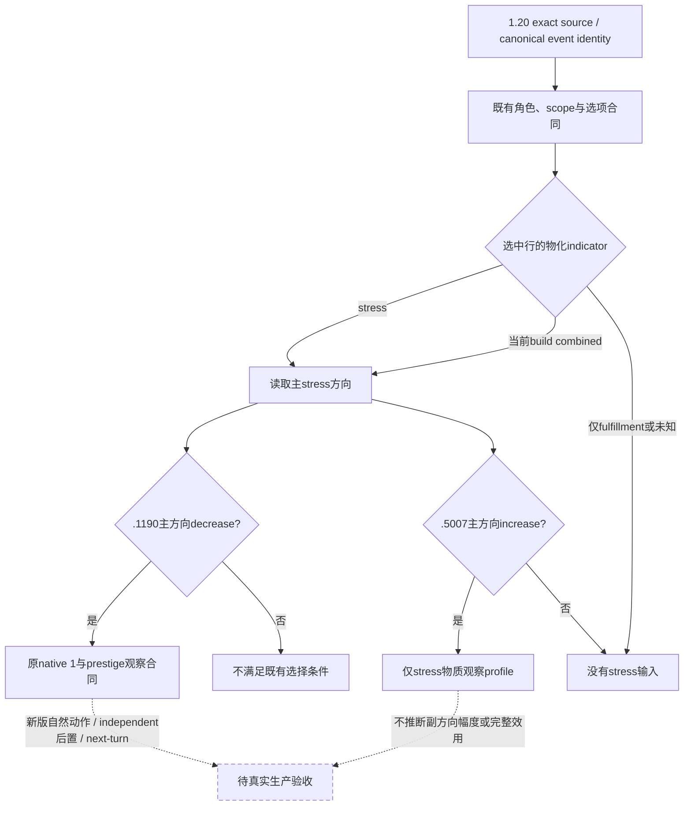

# 1.20.0.2 六项非战争事件源与 combined indicator 消费修复

2026-10-01，六个独立源码工作包并行复用既有迁移账本，最高资格为 `static-ready`。绑定 CK3 `1.20.0.2 Crozier / Steam25588574`，EXE SHA-256 `AE1BA6FF060BA603842F6F4A2DED0AF4B7D3666B3DD271F75FB01B0DA8E81B2D`。本包没有访问 CK3 进程、管道、桌面或存档。用户已恢复宗教研究并暂停战争研究，本包只闭合这六个非战争事件实际需要的输入。

| 事件 | 实际新源码与复用结论 | 尚未闭合的新版实机材料 |
|---|---|---|
| [医师 `.1000`](event12002_physician_epidemic_events_1000.md) | 两处压力 helper 改为 stress/fulfillment；既有四 scope 与 native 1 有限继续复用。rivalry helper 的绑定重构另列精确边界 | 治疗修正的 1.20 provider、医师/反对者关系、自然动作前后 |
| [疫情 `.1100`](event12002_epidemic_events_1100.md) | 三 option 同加 fulfillment 损失：apocalyptic 请求 -20、major -10、其余 -5，含 playable 与两种豁免条件；native 0 输入不变 | 实际 clamp、豁免判定与独立 fulfillment 差值 |
| [草药师 `.5007`](event12002_epidemic_events_5007.md) | trigger 改用 Rite 犯罪/美德判定；immediate 随机 accuser 不重做该过滤。native 2 的编号、角色与其他动作保留 | stress 之外的 fulfillment、opinion、relationship；自然生产后置 |
| [疫后 `.0110`](event12002_epidemic_events_0110.md) | 复用已有十三块、七回调及 optional-capital/legitimacy 审阅；native 2 有限继续保持 | 旧县修正 provider 的 1.20 list/title/modifier ABI、同日县修正与 legitimacy |
| [康复 `health.1101`](event12002_health_1101.md) | 事件与九个直接依赖、两条排程分支不变；两种精确 scope 消费复用。恢复效果发生在 immediate，native 0 为 tooltip-only | 新版自然通知投影、唯一 typed 确认、独立窗口缺席、下一 turn |
| [夜间 `.1190`](event12002_tgp_japan_yearly_events_1190.md) | 三处 helper 改名；既有 native 1、-75 prestige 与其他直接输入保留。新旧 `major_stress_impact_loss` 都为 -65，旧资料的 -80 已纠正 | 新版自然 source-bound native 1、独立 prestige 后置、下一 turn |

旧 R0085–R0100 的 RED 和旧版 GREEN 均保留；当前 source compatibility 仍是 192 项有限继续契约，不能写成 192 个新版本 live。G2 仍为 **3/8**，本包不增加游戏日或整代资格。

## 实际消费故障与最小修复

[新版窗口 reader](event-window-context-1.20.0.2.md)已证明 `stress_and_fulfillment` 的主方向是 stress，副方向是 fulfillment；该形状也有 attempt09 的真实 fixture-live 证据。当前窄消费者仍只筛选 `kind=stress`。同一既有 `.1190` context 换为当前 build 后，stress 行得到推荐，真实新版 combined 行却因 `r0100_selected_stress_decrease_indicator` 阻断；`.5007` 的相同过滤还丢失已有 stress 物质观察 profile。

生产 policy 现让这两个窄分支读取当前 combined 行的主 stress 方向。`.1190` 仍须主方向 decrease，仍选 native 1；`.5007` 仍只以主方向 increase 构建 stress 观察 profile。副方向不参与 stress 判断，旧版不接纳新的 combined kind，fulfillment-only 行也不提供 stress 输入。`complete_effect_set=false` 与未观测的 fulfillment/opinion/relationship 边界保持；这次修复没有增加完整效用预测或新的动作。

## 验证与冻结证据

只运行受影响的 meaningful 用例：五个新增 combined 用例与原 `.1190` 五个用例，共 **10 passed、5 subtests passed**。另冻结真实生产函数的 before/after 结果：`.1190` combined 从 blocked 变 recommended；`.5007` 从无 profile 变为 `selected-option-stress-facet-only`。这些是确定性生产路径回放，不是自然事件实机动作。

- 首个 RED：[combined-consumer-red.json](Z:/ck3_mod_rewrite/artifacts/g2-offline-2026-10-01/events12002/combined-consumer-red.json)，SHA-256 `9383CBFC129A9E6CD81664C80842EA554BEBE28C574ECCFF5D0E1DBB41748E02`。
- before/after：[combined-production-before-after.json](Z:/ck3_mod_rewrite/artifacts/g2-offline-2026-10-01/events12002/combined-production-before-after.json)，SHA-256 `468A88A14F571F0360CB2D5E9C8511DA0AD054E620FF04D1D3F6DDBDA87BCE2F`。
- 受影响测试：[combined-policy-test-result.json](Z:/ck3_mod_rewrite/artifacts/g2-offline-2026-10-01/events12002/combined-policy-test-result.json)。测试没有触碰 CK3。
- 三项 source commentary 修正及既有生成器再生成：[source-commentary-corrections.json](Z:/ck3_mod_rewrite/artifacts/g2-offline-2026-10-01/events12002/source-commentary-corrections.json)。新的 compatibility dataset SHA-256 为 `CC285AFD964FFE36489822CF43C997ED6F1037BB8731DF14E1A9DB4ADFABB126`，文件 SHA-256 为 `F412FD45107EA6177998180B4372F6826D4F37E55DF3B72F81C2391004FEC444`；原 [初次迁移](ck3-1.20.0.2-nonwar-events.md) receipt 仍是历史基线，未改写。

六个子包的 source proof、失败 attempt、精确 source path/hash 与日报/周报字段统一列入 [delivery-result.json](Z:/ck3_mod_rewrite/artifacts/g2-offline-2026-10-01/events12002/delivery-result.json)。缺失的 treatment/county provider 是下一项可施工入口；原 near-pair Python observer 可以复用。由协调者按实际 source/build 冻结与自然场景安排实机，不强制触发事件、不另挂自然阳性等待 worker。
