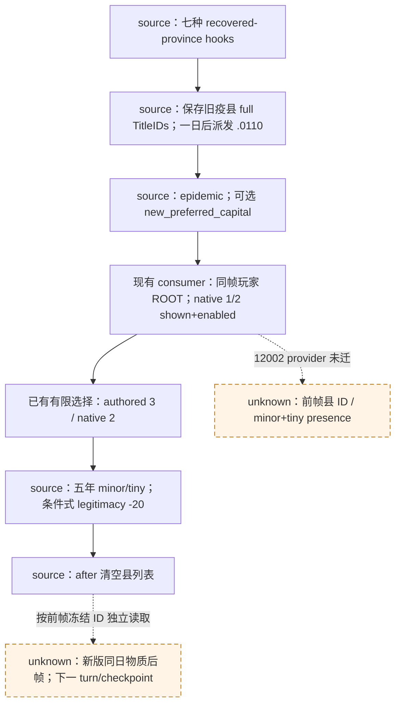

# CK3 1.20.0.2 `epidemic_events.0110`：来源复用与物质输入缺口

资格：事件来源及现有有限继续消费者 **`static-ready`**；新版县修正 provider **迁移待施工**；新版自然同日 pre/action/post/下一 turn **未验收**。本次只索引已证明的源码变化和真实生产输入依赖，没有修改策略、注册表、bridge 或运行 CK3。G2 仍为 3/8。

绑定 `1.20.0.2 Crozier / steam25588574`，EXE SHA-256 `AE1BA6FF060BA603842F6F4A2DED0AF4B7D3666B3DD271F75FB01B0DA8E81B2D`。复用[新版非战争事件账本](ck3-1.20.0.2-nonwar-events.md)、[原 `.0110` 消费与 R0099/R0101](epidemic-events-0110-recovery.md)、[旧县修正 ABI](m2-0110-county-modifier-observer-abi-2026-09-22.md)、[近邻库存](m2-0110-near-pair-inventory-2026-09-23.md)，不重做其已通过的十三个窄块、七个回调或 policy 矩阵。

## 已有来源树与真实变化

新版 `events/dlc/ce1/epidemic_events.txt:709–967` 文件 SHA-256 `A1CF48ABA07E121618F1190D5B8CF590D985FCA5A32DFF16D28F9A826FF0B950`；事件块 SHA-256 `F4F6EF48C1C8AD6AD9D59E14F7668C31E6F8B55563E809D9DA997462C2FEE7CA`；ordered-token SHA-256 `7EE9CB6DDFA34EA81F9FC928E36AEEABEB273458BAB0D432297EF7CD613FA68A`。现有 review 已闭合：

- 七种疫病 `on_province_recovered` → `plague_recovery_event_effect` 在领主的 `formerly_infected_counties` 保存恢复县完整 title identity，一日后派发事件；`after` 仍清空列表。
- 新首都候选增加 landless-type title 排除，`title_capital_county =` 改为 `?=`；`new_preferred_capital` 仍可缺省。现有 optional-scope 消费已经修好 R0099 的真实投影故障。
- authored 3/native 2 的县效果未变：重大及以上疫情给五年 minor（`development_growth=2`），否则给五年 tiny（`=1`）；不扣金币、不迁都。
- 正统性由内联 `has_legitimacy` 改走 `add_legitimacy_effect` / `is_valid_for_legitimacy_change`。`miniscule_legitimacy_loss=-20` 未变，但新 wrapper 要求仍在世、已落地的统治者、有王朝、伯爵或以上，且非共和国／神权政府；因此不能断言无条件 `-20`。



## 可复用消费者与尚缺原生输入

[同日 formal observer](../../ck3_autonomous_player/src/xar_autoplayer/epidemic_recovery_formal_observer.py) 和[私有 transport](../../ck3_autonomous_player/src/xar_autoplayer/bridge/epidemic_recovery_private_transport.py)已实现动作前冻结、动作后显式 title 查询，无需新 policy。有限选择仍只支持既有 native `(1,2)` 形状；本次不开放未单独验收的 `(0,1,2)`。

| 消费阶段 | 必需的实际输入 | 当前施工结论 |
| --- | --- | --- |
| 正式选择 | 新版 event provenance；同 paused 帧玩家 ROOT、instance、`epidemic` 与可选首都；shown/enabled native 1/2 | source migration 和现有 consumer 可复用；新版自然弹窗未验 |
| 动作前 | `formerly_infected_counties` 完整 generation TitleIDs；每县 minor/tiny presence；同角色 `player_legitimacy_v1` Q100000 | Python 钩子已有；县 list/presence native provider 仍为旧 ABI |
| 动作后 | 更晚但同日／同 episode／同 CharacterID paused revision；旧 instance 消失；按前帧 ID 查询县 presence 和 legitimacy | 显式 ID 模式已有；须接入实际 12002 provider 才能验收 |
| 后续消费 | 下一正式 turn、合法 save/driver 配对 | 等待自然现场；历史十五日差值不能补证 |

实际旧 provider [player_epidemic_recovery_v1.cpp](../../ck3_autonomous_player/native_bridge/src/player_epidemic_recovery_v1.cpp) 的注释、十个地址常量及布局均绑定旧 EXE `2D00FF31…F83DB86`：variable context `0x3329A40`、title store `0x570C410`、county presence getter `0x1942CB0`，并核对 Character `+0x18`、title `+0x10`、title definition `+0x160`。当前 bridge 的 CE1 selector 仍创建旧 `BindCurrentProcess(true)`／旧 environment；[旧 mailbox](../../ck3_autonomous_player/native_bridge/src/player_epidemic_recovery_v1_mailbox.cpp)执行旧 `ReadSnapshot`。`RegisterNonwarMailboxExecutorsV1` 尚无 12002 CE1 替代 callback。这是生产输入尚未迁移的源证据，没有声称已在新版运行或观察到故障。

可直接复用已迁的[通用 variable bindings](../../ck3_autonomous_player/native_bridge/include/xar_bridge/ck3_12002_phase_definitions.hpp)：context `0x370EB10`、identifier table `0x3F8A800`、lookup `0x3F8A680`、name `0x3F8A6F0`。它们只证明 identifier/context，不能由此认定旧 list 行布局或县修正 getter 正确。下一工作包应冻结实际 12002 list/full-title identity、modifier 定义库与 county-presence getter，绑定现有 query 的 list／explicit-title 两模式和新版 owner mailbox，并核新版 `player_legitimacy_v1` 实值。无需新增策略或理论门禁。

`remaining_days` 继续明确 unavailable；已有修正的前后 presence 都为 true 时不能证明续期。R0101 自然动作及 instance 消失仍只保留旧 build 资格；R0113–R0116 的 `283→263` 相隔十五游戏日，不是新版同日独占归因。新版自然 `.0110` 出现后按既有有限合同读取 pre → 一次合法 typed option → 独立同日 post → 下一 turn/checkpoint；不重放旧随机时间线凑场景。

## 本次一次性验证与可再生成证据

[索引脚本](../../ck3_autonomous_player/native_bridge/research/event12002_epidemic_events_0110.py)只读取既有 compatibility ledger，保留十三块／七 hooks 的原始定义指纹，并检查本冻结局部树实际存在的七个来源文件 SHA 全部匹配。局部树缺 `06_ce1_modifiers.txt`、`06_ce1_epidemics_values.txt`；两项明确复用此前审阅指纹，没有伪称本轮重新读取。旧 provider 常量与当前共享 variable bindings一并落盘，没有重跑已通过的 policy/ABI 测试。

[source-handoff.json](<Z:/ck3_mod_rewrite/artifacts/g2-offline-2026-10-01/events12002/epidemic0110/source-handoff.json>) SHA-256 `A309F7E552A24E7442354CDF9C03368900AEA6AAAB0708EA0CE1B419795B6F03`，记录精确源码、输入、历史资格及 provider 缺口；命令：

```text
python ck3_autonomous_player/native_bridge/research/event12002_epidemic_events_0110.py --repo <g2src> --game-root <frozen installation/game> --output <artifact/source-handoff.json>
```
