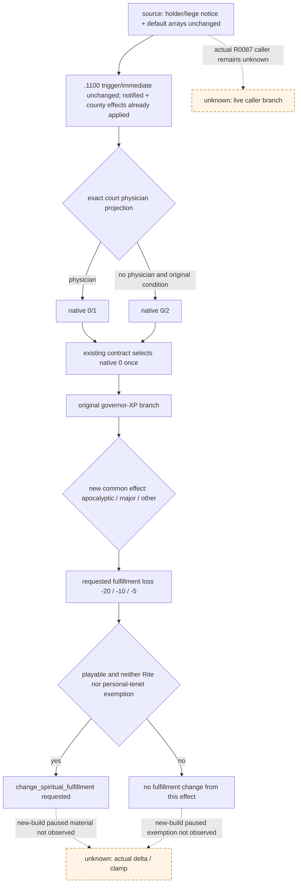

# `epidemic_events.1100`：1.20.0.2 通知合同迁移

本次为 **static-ready 源码合同**。沿用[原 R0087 专题](epidemic-events-1100-outbreak-notice.md)的 native `0` bounded continuation；不新增政策、registry、ABI 或测试门禁。新版三项共同新增精神满足度损失，现已按直接原版 effect 解析，不能继续描述为只有治理经验成本。没有新版 paused/action/material 实证，R0087 原自然 RED 与 G2 credit 不变。

## 构建与一次验证

冻结 CK3 `1.20.0.2 Crozier / Steam25588574`，EXE SHA-256 `AE1BA6FF060BA603842F6F4A2DED0AF4B7D3666B3DD271F75FB01B0DA8E81B2D`。只读取冻结安装的原版文本，没有接触 CK3、进程、pipe、UI 或 Steam。旧源来自保留的 `1.19.0.6_20260604/game`。复用既有兼容账本和 R0087 失败，无重复 consumer 回归。

运行 `py ck3_autonomous_player/native_bridge/research/event12002_epidemic_events_1100.py` 的一次必要验证 **15/15 GREEN**。其[完整 source proof](Z:/ck3_mod_rewrite/artifacts/g2-offline-2026-10-01/events12002/epidemic1100/source-proof.json) SHA-256 为 `8B268D8AB8BD59320D6F51BA0C9E06DE315889F6F110CCEA9DC2FA307230791C`。token parser 复用现有 `ck3_12002_nonwar_event_sources.py`，保留顺序、重复字段、字符串和转义，只忽略空白及注释。

| 冻结原版文件 | SHA-256 |
| --- | --- |
| `events/dlc/ce1/epidemic_events.txt` | `A1CF48ABA07E121618F1190D5B8CF590D985FCA5A32DFF16D28F9A826FF0B950` |
| `common/scripted_effects/06_dlc_ce1_epidemics_effects.txt` | `559E5E7952A1B943D9059122ADC402993529891703B81048FA75A0475614F652` |
| `common/scripted_effects/06_dlc_ce1_legitimacy_effects.txt` | `B639D4E390CE033C6D92F6706C9B41EE30E142E8FB1925AB97A1B448EDBF5689` |
| `common/scripted_effects/07_dlc_ep3_scripted_effects.txt` | `210FBB62DED6E6E48EFBD144CF60E01B66B7711BF79914BA70D8A6B5D841C7E6` |
| `common/scripted_effects/pam_effects.txt` | `50B0EBEEAB835B98FC2A159BAA5806078D706B3F988ECB5A6C1E025C86465161` |
| `common/script_values/pam_values.txt` | `458D1BD882E8854005E3158339FCA343177CFF13EAC7F83CB5877A8A37171965` |
| `common/defines/00_defines.txt` | `8E430D77EB6E8767030F34B1C53D5DAE84277FB354BD73CC42F93DC500BE8982` |

## 实际变化与复用范围

事件新版位于 `epidemic_events.txt:4181–4474`，旧版 `:3624–3914`。旧/new ordered-token SHA 分别为 `EA364F7617FCD8E577A60EC3BFF74A35A829BFE62BCA9722D5DCAD77B13CB3DF` / `BEB8B2E3763BC99C42D43255F25491228B153D5FF8A88FACA051A1F2AC2DA44C`。唯一三处变化是在各 option 内加入相同的 `pam_epidemic_arrival_spiritual_fulfillment_loss_effect = yes`；trigger、immediate、scopes、显示条件、顺序与既有动作保留。

直接调用的 `notify_holders_and_above`（`:35–243`）、`add_plague_county_modifiers`（新版 `:716–863`）、`epidemic_outbreak_legitimacy_effect`（`:364–390`）、`increase_governance_effect`（`:3438–3481`）与两项默认 holder/liege 感染事件数组（defines `:1813–1814`）的 ordered tokens 均未变。这里没有把整份文件变化或词法 caller 候选当成实际运行入口证据，也没有继续展开它们的完整传递依赖。

`pam_effects.txt:12202–12214` 按 `scope:epidemic.outbreak_intensity` 选损失：apocalyptic `-20`、major `-10`、其余 `-5`，值由 `pam_values.txt:2177–2185` 的 `5/10/20 × -1` 直接定义。随后 `pam_effects.txt:12188–12199` 只在 root 为 playable character、当前 Rite 不含 `no_epidemic_fulfillment_loss_active`、且角色个人信条不含 `no_epidemic_fulfillment_loss_personal_active` 时调用 `change_spiritual_fulfillment`。这是脚本请求值，当前帧的豁免、引擎 clamp 及最终实际 delta 未实测。

三项具有相同新增成本，因此该变化不改变当前“只作通知续接、不另开医生链”的选择依据，也不要求为 native `0` 推荐额外增加宗教输入。native `0` 仍有原有 governor 条件 XP 成本；native `1` 仍调用医生并安排三日后的 `.1020`，native `2` 仍设置三十日求医标志并安排 `health.3001`。三项 `ai_chance.base=100` 相同，不能解释为原生 AI 唯一偏好。

## 精确消费者输入与待实机范围

继续复用 `records_embedded_a.py` 及 `policy.py` 的既有 option-variant consumer：exact definition key；单一窗口及 instance；ROOT/played Character；完整的三个 saved-scope 名/类型 `epidemic:epidemic`、`province:province`、`infected_county:landed_title`；snapshot authored count `3`；实际两行各自 shown/enabled 与唯一 native `0`；物化索引只能是 `[0,1]` 或 `[0,2]`。三项非 Character identity 在 R0087 仍 opaque，不为推荐猜测或伪造。

如果验收新增精神满足度结果，需要同一角色的前后 `spiritual_fulfillment_raw`（[当前 religion context](ck3-1.20.0.2-religion-context.md)，`raw_scale=100000`）以及同一 outbreak intensity、playability、当前 Rite 参数和个人信条豁免判定。当前 religion provider 只提供满足度与身份，没有发布后四项实际判定；完整数值归因仍待必要只读原生观测，不能只凭 tags、faith/main Rite、ACK 或事件消失补成物质结果。这是物质验收依赖，不新增通知 B0 推荐门禁。

新版下一步沿现有正式路线：自然 `.1100` 真实 paused projection → 单次 typed native `0` → 独立 old-instance 消失及任何已可读的物质结果 → 下一 turn 不重复选择 → checkpoint/cold。县 modifier 与 notified 已由 immediate 改变，须独立观察同一 outbreak 才能称疫情物质证据；不能把本次静态 proof 或通知关闭计为 G2-M2 完成。共享 analysis / compatibility 的旧 owner-deferred 和 governor-only 说明由事件父任务统一修正，既有失败证据不改。
