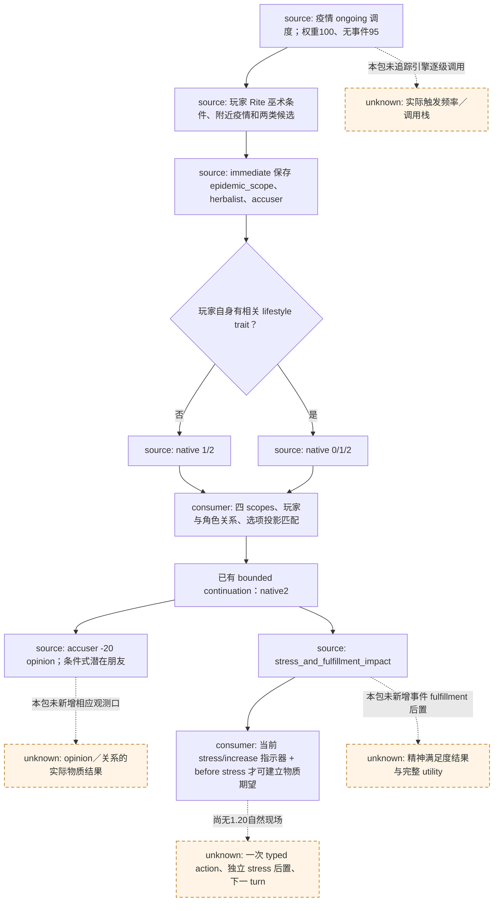

# CK3 1.20.0.2：`epidemic_events.5007` 草药师巫术控诉的源码迁移

2026-10-01，状态 **static-ready**。现有专用消费者可以复用，**不需要生产代码修改**。本次只读取冻结原版脚本、旧版对照及当前消费者，运行一次窄源码提取和 current-build stress profile probe；没有 CK3、命名管道、桌面、动作或新实机证据。[旧版 R0092 专题](epidemic-events-5007-herbalist-accusation.md)保留原资格，自然事件 material RED 仍 OPEN。

项目所有者 2026-10-02 已全面开放宗教研究与实现。此历史源码包记录事件所需的 Rite 条件及 fulfillment 变化，保留原 `static-ready` 边界；转换、改革或其他宗教策略尚未由此包实现，后续可从各自原生最终判定与只读查询链施工。历史迁移账本中的 `owner-deferred` 文字不再构成现行限制。

## Exact build 与源码身份

| 项目 | 身份 |
| --- | --- |
| 当前游戏 | `1.20.0.2 Crozier / Steam25588574` |
| 当前 EXE SHA-256 | `AE1BA6FF060BA603842F6F4A2DED0AF4B7D3666B3DD271F75FB01B0DA8E81B2D` |
| 新事件 | `events/dlc/ce1/epidemic_events.txt:7295–7532`；文件 SHA-256 `A1CF48ABA07E121618F1190D5B8CF590D985FCA5A32DFF16D28F9A826FF0B950` |
| 旧事件 | `1.19.0.6`，同文件 `:6722–6959`；文件 SHA-256 `FEF2972BD4F778818CD3A414C337D036F5132C1598FEBAB0E2623E0252DB7A1E` |
| 新事件 ordered tokens SHA-256 | `0DA1168B1925072B1E81B2203BDE9506230C13D6857B7841421B8EBF895F0912`，550 tokens |
| 旧事件 ordered tokens SHA-256 | `4785013464CD8D6EC9C899009B60AF9FFE66A4BDB5A96DFA33459CDA6EADC247`，550 tokens |
| 直接 caller | `common/on_action/ce1_on_actions.txt:1–26`，SHA-256 `96B42FA1A542836171A2A608B7155A8A80D30B0D8F8D9742EBE8AFF231B85E16`；新旧整文件字节相同 |

事件、关系 trigger、宗教 trigger 与压力值取自 `artifacts/migrations/2026-09-30/post-update-1.20.0.2/installation/game`。该快照没有 `ce1_on_actions.txt`，caller 单独取自本机安装目录 `Z:/SteamLibrary/steamapps/common/Crusader Kings III/game`，并核对到迁移 source-index 所记录的同一哈希；机器 proof 明确保留这个来源差别。旧源码取自 `Z:/Crusader Kings III/Crusader Kings III_1.19.0.6_20260604/game`。

机器证据：[source-proof.json](Z:/ck3_mod_rewrite/artifacts/g2-offline-2026-10-01/events12002/epidemic5007/source-proof.json)，SHA-256 `1A40C87AA767A47B0FC1A3666B798EFA996B4D3CF9DD49E0D608CEDC1F71BC93`。它复核既有 compatibility 表的精确 definition/hash，而没有再执行 195 事件矩阵。

## 已证明的变化与原生树

原 `epidemic_ongoing_events.random_events` 保留 `chance_of_no_event=95` 与本事件权重 `100`；事件自己的十年 cooldown 也未变。这是脚本调度表，不是逐级引擎调用或实际发生频率的实机证明。

只改变四个顶层字段：`trigger` 和三个 `option`。`trigger` 中巫术条件从 `trait_is_shunned_or_criminal_in_faith_trigger / FAITH / root.faith / this.faith / trait_is_virtue` 改为对应的 `...in_rite_trigger / RITE / root.rite / this.rite / trait_is_virtue_rite`。新 scripted wrapper 位于 `00_religious_triggers.txt:539–544`，对 witch 的直接分支分别调用 `rite_has_parameter=witchcraft_illegal`（`:434–435`）或 `witchcraft_shunned`（`:499–500`）。此文件 SHA-256 `7DD3803989DFFBA22FDBF46CEE084F68F29DDB9A32F90893726F6E5D311DD6F8`。本包不重写 native `trait_is_virtue_rite` 判定。

trigger 先要求玩家可用、巫术为 criminal/shunned 且不是 Rite virtue、领内附近存在疫情，存在健康成年且没有 witch 的草药师/神秘主义者/医师/园丁，以及另一名健康成年 AI 控诉者候选。**控诉者的 Rite 条件只出现在 trigger 的存在性检查中**；`:7409–7415` 的 immediate 随机采样只再检查健康成年、AI、与已选 herbalist 不同。这与旧版相同，不能把 trigger 的存在性条件转述成最终 `scope:accuser` 的已证明属性。

`immediate` 的 ordered tokens 完全不变：保存附近的 `epidemic_scope`、`herbalist`、`accuser`；原 caller 继承 `epidemic`。所需四个 scope 的名称和类型、三个 authored 选项的名称/顺序与原生索引未变。native 0 仍只有玩家自己持有相关 lifestyle trait 时显示；选项中的 `trait = lifestyle_*` 是关联标签，不能解释为取得 trait。

| Native option | 新版 authored 效果 | 迁移差异 |
| --- | --- | --- |
| `0 / .a` | herbalist 对玩家 grateful `+40`，条件式 miniscule legitimacy gain，性格相关压力 | 只替换 stress operation；显示 trigger、AI chance 与其他选项 tokens 不变 |
| `1 / .b` | medium piety gain，herbalist 获得 witch 并经合法囚禁 effect，accuser 对玩家 pleased `+40`，性格相关压力 | 只替换 stress operation；本消费者不选择这条路线 |
| `2 / .c` | accuser 对玩家 annoyed `-20`；允许时设置 herbalist 为潜在朋友；性格相关压力 | 只替换 `stress_impact` 为 `stress_and_fulfillment_impact`；其他 tokens 不变 |

所选 native 2 的 `can_set_relation_potential_friend_trigger` 与它直接调用的 `can_set_relation_friend_trigger`（`00_relation_triggers.txt:9–22`）新旧 ordered tokens 相同：尚无 potential-friend，并排除自身、friend、best-friend、rival 和 nemesis。当前文件 SHA-256 `973ED236B5544F56D20D11FF8F2A183527438C32E30FF973FAE54B39AC2DEF44`。这里证明条件未变，不代表 relation 必然发生或已观测。

native 2 的 impatient/callous/sadistic 使用 `minor_stress_impact_gain=20`，patient/compassionate 使用 `miniscule_stress_impact_loss=-5`；两项 value 新旧 tokens 相同，当前 `00_stress_values.txt` SHA-256 `821A0B77244FC5EE2D87D339CB24DBEF00787B83D44EC2DF9215FC1A93AEC2D4`。多个 trait 可以抵消，原生 effect 还可能调整精神满足度；实际 stress 数值不得直接套用 authored 常量。[已有 stress/fulfillment 原生效果证据](event-stress-and-fulfillment-1.20.0.2-source-review.md)继续复用。

## 精确消费者输入与复用边界

当前链为 [current-build knowledge 迁移](../../ck3_autonomous_player/src/xar_autoplayer/vanilla_events/migration_1_20_0_2.py) → [registry contract](../../ck3_autonomous_player/src/xar_autoplayer/vanilla_events/records_embedded_b.py) → [专用 policy](../../ck3_autonomous_player/src/xar_autoplayer/vanilla_events/policy.py) → [material comparator](../../ck3_autonomous_player/src/xar_autoplayer/vanilla_events/outcome.py)。旧合同中的示例人物被运行时玩家绑定替换，不能硬编码 R0092 的玩家或 accuser/herbalist ID。

| 输入 | 当前消费者要求 |
| --- | --- |
| 当前定义/版本 | `epidemic_events.5007`，current-build provenance，精确已审 source body；definition review 包含 `dynamic_stress_indicator_profile` |
| ROOT 与 scope | 本帧运行时玩家；`epidemic`、`epidemic_scope` 均为 epidemic，`herbalist`、`accuser` 均为 character；完整四 scope；两角色均非玩家且互异 |
| 显示选项 | 单一当前窗口，authored count `3`，原生投影恰好 `[1,2]` 或 `[0,1,2]`；native `2` 唯一且 shown/enabled |
| 物质期望入口 | current coverage `played-character-event-icon-indicators-1.20.0.2-v1`；不完整效果集合；筛出的一行 stress 精确为 increase、trait-affected、幅度 unavailable，并有可读的玩家起始 stress |
| 后置比较 | 同玩家、不同独立 paused snapshot、更大的 revision；实际 stress 严格增加，零或负增量不能关闭此门 |

单次 current-build direct-profile probe 证明既有生产函数仍生成 `selected-option-stress-facet-only`，并明确 `complete_effect_set=false`、未观测域为 spiritual fulfillment/opinion/relationship。这是 synthetic 输入下的已有代码接线证明，未执行 action，也没有关闭 R0092 material RED；未重复原 44 项 normal/`-O` 消费者矩阵。

原自然失败是 R0092 的 `registered_contract_requires_extended_consumer`，专用 variant/角色关系准入及 stress 比较器早已修复。迁移不需再改 policy/registry/ABI/MCP。下一次自然出现时，由实机责任人验证本帧精确投影、只提交一次 typed native 2、独立物质后置及下一 turn；没有自然阳性时不要专门反复等待 RNG。当前 script/source 证明不能代替这些结果，也不增加 G2、持久游戏日或 OODA 资格。

再生成入口：[窄 proof 提取器](../../ck3_autonomous_player/native_bridge/research/event12002_epidemic_events_5007.py)，`--output-dir` 指向新的 artifact 目录即可；输出显式记录 caller 快照缺口、实际来源和各依赖哈希。
