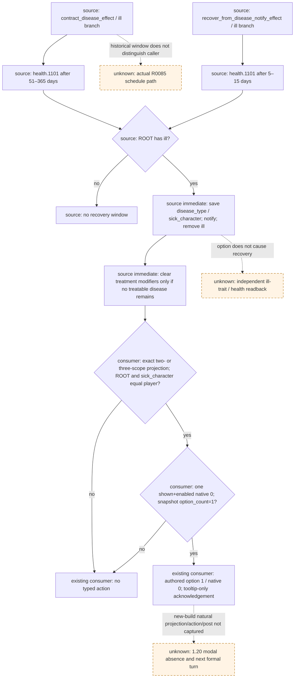

# `health.1101`：1.20.0.2 源码迁移与现有消费者复用

本次对照确认：事件 body、九个必要直接 effect / trigger / value 块、两个 `ill` 排程分支的 ordered tokens 均未变。现有精确 saved-scope 消费者可以继续用于新版有界通知确认，无需修改 policy、registry 或 native ABI。资格为 **`static-ready`**；本包没有操作 CK3，也没有新增自然事件实机证据。

## Exact build 与源码身份

当前 CK3 `1.20.0.2 Crozier / Steam25588574`，冻结 EXE SHA-256 `AE1BA6FF060BA603842F6F4A2DED0AF4B7D3666B3DD271F75FB01B0DA8E81B2D`。旧对照是 `1.19.0.6 / Steam23530548`，EXE SHA-256 `2D00FF3101EF70B566F2FCBAE292F09263199C80E9DC8F139B82D7D96F83DB86`。事件和直接 effect 文件身份先与[既有迁移数据](../../ck3_autonomous_player/src/xar_autoplayer/vanilla_events/data/source_compatibility_1_20_0_2.json)核对，再对本次必要块做一次窄比较；没有重复跑整库迁移审计。

| 当前原版文件 | SHA-256 |
| --- | --- |
| `events/health_events.txt` | `74073E049A416C744B36A2A996FA467610705E38D53C836B050F1AC6F66E1212` |
| `common/scripted_effects/20_health_effects.txt` | `ABEFA738C913C660A52FA747BCC92FCA2F57D77A0F47D903BEDC2882F3D5A9DB` |
| `common/scripted_triggers/20_health_triggers.txt` | `2846F0591E692814A907BB111C161BB8124798AF5A972BD2D3344DE69799C883` |
| `common/script_values/10_health_values.txt` | `787D22ED5A482E2ABAF5BD6F7A4A2EF257F77FC3B0636104108A62020FB7E90A` |
| `common/script_values/00_basic_values.txt` | `C379CC0C58ED1574033F0E07A58697DFC6F8475C26AA4B117F2332008D4A27EF` |

完整新旧文件 SHA、块 SHA、token SHA、行号及空 diff 保存在[源码证明 JSON](../../ck3_autonomous_player/native_bridge/research/event12002_health_1101.json)。事件在旧版 `4250–4283`、新版 `4248–4281`，两者 block SHA 为 `14C0762A1ED697A0C8BB96D22E04BB3D5442E3E0A6CCF1F78182563FE9E17169`，89 个 ordered tokens 的 SHA 为 `215BB71C1E8C6CFDE801BA839ABE943651358F5DC0AD8D2C36B118BAFA720019`。文件整体变化没有改变该事件。

## 当前 source tree 与直接依赖

| 必要块或分支 | 1.20.0.2 行号 | 对照结果与作用 |
| --- | --- | --- |
| `health.1101` | `health_events.txt:4248–4281` | 完全相同；trigger 要求 ROOT 有 `ill`；没有 authored `ai_chance` |
| `contract_disease_effect` 的 `ill` 分支 | `20_health_effects.txt:303–309` | 分支完全相同；`disease_type=flag:ill` 时排程 `.1101` |
| `minimum_recovery_time / ill_recovery_min / ill_recovery_max` | `10_health_values.txt:23/25/26` | 完全相同；`minimum_recovery_time=51`，`ill_recovery_min` 引用该值，max 为 `365` |
| `recover_from_disease_notify_effect` | `20_health_effects.txt:917–959`，ill 分支 `923–926` | 完全相同；另一直接排程为 `5–15` 日；本次不确定历史实际 caller |
| `recover_from_disease_effect` | `20_health_effects.txt:719–912` | 完全相同；保存 `disease_type`，确有疾病时保存 `sick_character`，先处理通知，随后移除该 trait |
| `inform_about_relative_recovery_trigger` | `20_health_triggers.txt:813–832` | 完全相同；恢复通知的直接资格条件，不从本窗口推断具体通知接收者 |
| `death_chance_dying_health` | `00_basic_values.txt:1543` | 完全相同，值 `1.5`；直接恢复 effect 的通知危险度条件 |
| `remove_disease_treatment_effect` | `20_health_effects.txt:3694–3709` | 完全相同；仅在没有其他可治疗疾病时清理六种 treatment modifier |
| `has_treatable_disease_trigger` | `20_health_triggers.txt:574–590` | 完全相同；上述 treatment 清理的 OR 条件，包含 `ill` 及其它疾病 |

`health.1101` 的 `immediate` 隐藏执行 `recover_from_disease_effect = { DISEASE = ill }` 与治疗清理。唯一 option `health.1101.a` 只在 `show_as_tooltip` 内写 `remove_trait_force_tooltip = ill`，选项提交没有额外恢复、费用、stress 或 fulfillment 操作。`ill` 移除发生在显示窗口之前；其它疾病仍存在时，治疗 modifier 可以保留。

比较范围止于表中事件、直接 helper、排程和必要条件/数值，不宣称完整疾病系统、通知的全部传递依赖或 exact-build native 执行链已经复验。该范围已经足以回答现有单选确认消费者是否需要新增输入。

## 精确消费者输入与复用入口

现有合同在 [records_manager_a.py](../../ck3_autonomous_player/src/xar_autoplayer/vanilla_events/records_manager_a.py)，由 [policy.py](../../ck3_autonomous_player/src/xar_autoplayer/vanilla_events/policy.py) 的专用 direct scope variant 路径校验，再由 [migration_1_20_0_2.py](../../ck3_autonomous_player/src/xar_autoplayer/vanilla_events/migration_1_20_0_2.py)选择新版 source-bound 合同。现有 `test_health_1101_policy.py` 已包含两种 scope 形状及关系/选项漂移；本次语义不变，不重复运行这些旧测试，也不新增镜像测试。

当前消费者仍需要同帧实例、日期/native revision、玩家 Character、ROOT/saved scope typed identity、当前 shown/enabled option 与 snapshot 的 active event/option count。它只接受：

- 三 scope：`physician` 与 `sick_character` 是 Character，`disease_type` 是 flag；ROOT=`sick_character`=当前玩家，`physician` 必须是另一 Character。
- 两 scope：只含 `sick_character` 与 `disease_type`，关系同上，不要求或伪造 physician。
- 唯一 rendered/native `0` shown+enabled、snapshot option count 为 `1`，提交 authored option `1`。其它 scope 库存、关系或选项投影仍交回现有未匹配路径。

`disease_type` 的 flag payload 仍可保持 opaque；专用事件 source 已绑定 `ill`，不从 `null` 推断 flag identity。上述输入不因本次版本变化增加。没有将角色 trait 的原生编号 `109` 固定为新版身份，也没有用 tooltip 图标证明真实恢复收益。

## 历史证据与新版后续

[R0085/R0086 专题](health-1101-ill-recovery.md)保留实际 `1.19.0.6` 身份。R0085 自然 paused 帧 instance `17` 未提交动作，原 direct consumer 因扩展字段准入返回 `registered_contract_requires_extended_consumer`；raw report SHA `500EACF9BCDC43375EE2EDF27D0AF61E436EDBDB5DCE5652B5DC3825CEBFC14D`。R0086 通过正式连续运行自然重现、唯一 typed 选项、独立下一 paused instance `17→null` 与下一正式 turn 无重提；evidence-manifest SHA `B4044ABAB75ACB8540B441C6BDB503BB8A65E1BD8A36DDF578DEA2EC2D2BB677`。该 GREEN 只证明旧版 modal continuity，没有独立 `ill` trait 或健康增益读回。

本次 source 比较 receipt 位于 `Z:/ck3_mod_rewrite/artifacts/g2-offline-2026-10-01/events12002/health1101/source-comparison-receipt.json`，10 个块和 2 个 ill 分支通过；生成脚本与 proof/dataset SHA 都在 receipt。首轮 helper 把 `death_chance_dying_health` 定义误定位到 `10_health_values.txt`，产生 **harness RED**；实际定义在 `00_basic_values.txt`，修正文件定位后本次比较通过。失败保存在同目录 `attempt-001-harness-red.json`，没有 capability RED、生产代码修复或游戏动作。

新版剩余验收在原普通罗贝尔 `29829` campaign 的正常继续过程中自然遇到 `.1101` 时采集：当前完整投影 → 一次现有 typed acknowledgement → 独立下一 paused instance 缺席 → 下一正式 turn 消费缺席。2026-10-03 已撤销仅非战争及战争暂停限制，战争与战斗研究、实现、策略和实机验收全面开放；该自然事件验收也可随战争期间的正常继续完成。实机保持原生 AI 研究优先、exact-build 绑定和最小化/noFocus，由 ROOT 单一 owner 操作。自然阳性未出现时不启动专门等待 worker；没有额外疾病收益主张。本包不增加 G2 credit、游戏日或 whole-campaign readiness。

可再生成入口为 [event12002_health_1101.py](../../ck3_autonomous_player/native_bridge/research/event12002_health_1101.py)，参数是 `--old-game-root`、`--new-game-root`、`--source-root`、`--output` 和 `--artifact-dir`；旧 game root 是 `Z:/Crusader Kings III/Crusader Kings III_1.19.0.6_20260604/game`，新 game root 是冻结 `artifacts/migrations/2026-09-30/post-update-1.20.0.2/installation/game`。
