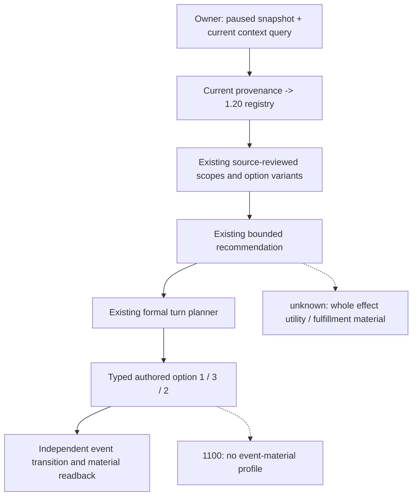

# CK3 1.20.0.2 自然事件：现有注册策略与 typed consumer 复用

2026-10-01，绑定 CK3 `1.20.0.2` / EXE SHA-256
`AE1BA6FF060BA603842F6F4A2DED0AF4B7D3666B3DD271F75FB01B0DA8E81B2D`。
本工作包只分析保存的 JSON 和已有消费者；未访问 CK3、进程、pipe、UI 或 Steam。

## 可以立即复用的生产路径

三个事件在当前生产 registry/policy/turn planner 中均能消费当前构建。
无需修改 `CK3_BUILD`、shared policy、registry、contract 或 source-hash 门。
新增 [只读保存帧适配器](../../ck3_autonomous_player/native_bridge/research/event12002_natural_policy_reuse.py)
仅调用这些现有 API，并返回现有 formal plan 允许的 typed 参数；它不发送任何查询或动作。

| 事件 | 现有 shown-native 投影 | typed authored number / native index | 当前物质后置 |
| --- | --- | --- | --- |
| `epidemic_events.1100` | `[0,1]` 或 `[0,2]` | `1 / 0` | 无 event-material profile；选项可继续通知，不能记为疫情物质成功 |
| `epidemic_events.5007` | `[1,2]` 或 `[0,1,2]` | `3 / 2` | 当前 primary stress increase 指标绑定玩家压力严格增加 |
| `tgp_japan_yearly_events.1190` | `[0,1,2]` | `2 / 1` | 当前 primary stress decrease 指标，加同帧威望至少 `7,500,000` raw；验证威望严格减少 |

`.5007` 两行投影的所选 rendered index 是 `1`，仍必须提交 authored number `3`。
`GameplayBridgeService.select_event_option` 和公开 MCP `ck3_select_event_option`
接收 authored 1-based number，不接收 rendered index。

策略返回 `recommendation_scope=bounded_timeline_continuation`、
`native_ai_equivalent=false`、`semantic_optimal=false`。这些是已有有限续接策略的资格，
当前 registry 没有为本三项提供全效果最优分数；这里不添加新的质量门。

## 版本与 source-hash 判定

- [builds.py](../../ck3_autonomous_player/src/xar_autoplayer/vanilla_events/builds.py)
  的 `CURRENT_CK3_BUILD` 已是 `1.20.0.2`。`event_context_build` 从
  `provenance.backend_id=ck3-1.20.0.2-native-event-window-v1` 识别当前构建。
- [event-window contract](../../ck3_autonomous_player/src/xar_autoplayer/bridge/event_window_context_contract.py)
  接受当前 exact provenance：root `module+0x5C6A520->+0x10`、idler `0x44BC408`、manager `+0x28`。
  正式 turn planner 的同帧恢复保留 provenance，并将 context 传入注册推荐。
- 历史 registry 默认 `EXACT_CK3_BUILD=1.19.0.6` 用于历史直接调用；公开 MCP knowledge
  默认已经是当前构建。直接 Python 调用可以明确传 `ck3_build="1.20.0.2"`。
- [migration](../../ck3_autonomous_player/src/xar_autoplayer/vanilla_events/migration_1_20_0_2.py)
  先应用 current source review，再将旧 source hash 留在 `legacy_source_sha256`。
  [policy](../../ck3_autonomous_player/src/xar_autoplayer/vanilla_events/policy.py) 的
  `_policy_source_hashes` 在已审阅兼容的迁移记录中取这个 legacy ledger，故旧 SHA literal
  不是拒绝当前构建的门。当前知识记录发布新 event/dependency hashes。
- 已有 `stress_and_fulfillment` primary stress consumer 修复直接复用；secondary direction
  不用于推断压力方向，也不用于推断完整 fulfillment 效用。

## 实机 owner 的直接调用

下面的代码使用 owner 已持有的 `service`。查询和 typed action 由 owner 执行；本包未执行。
把已有 session history 传入适配器，可保留正式 turn planner 的原有上下文。

```python
from xar_autoplayer.bridge.event_contract import action_step_set
# 将 research 目录加入 Python import path 后：
from event12002_natural_policy_reuse import inspect_saved_event

snapshot = service.snapshot()
capabilities = service.capabilities()
query = service.query_current_event_window_context_v1(
    snapshot["active_event"]["instance_id"],
    expected_revision=snapshot["revision"],
)
fresh_snapshot = service.snapshot()
actual_history = list(fresh_snapshot.get("history", []))
actual_history.extend(fresh_snapshot["native_command_history"])
analysis = inspect_saved_event(
    fresh_snapshot, query,
    action_steps=sorted(action_step_set(capabilities)),
    bridge_capabilities=capabilities.get("bridge_capabilities"),
    commands=actual_history,
)
# analysis 同时返回 registry_decision、formal_plan、typed_call。
if analysis["typed_call"] is not None:
    receipt = service.select_event_option(**analysis["typed_call"]["arguments"])
```

公开只读入口是 `ck3_query_current_event_window_context_v1(event_instance_id, expected_revision)`；
公开 typed 入口是 `ck3_select_event_option(option_number, event_instance_id, expected_revision)`。
knowledge 可直接调用
`query_vanilla_event_knowledge_v1(event_key, "1.20.0.2")`，推荐可直接调用
`recommend_registered_vanilla_event_option_v1(context, played_character_id=actor,
snapshot_option_count=authored_count, ck3_build="1.20.0.2")`。
正式动作使用 `choose_one_life_turn` 生成的 plan，保留既有物质输入要求。
query receipt 的 `current_event_window_context` 是推荐输入，`queried_revision`
是相应 typed 参数；不要用陈旧 query 代替当前帧。

只读 CLI 使用保存的 service JSON：

```cmd
Z:\ck3_mod_rewrite\tools\.venv\Scripts\python.exe Z:\ck3_mod_rewrite\.task-tmp\g2src\ck3_autonomous_player\native_bridge\research\event12002_natural_policy_reuse.py --snapshot SNAPSHOT.json --query-result QUERY-RESULT.json --capabilities CAPABILITIES.json --commands HISTORY.json --output ANALYSIS.json
```

`--commands HISTORY.json` 必须是实机 owner 保存的真实 command rows。
分析器原样传给正式 planner，不创建或补写 query history。输出只写分析结果和待提交参数。
ACK 不替代独立事件离场、压力/威望后置、下一 turn 或规定的 cold 恢复。



## 现有未支持范围和实际分工

| 范围 | 当前行为与原因 | 继续入口 |
| --- | --- | --- |
| `.1100` 本三 scope 或两种互斥投影以外的帧 | 现有 contract 不消费；不是旧 R0087 的变体缺口重现 | 保存实际 current query 后针对真实新投影审阅 |
| `.1100` fulfillment 物质变化 | 通知后置没有 event-material profile；不能由 option ACK 宣称 fulfillment/疫情成功 | 使用真实独立观测；本包不补全效果预测 |
| `.5007` 所选项没有当前 primary stress increase facet，或缺玩家同帧压力 | registry 可保留续接推荐，但既有 formal M2 material gate 不产生动作 | `r0092_material_stress_observation_unavailable`；需要实际当前 facet/压力输入 |
| `.5007` herbalist/accuser 角色不明、等于玩家或互相相同，或投影以外的帧 | 既有关系/variant contract 不匹配 | 保存实际失败帧；旧 R0092 专用消费者已经复用 |
| `.1190` 所选 stress primary 增加、缺失、仅 fulfillment，或非现有 decrease shape | policy 返回 `r0100_selected_stress_decrease_indicator` 失败 | 真实 trait 分支的另一路 policy 尚未实现；不重走造成旧 R0100 压力 0→80 的 generic native0 |
| `.1190` 同帧威望缺失、scale 不对或小于 75 | 既有 formal gate 返回 `r0100_prestige_budget_or_observation_unavailable` | 当前资源观测/预算；此包不新增替代路线 |
| 三项完整 fulfillment/opinion/relationship/councillor/dread 效用 | 现有策略仅覆盖已列独立 facet，未宣称全效果最优 | 按实际游戏价值另行施工；不是本包的动作前附加门 |
| `.1007` / `.0030` migration profile 后置为空 | review ledger 的 `analysis_updates.selected_choice_effect_profile.observable_postcondition=null` 直接替换旧 profile，非 policy 主动删除 | health owner 已交独立 current primary stress + actual before/after 适配器，本包未重复实现或验证 |

## 一次离线验证与 readiness

[verification.json](Z:/ck3_mod_rewrite/artifacts/g2-offline-2026-10-01/m2-natural-live-next/event-policy-reuse/verification.json)
记录五种投影、20/20 GREEN：current knowledge → current policy → 未改正式
`choose_one_life_turn` → 正确 authored typed 参数。其中 `.5007` 两行投影仍选 `3/2`，
压力后置 ready；`.1190` 威望后置 ready；`.1100` 保持没有 material profile。
首轮 GREEN 收到实机 owner 的真实 history 输入要求后，只改此新适配器为不补写 query row，
必要复验仍是五种投影、20/20 GREEN；首轮 artifact 保存在 `verification-001.json`。
验证直接复用已有历史 scope/option fixtures，将其重投影为当前严格 wire context，
没有执行旧 combined-stress 测试矩阵，也没有把 fixture 记为 current live。

新增源码最高 `static-ready`；生产 shared 文件无需本包改动。
下一步由实机 owner 在自然事件出现后调用上述 API，保存实际 query、typed receipt、
独立 material、下一 turn 与规定 cold evidence。未新增 G2-M2 credit。
