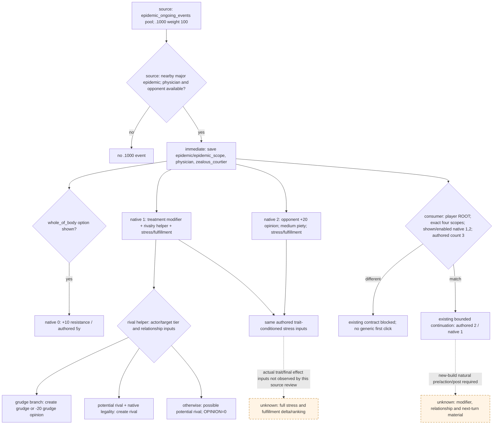

# 1.20.0.2 `physician_epidemic_events.1000`：医师抗疫争议源码迁移

2026-10-01。当前结论是 **source-reviewed / bounded consumer static-ready**：复用既有新版 registry 消费契约，没有修改 policy、registry 或生产 ABI，没有新增实机资格。当时项目所有者已允许宗教研究、停止战争研究；本专题只追踪该医师事件的直接输入与实际新增 fulfillment 后果。2026-10-03 旧战争研究停止限制已撤销，项目所有者已全面授权战争与战斗的研究、原生观测、实现、策略及实机执行；这一授权不改变本专题的 source-reviewed/static-ready 证据范围。

游戏冻结为 CK3 **1.20.0.2 Crozier / Steam build 25588574**，EXE SHA-256 `AE1BA6FF060BA603842F6F4A2DED0AF4B7D3666B3DD271F75FB01B0DA8E81B2D`。旧 R0089 属于 1.19.0.6，不能换版本号当作新版 live。旧记录见 [事件树](physician-epidemic-events-1000.md)与[固定修正 presence](physician-epidemic-modifier-presence-v1.md)；已经完成的通用迁移见 [1.20 非战争事件](ck3-1.20.0.2-nonwar-events.md)。

## 实际差异与复用结论

事件仍在 `events/dlc/ce1/physician_epidemic_events.txt:8–171`。完整文件新 SHA-256 `A32E442328BDA1849535A666060D5A3011CC3D80A634E78C81B1CD01669092D4`，旧为 `51ADEEA52F9A93406156ABAFA6608B0425003F63098F0CB033A5CB515C90F493`。事件 ordered-token hash 从 `E02E433B4D0886F7D3C6713D08A0C7EC494D6901EE4176E9EF7772044256130B` 变为 `38824AD7FB82FC50C45073954200607454FC8DD50F758620798789DF11575960`。

事件 body 只有两处操作名替换：native 1／`.b` 与 native 2／`.c` 的 `stress_impact` 变为 `stress_and_fulfillment_impact`。trigger、immediate、cooldown、选项名称／顺序、native 0 的 `whole_of_body` 条件、抗疫修正、`.c` 的好感／虔诚及三个 `ai_chance` 块的 ordered tokens 保持不变。

已经存在的 [compatibility review](../../ck3_autonomous_player/src/xar_autoplayer/vanilla_events/data/source_compatibility_reviews_1_20_0_2.json)将本项记录为 `stress-application-refactor`、`current-source-reviewed-bounded-continuation`、`policy_contract_compatible=true`。本次核对实际原版事件与当前 compatibility 的定义、token 差异完全相同，直接复用这个结论；没有重复跑旧 consumer 矩阵。

新效果的语义来自冻结 EXE 内原生文档，见 [stress／fulfillment 原生效果边界](event-stress-and-fulfillment-1.20.0.2-source-review.md)：保持 base 与匹配 trait 的 stress 输入求和，同时依据角色 trait 行为及 sinful／virtuous 分类调整 spiritual fulfillment。**authored stress 输入相同，不代表完整后果或选项质量相同。**

本轮新核对的九个直接 block 中，七个 ordered-token 不变：

| 直接输入 | 新版位置 | 结论 |
| --- | --- | --- |
| `epidemic_ongoing_events` | `common/on_action/ce1_on_actions.txt:1–106`，`.1000` lexical candidate 在 35 | block 与整文件不变；weight 100、`chance_of_no_event=95` 保留。不据此宣称一次实际 RNG 或完整调度调用链已互证 |
| `get_random_nearby_realm_epidemic` | `common/scripted_effects/06_dlc_ce1_epidemics_effects.txt:372–439` | block 不变；整文件 SHA 已改变，不能用整文件差异否定这个直接 block |
| `ce1_non_heretical_solution` | `common/modifiers/06_ce1_modifiers.txt:891–894` | `epidemic_resistance=10` 不变 |
| `ce1_unorthodox_epidemic_treatment` | 同文件 896–900 | `epidemic_resistance=10`、`zealot_opinion=-10` 不变 |
| medium／minor stress gain、minor loss | `common/script_values/00_stress_values.txt:27–32` 中对应条目 | 事件所用三个常量不变；实际 stress 净变化仍依赖角色／运行时 |

修正文件 SHA-256 仍为 `63FEB33C8C5BF825E3D186E841D07235C98D6AED27C47375E495EA832255C52B`，on-action 文件仍为 `96B42FA1A542836171A2A608B7155A8A80D30B0D8F8D9742EBE8AFF231B85E16`。其余文件和各 block 的新旧完整 hash／行号见机器回执。

### 直接 rivalry helper 也发生了源码重构

`progress_towards_rival_effect` 从旧 `00_relation_effects.txt:205–430` 移至新版 `207–431`；新文件 SHA-256 `B4668EED284175E67FB7F4DF42D1B2007075DEE25C0F348823C87664545B1891`。入口新增 `$CHARACTER$ = { save_scope_as = target_char }`，后续目标访问统一改为 `scope:target_char`；首个有效目标的 `NOT { highest_held_title_tier <= tier_barony }` 改写为 `highest_held_title_tier > tier_barony`。去除该 binding 并还原这两个明确重构后，ordered tokens 与旧 block 相同。这个比较只适用于目标实际解析成功，不证明缺失目标或所有下层 relation trigger 的完整引擎等价。

本事件从 `scope:zealous_courtier` 调用此 helper，目标是 `scope:physician`、`REASON=rival_heretical_physician`、`OPINION=0`。它并不保证立刻建立完整 rivalry：

- 社会等级、家族／配偶／继承关系决定是否走 grudge 分支；已有 grudge 时加 `grudge_opinion=-20`。
- 已有 potential rival 且原生 `can_set_relation_rival_trigger` 满足时，设置 rival。
- 否则仅在原生允许时设置 potential rival；`OPINION=0` 跳过末尾 hate-opinion 的数值分支。

这些是医师与反对者之间的后果，不能用玩家好感字段替代，也不能把“推进关系”直接填成“已建立 rival”。下层 native relation 判定未在本次展开。

## 当前原版树与我方消费边界

三个 native AI `base=100` 不变；native 0 的 zeal／compassion／rationality 系数均为 `1`，native 1 为 `-1/1/-0.1`，native 2 为 `1/-1/0.1`。本专题没有读取同一实际角色帧的 AI 参数、有效 trait 宗教分类或最终权重，不声称复现原版 AI 最终选择。

消费者实际入口是 [records_physician_epidemic.py](../../ck3_autonomous_player/src/xar_autoplayer/vanilla_events/records_physician_epidemic.py)、[current-build adapter](../../ck3_autonomous_player/src/xar_autoplayer/vanilla_events/migration_1_20_0_2.py)和 [production policy](../../ck3_autonomous_player/src/xar_autoplayer/vanilla_events/policy.py)。语义选择必需输入为：当前玩家 ROOT 的 typed CharacterID；名称恰为 `epidemic/epidemic_scope/physician/zealous_courtier` 的四项 saved scopes；两项 epidemic 类型保持 opaque identity；两名 character 必须互异且均不是玩家；snapshot authored option count `3`；当前显示、启用的 native `(1,2)`；唯一当前事件窗及相同 paused revision/date。已有推荐是 authored `2`／native `1`，继续既有有界抗疫路线，不扩到新的投影。

## 独立后置所需观测，及现有 provider 的真实范围

| 后果／输入 | 已有实际来源 | 新版尚需闭合的项 |
| --- | --- | --- |
| 玩家治疗修正 presence | `player_epidemic_treatment_presence_v1.cpp` 的旧固定 key reader、旧 private transport | 仍为 `xar::ck3_11906` 和旧 lookup RVA／角色扩展 `+0x1A8`／modifier rows；bridge 仍通过旧 `BindCurrentProcess` 与旧 environment 绑定。脚本 hash 保持不能赋予该 ABI 新版资格。须迁移 definition lookup／角色 rows 并从新版同一 MCP 实际读回 |
| 玩家当前 stress | `ck3_12002_adapter.cpp` 调用 `ReadActorResourceBalances12002`，经 Snapshot 输出 `played_character.stress_points`；新 reader 的角色扩展为 `+0x1B0`，stress 在 extension `+0x2F8` | 这是独立当前计数；本事件选项的前后同帧／后一帧材料未采集，单个计数或 authored 输入不能证明精确因果 delta |
| 玩家当前 spiritual fulfillment | [新版 religion context](ck3-1.20.0.2-religion-context.md)，`GetSpiritualFulfillment=0x28BCE40`，signed Q100000；缺扩展由原生 default 求值 | 该域已有组件／实际 mailbox 静态证据，中央与 Python/MCP 接线／paused 资格由其 owner 继续收口。本事件需同玩家 before/after；不能把缺失扩展写成手工零。选项预测另需有效 trait 的 sinful／virtuous 分类 |
| 医师与反对者关系 | source 中 grudge／potential rival／rival 及各合法性分支 | 两个完整 CharacterID 的独立 before/after 关系读回；玩家 Snapshot 的家庭关系字段不是此查询 |
| 五年持续时间 | 原版 `years=5` | authored 五年，不是已测剩余时长；旧 presence DTO 的 `remaining_days` 明确 `duration_abi_not_verified` |
| 完整效果投影 | 新事件窗可保留 stress／fulfillment／组合 indicator | indicator 幅度不可用、`complete_effect_set=false`；不得用于声称完整后果预测 |

压力 Snapshot 与 fulfillment context 均可给独立当前材料；它们不补出抗疫修正，也不自动让本事件的 material observer 成为完整。现有旧 private selector `query-player-epidemic-treatment-presence-v1` 和 `allow_private_epidemic_treatment_presence_query` 继续保留原 ABI／默认关闭边界。本任务未开启它，也没有修改任何共享路由。

## R0089、验证与交付

R0089 manifest SHA-256 `79661336F22CEEA10A21FA41B84654BA86087EF44492CD1FFABE64ABD4E3C9FC`，ROOT `36403`、event instance `21`、date_raw `53350560`，医师 `50397184`、反对者 `33594572`。旧 generic 实际选 native 1，后一帧窗口消失；没有独立 modifier／stress／rivalry 材料。h411 是 post-generic 的物理配对 checkpoint，不能由这个事实升级正式 GREEN，更不能当作 1.20 的自然事件证据。

本轮机器回执：[source-review.json](Z:/ck3_mod_rewrite/artifacts/g2-offline-2026-10-01/events12002/physician1000/source-review.json)，SHA-256 `8316A04EB732C64B8FAECFB316250B5148525A6BF076A78C08560128EF2027D7`。可复跑的[窄 source reader](../../ck3_autonomous_player/native_bridge/research/event12002_physician_epidemic_events_1000.py)复用已有 ordered-token 提取器，仅检查本事件、九个直接 block、与已有 exact review 的一致性，以及 rivalry 重构边界。它不运行旧 consumer、游戏或 worker。

冻结 `A/installation/game` 为部分树；首次读取 caller 遇 `FileNotFoundError` 的 **harness RED** 保留在 `harness-attempt-001.json`。完成安装源为 `Z:/SteamLibrary/steamapps/common/Crusader Kings III/game`；读其事件／caller 前后与已有 compatibility hash 一致，不把缺少复制的文件当 capability RED。

当前可收口的是源码与精确消费者输入交接。新 natural paused 投影、一次 typed 选择、独立治疗修正与当前资源后置、下一 turn、规定 checkpoint／cold 仍待根代理实机；自然事件未出现时不专门挂长时间等待 worker。R0089 RED、G2-M2 及完整 OODA 资格不因这份 source 回执变化。生产 provider 迁移需由中央协调文件独占后施工。
