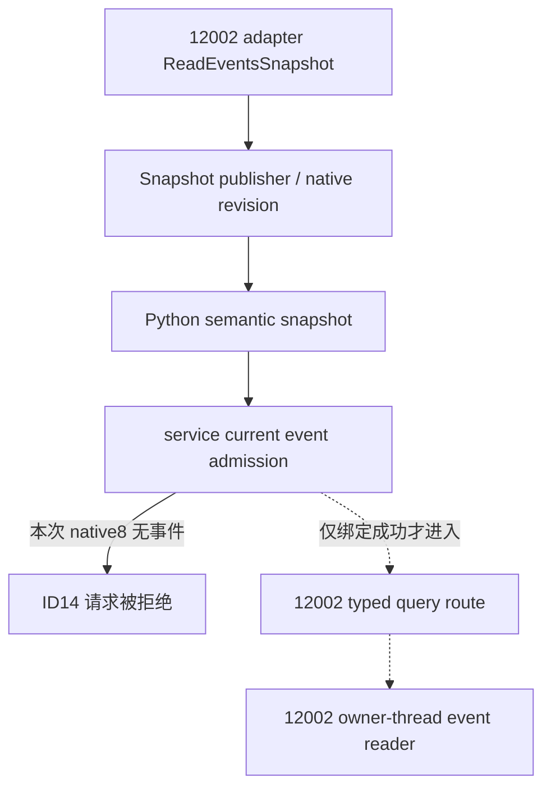

# R6：事件 14 查询入口与已保存快照

2026-10-01 的这次查询在 Python service 的当前事件绑定检查处结束，未进入原生事件窗口 reader。较早的 `native:5` 快照含 `event14`，随后 SDK 的三份 `native:8` 快照均为 `active_event=null`；它们的游戏日期同为 `53169336`。这证明保存材料之间存在发布时点差异，尚未定位较早事件观察的具体原因，不能据此判定原生 ABI、缓存实现或新旧回调混线。

本条复用[当前事件窗口专题](event-window-context-1.20.0.2.md)和[适配器组合说明](../ck3-1.20.0.2-adapter-composition.md)，不扩展事件 ABI，也没有访问进程、管道、游戏 UI 或启动/恢复游戏。[机器记录](../../ck3_autonomous_player/native_bridge/research/event12002_r6_event_adapter_saved_review.json)保存 11 个既有 artifact 的路径与 SHA-256，以及实际 R6 `g2live6` 源码的四组完整文件 pin 和相关代码段；同时列出候选 `g2src` 的哈希供中央接线时比较。

| 已保存材料 | Native frame | Public revision | active_event | 结果 |
|---|---:|---:|---|---|
| `construction-live-next/root-r6-fresh-material-01/snapshot-before.json` | 5 | 2 | ID 14，1 个选项 | 较早观察 |
| `targeted-sdk-r6/r6-current-event14-context-20261001T115859Z/001-ck3_take_snapshot.json` | 8 | 2 | null | SDK 查询前 |
| 同目录 `002-ck3_take_snapshot.json` | 8 | 2 | null | 第二份观察 |
| 同目录 `003-ck3_query_current_event_window_context_v1.json` | 未执行查询 | 请求 2 | 请求 ID 14 | `event instance ID does not match the active event` |
| 同目录 `004-ck3_take_snapshot.json` | 8 | 2 | null | SDK 查询后 |
| `construction-live-next/root-r6-fresh-material-02/summary.json` | 10 | 2 | — | root 只读 construction `material_source` |
| `targeted-sdk-r6/r6-crown-action-readonly-20261001T120433Z/result.json` | 11 | 2 | — | root LAW SDK 查询 `isError=false` |

最后两项解除当前 construction/LAW 查询阻点，未将失败的事件窗口 attempt 改写为正例。所有材料位于 `artifacts/g2-offline-2026-10-01/`；机器记录保留准确文件路径。此工作本身没有新 live 测试或能力完成计分。

## 已定位的代码路径

`ck3_12002_adapter.cpp:417` 绑定当前版本 `BindEventsImage`；`read_snapshot` 在局部 `Snapshot` 中调用当前版本 `ReadEventsSnapshot`，读取成功才将结果赋给输出。这里没有单独缓存事件字段。`bridge.cpp:4693–4709` 直接把 `has_active_event`、instance ID 和 option count 序列化成 `active_event`。

`bridge.cpp:10289–10332` 的 publisher 读取快照；读取失败时保留已有发布状态，相同完整快照及 checkpoint 序号时去重，变化时递增 native revision 并保存 `previous_snapshot`。连接服务使用 `WorkerState` 中的 revision 与 previous snapshot，heartbeat 路径再次调用 publisher。这说明 publisher 如何保留上一帧，不证明本次事件 14 的原因就是该保留路径。

Python `native_driver.py:863–868` 在 hello 时清空 semantic snapshot；`882–907` 将合法 `state_snapshot` 更新到当前 semantic snapshot。`1007–1034` 返回该对象，并把 Python public revision 与原生 frame revision 分别映射为 `revision`、`native_revision`。因此两个 artifact 的 public revision 都为 2，不等于二者观察了同一个 native frame。

`service.py:10277–10349` 先取当前 snapshot，验证暂停、public revision 和 native frame 元数据，再检查 `active_event.instance_id`。本次 ID 14 请求就在 `10327–10332` 被拒绝；后面的 `execute_step` 尚未执行。不能用这条 Python 错误反推原生 callback 的读取结果。

如果进入原生 route，`bridge.cpp:11414–11417` 会先按 adapter ID `ck3-1.20.0.2-msvc-x64` 选择 `RunTypedQuery12002`。它复用旧版稳定 step 名和纯请求 parser，将参数读为 expected native revision 与 event instance ID，然后在当前版本 callback `9858–9862` 调用 `ck3_12002::ReadEventWindowContextV1`。旧命名 parser 的复用不代表调用了旧版 native reader；本次 attempt 没有进入这段路径。



没有修改 producer、缓存、guard、schema 或策略，也没有新增或运行 fixture tests。具体初始 event14 的来源仍未定位；当前阻点已解除，按 root 指示在这里收口，不追加 ABI 逆向、VM_READ 或缓存审计。

保存材料提取命令如下；脚本只读现有文件，不发起游戏操作：

```python
import subprocess

subprocess.run(
    [
        r"Z:\ck3_mod_rewrite\tools\.venv\Scripts\python.exe",
        "ck3_autonomous_player/native_bridge/research/event12002_r6_event_adapter_saved_review.py",
        "--source-root", r"Z:\ck3_mod_rewrite\.task-tmp\g2live6",
        "--candidate-root", r"Z:\ck3_mod_rewrite\.task-tmp\g2src",
        "--artifact-root", r"Z:\ck3_mod_rewrite\artifacts\g2-offline-2026-10-01",
        "--output", "ck3_autonomous_player/native_bridge/research/event12002_r6_event_adapter_saved_review.json",
    ],
    check=True,
)
```
