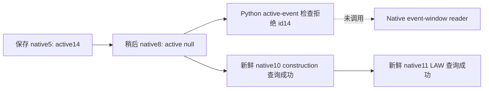

# R6 event 14：保存帧与当前 SDK 帧的时点差异

2026-10-01，本次窄排查仅读取 R6 已保存的 JSON、冻结工作树与磁盘 EXE。后续新鲜 construction 与 LAW 只读查询已成功，因而停止故障施工：R6-01 不足以证明事件 producer、事件窗 ABI 或实例绑定存在错误。没有修改生产代码、增加 gate/schema、执行 VM_READ、连接 pipe、操作 CK3 或运行新的实机测试。实际游戏操作均由协调者执行。

Exact build 为 CK3 `1.20.0.2 Crozier / Steam 25588574`，EXE SHA-256 `AE1BA6FF060BA603842F6F4A2DED0AF4B7D3666B3DD271F75FB01B0DA8E81B2D`。事件树与已验收布局复用[原生事件专题](events-and-interactions.md)、[当前事件窗迁移](event-window-context-1.20.0.2.md)及现有 `ck3_1_20_0_2_events.json`，不重新展开研究。

## 实际保存证据

统一 artifact 根目录为 `artifacts/g2-offline-2026-10-01/`。

| 保存响应 | public revision | native revision | date_raw | 实际内容 |
| --- | ---: | ---: | ---: | --- |
| `construction-live-next/root-r6-fresh-material-01/snapshot-before.json` | 2 | 5 | 53169336 | `paused=true`，`active_event.instance_id=14`、`option_count=1` |
| `targeted-sdk-r6/r6-current-event14-context-20261001T115859Z/001-ck3_take_snapshot.json` | 2 | 8 | 53169336 | `paused=true`，`active_event=null` |
| 同目录 `002-ck3_take_snapshot.json` 与 `004-ck3_take_snapshot.json` | 2 | 8 | 53169336 | 同样为 `active_event=null`；不当作三个独立原生帧 |
| 同目录 `003-ck3_query_current_event_window_context_v1.json` | 请求 2 | 未进入原生查询 | — | SDK `isError=true`：event instance ID does not match the active event |
| `construction-live-next/root-r6-fresh-material-02/received-command-results.json` | — | 10 | 53169336 | 完整 `command_result.ok=true`；world source `source_available`、989 definitions、390 final legality checks、64 native cost checks |
| `targeted-sdk-r6/r6-crown-action-readonly-20261001T120433Z/003-ck3_query_realm_law_crown_action_private_v1.json` | 查询 2 | 11 | 53169336 | SDK `isError=false`、`available=true`、`paused=true`，发布四项 crown-authority 原生合法性与资源成本 |

事件窗的这次错误在 Python service 的 snapshot active-event 检查阶段发生，尚未调用 native event-window reader。协调者提供的故障来源定位为 `service.py:10327–10332`。早期的 native 5 与随后 native 8 不是同一帧；相同 public revision、日期和暂停状态不能把早期 event 14 的存在证明移到后来的查询。当前保存材料只能确认事件 14 在后来的帧中已不再发布，不能区分其此前真实生命周期、restore attachment 或缓存来源的具体原因。

协调者报告同时保存的 `live-run-06/gui/20261001T115630965665Z.png` 为地图画面。该报告不提供与 native 5 同时刻的实例绑定，因此不用于认定“hidden/queued event 被误发为 active”。

## producer 的确切边界

冻结 `g2live6` 的 [ck3_12002_events.cpp](../../ck3_autonomous_player/native_bridge/src/ck3_12002_events.cpp) 在第 58 行调用 `get_current_event`；第 63–71 行读取返回的 ActiveEvent `+0x1B0` definition、`+0x1BC` instance 与 definition `+0x1AC` authored option count。第 172–174 行先重置 snapshot 事件字段，第 186–187 行填入本次读取结果。[bridge.cpp](../../ck3_autonomous_player/native_bridge/src/bridge.cpp) 第 4693–4703 行按这些 snapshot 字段序列化 `active_event`。因此该概要的选项数量来自 authored definition；它没有独立证明 GUI 窗口已经物化，序列化的默认 option label/enabled 也不是窗口选项状态观测。

现有 native getter `0x29C57A0` 使用 event manager `+0x1F18` pointer vector、`+0x1F24` count，倒序读取 ActiveEvent，检查 `+0x1B8` local recipient 与定义类型相关原生条件。它返回当前本地事件对象，不枚举 CEventWindow。GUI 物化是[当前事件窗 reader](event-window-context-1.20.0.2.md)另行核对的 Gfx idler、window manager vector 与 `CEventWindow+0xB8` 分支。此次所存响应没有成功请求 event 14 的原生窗口，故没有证据可把该分支标为 ABI RED。

construction 的 source 查询成功仍保留其自身 `checks_truncated=true / cost_ready=false / construction_action_ready=false`；LAW 是只读原语。本报告不把二者升级为完整动作或 G2 production loop。事件能力/readiness 不变。本轮只冻结证据，不继续 VM_READ、producer 修复或 ABI 审计。

机器摘要与逐文件 SHA-256 在 [event12002_r6_published_event_result.json](../../ck3_autonomous_player/native_bridge/research/event12002_r6_published_event_result.json)。原始 R6-01、SDK 错误及后续成功 artifact 均保留，日报/周报由协调者按本摘要合并；Git commit/push 同样由协调者统一执行。
