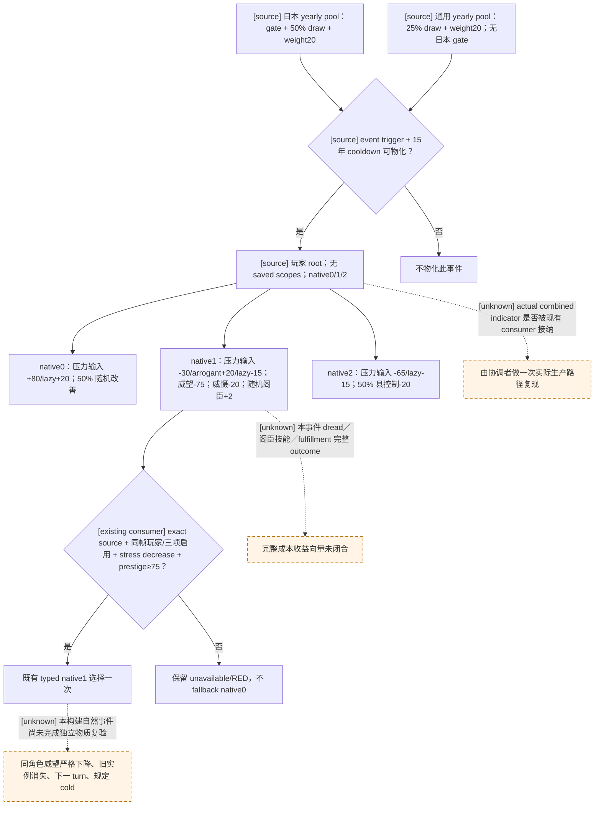

# CK3 1.20.0.2：日本年度事件 `.1190` 源迁移

2026-10-01。此项为 **research / source-confirmed**：一次磁盘源码对照已证明旧 native1 有界选择合同的输入可复用；没有新 paused/live、物质结果或 G2 credit。本次不修改策略、registry 或 native bridge，也不访问 CK3 进程、pipe 或 UI。旧自然 R0100 的损害 RED 继续保留，见[原事件专题](tgp-japan-yearly-1190-night-decisions.md)。

冻结新构建为 CK3 `1.20.0.2 Crozier / Steam25588574`，EXE SHA-256 `AE1BA6FF060BA603842F6F4A2DED0AF4B7D3666B3DD271F75FB01B0DA8E81B2D`。旧源来自 `Z:/Crusader Kings III/Crusader Kings III_1.19.0.6_20260604/game`；新源来自当前安装 `Z:/SteamLibrary/steamapps/common/Crusader Kings III/game`，event、yearly、basic/stress 文件哈希与已冻结的新 source index／原件一致。只读提取器和完整原始块位于 `ck3_autonomous_player/native_bridge/research/event12002_tgp_japan_yearly_events_1190_sources.py` 与同前缀 `source_review.json`；后者 SHA-256 为 `b3a33a31e264805b6f4e2766201fbc03437ae144ea518d48a6525622b52c54f4`，另复制到 `artifacts/g2-offline-2026-10-01/events12002/japan1190/source-proof.json`。

## 精确源与变动

| 相对 `game/` 的文件 | 1.19.0.6 SHA-256 | 1.20.0.2 SHA-256 |
| --- | --- | --- |
| `events/dlc/tgp/tgp_japan_yearly_events_ariana.txt` | `B9F5799465E9B83B16C97086BC74F43ECD3949680AE1A78C081ED44ECD9B5FD6` | `9472FA2899770851F8489F0DE57A50F5849DA0B13D8CAB61F24F47DC1212E4C1` |
| `common/on_action/dlc/tgp/tgp_japan_yearly_on_actions.txt` | `40D68D6306D3E180E40EFBC80D5879DA825AB111F7EC0870682AB414F2AD5FE4` | 相同 |
| `common/on_action/yearly_on_actions.txt` | `0FC85A284224A68D1CA0A4EF071D4F4A4F49896753AEC463975A12EE4E1116FA` | `14C97F3845138D74A2C2552C5DD3C95DE1DA035014A5CDF31C92540AAE3390FE` |
| `common/script_values/00_stress_values.txt` | `104A7EF94EE9DA1092F23AEB2FD9DC971B08C695415F3B7EBFB628F381D26395` | `821A0B77244FC5EE2D87D339CB24DBEF00787B83D44EC2DF9215FC1A93AEC2D4` |
| `common/script_values/00_basic_values.txt` | `9268A54F0E425D409D9D0F20D884E0A3D0A89DF85A0B6644D56133C0C4CB0096` | `C379CC0C58ED1574033F0E07A58697DFC6F8475C26AA4B117F2332008D4A27EF` |
| `common/script_values/00_county_control_values.txt` | `A1D06C795CBBE22E06889AD90012DDF0EC476BFFDE63BD5D163E9C3451255E65` | 相同 |

事件完整块从旧 `4701–4884` 移至新 `4708–4891`。忽略空白与注释后，只有三处 `stress_impact` → `stress_and_fulfillment_impact` 调用名称替换；其他有序 token 完全相同。选项身份、顺序、trigger、15 年 cooldown、weight multiplier、随机结果、AI 权重和 scope 均未变。事件没有 immediate、after 或 saved scope。

两条直接调用仍在：日本 TGP pool `tgp_japan_yearly_on_actions.txt:1–50` 完全不变，DLC 且日本 heritage／首都区域／政府 gate、`chance_to_happen=50`、事件权重 `20`；通用 `on_yearly_events` 从旧 `yearly_on_actions.txt:2933` 移至新 `3449`，pool 头仍为 `chance_to_happen=25` 和 `200=0`，`.1190` 的权重 `20` 从旧 `3797` 移至新 `4313`。通用 pool 不附加上述日本 gate，因此该事件仍可能出现在普通封建角色的自然 yearly 抽取中；此处没有计算整个 pool 的净出现概率。

新 event trigger `4748–4767` 为 DLC、有地、可用成年人、irritable／impatient／drunkard 或低 learning，排除 temperate／diligent／高 learning，并至少有一块非首都 county。weight multiplier `4769–4783` 为 base10，stress level≥1/2/3 分别追加5/10/15；这是抽取权重，不是选项效用。

| native option | 新 source 行与 authored 结果 | 原生 AI source |
| --- | --- | --- |
| `0` / `.a` | `4786–4819`：压力 base `+80`，lazy 项 `+20`；50% 获得 minor prestige，并按优先级移除 irritable／impatient／drunkard，或加5 learning | base100，`ai_rationality=1` 修正 |
| `1` / `.b` | `4822–4861`：压力 base `−30`，arrogant 项 `+20`、lazy 项 `−15`；随机一个存在的五类阁臣对应技能+2；root 保证 `minor_prestige_loss=−75`、`medium_dread_loss=−20` | base100，`ai_boldness=1` 修正 |
| `2` / `.c` | `4864–4890`：压力 base **`−65`**，lazy 项 `−15`；50% 随机非首都 county `medium_county_control_loss=−20` | base100，`ai_honor=1` 修正 |

直接数值已逐项核对：stress `27/29/32/33/34`、basic `727/1001/1012–1015` 和 county-control `7` 在两版都相同。特别是 `major_stress_impact_loss` 两版都为 **`−65`**；旧事件专题、record 与新版兼容账本写的 `−80` 是资料错误，不能描述成这次升级改变原版数值。native1 的 authored 项 `−30/+20/−15` 也不能独自证明实际玩家压力上升或精确净 delta；执行仍消费同帧 native direction，实际值受原生求值／修正／零下界影响。

`stress_and_fulfillment_impact` 的原生文档和第二域边界复用[既有 helper 研究](event-stress-and-fulfillment-1.20.0.2-source-review.md)，不重复逆向。其证据 `artifacts/nonwar-offline-1.20.0.2/events/stress-fulfillment-source-review.json` SHA-256 `486d54b7b22d66e4920ecc3004dcf9b2b279e04744aae8dc2294fb594833c6b3` 证明可选 base 与匹配 trait 项求和，同时可影响 spiritual fulfillment；不证明旧 stress-only 完整效果相等。宗教研究现已获所有者授权，但此事件没有已验收的 fulfillment 净变化或完整 utility。

## 决策树与消费者输入

现有 `records_tgp_japan_yearly.py` contract 固定 native `[0,1,2]`、选 authored2/native1、玩家 ROOT 与零 saved scope；新版 compatibility ledger 已绑定新 event SHA，保留 legacy source hash 作为旧窄合同的来源。`policy.py:1364` 后的 R0100 条件目前只接纳 `kind=stress`，新版分支也只保留 `stress` 行；[新版事件窗](event-window-context-1.20.0.2.md)提供的 combined 行则为 `kind=stress_and_fulfillment`，主 direction 是 stress、副 direction 是 fulfillment。此处只报告真实代码输入边界，由协调者统一复现及决定最小消费修复；不在本任务新增策略选择。

继续原 native1 路径所需输入为：同一构建/EXE/event source、实例 ID、snapshot revision/date、当前 played-character full ID 与 root、零 saved scope、严格三个 shown+enabled native indices、native1 的真实主 stress direction 和 trait/critical 状态、同帧 `played_character_prestige.raw/scale`（Q100000且不少于75）。现有正式策略与事件 receipt 需保留动作前后独立同角色威望；native1 的保证威望代价可复用，压力零变化不可冒充物质收益，ACK 不代替结果。

R0100 的旧自然结果是 actor36403 压力 `0→80`，旧实例消失且下一 turn 消费；其技术20/20 GREEN不能关闭损害 RED。新版本仍需自然或已声明 fixture 条件下的 paused 行与预算，再验 typed 选择、独立 material、next turn 与规定 cold。缺同帧 prestige／方向／合法选项时记录具体缺口；不要重复提交、不沿 native0 fallback，也不要用本次 source-proof 补成新版 live。
