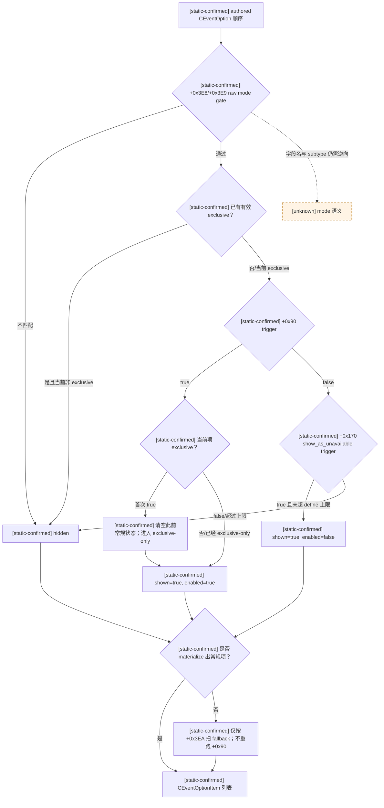
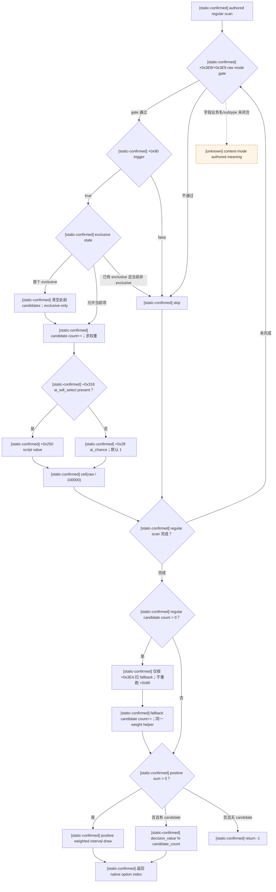
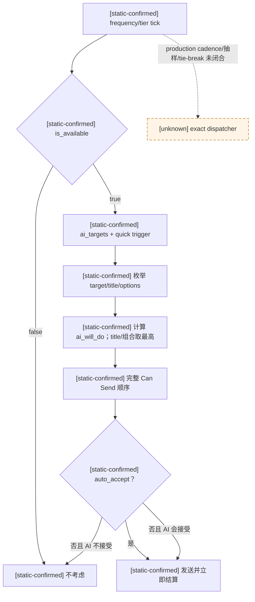
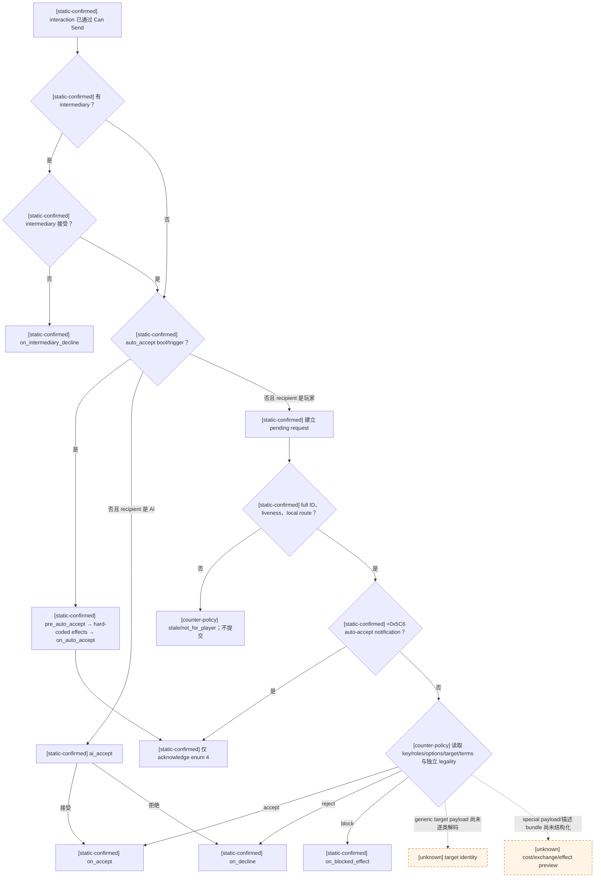

# CK3 1.19.0.6 原生事件与人物互动决策树

## 范围、版本与证据边界

- [static-confirmed] 本文只绑定 CK3 `1.19.0.6` 的
  `Crusader Kings III/binaries/ck3.exe`，SHA-256 为
  `2D00FF3101EF70B566F2FCBAE292F09263199C80E9DC8F139B82D7D96F83DB86`；所有 RVA 都以该 EXE
  模块基址为零点。
- [static-confirmed] 通用事件脚本契约来自 `game/events/_events.info`，SHA-256 为
  `DB52CE9B9D048C6DF7DD880E035C700046878BC9E829F82B8AF4C1CC6DEDE09B`。
- [static-confirmed] 通用人物互动契约来自
  `game/common/character_interactions/_character_interactions.info`，SHA-256 为
  `F360C05B72CD2B0D87885E570FA55E70E41089DEFB4675BE5A82E390940D5D10`；具体脚本例证使用
  `00_alliance.txt`，SHA-256 为
  `919ED408EC735F64ED972E23A376CD618A2E207A0EA273F973C5B1F89440E39D`。
- [static-confirmed] 人物互动过期 define 来自 `game/common/defines/00_defines.txt`，SHA-256 为
  `C1ECA141C71EC1E741CA5336E01BB538EEFAEC05B0684EDEC477CFC9053C3807`。
- [static-confirmed] `static-confirmed` 表示原版 `.info`/defines 直接声明，或 exact-build 反汇编闭合；
  `live-confirmed` 表示 production bridge 在真实 paused frame 中互证；`inference` 表示已证事实的策略解释；
  `unknown` 表示尚未闭合，Mermaid 中一律画成虚线。
- [owner-deferred] 项目所有者在 2026-08-26 明确暂缓宗教/信仰专项。本篇只研究所有事件与人物互动共用的
  引擎机制；在收到“可以开始宗教相关内容”的明确通知前，不追踪宗教事件、改宗、改革、教义、信条、热情或
  圣战互动的内容树，也不把该域记为完成。

本文区分三件事，避免再把一个裸命令冒充完整能力：

1. 原生 AI 如何筛选并评分事件选项或主动互动；
2. 当前玩家实际看见、能否点击、将执行什么；
3. 自动玩家是否已获得足够的只读语义来选择并验证结果。

## 事件选项的脚本契约

### 候选资格与显示规则

- [static-confirmed] 每个 `option` 的 `trigger` 决定该选项是否有效。
- [static-confirmed] 无效选项只有在 `show_as_unavailable` 成立时才可以显示为 disabled；显示数量还受
  `EVENT_OPTIONS_SHOWN_HIDE_UNAVAILABLE = 4` 约束。scheme preparation 使用独立上限 `8`。
- [static-confirmed] 如果至少一个有效选项标记 `exclusive = yes`，所有非 exclusive 选项都被忽略。
- [static-confirmed] `fallback = yes` 声明备用项。exact GUI 与 AI 的“没有常规项”门并不相同：GUI 检查常规
  materialized item count，AI 检查 regular candidate count；下文分别给出精确分支，不能合并成一句“没有有效项”。
- [static-confirmed] `is_cancel_option` 只给 controller/widget 标记返回或取消语义，不能据此推断收益为零。
- [static-confirmed] 事件生成后的选项有 `EVENT_OPTIONS_DISABLED_TIME = 0.5` 秒 UI 防误触时间；这是临时 UI
  click gate，不等于脚本 `trigger` 的长期合法性。

### exact-build `CEventWindowData::SetupOptions`

[static-confirmed] RTTI 中保留了完整函数签名
`SetupOptions@CEventWindowData(SPlayerEventData const&, GuiContextGUI*, int)`，其函数体为 RVA `0x16CC780`，
caller 为 `0x16CB782`。函数从 `SPlayerEventData+0x1B0 -> EventData+0x1B0/+0x1BC` 取得 authored-order
`CEventOption*` 数组和数量，为每个 native index 分配两个状态字节，然后执行下列筛选：

[static-confirmed] 先前候选 `0x167C220` 不是 `SetupOptions`，`0x167C0D7 -> 0x334C510` 也不是 option required-trigger
callsite；真正的 required-trigger callsite 是 `0x16CC94E -> 0x334C510`。这两个旧地址只保留为已排除的 false leads。

[static-confirmed] 机器可读范围、`.pdata` 边界及逐 span SHA-256 固定在
`ck3_autonomous_player/native_bridge/research/event_option_1_19_0_6_abi.json`，可用同目录
`verify_event_option_abi.py` 对冻结 EXE 做纯只读复验；它不启动或 attach CK3。

| exact-build 字段/入口 | 已闭合语义 |
|---|---|
| `CEventOption+0x10/+0x18/+0x1C` | dynamic option-name 候选向量的 data/capacity/count；resolver 为 `0x33E7FF0` |
| `CEventOption+0x28` | `ai_chance` scripted-modifier 子对象；其 base 在绝对 `+0x88`，constructor 默认 raw `100000`（语义 `1`） |
| `CEventOption+0x90` | required validity trigger；`0x16CC94E` 调 `0x334C510` |
| `CEventOption+0x170` | `show_as_unavailable` trigger；存在时由 `0x16CCA37` 调 `0x334C510` |
| `CEventOption+0x250` | `ai_will_select` script-value 子对象；绝对 `+0x318` 的非零/count gate 使它优先于 `ai_chance` |
| `CEventOption+0x358` | loaded effect；执行走 `0x3380410`，GUI preview/presentation 收集走 `0x3380170` |
| `CEventOption+0x3E8/+0x3E9` | raw context-mode discriminator/presence；与 `SPlayerEventData+0x1C0` 比较，业务名称仍 unknown |
| `CEventOption+0x3EA` | fallback marker；常规 materialized 列表为空后由 `0x16CCC11..0x16CCD3D` 扫描 |
| `CEventOption+0x3EB` | exclusive marker；第一个有效 exclusive 会清掉之前累计的常规状态，之后跳过非 exclusive |
| `CEventOption+0x3F0/+0x408/+0x420` | unlock-reason metadata arrays；逐数组业务名仍 unknown |
| `CEventOption+0x438` | `clicksound` 字符串 |
| `CEventOption+0x478` | `is_cancel_option`；regular/fallback 分别在 `0x16CCAF7/0x16CCC64` 测试，首个匹配 native index 写入 `CEventWindowData+0x2C` |
| `CEventOption+0x479` | `show_unlock_reason`，constructor 默认 `1`；`0x16D26B7` gate 控制 unlock/trigger failure reason materialization |
| `CEventOption+0x47A` | constructor 默认 `0`；已见 parser 与 consumer，但业务名仍 unknown |
| 临时 status byte `+0` | enabled/eligible；有效项写 `1`，show-as-unavailable 项写 `0` |
| 临时 status byte `+1` | included/shown；有效项和允许显示的 disabled 项写 `1` |
| `0x16D6B10` | 把 option + native index + 两个状态字节 materialize 成一个 `CEventOptionItem` |

- [static-confirmed] `CEventOption` RTTI TypeDescriptor RVA 为 `0x54925B0`，主 vtable 为 `0x42F55E8`；
  deleting destructor `0x21F1450` 以 `0x480` 释放对象，因此当前字段界限不依赖猜测的对象大小。
- [static-confirmed] constructor `0x21F1220` 初始化 required trigger at `+0x90`、show-as-unavailable trigger
  at `+0x170`，并在 `0x21F1372` 清零 `+0x3E8..+0x3EB` 四个 flags。
- [static-confirmed] `SetupOptions` 还有一条由 `CEventOption+0x3E8/+0x3E9` 与
  `SPlayerEventData+0x1C0` 共同控制的预筛。它已证明会影响候选是否继续求值，但字段名称和适用 event subtype 尚未闭合，
  因而不能把它删掉或随意命名。
- [static-confirmed] unavailable 项超过 define 上限时按 authored order 隐去；因此 native command index、脚本顺序和
  rendered option number 不是在所有事件上都可以互换。
- [static-confirmed] fallback 分支的条件是常规 **materialized item count 为零**。`0x16CCC11..0x16CCD3D`
  只检查 `+0x3EA`，强制 item enabled，且不重跑 `+0x90` required trigger、mode gate、
  `show_as_unavailable` 或 exclusive；这不能改写成“fallback 重新通过了 trigger”。

### materialized item、名称与效果路径

- [static-confirmed] `CEventWindowData+0x10` 是 inline `CEventOptionItem` vector，capacity/count 在
  `+0x18/+0x1C`；item stride 为 `0x1B8`，constructor 为 `0x16D23B0`，materializer 为 `0x16D6B10`。
  向量 membership 本身就是 `shown=true`；hidden authored option 没有对应 item。
- [static-confirmed] item 的 `+0x160` 为 owner `CEventWindowData*`，`+0x168` 为解析后的 clicksound resource，
  `+0x170` 为 resolved-name MSVC string，`+0x190` 为 disabled/unavailable reason string，`+0x1B0` 为
  authored zero-based native option index，`+0x1B4` 为 enabled byte，`+0x1B5` 为 fallback-materialized byte。
  `CEventWindowData+0x2C` 保存首个 cancel option native index；没有 cancel 时使用负 sentinel，但 `-1/-2` 的
  subtype 区别仍 unknown。
- [static-confirmed] name resolver `0x33E7FF0(CEventOption*, string*out, SPlayerEventData*)` 在零个名称时返回空，
  一个名称时解析第一项；多个名称时逐项用 candidate `+0x30` trigger 和 `0x334C510` 过滤。没有 trigger 通过时
  回退 authored 第一项；有通过项时使用 context-derived deterministic hash 选择，不消耗 mutable RNG。
- [static-confirmed] GUI item constructor 尾部进入 `0x16D2CF0`；`0x16D2D49` 形成
  `CEventOption+0x358` 指针，`0x16D2D58` 再把它、真实 `SPlayerEventData` 与 presentation collector 交给
  `0x3380170`。后者通过 loaded-effect
  vtable `+0x58`、`r8d=0` 收集 preview/presentation。它与 command 路径使用的 effect executor `0x3380410`
  是两个不同入口。
- [static-confirmed] `show_unlock_reason` at `+0x479` 由 `0x16D26B7` 测试，`0x16D273A` 调用 `0x2537490`。该函数消费
  `+0x3F0/+0x408/+0x420` metadata；没有专门 metadata 时可从 `+0x90` trigger failure 构造 reason。
- [static-confirmed] `CIngameInterfaceIdlerGfx+0x28 → event-window manager → CEventWindow+0xE8 →
  CEventWindowData` 的下半 locator、构造/析构与 manager 同 tick 压缩生命周期已经闭合，详见
  `event-window-context.md`；[unknown] 稳定 global root/capture seam 与 `0x3380170` collector/output ABI 仍未闭合。
  因而现阶段不得从 bridge worker 直接调用 trigger/name/preview evaluator，也不得调用 effect executor 来“预览”。

### 玩家选择命令与后置条件

- [static-confirmed] 当前本地事件由 `CEventManager` getter RVA `0x2706AD0` 返回；active event 的
  `event_data/instance_id` 分别位于 `+0x1B0/+0x1BC`，`EventData` 的 option pointer array/count 也分别位于
  `+0x1B0/+0x1BC`。
- [static-confirmed] `CSelectEventOptionCommand` 为 `0x28` bytes，instance ID at `+0x20`，zero-based native
  option index at `+0x24`；主/次 vtable 为 `0x4335240/0x4335210`。
- [static-confirmed] executor chain 最终进入 RVA `0x33E68C0`。它只做 `0 <= index < option_count`，随后读取
  `options[index]+0x358` 并调用 loaded-effect executor `0x3380410`；这条提交路径没有重跑 required trigger、
  exclusive/fallback 或 rendered enabled gate。
- [live-confirmed] 既有 background production probe 曾观察 event instance `14`/五个 numeric indexes，提交
  option 1 后观察到 instance `15`/三个 indexes。它证明 command primitive 和 event-instance postcondition 可用，
  不证明被选项的显示、合法性、文本或收益已知。

## 原生 AI 的事件选项树

- [static-confirmed] `_events.info` 明确规定 `ai_chance` 与 `ai_will_select` 是互斥的两种权重语法；若脚本同时提供，
  `ai_will_select` 胜出。前者使用 scripted-modifier 语法，后者使用 script-value 语法。
- [static-confirmed] exact selector 为 RVA `0x33E71B0..0x33E784E`；唯一已见 caller `0x278DE1E` 传入
  `(EventData*, SPlayerEventData*, int32 decision_value, uint8 context_mode)`，返回 authored zero-based native index
  或 `-1`。它复现 GUI 的 mode/required-trigger/exclusive 语义，但不是调用 `SetupOptions`。
- [static-confirmed] regular scan 按 authored order：先应用 `+0x3E8/+0x3E9` mode gate，再求 `+0x90` trigger；
  第一个 trigger-valid exclusive 清空此前 candidate mask/weights/total，之后非-exclusive 项被跳过。candidate count
  在权重求值前增加。
- [static-confirmed] weight helper `0x33E7E60` 在绝对 `+0x318 != 0` 时用 `+0x250 ai_will_select` 和
  `0x1409696C0`；否则用 `+0x28 ai_chance` 和 `0x337B210`。无 authored AI weight 时 constructor 默认
  `ai_chance` base raw `100000`，语义权重 `1`。selector 最终使用的 signed integer weight 精确为
  `ceil(raw_q100000 / 100000)`（例如 raw `-150000 -> -1`），不是 round-to-nearest 或笼统的 away-from-zero。
- [static-confirmed] 只要 regular candidate count 非零，fallback 就不会再打开，即使所有 regular weight 都为零或负数。
  只有 regular candidate count 为零时才扫描 fallback；该循环只检查 `+0x3EA`，不重跑 mode、`+0x90` 或 exclusive。
- [static-confirmed] 若 positive weight sum 大于零，`0x3BB6DD0` 计算
  `threshold=floor(decision_value * positive_sum / 2^31)`，按 authored order 选第一个累计正区间严格大于 threshold 的项；
  零/负权重不占区间，同权重自然得到同宽区间，没有第二 tie-break。
- [static-confirmed] 若有 candidate 但 positive sum 小于等于零，则按
  `decision_value % candidate_count` 在 candidate mask 中 authored-order 均匀选取；若 regular 与 fallback 都无 candidate，
  返回 `-1`。sum 使用 signed `int32`，未见 overflow guard。
- [static-confirmed] caller 通过 `0x356A0A0 -> 0x356B770` 取得 draw，末尾 `btr eax,31` 将 selector input
  限为 `0..0x7FFFFFFF`。已闭合的是该调用点的 draw 来源与归一化；更大 RNG stream 的业务身份/复现种子仍 unknown。

这棵树是 opponent model，也是我方 event policy 的最低基线，不是我方效用函数。高智商自动玩家还必须读取每个选项的
可见文本、直接/延迟效果、资源变化、关系、战争、继承和风险，再按当前 campaign objective 评分；原生 `ai_chance` 只能作为
缺少更强语义时的先验，不能直接照抄成玩家决策。

## 原生 AI 的主动人物互动树

### 调度、目标与选项组合

- [static-confirmed] `is_available` 是 actor 级入口；旧 `ai_potential` 已 deprecated。何时重试由
  `ai_frequency` 或按 top-title tier 的 `ai_frequency_by_tier` 控制，tier value `0` 表示从不考虑。
- [static-confirmed] `ai_targets` 决定 recipient 列表，可用 `max` 与 `chance` 做有界/随机预筛；
  `ai_target_quick_trigger` 提供 adult、互相吸引、prison 等快速过滤。
- [static-confirmed] `ai_will_do` 在 target 选定后求值，语义为 clamp 到 `0..100` 的发送概率。
- [static-confirmed] title-target interaction 会为每个 title 单独求 `ai_will_do` 并使用最高分 title；存在 send options
  时，原生 AI 使用令 `ai_will_do` 最高的 option combination。
- [static-confirmed] `send_options_exclusive=yes` 时选项互斥；非互斥组合可能显著放大枚举成本。普通 option 应避免
  破坏 Can Send 假设，只有 `can_invalidate_interaction=yes` 才要求 AI 对该组合重跑完整验证。
- [unknown] interaction scheduler 的 exact C++ tick ordering、target random sample、相同最高分 tie-break 和最终 0..100
  draw 尚未闭合。RVA `0x19126D0` 能生成 `logs/ai_interactions.csv` 并引用 `ai_will_do`，但当前证据只支持诊断路径，
  不能把它冒充 production dispatcher。

### 原版声明的 `Can Send` 顺序

[static-confirmed] `_character_interactions.info` FAQ 给出完整顺序：

1. 所需 actor/recipient/secondary scopes/target 均已 setup；
2. 若该互动要求，检查 diplomatic range；
3. 执行 `special_interaction` 的 special is-shown checks；
4. 求值 `is_shown`；
5. 确认 recipient 当前没有在处理同一互动；
6. 求值 `is_valid_showing_failures_only`；
7. 求值 `has_valid_target_showing_failures_only`；
8. 求值 `can_send`；
9. 求值 `is_valid`；
10. 求值 `has_valid_target`；
11. 执行 `special_interaction` 的 special can-send checks；
12. 若不是 auto-accept，则发给 AI recipient 时还必须证明对方会接受；imprison 等 special case 可例外发送。

`can_be_picked_title` 只负责 title list population，不在 Can Send 时重跑；第一个可选 character 用
`can_be_picked` 过滤，第二个 character 则尝试补全 scopes 后做完整 Can Send，但忽略 AI acceptance。

## 接收方、中间人与 reply 树

- [static-confirmed] `auto_accept` 可为 bool 或 trigger。auto-accept 时先执行 `pre_auto_accept`，再执行硬编码 side
  effects，之后执行 `on_auto_accept`；它不是普通 recipient `accept` 的同义词。
- [static-confirmed] 存在 intermediary 时先用 `ai_intermediary_accept` 决定是否转发；通过后才进入 recipient
  decision。recipient AI 使用 `ai_accept`，主动发送者使用的是另一棵 `ai_will_do` 树。
- [static-confirmed] 普通回复可为 accept、reject 或在 `can_be_blocked` 成立时 block；已经自动结算、只留通知的项必须
  acknowledge，不能用 accept/reject 代替。
- [static-confirmed] `CReplyCharacterInteractionCommand` 为 `0x28` bytes，pending component ID at `+0x20`，reply enum
  at `+0x24`；主/次 vtable 为 `0x4082930/0x4082900`，validator 为 `0x26B3540`。UI reflection 证明
  `0=accept, 1=reject, 2=block, 4=acknowledge`。

### exact-build pending 对象与稳定身份

- [static-confirmed] pending storage slot 为 `0x57BF1C8`。分配器/构造器 `0x27541F0` 以 `0x5C8` 为对象
  stride；`CPendingCharacterInteraction` RTTI TypeDescriptor 为 `0x54BB780`，主 vtable 为 `0x431C550`。
  `+0x10` 是完整 generation-bearing component ID，读取时只能用低 24 位找 slot，随后必须比较完整 ID。
- [static-confirmed] `CPendingCharacterInteraction+0x18` 不是另一个 pending 指针，而是内嵌的 `0x338`-byte
  `CCharacterInteractionContext`。构造器在 `0x2754335` 调用 context copy constructor `0x2C3ED50`；因此
  context 内的定义指针、roles、target、send-option 状态和 special payload 都随请求冻结在同一个 pending 对象里。
- [static-confirmed] `*(pending+0x18)` 是 `CCharacterInteraction*`。其构造器 `0x2C385F0` 调用
  `CGameDatabaseObject` 构造器 `0x345E620`，稳定身份布局为 definition `+0x10` runtime ordinal、`+0x14`
  deterministic key hash、`+0x18` canonical MSVC string（size `+0x28`、capacity `+0x30`）。对外身份必须绑定
  exact build 并发布 canonical key/hash；ordinal 只能作为该进程内证据，不能冒充稳定 key。

| pending offset | exact-build 含义 |
|---|---|
| `+0x18` | 内嵌 context 起点；其 `+0x00` 即 interaction definition pointer |
| `+0x20` | context primary event-target/script-scope block 起点 |
| `+0x188` | context 第二个 `0x168`-byte scope block；业务名仍 unknown |
| `+0x2F0/+0x2F4` | actor / recipient `CharacterID` |
| `+0x2F8/+0x2FC/+0x300` | secondary actor / secondary recipient / intermediary `CharacterID` |
| `+0x308` | 16-byte generic target script-scope value（context `+0x2F0`） |
| `+0x318/+0x324` | selected send-option byte-vector data pointer / signed count（context `+0x300/+0x30C`） |
| `+0x348` | cloned polymorphic `special_interaction` payload pointer；可以判断 present，通用 payload ABI 未闭合 |
| `+0x350` | 已物化的通知/描述 bundle；存在不等于已获得结构化成本或效果语义 |
| `+0x5B8/+0x5BC` | age in days / 非玩家 responder 的 AI reply cutoff |
| `+0x5C0` | routing kind：`0/2 → recipient`，`1 → intermediary`，`3 → terminal/non-local` |
| `+0x5C6` | auto-accept notification；只允许 acknowledge channel |

`0x1266BA0(pending, played_character)` 是 exact local-routing predicate：先做 component liveness，再按 kind 选
`recipient` 或 `intermediary`，比较 `played_character+0x18` 的完整 `CharacterID`，最后调用
`0x2C42A30(context,false,false,false)`。构造时有 intermediary 则 kind 为 `1`，否则为 `0`；manager
`0x2751410` 在 intermediary 放行后写 `2`，终态路径写 `3`。这使 actor、recipient 与当前 responder 不再混为
一个旧的 `sender_character_id`。

### target、send options 与通用条款边界

- [static-confirmed] context `+0x2F0`（pending `+0x308`）是 16-byte type-discriminated generic script-scope
  value：首个 `uint16` 是类型注册表索引，零表示没有该 scope；其余 payload 按类型解释。serializer `0x2C3F400`
  用 tag `0x6B` 写出该值，refresh `0x2C40950` 把它加入 event-target scope，validator `0x2C42610` 通过
  `0x3329B00` 检查它。definition `+0x2A2A` 参与 target-type 分支。
- [static-confirmed] 类型索引本身已有稳定名称：`0x33C52B0` 返回 `module+0x4FFE290` 的 generic value-type registry，
  data/count 位于 `+0x00/+0x0C`，entry stride 为 `0x50`。serializer `0x81D8C4..0x81D8E2` 以首个
  `uint16` 做同一 bounds/stride 解析；CK3 consumer `0x201143B..0x2011464` 随后读取 entry `+0x00` 的
  identifier，并调用 `0x3B58970` 得到 stable type key。三个完整 `.pdata` 区间分别为
  `0x33C52B0..0x33C535B`（SHA `8B7E4C67...97507`）、`0x81D880..0x81DA06`
  （SHA `B267CA32...D1E6D`）和 `0x2011400..0x2011623`（SHA `55AC1793...B02B`）。因此 wire 必须发布
  `raw_type_index + type_key`；type `0` 明确表示 absent，越界不得使用 `module+0x5000AB0` fallback 冒充有效类型。
- [unknown] `title/artifact/men_at_arms/court_position_type/count` 等 type key 对应的 payload → 稳定业务 ID decoder
  尚未逐类闭合。只读合同可保留 type key、raw index/16 bytes 作为 source evidence，但在该类型被 exact-build
  decoder 支持前，`target.typed_identity_status` 必须为 `unavailable`，不得把 payload 的某个 dword 猜成
  CharacterID/TitleID。
- [static-confirmed] definition `+0x2548/+0x2554` 是 inline send-option rows pointer/count，row stride `0x7D0`；
  row `+0x00/+0xE0` 分别是 `is_shown/is_valid` triggers，row `+0x3A8` 是 numeric script flag identifier。
  context `+0x300` 的 byte vector 必须与 definition count 相等，byte `1` 表示 selected、`0` 表示未选；
  `0x2C408B0` 按 `is_valid → is_shown` 检查选项，`0x2C40B20` 修复长度/失效选择。definition `+0x2A4E`
  是 exact exclusive flag。稳定 option identity 至少是 `(native_index, numeric_flag_identifier)`；flag string resolver
  尚未闭合。
- [static-confirmed] refresh 会把每个 option 的 selected bool 以 row `+0x3A8` identifier 注入 interaction scope。
  因而 stable interaction key、roles、target-presence/raw type、选中 options、routing、auto-accept 与 deadline 都是
  通用、安全的只读语义。
- [unknown] `special_data +0x348` 由不同 `special_interaction` subtype 自己解释，`+0x350` 也是展示/描述 bundle，
  当前没有 engine-generic 的结构化 cost/exchange/effect-preview ABI。未闭合 subtype 只能发布
  `special_data_present=true` 和 typed unavailable reason；不得从通知文本反推条款，也不得在 worker 线程调用未知 vfunc。

### deadline 与 exact reply legality

- [static-confirmed] manager daily loop `0x27516F0` 每日将 `pending+0x5B8` 加一。若当前 responder 是人类玩家
  （`0x28BCEB0`），它把 age 与 `module+0x570F528` 比较；define registration thunk `0x211D250` 把该地址绑定
  到 `CHARACTER_INTERACTION_EXPIRATION_DAYS`，原版值为 `60`。所以玩家请求可发布
  `remaining_days=max(0, expiration_days-age_days)`；相等的 daily pass 已把请求排入 expiry queue，不能把零天解释成
  下一整天仍保证可答。非玩家 responder 才使用 per-pending `+0x5BC`；它与脚本的 AI min/max reply-days 相关，
  但具体随机抽样尚未闭合，不能当作玩家 deadline。
- [static-confirmed] 正常 channel 的四个 legality 必须先做 full-ID resolve、liveness 和 `0x1266BA0` local route，
  再分别构造 native reply 并调用 validator；不能只根据按钮名字或 ACK 猜测：
  - `can_accept = routed && !auto_accept_notification && validate(enum 0)`；
  - `can_reject = routed && !auto_accept_notification && validate(enum 1)`；
  - `can_block = routed && !auto_accept_notification && validate(enum 2)`；
  - `can_acknowledge = routed && auto_accept_notification`，并且只提交 enum `4`。
- [static-confirmed] validator `0x26B3540` 对 enum `0/1/2` 共同要求 pending generation/liveness、context identity
  `0x2C42610` 与 reply-state predicate `0x2C42A30`。enum `2` 另求 definition `+0x11F8` 的
  `can_be_blocked` trigger；reject/block 还要求 actor != recipient，并要求 exact `auto_accept` 为 false。
  `auto_accept` 是 definition `+0x2580` trigger（以 pending `+0x20` scope 调 `0x334C510`）或指针为空时的
  `+0x2A48` bool fallback。这里的分支是 **auto_accept 为 true 时 reject/block 非法**。
- [static-confirmed] enum `4` 在 `0x26B3540` 一进入就无条件返回 true，甚至不 resolve pending ID；所以该返回值
  不是 ACK legality。`+0x5C6`、generation-safe resolve 与 exact route 是 acknowledge 必须补上的真实闸门。
  executor `0x26B3480` 又证明 intermediary channel 与 recipient channel 参数不同：kind `1` 把 reply 放在
  intermediary 参数，否则放在 recipient 参数。

## 当前 bridge/MCP 的真实缺口

| 子域 | 当前已发布 | 仍缺的决策事实 | readiness |
|---|---|---|---|
| active event identity/action | instance ID、raw option count、`1..N` numeric indexes；select command + instance-change postcondition；static ABI 已闭合 GUI item 的 shown/enabled/native-index/name/reason/cancel/fallback、下半 window/data locator/lifetime 与原生 AI selector | stable global root/capture seam、stable event key、scope identity、完整 effect-preview output ABI、正式 typed query | `event_action_primitive_ready=true`，`event_static_observation_seam_ready=true`，`event_semantic_decision_ready=false` |
| Python event normalization | 可消费显式 `enabled`/`strategy_score` | native 缺字段时会为每个 count row 补 `enabled=true`，无分数时按最低 option number 选第一项 | 不能作为 autonomous event policy |
| pending interaction identity/action | `query-pending-character-interaction-context-v1` 已接入 exact-build application-main mailbox、native driver、service 与 MCP；普通 recipient pending 已完成 production paused cold-reload 双查询，可发布完整 instance ID、stable key/hash、五 roles、generic target type key、send options、routing、deadline、auto-accept 与四路 legality；accept/reject primitive 仍有 ID 推进后置条件 | intermediary live、generic target payload identity、structured terms/cost/effect preview；当前 terms 必须 typed unavailable | `interaction_typed_query_wired=true`，`ordinary_interaction_live_ready=true`，`interaction_semantic_decision_ready=false` |
| auto-accept notification | native object已有 flag；production Snapshot/query 已保留 locally routed notification；固定 enum-4 ACK action 会 fresh revalidate full ID/paused/route/flag，并等待旧 ID 推进 | 非宗教 production live fixture 与 intermediary notification live 仍缺；enum-4 validator 仍不得作为 legality | `notification_ack_static_ready=true`，`notification_ack_wired=true`，`notification_ack_live_ready=false` |
| current planner | 对普通 pending 先查同 snapshot/revision/full ID 的 typed context；active war 中仍先执行 100% enforce-demands 优先级，再查询互动；auto-accept notification 只走固定 ACK | v1 structured terms 与 semantic policy 未 ready 时不再默认 accept/reject；stale query 不复用；ACK 仍待 live | observation/机械通知清理已接入，但语义回复策略仍未完成，不得称为高智商闭环 |

这里的缺口已经直接阻断通用 OODA：事件一弹出，agent 虽能提交某个 numeric option，却不知道该项是否可点、会做什么；
互动 typed query 现已能识别请求类型、角色、routing、options 与合法回复，但 target payload 和结构化条款仍不足以做高质量取舍。
普通 recipient pending 的 paused live 双查询已经闭合，planner 也已改为先查询同帧 typed context，并在
`interaction_semantic_decision_ready=false` 时停在明确的 observation dependency；下一步补
intermediary live、notification query→ACK live fixture 与结构化条款观测，再实现真实效用选择。不得退回默认第一项或默认接受。

[live-confirmed] 2026-08-26 的非宗教 `claim_cb` white-peace fixture 在 seed PID `93972` 中生成普通 pending，
保存 66,579,686-byte checkpoint（SHA
`3ABF8B9750911910D95B6AE2108B71BAA040613B3E4410578F1C4F76F16019DF`），再由独立 production-only PID
`39180` 冷恢复。
完整 pending ID `738197506`、date `53175816` 与两次相邻 query frame 完全一致；stable key 为
`end_war_attacker_white_peace_interaction`（hash `3450334569`，runtime ordinal `294`），roles 为
`29829 → 36108`，route kind `0`，target absent，send-option count `0`，deadline `0/60/60`，
accept/reject/block 均 true、acknowledge false。结构化 costs/exchanges/effect preview 仍明确 unavailable，
`interaction_semantic_decision_ready=false`，且 runner 没有提交任何 reply。artifact SHA 为
`D20E339D56AFEFF8EB53F90FFD120AA8C42216AD214D38B7AC1B0EA9A2B8BC89`；源存档 SHA 前后不变，两个进程树和 disposable root 均清理。

[static-confirmed fixture入口] exact-build stock `00_culture_effects.txt`（SHA
`B70E2DD0711D479619F1B856A690346E5B78D75445E071393830014C5D79BF0C`）在 `run_interaction` 中显式传
`interaction/actor/recipient/execute_threshold`；其它 stock 调用也使用 `send_threshold`。`00_diarch_interactions.txt`
（SHA `48216AA6BEAE44771F5EEEF82C39B3DE6CA3BA0A4A9C0D4D5F9187C538FE8C0D`）则在 definition 的 `redirect`
里把 `scope:actor.liege` 保存为 `intermediary`，并提供 `ai_intermediary_accept` 与 intermediary 专用文案/回复键。
因此 intermediary live fixture 不必依赖 OCR：可在 disposable seed-only 外部夹具中定义一个无宗教、无 gameplay effect 的
最小 interaction，用 stock `run_interaction` 生成 route kind `1`，保存后再由 fresh production-only userdir 冷查询。该夹具只证明
engine-generic intermediary routing/full-ID/mailbox；不能拿 test interaction 冒充任一 stock diarch interaction 的条款或 AI 决策。

## 下一版只读观测合同

### `event-decision-context-v1`

每次查询必须绑定 fresh paused snapshot 的 date/revision、active event instance 和 exact build，并至少发布：

- `status = available | unavailable | invalid` 与 typed `unavailable_reason`；
- stable event definition key/hash（若本 build 只有 numeric registry identity，则明确名称与 generation 语义）；
- event root 与已保存 named scopes 的类型化 identity；
- authored/native option index，以及真正 rendered option number；
- 每项 `shown`、`enabled`、`fallback`、`exclusive`、`is_cancel_option`，未知字段不得用 false 代填；
- option name 的 loc key/已解析当前语言文本及解析状态；
- effect preview 的结构化资源/关系/角色/战争/头衔 delta 与 `preview_status`；遇到不能保证只读的 loaded effect
  一律标 unavailable，不得调用已证明会使 production 路径崩溃的 preview helper；
- 原生 `ai_will_select`/`ai_chance` 的 raw fixed-point weight、选择器类型与求值状态，作为策略先验而非最终效用；
- `event_semantic_decision_ready` 只在至少一个 shown+enabled option 拥有足够的文本/效果语义时为 true。

首选实施路径是先定位当前 engine-owned `CEventWindowData` 及生命周期，再在 application-main paused query 中读取其
已 materialize 的 `CEventOptionItem` vector；这条路径已经能给出 shown/enabled/native-index/resolved-name/reason，且不需在
worker 重放 evaluator。只有 locator 无法稳定闭合时，才考虑在 main-thread mailbox 中用真实 engine-owned event/GUI context
重放 `SetupOptions` 的纯筛选部分。禁止从 bridge worker 直接调用 evaluator，禁止伪造 `GuiContextGUI`，也禁止用
`0x3380410` executor 冒充 preview。

### `pending-character-interaction-context-v1`

至少发布：

- instance ID、stable interaction key、actor/recipient/intermediary/secondary actors 与 target identity；
- stable key 必须来自 definition canonical string/hash；同时可给 runtime ordinal，但明确它不稳定；
- target 发布 `present/raw_type_index/type_key/typed_identity_status/typed_identity`；未支持的 generic scope payload
  返回 typed unavailable，而不是把已经闭合的 type key 也降级成 unknown 或填入空 ID；
- 每个 send option 发布 native index、numeric flag identifier、selected、shown/valid evaluation status 与 exclusive；
- routing kind、当前 responder role、auto-accept notification、age/expiration/remaining days；
- `can_accept/can_reject/can_block/can_acknowledge` 四个独立 legality/status；ACK 不读取 validator enum 4 的
  无条件 true，必须使用 generation、route 与 `+0x5C6`；
- cost、交换条款与结构化 effect preview 各有独立 status；special subtype 未解码时必须 unavailable；
- 若对方是 AI，发布 `auto_accept`、`ai_accept` raw/threshold/final decision status；
- 明确关联 WarID/战争 outcome/完整 terms，不能按“active war + sender”猜测；
- `interaction_semantic_decision_ready` 只有在 stable kind、当前 responder、目标（若有）、所有会改变决策的关键条款
  和至少一个合法 reply 都已观测时为 true；raw target/special bytes 不计作语义已知。

## 验收门

1. [static] source contract 固定上述 RVA、object bounds、trigger/flag offsets、原版文件 hashes 和 unsupported build 拒绝路径。
2. [native unit] fixture 同时覆盖：普通有效项、invalid hidden、invalid shown-disabled、exclusive 清前项、fallback-only、
   unavailable define 截断、rendered/native index 不同。
3. [Python] 删除“count 自动补 enabled=true”的 native fallback；缺 shown/enabled 时 readiness 必须 false，planner 不提交。
4. [production paused live] 同一个真实事件做稳定双查询，至少包含一项 enabled 与一项 disabled/hidden；选择 planner 指定的
   exact native index 后，观察旧 instance 消失/变更，并核对预期资源或角色 delta。
5. [production pending live] 分别验收 accept、reject、block（有合法 fixture 时）和 auto-accept acknowledge；每次都验证原
   pending ID 推进以及关键游戏状态后置条件，ACK 本身不算成功。
6. [campaign OODA] 连续处理多个不同类别的通用事件/互动，任何语义缺失都返回 typed observation dependency；不得退回 OCR、
   鼠标、前台窗口或“默认点第一个/默认接受”。宗教专项 fixture 在 owner 解除暂缓前不进入矩阵。

## 当前 exact 下一入口

- [candidate] 在 in-game idler per-frame `0xAA72B0` 或精确 callsite `0xAA8233` 捕获 idler/manager，并在
  idler destructor `0xAA4070` 清除；用 RTTI、vector bounds 与 `CEventWindowData+0x00 == ActiveEvent+0x1BC`
  排除 frontend collision。只有该 stable capture/lifetime 经 production live 闭合后才实现只读 snapshot。
- [static-confirmed] `0x16D2CF0 -> 0x3380170`：继续闭合 presentation collector 的输出布局与只读边界；在输出 ABI、
  线程和上下文生命周期闭合前只作为静态 seam，不直接调用。
- [unknown] `CEventOption+0x3E8/+0x3E9` 的业务字段名/subtype；`+0x47A` 业务名；cancel-index `-1/-2`
  sentinel 区别；stable event definition key 与保存 scopes 的 engine identity。
- [static-confirmed] AI selector、默认权重、全非正权重时的 uniform 分支、normalization、同权重区间和该调用点 RNG draw 已闭合；
  后续不再重复逆向这些分支，直接作为 opponent-model fixture 输入。
- [live-confirmed] pending object 的 stable definition key/hash、五 roles、send-option selection、route、deadline 与四路
  reply legality 已冻结在 `pending_character_interaction_context_v1_abi.json`，并通过 application-main paused read-only
  query 接入 native driver/service/MCP；普通 recipient fixture 已完成跨 checkpoint 冷恢复的非宗教 live 双查询，
  下一步补 intermediary fixture。
- [implementation-confirmed] auto-accept notification discovery 已移除旧 `+0x5C6 != 0` 过滤，typed query 与固定 enum-4
  ACK action 已可达；action 自行重验 full ID/paused/local route/flag，且必须等旧 ID 推进才报告成功。下一步是非宗教
  notification 的 production paused query→ACK→后置状态 live fixture，不能把 unit/queue submission 当作 live。
- [static-confirmed] generic target scope 的 registry type key 已由 `0x33C52B0` registry 与 `0x3B58970` resolver
  闭合；[unknown] 仍是各 type-key payload decoder，以及 `special_data`/materialized description bundle 的
  engine-generic structured terms/effect ABI。后两者是 `interaction_semantic_decision_ready` 的最高优先级观测依赖；
  在闭合前继续 typed unavailable，不允许默认接受。
