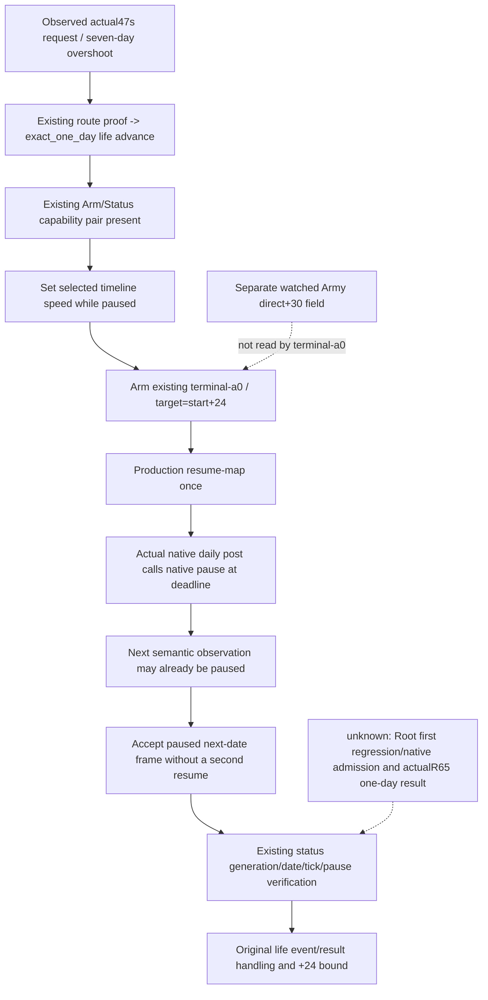

# Exact one-day clock: actual 1.20.0.4 overshoot repair

## Actual failure before source work

Root's ordinary Robert29829 campaign issued the registered step `advance-route-contact-horizon-v1-218104048-to-2618-h-1-134218098`, expected public revision3. It took47.118s and returned `exact one-day advance exceeded its 24-hour native horizon: 53288256 -> 53288424`. The original [failed response](Z:/ck3_mod_rewrite_process_assets/g2-background-20261007/upstream-build-migration/managed-full-h9613-title12/operator/gameplay-responses/g2-route-ef6a7caf2f39-08-one-exact-route-day.json) is retained. The +168 raw delta is **seven actual days**, not a completed one-day loop.

Root independently observed the later paused/map-ready `native12/public13` frame at raw53288424: Robertalive, ownUnit218104048 arrived2618, targetnull/route empty, regular/not in combat; war100663329 remains active. Root owns preservation of that actual +7 normal state/H9635 and side Byzantine work. This package does not restore, replay or advance the game.

The target build is actual CK3 `1.20.0.4`, Steam25734779, EXE SHA-256 `98702F88A547CDE2EAF29A85F93B85F68EE4CF8148336A4F7AFAEB75319DD518`. Python source baseline is Root `38b0a986`; the failed live runtime was frozen89d/entry14. Source inspection and the actual response supply necessity for this fix; no EXE read or whole hash is performed.

## Closed source cause and existing native deadline

The route proof composite calls `_execute_life_advance(exact_one_day=True)`. That method previously set speed, resumed, sampled rich semantic snapshots until date/army progress, and submitted a cleanup pause. It never armed the installed tactical daily sentinel. Snapshot wall latency therefore could pass several native daily ticks before Python paused; the final +24 check only detected the already committed overshoot.

The actual4 native installer and handler already exist. The native owner also closed a second source regression: `.4` AdapterDescriptor omitted the existing Arm/Cancel/Status capability strings. `game_adapter.cpp` maps the canonical steps to those three capabilities and then checks descriptor membership; missing entries make the outer dispatcher reject before an installed handler can run. Root owns the minimal one-header/three-capability native correction. No new native address, command or capability is introduced by this clock fix.

Existing `mode-terminal-a-0` is admitted by the parser and native Arm contract. With no watched armies, Arm and post-hook Army/Combat loops are empty; the deadline still fires on the actual daily callback. It depends only on already closed actual4 daily post, GameState/Jomini/local-player roots and native pause wrapper. It does **not** depend on the separate direct+30 Army observation gap. Held native evidence and Root's admission recipe are in [R63 native source seams](Z:/ck3_mod_rewrite_process_assets/g2-parallel-20261007/default-manifest-sentinel-12004/sentinel-native/R63-NATIVE-SOURCE-SEAMS.json) and [native support patch](Z:/ck3_mod_rewrite_process_assets/g2-parallel-20261007/default-manifest-sentinel-12004/sentinel-native/R63-NATIVE-SUPPORT-PATCH.txt).



## Minimal Python behavior

Exact one-day requests use the native deadline when the existing Arm/Status pair is advertised. The wire token is generated from the actual starting date: `research-arm-tactical-daily-sentinel-v1-<start>-to-<start+24>-speed-<selected>-mode-terminal-a-0`. `_advance_exact_day_with_sentinel` reuses current normalization and Arm/stop checks with a local date-only scope, then returns the paused native ending frame into the original event and result path. The returned `exact_day_native_clock` receipt contains actual Arm and stopped status. Non-sentinel/non-exact behavior remains the previous path; Root must deploy the native descriptor correction together with Python before the next actual4 exact-day attempt.

The production `_resume_life_advance` gains an optional native-stop target for this clock path. It accepts a newly observed paused frame with positive date progress after the single resume, because a fast native stop can occur before any running snapshot is published. The existing native stop validation still binds generation, dates, daily ticks, zero overshoot and pause ownership; a command ACK alone does not satisfy the clock. The old retry behavior is retained for callers without this native-stop context.

If the clock operation fails, the composite uses its existing pause path and the actual returned generation for cancellation. Cleanup failure is recorded without replacing the original error. This is bounded cleanup for the same actual command, not a new gate or audit. Full battle Monte Carlo gaps and direct+30 do not block date-only clock use.

## Unique first regression and actual acceptance

The single new test is [test_exact_day_native_clock_paused_next_frame.py](../../ck3_autonomous_player/tests/unit/test_exact_day_native_clock_paused_next_frame.py). Its synthetic transport implements a game clock: an unarmed resume advances7 days and remains running; an armed one-day deadline emits **only** the next paused day. It drives the real `NativeHeadlessGameplayDriver.execute_step`, `_execute_life_advance` and `_resume_life_advance`, and checks Arm precedes resume, only one resume is submitted, final date delta is24, native generation37 is retained, and no Python cleanup pause replaces the native stop. No fixture calls the new helper or reimplements its branching. This test would fail both the original unarmed polling path and a repair that re-resumes the already paused next-day frame.

Source and test are **AUTHORED_NOTRUN** in this package. Root runs this one new regression FIRST, without repeating the forecast7 tests or unrelated suites:

```powershell
& 'Z:\ck3_mod_rewrite\tools\.venv\Scripts\python.exe' -B -X utf8 -m pytest -q -p no:cacheprovider tests/unit/test_exact_day_native_clock_paused_next_frame.py
```

After Root adopts the Python and native admission patches and keeps the failed +7 state/save, an actual ordinary-campaign one-day attempt from the then-current paused frame must show its own start→start+24 paused result and native deadline receipt. The known saved raw53288424 would target53288448, but the request must derive its starting date/revision from the then-current Root frame. The existing route proof must also be fresh; Unit218104048 already arrived2618, so the failed old moving-route literal/proof cannot be replayed.

## Oct7/W41 fields

- Completed: actual +7 failure retained; polling/unused Arm cause and missing existing native cap admission isolated; Python deadline and paused-next-day resume authored; unique production-provider regression authored; native source tree and Mermaid recorded.
- Doing: Root native admission integration, one new FIRST test, preserved H9635/Byzantine side work, then fresh ordinary-campaign R65 exact-day qualification.
- Why: the real one-day route advanced7 days before rejection, compromising tactical sampling. Native date-only stop makes wall snapshot latency irrelevant to the daily deadline.
- Readiness: source authored only; no new static-ready/live one-day/loop credit from this worker. The +7 days remain actual campaign progress with a failed one-day contract.
- Execution: worker tests/imports/build/game/SDK/EXE/whole Driver/whole Snapshot0; original failed small response read once and held native receipts reused.
- Next: Root single provider FIRST then actual fresh paused start+24 receipt; continue G2 with the fixed clock. No old route proof, cached forecast or theoretical field blocker substituted.
