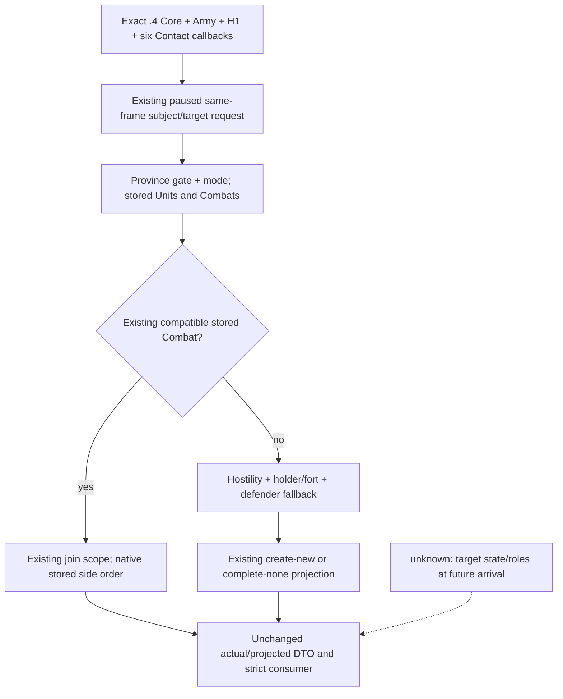
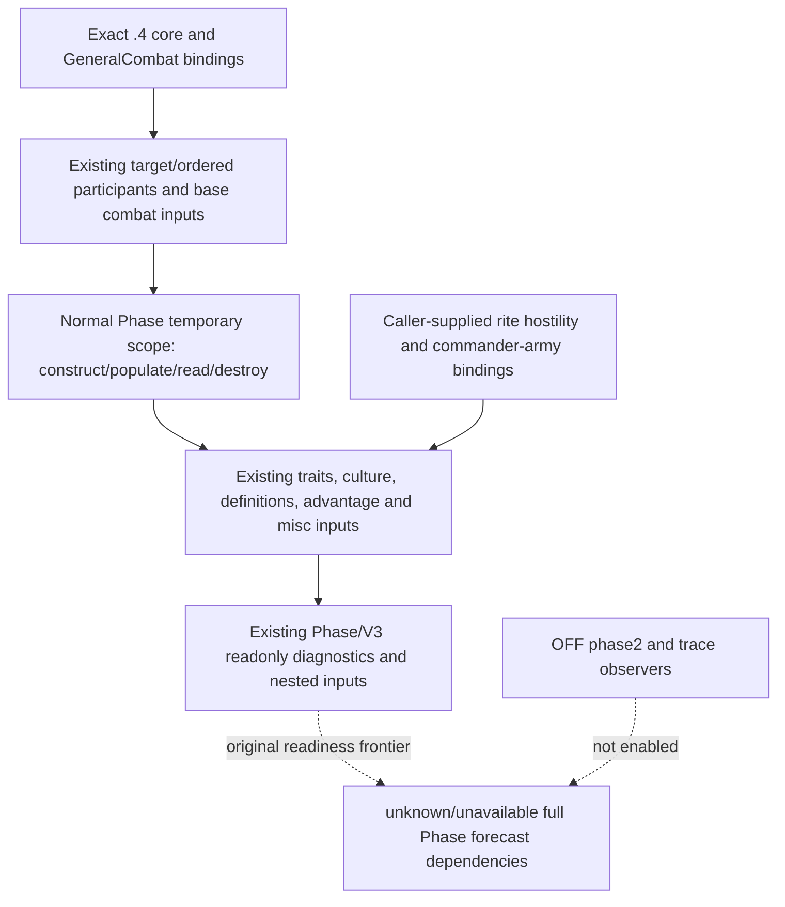

# CK3 1.20.0.4: existing Contact and Phase provider migration

2026-10-07 / ISO 2026-W41. This work restores previously adopted readonly
capabilities after the installed-build migration. The frozen target is CK3
**1.20.0.4 / Steam25734779**, EXE SHA-256
`98702F88A547CDE2EAF29A85F93B85F68EE4CF8148336A4F7AFAEB75319DD518`.
The isolated source base is `c8f19a6a067ef8dd56926b8bc11d14b164045974`.
This package does not acquire runtime qualification: build, tests, SDK queries,
game operations and new whole-image hashes are NOTRUN.

The source inputs are the adopted [projected Contact tree](projected-contact-scope-v1-12003.md),
[current Phase tree](combat-phase-events-12003.md),
[Phase input frontier](combat-phase-readonly-input-frontier-12003.md), the frozen
`.3` factories and the exact `.4` mapping receipts below. Historical `.3` live
results remain historical. No counter-policy, new activity, event executor,
phase2 observer or disabled Phase trace is enabled by this migration.

## Current production seams

The `.4` adapter did not fill `bindings.phase`. The shared typed Contact and
Combat V3 branches still passed the actual `.4` SHA to the legacy factories;
those factories correctly returned empty bindings. Projected Contact also had
two `.3`-only dispatch guards. The `.4` descriptor and typed whitelist must
advertise the corresponding existing providers only after their real new
factories and shared dispatch hooks are present.

The Root-owned seam inventory is
`upstream-build-migration/existing-capability-migration-remaining/PRIMARY-FUNCTIONAL-SEAMS.json`.
This source package owns four new native files, two existing internal Phase
files, and this topic. Shared adapter, Bridge and CMake changes are supplied as
an external recipe for Root to apply.

## Existing actual and projected Contact

`xar::ck3_12004::BindContactImage12004(base, sha)` returns the existing software
`ck3_12002::RouteBindings`. It requires a nonzero image base and the actual
`.4` SHA. It composes the qualified actual4 Core and Army storage roots with
Army's independent H1 factory `BindRouteImage12004`, dependency pin
`3c0a979c75c44add85bfea0fd9bc8f7a0b430d66`. It does not call a legacy image
factory or substitute a reviewed old ABI SHA.

The existing normal readers require six callbacks. Arrival's three-callback
subset alone does not satisfy this provider's preflight.

| Existing binding | Exact `.3` entry | Closed actual `.4` entry | Receipt |
| --- | --- | --- | --- |
| character hostile | `2C09640` | `2C09620` | Arrival HOSTILE full191B |
| internal army empty | `24E83C0` | `24E83A0` | Arrival EMPTY logical full152B |
| internal army in combat | `24E8360` | `24E8340` | Army native-main/map05 full81B |
| Province holder | `247D030` | `247D010` | Army commander-supply/domain-scoped06 full172B |
| defender by holder | `2C09810` | `2C097F0` | Army native-main/map06 full465B |
| defender fallback | `2C164E0` | `2C164C0` | This package fallback-first01 full423B |

The final fallback mapping uses the paired cached runtime intervals, complete
instruction decode, equal concrete non-address bytes, ordered call/RIP edge
shapes and local control topology. The runtime metadata pair supplies a
candidate; the actual body supplies its admission. The only new Contact
captures are old423B/one read and new423B/one read: **846B / two reads**. There
is no new callee expansion, whole-image read or hash.

The pure field authority is split deliberately by real witness. The reused
292B arrival prefix proves `Province+20 -> byte1B`, stored Combats at
`758/764`, and contact mode root `5CB87F8 -> 1C0 -> 28`. Province's separately
closed profile proves Units at `740/74C`, GameData Province pointers/count at
`140/14C`, pointer stride8, full ID10 and tag85C. Its retained32B named window
contains the7B signed fort getter and11B signed-positive predicate for
`Province+850`, with padding; it is not one32B function. Core, Army and Battle
provide the remaining exact storage roots, including internal Army,
Regiment, Character, Combat `5D1DE70` and BattleResult `5D1FFE0`.

All existing contact hostility calls use a null/false third argument. The
native third argument is an optional War pointer; this package does not claim
a general nonzero argument contract. Existing serializers and Python strict
leaf parsers retain their software DTOs and semantics. Current actual Contact
and `hypothetical_now` projected Contact remain distinct from future
arrival, actual battle execution or outcome prediction.

The full Contact authority is
`Z:/ck3_mod_rewrite_process_assets/g2-parallel-20261007/battle-pursuit/migration-steam25734779/existing-contact-phase-12004/contact/CONTACT-PROFILE-SOURCE-CLOSED.json`.
The H1 dependency authority is
`Z:/ck3_mod_rewrite_process_assets/g2-background-20261007/upstream-build-migration/route-horizon-12004/SOURCE-CLOSED.json`.

## Existing normal Phase and Combat V3

`xar::ck3_12004::BindPhaseImage12004(base, sha)` returns the existing software
`ck3_12002::PhaseBindings`, under the same direct actual4 identity rule.
GeneralCombat4's adopted20 groups provide base combat and nested character
inputs; they do not stand in for the separate Phase scope construction,
population, selection, dynamic, scheduling, culture, advantage and misc
callbacks required by the original normal factory.

The pre-implementation bounded plan is
`migration-steam25734779/existing-contact-phase-12004/phase-native/PHASE-SOURCE-PLAN.json`.
The normal provider migrates that declared set and reuses already closed
definition identifier, rule and GeneralCombat factories. It does not turn
the old incomplete forecast into a complete event simulation.

The callback bodies, necessary logical continuations and named root operands
are now source-closed. Phase's physical captures total **21,063B /101 reads**;
the final closure ledger separates reused evidence from these new finite
reads and retains incomplete prefix attempts. The final effect-database
getter is `8FC3E0 -> 8FC3E0`, full87B, paired concrete bytes and edges closed.
It is distinct from GeneralCombat's `899E40` MAA database getter. Equality
of this address is evidence for this one function, not a general RVA rule.

| Normal Phase binding | Actual `.4` authority |
| --- | --- |
| local primary/secondary shell tables | constructor's exact RIP operands produce `473D148 /473D110`; not the ongoing Combat manager's table |
| commander-army gate | full caller and joined leaf prove `24DFB50` |
| null internal Army | named RIP witness produces slot `5D1DE50` |
| Rite hostility | paired normal callback body proves `2591CC0` |
| loaded hostility factor count/data | exact signed-count/pointer operand pairs prove `5451D34 /5451D28` |

The member-by-member authority and logical body joins are in
`migration-steam25734779/existing-contact-phase-12004/phase-native/PHASE-SOURCE-CLOSED.json`;
the new factory's literals are limited to those closed normal dependencies.
This is authored source readiness within the `research` boundary; no
successful compile or runtime qualification is inferred. Contact plus Phase
adds **21,909B /103 finite reads**, using the frozen installed-build authority
without a new whole-image read or hash.

Two old normal-reader paths had implicit image-relative legacy addresses:
Rite hostility/factor roots and commander-army gate/null sentinel. Five
caller-supplied internal fields are appended to `PhaseBindings` so the `.4`
factory can supply actual proven pointers. The legacy factory initializes
those fields from its original constants; manually assembled legacy callers
retain their existing fallback. The new actual4 factory must fill all five,
so its normal readers do not enter the embedded legacy path. The internal
structure grows40B on x64; wire data and public query arguments do not change.

Root must rebuild every selected-target translation unit that depends on the
internal Phase header. The bounded quoted-include closure is recorded in
`migration-steam25734779/existing-contact-phase-12004/PHASE-HEADER-DEPENDENTS.json`.
It lists107 production TUs and76 test compile dependencies at this source
base; the new Phase TU is an additional direct dependent. Conditional/OFF
entries are compilation dependencies only, not requests to enable or run
them. Root's compiler dependency graph decides which listed objects belong
to the chosen production targets.

## Integration and qualification boundary

Root owns adding the two new TUs, the actual4 adapter's `bindings.phase`, the
typed Contact/V3 factory selections, existing capability tokens and the
actual4 typed whitelist. Projected-only guards must admit actual4 explicitly;
the adjacent constructor geometry guard is a separate Phase/Combat source
seam and is not changed by the Contact factory.

Retain the existing V2 token. The exact effective old `.3` descriptor inherits
`.2` and its84 capabilities advertise V2 only. The explicit V3 literal in the
separate legacy11906 descriptor, and generic supports-step's V3 mapping, do
not prove adopted `.3` ON advertisement. The real Phase bundle restores the
normal adapter's contextual Phase inputs and the existing request-selector/
typed provider. Root admits actual4 in the adopted constructor guards with
the actual4 source bindings; it does not add an explicit V3 token or an OFF
diagnostic/observer token.

This package's final source delivery, source pin, root/vtable map, finite
capture totals and Oct7/W41 fields are external under
`Z:/ck3_mod_rewrite_process_assets/g2-parallel-20261007/battle-pursuit/migration-steam25734779/existing-contact-phase-12004/`.
Root handles the necessary build and actual paused existing-query acceptance.
No previous qualified fixture, query, full snapshot, Driver history, save or
old GREEN case is replayed by this source lane. Source evidence restores the
factory inputs; only Root's subsequent real bodies can restore `.4`
production-live credit.
