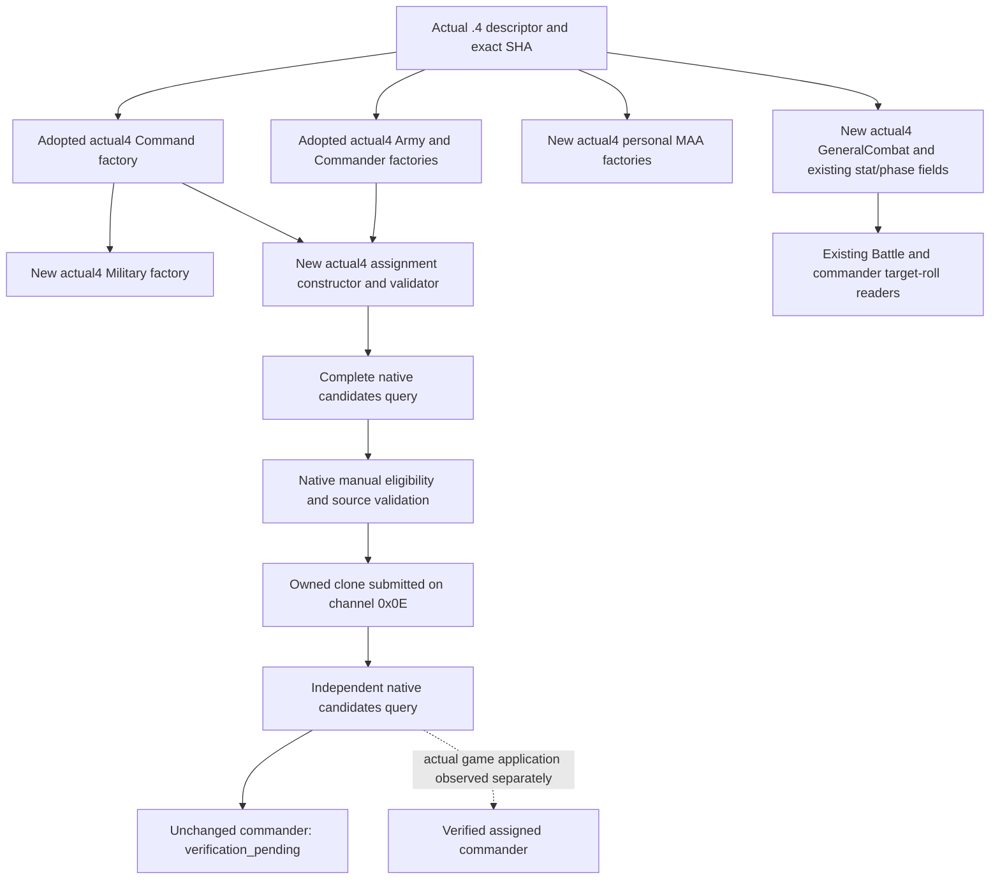

# Existing military MCP factories on CK3 1.20.0.4

This package restores existing GeneralCombat, Military, regular personal MAA
and commander-assignment paths after the Steam build 25734779 update. The
actual executable SHA-256 is
`98702F88A547CDE2EAF29A85F93B85F68EE4CF8148336A4F7AFAEB75319DD518`.
The old and new native sections differ; a general RVA displacement is not
evidence for a binding. Each selected function uses a complete matched body,
an actual caller edge, or an actual constructor/vtable slot. Existing family
proofs and the centralized finite mapper are reused.

The software DTOs, native rules and player-only scope remain their adopted
interfaces. Factories return those types while selecting actual `.4` addresses;
they do not call an old image binder with a substituted hash. Military borrows
the caller's actual CommandBindings. Its `submit_context` must point at the
final owning command bundle after the adapter moves that bundle.

Commander assignment uses the public CUnit ID in the request and the internal
CArmy ID in the native command. The actual constructor is `0x297BAE0`. Its
primary vtable slot `+0x30` selects validator `0x2971460`, including the existing
manual can-set predicate. The caller-owned 48-byte command stores mode 1,
candidate ID and internal Army ID at `+0x20/+0x24/+0x28`. The existing executor
uses hidden-result clone slot `+0x40` and owned submission channel `0x0E`.
Queue acceptance retains `verification_pending`; it cannot establish that
Army `+0x120` changed.

Military restores the existing raise, move, halt, disband, split, merge and
start/stop assault callbacks, route preview and their typed command interfaces.
MAA restores the existing catalog, independent native can-create predicate and
ten signed raw quote resources, plus the adopted personal create provider.
Permission false is an observed result. Quote zero remains an observed value.
The MAA Python leaf admits exact `.3` and `.4`; its response and after-frame
checks already follow the selected build identity.

The native source ledgers are
`ck3_autonomous_player/native_bridge/research/ck3_1_20_0_4_commander_assignment.json`,
`ck3_1_20_0_4_military_maa.json` and `ck3_1_20_0_4_general_combat.json`.
External receipts live under
`Z:/ck3_mod_rewrite_process_assets/g2-background-20261007/upstream-build-migration/existing-mcp-factories-12004/`;
the GeneralCombat child retains its finite map under
`Z:/ck3_mod_rewrite_process_assets/g2-background-20261007/existing-mcp-factories-12004/general-combat/`.

The sole new target is
`xar_bridge_ck3_12004_existing_factories_whole_test --emit-wire <fresh-directory>`.
It selects the actual factories, then substitutes fixture-owned native storage
and ABI callbacks before any invocation. Three complete production packets are
assembled through genuine candidates read, assignment executor and serializers:
`before.command-result.json`, `assignment.command-result.json` and
`after.command-result.json`. The aggregate is
`existing-factories-12004-whole.json`. The queue fixture consumes one clone and
keeps the independent commander absent. This exercises the real pending path.

The sole Python consumer uses the real NativeHeadlessGameplayDriver, Service
and registered `ck3_assign_army_commander_v1` tool. Hello, paused player scope
and outer request correlation are synthetic; compiled native result bodies
remain complete and unchanged. Root owns compilation and the first invocation.
All GeneralCombat base callbacks, loaded definitions, ordinary and MAA stat
inputs, knight association and four existing phase input bundles are source
closed. The final piety getter is `0x28BE0B0`, proved by a complete 86-byte body
already in the shared cache. At source delivery, FIRST is NOTRUN and this
package claims no live capability. The final pins, actual finite read cost and
remaining Root compilation/FIRST are recorded in ROOT-DELIVERY and Oct7/W41.

The Oct7 joint-domain FIRST02 native producer passed. Its first consumer stopped
before production imports because the harness expected nested martial status
`absent`. The existing `ReadCurrentCommanderTotalMartial(-1, ...)` instead retains
DTO status `unavailable`, with reason `current_commander_absent`, null source ID
and value, skill index 1 and the native current-skill-cache source. The parent
commander status remains `absent`. The corrected consumer asserts that entire
six-field DTO exactly and reuses the unchanged GREEN native whole packet.
