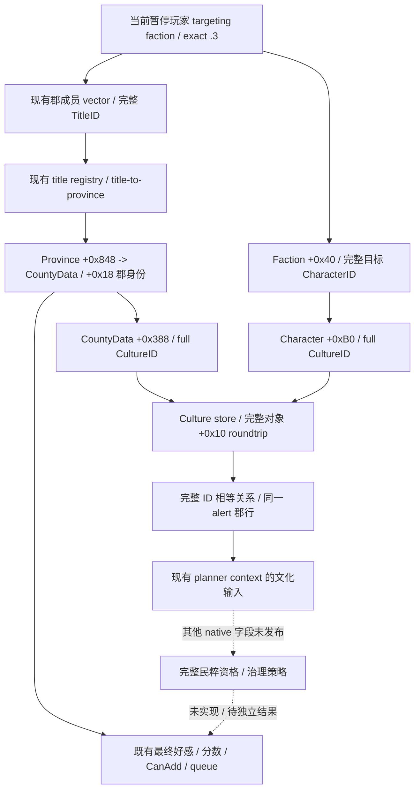
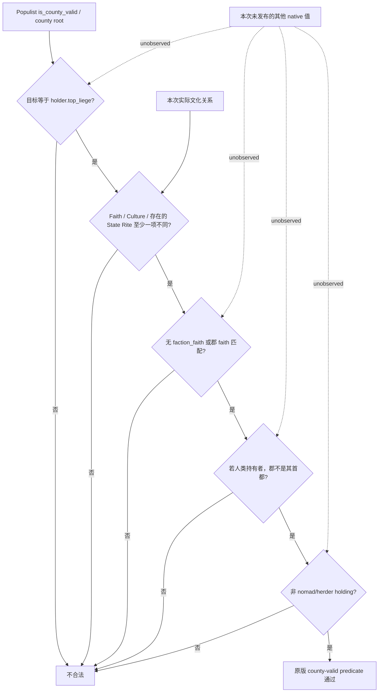

# CK3 1.20.0.3：玩家派系郡文化输入

本页冻结派系应对所需的郡文化输入，源码树先于实际 consumer 修改。2026-10-06 保存的 `674-current-faction-alerts.json` 中，Robert **29829** 的民粹派系 **33554465** 只有郡 **2111**，没有角色 leader/member，因此赠礼没有接收者；郡好感 **-22**、原生加入分数 **31**（raw 3100000）、CanAdd **true**、移除队列 **false**。该帧为暂停 `native:1001` / public revision **1002** / date raw **53286000**，保存路径为 `Z:/ck3_mod_rewrite_process_assets/g2-resume-20261006/gameplay-responses/674-current-faction-alerts.json`。这是新输入的必要性证据，不是新字段的实机验收。

绑定 **1.20.0.3 / Steam 25652598 / EXE SHA-256 `94B55397ABB687A3DCD436805A5D885E6BE90FA6C693FEB44A9E3BBEEADE02A6`**。复用现有缓存与 reviewed `phase_culture` ABI；没有新 EXE 读取或哈希。原生来源账见 [ABI manifest](../../ck3_autonomous_player/native_bridge/research/ck3_12003_faction_county_culture_input_abi.json)。同一查询中的既有郡好感/最终分数等能力见 [郡派系判断材料](county-faction-material-12003.md)。

## 已闭合来源与观测树

exact .3 缓存 `robert-county-opinion-native-01/getter-registry/disasm-0024d4790-0024d4ca8.txt:35-54` 的当前郡好感 aggregate **0x24D4790**，在 **0x24D480F** 读取 `CountyData+0x388`，经文化 storage **0x5D1E2F0** / fallback **0x5D1E2E8** 回查，索引只用低 24 位，但对象 `+0x10` 比较完整 ID。具名 `phase_culture` manifest 独立闭合相同文化 store，及 **0xC6E0FB** 的 `Character+0xB0`；它在 `.3` ABI reuse 清单中。相同 registry 和完整身份链把 `CountyData+0x388` 静态识别为郡完整 CultureID。旧 county-opinion proof 当时把文化内部输入留为 opaque；本页是其后的窄输入闭合，未声称旧 proof 已完成文化观测。

Root 授权只冻结当前原版 `common/factions/00_populist_faction.txt`，外置副本 `Z:/ck3_mod_rewrite_process_assets/g2-parallel-20261006/faction-mitigation/stock/current-12003-00_populist_faction.txt` 的 SHA-256 为 **c67853a56bcea26ed90427cdba7ed4a51968ee085ec88e34fe2976ce5437dd4d**，48187 bytes；冻结时间为 2026-10-06 20:43 Asia/Shanghai。没有把整份原版源码提交到仓库。

当前 `is_county_valid`（119-163）要求：目标为持有者 top_liege；不同目标 faith、不同目标 culture、或存在且不同的 state rite 三者至少一个；有 `faction_faith` 时郡 faith 必须相同；人类持有者的首都郡排除；nomad/herder holding 排除。独立文化项不依赖 heritage 或 diarch。后面的 score（415-505、581-595）才另外消费 heritage/active-diarch 输入；脚本枝已知不代表这些 native 值已发布。

文化不同只证明 grievance OR 中的文化项为真，不证明完整资格或未来退派系。文化相同也不能否定 faith/rite 项。CanAdd 的原生布尔结果、score 和 queue 仍分别保留；不能把它们或未来改宗 ACK 当作县已经移除。

## 实际接口与消费入口

`targeting_factions[].county_member_observations[]` 追加四字段：

| 字段 | 值 | 边界 |
|---|---|---|
| `county_culture_id` | signed int32 或 `null` | 成功完整文化回查后的郡身份 |
| `target_culture_id` | signed int32 或 `null` | 实际派系玩家目标的文化，不能替换成郡持有者 |
| `same_culture_as_target` | bool 或 `null` | 两个完整身份均已解析时才比较 |
| `culture_relation_status` | `available` / `unavailable` | 两身份及关系均可用时才为 available |

文化 ID **0** 是可回查的值；仅 **-1** 是空 sentinel。只用低 24 位比较会丢失 generation，因此只能比较完整身份。部分读取成功的 ID 保留，relation 为 `null`；新叶失败不取消已有 alert、opinion 或 native-final readiness。

生产 normalizer 接受原十字段旧行，或四文化字段一起发布的新行，严格保留 **false / 0 / null** 的区别。已有 `_general_war_entry_faction_context` 是唯一新增 consumer，它将同一 alert 的各 `(faction_id, county_title_id)` 关系投影到 `county_culture_context`，携带现有 snapshot/date/player/build provenance，并显式报告本地输入 readiness。没有县行是 `not_applicable`，不是文化采样成功。危险/watch、`prior_scope_eligible` 和 action 选择不变；没有新增 MCP 或治理动作。

## 验证与后续

状态为 **research / source-integrated，未编译、未执行 fixture、未实机验证**。Root 指定的独占整合树已经接入实际 DTO、reader、serializer、Python normalizer/consumer；Root 下一轮 64 jobs 联合 batch 首次执行专用检查。新增 native target 为 `xar_ck3_12003_faction_county_culture_whole_query_test`，CTest 名为 `xar_ck3_12003_faction_county_culture_whole_query`；Python 入口为 `tests/unit/test_player_faction_county_culture_inputs_v1.py`。

native fixture 复用旧 memory-layout scaffold，替换其 main，只执行四个新整条生产查询例：目标与 holder 不同的文化 mismatch；文化 0 的相同关系；目标文化失败但保留 alert/opinion/finals；同 slot 不同 generation 的缺失身份。Python fixture 对真实 normalizer 和现有 consumer 验证类型/部分读/旧形状/空县/同县多派系，以及原 context 去掉新字段后仍一致。这些测试源码已经交付，尚无通过结果；旧 alert/gift 没有重跑。

Root 编译与专用检查通过后，仅在 Robert **29829** 原普通战役的实际暂停同查询中采样新字段。若没有县成员，就保留零样本事实，不给新字段 production-live credit。真实关系值只能推进这个观测 primitive；完整县治理动作与 OODA 还需独立行动、观察和结果。宗教、战争权限全面开放；本输入没有重新设置领域限制。
