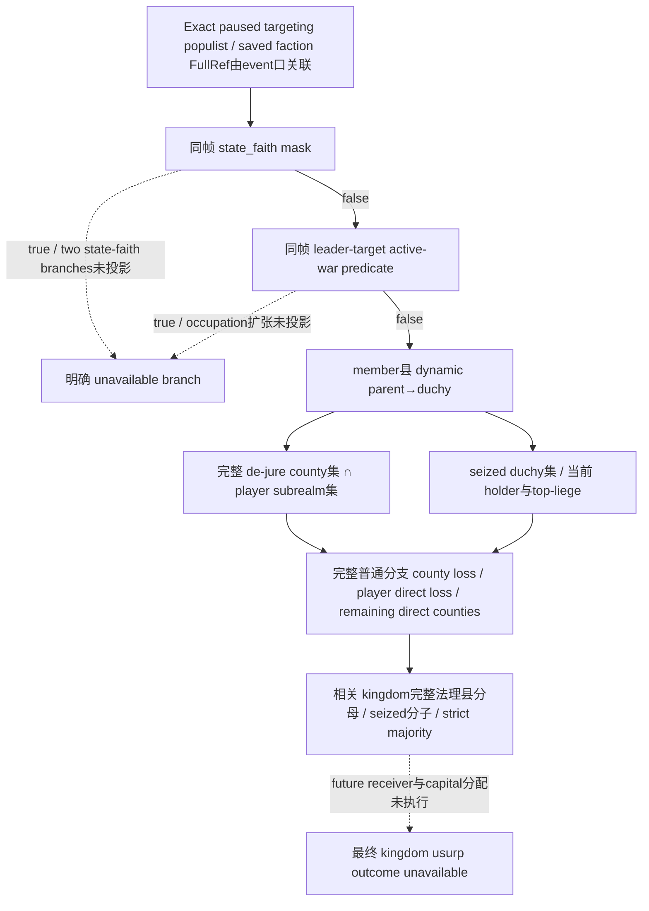

当前原事件 `faction_demand.1001/23` 的接受选项调用 `successful_popular_revolt_outcome_effect`。本页在修改 reader 前冻结其最小观测输入，绑定 CK3 1.20.0.3 / Steam25652598 / EXE SHA256 `94B55397ABB687A3DCD436805A5D885E6BE90FA6C693FEB44A9E3BBEEADE02A6`，生产基线 `8cf176b436b6b0024fb591d4114b92448146181a`。已有原版事件树与封存 source-effects 直接复用；本页不重复授予实机或策略信用。

原版普通分支将每个成员县的 `duchy` 无条件加入 `seized_duchies`，并将该公国法理县中 `holder.top_liege = faction_target` 的县加入 `seized_counties`。公国是否由玩家持有不限制入集；标题未持有与已持有分别报告，避免将所有 transfer 都写成玩家直接头衔损失。`show_as_tooltip` 不另外执行第二次割让。三成员县不是全损失。

新只读投影从既有 `query-player-faction-alerts-v1` 的 populist row 发布动态法理父链、完整 subrealm 县集、受影响县/公国当前持有者、玩家直接头衔损失与剩余县、王国法理县分母和当前 seized 分子。所有身份继续使用 registry 的完整 generation，不使用县成员数量替代完整集合。

exact .3 新增调用链已从本机 PE 读到：

| 入口 | 原生事实 |
| --- | --- |
| reflected GetDeJureLiege registration `0x45A17C` | 注册 getter `0x2316080` 与 wrapper `0x23160C0` |
| getter `0x2316080` | `title+0x108` FullTitleID；registry slot `0x5D1DAF8`，低24位索引、`object+0x10` 完整回读；fallback `0x5D1DAE0` |
| existing title child span | `title+0x110/count+0x11C`，递归到 tier2 县；每条 parent/child 均核对完整 ID |
| government_allows trigger `0x2B1F3F0` | `0x28C2E10(character)` 返回政府，`government+0x40` 与 trigger mask 比较 |
| state_faith registration `0x366F50` | 动态 identifier 槽 `0x5C78AC0`，`0x22CA060(&identifier)` 返回能力 mask；不硬编码运行时 identifier |
| is_at_war_with trigger `0x2B33540` | pure relation lookup `0x28BC270(left,right)`，`relation+0x20` FullWarID、war registry、`war+0x358 == 0` 判断 active |

`ReadSubrealmCountyIds` 的既有 held-title/direct-vassal-contract 递归复用；其 county tier2 且非空 de-jure children 的原生约束保持。普通县损失清单只有在同帧 `government_allows_state_faith=false` 与 `leader_at_war_with_target=false` 时才标为完整。state-faith 两特殊分支和战争占领扩张均单独保留具体未施工原因，不能用 `faction_at_war=false` 代替 leader pair predicate。

王国原文要求新 leader **直接持有**的法理县严格 `>50%`。发布的 seized 分子和完整法理分母用于审阅当前风险；资本选择、各轮 receiver 的已有直接县与 primary-title 变化没有凭数量猜定，最终 usurp outcome 仍标 unavailable。拒绝 API4 调用原版 `faction_start_war`，战争执行授权仍由主代理单独判断。

施工状态：本页与 ABI 先落盘，随后代码进入外置独占投影。`ck3_12002_faction_alerts.cpp` 的原生产 reader、shared serializer 与生产 Python normalizer 已通过同一聚焦六帧流水线，`/W4 /WX /O2`；证明同公国 spillover、间接封臣 holder/top-liege、严格 `>50%`、state-faith/active-war 对完整县损失的禁用、ended-war false 与父链读取失败的 typed unavailable。fixture 是 synthetic，能力为 `static-ready`。

证据：`Z:/ck3_mod_rewrite_process_assets/g2-resume-20261003/faction-extent/FOCUSED-RESULT.json`，producer SHA256 `2152b1b54bb20a6140a864a7d970d2a686fe5a3f765ed0cf5a88291105413d6b`。Attempt01 harness RED：最后夹具误破坏既有 alerts 同样依赖的头衔 identity；改为仅新父链 generation 后，Attempt02 native 六帧通过，但最小外置投影缺 runtime tools 导致 Python import harness RED。两份原 result/compile.log 保留；补齐外置运行环境后复用同一 native binary/producer 完成 Python 校验，没有为 harness import 修复重编 native。

实际 Robert loss IDs 尚待 root 组合构建和原事件同帧读取；不选择 API3/4、不运行游戏、不调用 pipe、不使用窗口。kingdom future receiver/capital 和两特殊 branch 没有宣称闭合，后续只读输入已有具体树与 ABI 入口；本包不给日数、动作或 G2/NW完成信用。

## 2026-10-03T12:25 接续源码采用

真实v33 PID96112派系割让返回 surrender_title_collection_unavailable；确定性生产reader复现该RED。exact .3 immediate-liege 0x28BFC70 在0x28BFC9D对独立有地领主返回自身，现有campaign已正确接受，新割让reader误判为循环。最小修复接受self终止，并在后续title失败时保留已成功读取的state-faith/pair-war谓词。118-byte原生span SHA d7675380a1279ba5242feb3bb6053302519af85c32e56e2338ea6015e76f545c 已先冻结到ABI/原生树。新增3聚焦帧生产reader→serializer→Python normalizer /W4 /WX /O2 GREEN，保留此前fixture include harness RED，不重跑旧6帧。无新MCP/CMake/产品flag；原actual仍RED，下一v34组合DLL实际暂停帧待验。

实际记录：`2026-10-03T12:25:54+08:00`。源码已采用；严格组合DLL和Robert暂停实读仍待完成，不能记为live或增加日数/动作/收益/G2信用。ROOT负责正常commit/push。

交付回执：[faction-independent-liege-fix](Z:/ck3_mod_rewrite_process_assets/g2-resume-20261003/faction-extent/ROOT-INDEPENDENT-LIEGE-DELIVERY.json)。
