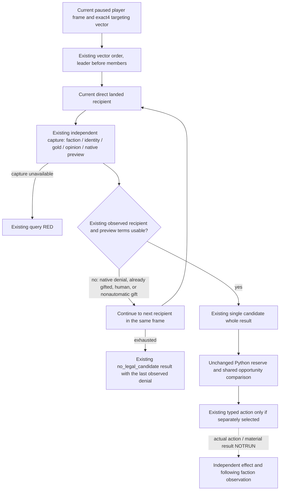

# Same-frame faction gift candidate continuation

2026-10-10 / 2026-W41. Source baseline
`91bf64589d78df866fdf6908841fc9b64e875ec7`, isolated tree
`D:/pM6factionContinue`. Status: **source-ready / FIRST NOTRUN**. Root owns
compilation, qualification, integration and all actual CK3/SDK operations.

## Concrete ordinary-planner input gap

The existing native route selects the first direct landed leader/member from
the current targeting-faction vector and captures exactly that recipient.
`SelectFactionGiftPrivateCandidate12004` returns immediately. The ordinary
Python chooser then rejects an already gifted recipient, a human recipient,
native `CanSend=false`, nonautomatic acceptance or a nonpositive gift effect.
The router does not inspect any later recipient. Thus a denied first entry can
hide an otherwise usable political intervention on every following normal
turn. This is a deterministic source-path input gap, not a claim that the
current actual Robert frame contains a particular legal gift.

The [selected-stock-response topic](faction-selected-gift-stock-response-12004.md)
already identifies the one-selected-member boundary. The source-grounded
ordinary consumer is `faction_gift_formal_candidate_v1.py` calling
`choose_faction_gift_v1`; Service uses it through
`plan_faction_gift_private_v1` and the existing private query. The existing
consumer retains its reserve and shared spending comparison.

## Retained exact-build native tree

Reuse [the individually qualified adopted faction port](ck3-1.20.0.4-faction-adopted-native.md)
and its recorded static qualification. Current engine: **CK3 1.20.0.4 / Steam
25734779**, EXE SHA
`98702F88A547CDE2EAF29A85F93B85F68EE4CF8148336A4F7AFAEB75319DD518`.
No executable bytes, PE metadata, fresh hash or old qualification were read or
executed by this package.

| Existing source input | Existing native / consumer role |
| --- | --- |
| Current targeting vector, full Faction ID, target and leader/member IDs | Qualified actual4 faction reader; only factions targeting this player and not at war enter the gift route |
| Current direct landed vassal IDs | Qualified actual4 campaign-faction reader; recipient must be in this list |
| Fresh recipient observation | `CaptureFactionGiftObservation12004` independently rereads the original faction, recipient identity, player gold and current opinion |
| Gift definition and two-role context | Actual4 refresh `3078A40`, finalize `3078C70`, final validator `307C020`, destroy `3077380`; named native `gift_value` / `send_gift_opinion` |
| Already applied gift | Actual4 opinion readers `28BC470/25A2EE0/2949A80/2596290`; presence is distinct from its signed value |
| Final Python decision | Existing positive effect, recipient and budget terms in `faction_gift_policy_v1.py`; exact quote remains authoritative |

These existing providers remain unchanged. The authored original gift effect
does not directly remove a faction member; no gifted opinion delta predicts
departure or dissolution. Actual faction outcomes require their independent
existing receipt and following faction observation.

## Minimum source change

Only production `ck3_12004_faction_gift_router.cpp` changes. A common visitor
preserves the existing faction vector order and leader-before-member order;
the leader's repeated member entry is visited once for that faction. The
public raw selector retains its first-recipient behavior for existing callers.
The preview executor uses the same visitor and stops at the first recipient
whose existing observed terms can reach the current Python chooser.

Each attempt still executes the actual observation collector and its before/
after paused-frame checks. A failed capture retains the original query RED;
only a complete known denial advances to another recipient. An incomplete
source or malformed positive quote remains for the unchanged Python consumer
to interpret; it is not silently skipped. No new action,
MCP tool, argument, wire field, header ABI, configuration option or persistent
record is introduced. No reserve, global ranking, marginal faction benefit or
future outcome is reconstructed in native code. A usable but over-reserve first
candidate can still be rejected by the unchanged Python budget comparison;
budget-aware all-candidate ranking remains outside this bounded change.

## One new qualification package

New native target `xar_ck3_12004_faction_candidate_continue_whole_test` emits
only four new whole `command_result` files:

1. First leader native-final denied, later member usable.
2. First leader has `gift_opinion`, later member usable.
3. First leader is human, later member usable.
4. Both recipients native-final denied: existing no-legal-candidate outcome.

The new fixture reuses the old store/adapter/transport helpers by including its
source with a renamed main; **the old main and its matrix are never invoked**.
The real mailbox handler, visitor, observation reader, final preview and
whole serializer remain linked. The authored per-recipient callbacks and
memory are explicit synthetic fixture inputs, not engine ABI evidence.
It checks exactly two recipient previews per world, same bound date/revisions,
no command queue call and no pending action. The whole result is never edited
after serialization. CMake retains the existing real Bridge closure and the
two fixture transport aliases for this new target as for the qualified target.

One new consumer method,
`FactionCandidateContinueWhole12004.test_native_continuation_wholes_reach_registered_candidate_choice`,
reads these four newly emitted wholes and calls the actual registered
`ck3_query_faction_gift_candidate_private_v1` once per world. It verifies the
unchanged driver's existing policy selects the later full Character ID and
that all-denied remains unselected. Only request-correlation metadata is
rebound by the synthetic endpoint; each native result body is preserved.
No old native matrix, retained whole replay, gift submit or old consumer runs.

Root-only finite recipe and Oct10/W41 fields are under
`D:/codex-ck3-background-spill/m6-faction-candidate-continuation/`.
Source/diff and Python syntax inspection are distinct from compile/FIRST.
No M4/M6 completion, live primitive, game-day increase or actual gift outcome
is claimed. The clergy owner confirms its concurrent package only consumes
the existing construction-completion benefit; it does not overlap this input.
