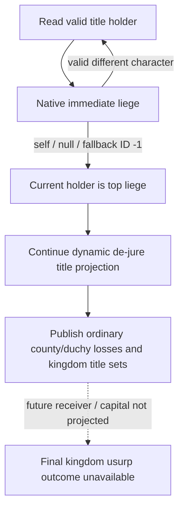

The paused v33 capture at `runtime-preparation/actual-paused-v33-01` binds the actual `faction_demand.1001/23` saved FullFactionID `33554465` to actor/target `29829` and leader `70766`, date raw `53236608`, PID `96112`. The successful alerts query reports `surrender_impact.status=unavailable`, reason `surrender_title_collection_unavailable`; its three member counties `2102/2111/2115` are not evidence of the complete loss set. Actual direct county/duchy loss, remaining domain and kingdom numerator/denominator remain unavailable until the repaired producer is deployed and observed. The later batch clergy Python opt-in failure is a separate harness RED and does not invalidate successful event/alerts queries.

The exact CK3 1.20.0.3 / Steam25652598 EXE SHA256 is `94B55397ABB687A3DCD436805A5D885E6BE90FA6C693FEB44A9E3BBEEADE02A6`. Native immediate-liege getter RVA `0x28BFC70` reads character land `+0x1C0`, then its liege container, and checks the character tag/full identity. For a landed independent character with no valid liege, RVA `0x28BFC9D` executes `mov rax, rcx; ret`: it returns the input character pointer. The 118-byte getter through its final `ret` is frozen in [immediate_liege_self_12003_abi.json](../../ck3_autonomous_player/native_bridge/research/immediate_liege_self_12003_abi.json). Existing production `ck3_12002_campaign.cpp::ReadLieges` already handles a self pointer as independent.

The new `ReadSurrenderTitle` instead advanced to the same pointer and rejected its repeated holder ID on the next hop. This deterministically produces the captured failure reason. Its caller also cleared the already successful government/state-faith and leader-target-war observations when any later title read failed, which accounts for both predicates being null in the captured failure. Predicate-read failures have a distinct `surrender_branch_predicates_unavailable` reason.

The minimal repair accepts the native self return as the top-liege terminal and retains completed branch predicates if a subsequent title collection fails. It does not change stock revolt semantics, add a query, select an event option or infer final kingdom receivers. The focused regression uses the production reader, actual C++ serializer and production Python normalizer. It tests only the newly evidenced self representation, the existing fallback representation and preservation of completed predicates after a later title failure. The old six-frame extent matrix is reused as prior evidence and is not rerun.

Before the repair, the identical g33 reader SHA256 `b3483de93d31ca6d73a3a66c7435642e1f3b79acc3fb3643344bff108424e134` produced the same unavailable/null/empty component in the self-return fixture. The preserved receipt is `faction-extent/independent-liege-before-fix-repro/result.json`, status `EXPECTED_CAPABILITY_RED_REPRODUCED`, producer SHA256 `703e4cb50c895c4578b500622b807ee986cbb63e338684f3af65c4f676abd45f`. An earlier new-fixture nested-main compile failure is preserved separately in `independent-liege-before-fix`; it is harness RED, not another game capability result.

The repaired reader passed the same focused three-frame production path with `/W4 /WX /O2`. Independent-self and fallback frames publish identical complete ordinary title sets; the later-title-failure frame keeps `state_faith=false` and `leader_at_war_with_target=false` while keeping failed collections empty and readiness false. Receipt: `faction-extent/independent-liege-after-fix/result.json`, status `GREEN`, producer SHA256 `c7d8e2fb83395c04df84746ce795c644bad5265c155e35a2b57501604d1b8ded`, repaired reader SHA256 `e63e02384fb7d360b5981eeb63e1538fcf01888b382408a4699eecf60a2d132c`.

Readiness remains `static-ready` for this repair until root deploys it and freezes actual Robert title sets. The existing paused capture is a successful query with a capability RED surrender component. Final kingdom receiver/capital/current receiver domain, state-faith transfer branches and active-war occupation expansion retain the original explicit boundaries. No SDK, game, pipe, window or Git operation is part of this package.
