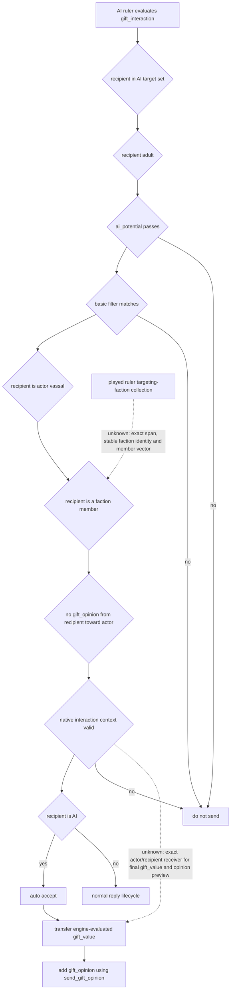
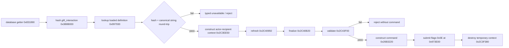
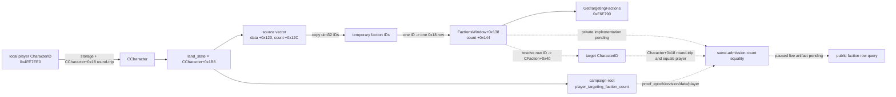
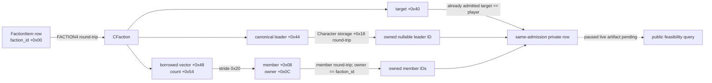

# CK3 1.19.0.6 派系治理：首个可见 OODA 与赠礼干预合同

## 状态与结论

- **原版 AI 与命令路径：`static-confirmed`。** 本文冻结 `gift_interaction` 的原版 AI 选人、合法性、自动接受、扣款与好感效果，并闭合 exact-build 中按稳定 key 查找 `CCharacterInteraction`、构造两角色上下文、校验和提交命令的原始调用链。
- **逐派系/候选观测：`static-ready` 私有原语。** 当前 production-live `campaign-root-context-v1` 仍只有 `player_targeting_faction_count` 和 REALM2 的 `direct_landed_vassal_character_ids`。FACTION2-CORE 已闭合 targeting collection 的 inline row span、`0x18` stride 与稳定 faction identity；FACTION3-EVIDENCE 闭合了 exact-build 目标角色 getter和 campaign-root count 等价；FACTION6-CORE 又把 canonical nullable leader 与 `0x20` character-member rows 接进同一 private、default-off capture。它仍没有 paused live/heartbeat artifact，也没有 type、war、power/discontent 或公共 query，因此公共能力仍不能证明某个封臣属于哪一支派系。
- **赠礼动作：`research`。** 本工作包只给出最小 typed observation/action 合同和施工入口，没有修改 bridge、公共 MCP、schema、planner 或动作实现，也没有启动 CK3。
- **首个可见 OODA：** 从真实 targeting faction row 中选一名直属有地、AI 控制、尚无 `gift_opinion` 的成员，读取引擎最终赠礼成本与好感增量，满足预算后执行一次 `gift_interaction`；随后验证金币转移与该角色的 `gift_opinion`，并重新读取原派系状态。

这条路径适合作为 G2-M4 的第一个“真实封臣/派系干预”：原版 AI 自己就把 factioneering vassal 纳入赠礼候选；AI 收礼人自动接受；动作有确定的资源与关系后置条件；失败时不会像撤销头衔、囚禁或修改封臣契约那样引入暴政、战争和多阶段回复。它不会保证一次赠礼立即解散派系，因此产物必须区分 `mitigation_applied` 与 `threat_resolved`。

本文不进入通用宗教域。原版赠礼脚本中与宗教领袖、教义或大圣战有关的其他 AI 分支，不属于本合同的候选来源、readiness 或策略输入。

## 冻结构建与证据

冻结输入为 CK3 `1.19.0.6`：

| 对象 | 大小/范围 | SHA-256 |
|---|---:|---|
| `binaries/ck3.exe` | 95,206,008 bytes | `2D00FF3101EF70B566F2FCBAE292F09263199C80E9DC8F139B82D7D96F83DB86` |
| `game/common/character_interactions/00_gift.txt` | whole file | `119226E06725B6C7199785F2A5C49BB6BDEDB095F0DFBAD829371FA771DCB118` |
| `game/common/script_values/00_basic_values.txt` | whole file | `9268A54F0E425D409D9D0F20D884E0A3D0A89DF85A0B6644D56133C0C4CB0096` |
| `game/common/script_values/00_scheme_values.txt` | whole file | `E2AEBEF1C8AE686986811563AF966BBE17D80EBAB79037A3D67F229AEA14E96F` |
| `game/common/script_values/01_dynamic_values.txt` | whole file | `049303EFF8ABFDFCADCC31D27E2633A26A2E877E4E2980D4A42C53D6B76D7064` |
| `game/common/opinion_modifiers/00_opinion_modifiers.txt` | whole file | `9784F704B8DE847294451BEC6E6D1345B5CA4109219A9B4264E4AE8FDB1AE555` |
| `game/common/important_actions/00_realm_actions.txt` | whole file | `C1382FD5DFF09AB40BDB2BEE807D58DBF576877B87119F2F246DE9410CD2088D` |
| `game/common/scripted_triggers/00_scripted_triggers.txt` | whole file | `490C3784EE1555A49F7A4ADC9BAABB8522485F1AF6E1C837961E299A88695B5E` |

机器可读副本位于 `ck3_autonomous_player/native_bridge/research/fixtures/g2_m4_faction_gift_response_v1_source_contract.json`。它只记录相对游戏安装根的 source、RVA 和字节哈希，不依赖账号、机器路径或某个 CK3 轮次。

既有 [玩家目标派系告警 v1](player-targeting-factions-v1.md) 已冻结以下原版威胁语义，本文直接复用：

- `action_dangerous_faction_targeting_me` 只对 `is_dangerous_faction_trigger=yes` 且不存在 `faction_war` 的 targeting faction 报警；
- 人类领袖始终危险；`peasant_faction` 在 `months_until_max_discontent <= 12` 时危险；其他类型在 `discontent_per_month > 0` 时危险；
- `player_targeting_faction_count` 只能用于零值快路和逐行枚举后的计数一致性，不能提供 faction identity、type、member、power 或 discontent。

## 原版为什么会给派系封臣送礼

`00_gift.txt` 给出的原版 AI 选择链是：

1. `ai_targets` 会枚举 vassals；`ai_target_quick_trigger` 要求成年目标；AI 频率依统治者 tier 为 36、60 或 120 个月。
2. `ai_potential` 要求发起者处于可用的和平/成年状态、短期金币达到 `gift_interaction_cutoff`，并受贪婪、征服者和首都建设倾向约束。这是原版 AI 的调度意愿，不是玩家动作的合法性条件。
3. `ai_will_do` 的 basic filter 明确包含：recipient 是 actor 的 vassal、`is_a_faction_member=yes`、且没有 actor 指向 recipient 的既有 `gift_opinion`。
4. 真正的显示/合法性核心是 recipient 不是 actor、actor.gold 至少为 `gift_value`、recipient 没有被 actor 囚禁；最终仍必须以 native interaction context 校验结果为准。
5. recipient 为 AI 时，`auto_accept` 成立。
6. `on_accept` 使用 `pay_short_term_gold` 把 `gift_value` 从 actor 转给 recipient，并给 recipient 添加指向 actor 的 `gift_opinion`，数值为 `send_gift_opinion`。

`gift_value` 并非常数。它从 50 起步，继续读取 recipient greed、rank、government、dynasty legacy、文化和其他上下文。`send_gift_opinion` 同样读取 actor diplomacy、recipient greed、liege 关系、文化与其他上下文。bridge 不得复制这些脚本公式，也不得把 50 当作固定成本。两项都应在 exact actor/recipient interaction context 中读取引擎最终值。

`gift_opinion` 是 decaying modifier，`monthly_change = 0.25`。重复赠礼会被原版 AI 的 `ai_will_do` 置零，因此首个策略也只选没有现存 `gift_opinion` 的角色。

### 原版 AI 树

实线表示已经由冻结 stock script 闭合的分支；虚线表示本项目尚未闭合的 native 观测入口。



这里只证明“原版 AI 把派系封臣作为赠礼候选”，不证明赠礼会令成员退出派系。原版脚本没有在 `gift_interaction` 的 `on_accept` 中直接执行 faction leave/remove。

## exact-build definition lookup 与发送调用链

通用 character interaction database 入口已经足以支持 `gift_interaction`，不必为赠礼猜一个固定 database slot：

| 语义 | RVA 范围 | 长度 | SHA-256 |
|---|---|---:|---|
| `CCharacterInteractionDatabase` getter | `0x831890..0x8318E7` | 87 | `954B26681465C4A72A0CC660025958E61ED1A367257F2167437401BF6CF532C2` |
| pure stable-key hash | `0x3B8B000..0x3B8B087` | 135 | `E42410BF40CBE818FED8B771988E102AE129BCE08CD7F975EB7A1EB2E5CD70DD` |
| loaded interaction lookup by key hash | `0x997930..0x997A6A` | 314 | `D2CF41A720A93596E4E9B545B5B994C4068EF881E2BBCF28E6A12C29C800B060` |
| original getter -> hash -> lookup caller | `0x2C46E40..0x2C47020` | 480 | `55B7A5503427514DDF54E5284BC46AC3137B697274E1ACC11407DEAF1A82D522` |
| construct two-role interaction context | `0x2C3EE50..0x2C3EFF9` | 425 | `A9CDB9706153581B01B24ADAD38204703CC4AF0CBA2F381EB4E49C064E9CE83A` |
| finalize context | `0x2C40B20..0x2C40BFE` | 222 | `1A6393A2BF0D6B5AEA4BB71CA261B63147336CCFBE42F5BA9EA7A09AB5472661` |
| validate send | `0x2C43F00..0x2C44070` | 368 | `3B9A75EC79B4C93DE7C1E3F9D45ADA2518048611EFCF7C0475F243C93086ED54` |
| generic UI validate-and-send route | `0xFE5190..0xFE5211` | 129 | `E9395FFF0F765D7FC29B6EFC914F3B06E1081C9E684BFC477ED9ABC8C0BEA217` |
| construct `CSendCharacterInteractionCommand` | `0x26B3220..0x26B32C4` | 164 | `9FF7B4F35955FD90765E33428CCD92EAFE913A2C46B22D05BC910C8F465E8FB0` |
| submit gameplay command | `0x973E00..0x973E6C` | 108 | `DE559EA4ADE7CC7BA5AD44612C15B28FD66B59FC69F4B1BF6C52431E750537F8` |

原始 caller 在 `0x2C46E6D` 取 database、`0x2C46E8B` 对 canonical key 求 hash，并在 `0x2C46E95` 调用 loaded-object lookup。lookup miss 会返回 module 内 fallback object，不能把“返回非空”当作查找成功。调用方必须同时校验：

- `CCharacterInteraction+0x14` 的稳定 key hash；
- `CCharacterInteraction+0x18` 的 canonical MSVC string，size 在 `+0x28`，capacity 在 `+0x30`；
- string round-trip 严格等于 `gift_interaction`。

`+0x10` runtime ordinal 只在当前进程内有意义，不能写进 MCP、receipt 或跨帧选择键。

发送路径按既有 `CCharacterInteractionContext` 生命周期执行：构造两角色 context -> refresh `0x2C40950` -> finalize -> validate -> 用原 constructor 生成 `CSendCharacterInteractionCommand` -> 以 flags `0x0E` 提交 -> 用 `0x2C3F380` 销毁临时 context。通用 UI 原始路径 `0xFE5190` 证明 validator、constructor、queue 与 destroy 的顺序；derived payload 不得手填。



## 首个最小观测合同

建议新增独立 capability `game.command.query-player-faction-response-candidates-v1`，由 MCP `ck3_query_player_faction_response_candidates_v1` 暴露。它必须在 paused application-main callback 中，把三份输入绑定为同一帧：

1. 现有 campaign root 的 player/date/revision、`player_targeting_faction_count`、玩家金币；
2. [玩家目标派系告警 v1](player-targeting-factions-v1.md) 定义的 targeting faction row、dangerous rule 和 member IDs；
3. REALM2 的 `direct_landed_vassal_character_ids` 与对应 generation-valid Character context。

首版只投影 targeting faction 的 character members。county-only populist exposure 没有可送礼的角色成员时保留告警，但不给出伪候选；已爆发为 faction war 的 row 交给战争 OODA。

### 返回字段

| 字段 | 类型/约束 | 用途 |
|---|---|---|
| `snapshot_revision`, `date_raw`, `player_character_id` | 复用 campaign root | same-frame 与 stale gate |
| `targeting_faction_count` | `int32 >= 0` | 与完整 targeting rows 严格一致；只作零值快路/一致性锚 |
| `source_faction_id` | 复用 faction-alerts 的 engine-stable identity | 动作和后置查询必须回到同一 row |
| `source_faction_type_key` | canonical engine key | 解释 consequence；不按本地化名判断 |
| `source_faction_dangerous`, `danger_reason` | stock predicate result | dangerous 优先，watch 次之 |
| `source_faction_at_war` | bool | `true` 时不生成赠礼候选，转战争域 |
| `recipient_character_id` | full-generation `CharacterID` | 必须同时出现在 row member IDs 和 REALM2 direct landed vassals |
| `membership_role` | `leader` 或 `character_member` | 领袖可提高排序优先级；不得由列表位置猜 |
| `recipient_is_ai`, `recipient_alive` | bool | 首版要求均为 `true`，从而保持自动接受和有效目标 |
| `recipient_opinion_of_player` | signed final engine opinion | 排序和后置对比；不从 UI 文本/OCR 读取 |
| `gift_opinion_present` | bool | `true` 时排除重复赠礼 |
| `definition_key`, `definition_key_hash` | canonical string + `uint32` | 必须为 exact loaded `gift_interaction` |
| `interaction_valid` | bool + typed reasons | 原生 context 的最终合法性，不复制脚本 trigger |
| `auto_accept` | bool | 首版必须为 `true`；非 AI recipient 不进入候选 |
| `gift_gold_cost` | signed Q100000，要求 `> 0` | exact actor/recipient context 中引擎最终 `gift_value` |
| `gift_opinion_delta` | signed `int32`，要求 `> 0` | 引擎最终应用的 `send_gift_opinion` 结果；需闭合 fixed-point 到 opinion 的转换 |
| `before.player_gold` | signed Q100000 | 预算、扣款后置条件 |
| `before.gift_modifier_value` | nullable signed `int32` | 正常候选为 `null`；与读取失败严格区分 |
| `before.faction_power`, `before.faction_discontent` | 复用 faction-alerts fixed-point | 后置重查，不作为赠礼立即成功的硬断言 |

`status=available` 只有在完整枚举、identity、member/direct-vassal join、interaction definition round-trip、final value evaluation 和 same-frame 双采样都成功时成立。合法零候选返回 `candidates=[]`，不返回 `unavailable`。

### readiness

```json
{
  "readiness": {
    "targeting_rows_ready": false,
    "stable_faction_identity_ready": false,
    "member_identity_ready": false,
    "realm2_join_ready": true,
    "interaction_definition_ready": true,
    "interaction_context_ready": false,
    "gift_value_ready": false,
    "gift_opinion_preview_ready": false,
    "opinion_modifier_observer_ready": false,
    "same_frame_ready": false,
    "action_ready": false
  }
}
```

上例表达本工作包结束时的真实边界。`realm2_join_ready` 与 generic definition lookup 已有闭合输入；其余不能用 `null` 冒充完成。

## 最小动作合同

建议动作名为 `send-gift-to-faction-member-v1`。输入只接受上一节 available candidate 的稳定字段，不接受裸内存地址、runtime ordinal、UI row index 或本地化字符串：

```json
{
  "step": "send-gift-to-faction-member-v1",
  "expected_revision": 412,
  "expected_date_raw": 53789952,
  "player_character_id": 32904,
  "source_faction_id": 771,
  "recipient_character_id": 33011,
  "expected_definition_key": "gift_interaction",
  "expected_definition_key_hash": 1234567890,
  "expected_gift_gold_cost": {"raw": 7500000, "scale": 100000},
  "expected_gift_opinion_delta": 25,
  "minimum_gold_reserve_after": {"raw": 10000000, "scale": 100000},
  "idempotency_key": "opaque-caller-generated-token"
}
```

示例中的 ID、hash 和数值只展示 shape，不是实机 artifact。

动作在 application-main paused callback 内必须重新读取并逐项拒绝漂移：

1. current player、date、snapshot revision 与输入一致；
2. source faction 仍 targeting player、尚未开战，recipient 仍是该 row 的 leader/member；
3. recipient 仍存活、AI 控制、直属有地封臣，且没有既有 `gift_opinion`；
4. definition hash/string round-trip 仍为 `gift_interaction`；
5. 重建 context 后的 legality、auto-accept、cost、opinion delta 与 preview 一致；
6. `player_gold - gift_gold_cost >= minimum_gold_reserve_after`；
7. validator 通过后才构造和提交原版 command。

stale、身份漂移、预算不足、interaction invalid、重复 modifier 或 auto-accept 漂移均返回 typed reject，不提交任何 gameplay command。`submitted` ACK 只表示命令进入原版队列，不表示赠礼效果完成。

## 决策策略的最小边界

第一版 planner 不复刻原版 AI 的 greed、personality 与 tier frequency。它使用原版 AI 树确定“赠礼是合理的派系响应动作”，再用我们的可见价值和资源预算排序：

1. 过滤已经开战的 faction、非 AI recipient、非直属有地封臣、已有 `gift_opinion`、context invalid 或 preview 不完整的 row；
2. 优先 `source_faction_dangerous=true`，其次是 stock `watch` 且 discontent 正在增长的 row；
3. 同一派系优先可验证的 leader，然后按较低当前 opinion、较低 `cost / opinion_delta` 排序；
4. 只执行一笔，并保留当前 construction、council 与军事策略给出的统一金币 reserve；
5. 无候选、成本超预算或任一 readiness 为假时选择 `do_nothing`，不退化为盲送礼。

若当前只有 county exposure、派系已经开战或不存在 targeting faction，赠礼 slice 不可用；这不是 observer failure。它应分别进入 watch/war handoff/no-op。

## 后置验证与 M4 记账

提交后等待新的 paused stable snapshot，要求 episode/build/player 不变，并验证：

| 后置项 | 硬条件 | 解释 |
|---|---|---|
| 命令生命周期 | 原 ticket completed，且没有 typed reject/error | ACK 本身不算完成 |
| recipient identity | full-generation CharacterID 仍解析为同一角色 | 防 PID/slot 复用与死亡漂移 |
| 金币 | 玩家金币按同一停顿日期减少 exact `gift_gold_cost` | 同日无 tick 时可做 exact delta；若 date 已推进则该 attempt 不满足首版硬证据 |
| opinion modifier | recipient 指向 player 的 `gift_opinion` 出现，modifier-specific value 等于 previewed delta | 总 opinion 可能有封顶或同步变化，不用总值替代 modifier-specific 证据 |
| faction requery | 回读同一 `source_faction_id` 的存在、成员、power、discontent、dangerous/war 状态 | 只记录结果，不要求立即下降或解散 |

只有 source faction row、recipient membership、发送动作以及金币/`gift_opinion` 后置条件同时为真，才把该 attempt 计为 G2-M4 的一次 `faction_targeted_gift_intervention`。

- 派系仍存在：`mitigation_applied=true`、`threat_resolved=false`；这是有效的可见 OODA，但不宣称危机已解除。
- recipient 离开或派系解散，且新 snapshot 能证明：可再标记 `threat_resolved=true`，但不能把同时发生的其他变化归因于赠礼，除非有独立证据。
- 只有金币变化、没有 modifier-specific 证据：保留 RED，不计入 M4。
- 只有 `submitted` ACK：保留 pending，不计入 M4。

完整可见 OODA 为：观察真实派系/member -> 关联直属封臣并读取最终成本/效果 -> 按威胁与预算选择一人 -> 执行原版赠礼 -> 验证资源和关系变化 -> 重查派系状态。它解锁独立游戏价值，不需要先完成所有封臣契约、暴政、撤销、囚禁或叛乱镇压动作。

## 施工顺序

### FACTION2-CORE：首个私有 row observer

exact `1.19.0.6` 的 `FactionsWindow.GetTargetingFactions` callback 在 `0x1395F0E` 调用 leaf getter `0xF6F790`，后者返回 `FactionsWindow+0x138`。`HasTargetingFactions` 从容器 `+0x0C` 读取 signed `int32` count；原版 count/slice/item adapters `0x96DB70`、`0x13A32C0`、`0x13A3130` 共同证明容器 `+0x00` 是 row data，row 为 inline `0x18` bytes。`FactionItem.GetFaction` resolver `0xE6F440` 从 row `+0x00` 读取 full-generation `uint32` faction identity，并要求解析对象 `+0x10` round-trip 相等。leaf getter 存在多个折叠 callsite，本包没有证据指定唯一 producer/writer，不能沿用早期的 producer 猜测。

私有 `faction_targeting_row_observer_v1` 默认关闭，只在 exact executable hash、安装时主线程 suspended、运行时 paused application-main admission 同时成立时读取。它在同一 admission 下重复读取容器 data/count 与每个 row `+0x00` identity，逐项 resolver round-trip，随后只发布排序后的自有 `faction_ids`；原始地址、地址哈希和 `0x18` row bytes 都不写入 artifact。失败保留上一代完整 snapshot。离线 fixture 与 source contract 已通过，状态为 `static-ready-pending-paused-live-capture`，不能写成 production-live，也没有改变公共 MCP/schema/readiness。

FACTION2 在当时没有 producer 证据，所以把 target getter/count 等价保留为未闭合边界；下面的 FACTION3 exact-build 增量取代该旧施工入口，但没有改变 FACTION2 私有 observer 的实现或公共 readiness。

### FACTION3-EVIDENCE：目标角色与 campaign-root count 等价

这里需要先纠正一个命名：原版没有暴露名为 `FactionItem.GetTargetCharacter` 的公开 GUI 方法。可复核的目标 getter 是 RTTI `.?AVCFactionTargetLink@@` 的 vtable `0x41D7C08` slot 4，落到 `0x19D8280..0x19D82DE`。它要求输入 scope kind 为 `0x19`（Faction），经 storage slot `0x570C768` 解析 full-generation faction ID 并用 `CFaction+0x10` round-trip；随后读取 `CFaction+0x40`，返回 kind `0x04`（Character）的 identity。下一版私有 observer 应从每个 `FactionItem+0x00` faction ID 解析 `CFaction`，读取 `+0x40`，再经 Character storage `0x570C130` 和 `CCharacter+0x18` round-trip，禁止仅凭低 24 位或指针相等认定目标。

`FactionsWindow` 的刷新函数从 `0x1392C90` 开始；决定计数等价的链路如下：

1. `0x1392CBC` 将 `FactionsWindow+0x144` 的 targeting row count 清零；
2. `0x1392CC2..0x1392D01` 从全局 `0x4FE7EE0` 取本地玩家 CharacterID，经 storage `0x570C130`、fallback `0x570C138` 和 `CCharacter+0x18` 完整代际回查，随后读取 `CCharacter+0x1B8` land state；
3. 非空 land state 取 `+0x120` 容器；`0x1392D3A..0x1392D4C` 读取 data 与 signed count `+0x0C`，所以来源 count 正是 `land_state+0x12C`，并把 `[data, data+count*4)` 复制成临时 `uint32` faction ID 序列；
4. `0x1392D80..0x1392E9C` 以 4 bytes 步长遍历每个来源 ID。扩容路径在 `0x1392D9E/0x1392E4F` 增加并写回 count，已有容量路径在 `0x1392E81` 增加 count；两条路径都只追加一个 `0x18` `FactionItem`，循环中没有过滤来源 ID 的分支；
5. `0x1392EA3` 调用 `0x1394540`，排序函数以 destination data/count 构造 `[begin,end)` 并重排 row，不改 count。之后 leaf `0xF6F790` 返回 `FactionsWindow+0x138`，`HasTargetingFactions` `0x1393C40` 读取同一个 `FactionsWindow+0x144`。

因此，在该刷新完成后，窗口 targeting row count 与 campaign root 已发布的 `player_targeting_faction_count` 都表示同一个 full-generation 本地玩家的 `land_state+0x12C`。这是 exact-build 静态等价证明，不是 paused live 证据；窗口若尚未刷新，不能仅靠地址关系声称实时相等。



同帧 join 必须复用现有私有 observer admission 的 `proof_epoch`、`snapshot_revision`、`date_raw`、`player_character_id` 四键，并在发布前同时要求：captured row count 等于 campaign-root count；每个 row 的 `CFaction+0x40` 都解析并 round-trip 为 admitted player；合法零 count 对应空 rows。仅凭两个采样“日期相同”不够。

> Historical FACTION3 boundary (superseded by FACTION4 below): 当前 readiness 边界为：`target_character_getter_source_ready=true`、`campaign_root_count_equivalence_source_ready=true`、`same_frame_join_contract_ready=true`；`private_target_and_count_observer_ready=false`、`paused_live_equivalence_artifact_ready=false`、`member_identity_ready=false`、`public_targeting_rows_ready=false`。唯一下一实现入口是 `extend_faction_targeting_row_observer_v1_with_resolved_target_identity_and_campaign_root_count_same_admission_gate`。地址、哈希和断言由 `faction_target_character_count_equivalence_v1_source_contract.py` 与同名 ABI/fixture 固定。

### FACTION4-CORE: private target identity and count join

FACTION4 consumes the FACTION3 source seam without changing any public MCP or
schema. `FactionTargetingRowCaptureAdmissionV1` now carries the campaign-root
`player_targeting_faction_count` beside `proof_epoch`, `snapshot_revision`,
`date_raw`, and `player_character_id`. A capture is accepted only when that
non-negative count equals the `FactionsWindow+0x144` row count before any
publication, and the second admission repeats every join value.

For each inline `0x18` row, the observer resolves the faction identity, checks
the `CFaction+0x10` round-trip, reads the target CharacterID at `CFaction+0x40`,
resolves it through exact-build `0x82B270`, checks `CCharacter+0x18`, and
requires the result to equal the admitted player. It repeats faction/target
resolution for the second span copy, then publishes owned `(faction_id,
target_character_id)` pairs sorted by faction identity together with the
campaign-root count. A target/count mismatch retains the previous generation
and increments a dedicated counter and failure bit.

The deterministic capture fixture proves two rows `[7,42]`, target identities
`[29829,29829]`, and campaign-root count `2`; the observer/source contracts and
MSVC `/W4 /WX` test are GREEN. This is
`static-ready-private-target-count-pending-paused-live`: paused exact-build live
equivalence, member vectors, type, war, power/discontent, and public
query/readiness remain open. The unique next reverse-engineering entry is
`faction_leader_and_character_member_vector_semantics`.

### FACTION5-EVIDENCE: canonical leader and character-member vector

Exact-build `1.19.0.6` closes the static layout needed by the next private
feasibility reader. The `CFactionLeaderLink` RTTI binding has type descriptor
`0x533F298`, COL `0x47C53F0`, vtable `0x41D7C80`, and slot 4 resolver
`0x19D8320..0x19D837E`. The resolver accepts a Faction scope (`0x19`), resolves
the complete faction identity through storage `0x570C768`, requires
`CFaction+0x10` to round-trip, and projects the uint32 at `CFaction+0x44` as a
Character scope (`0x04`). The canonical leader ID is independent of the
faction-window portrait. That portrait calls
`Faction.GetSpecialCharacterOrLeader`, whose exact branch can use special
CharacterID `CFaction+0x90` instead of leader `+0x44`; it cannot replace the
canonical leader observation.

The `FactionItem.GetCharacterMembers` callback `0x1394C70..0x1394CFB`
resolves the row faction ID, checks `CFaction+0x10`, and passes the address of
the embedded member collection at `CFaction+0x48` to the GUI data model. This
is a borrowed view owned by the faction. Its confirmed layout is:

| Location | Confirmed meaning | Evidence boundary |
|---|---|---|
| `CFaction+0x48` | member data pointer | borrowed; never persist this address |
| `CFaction+0x50` | opaque header word | semantics remain unknown |
| `CFaction+0x54` | signed `int32` character-member count | zero is a valid empty vector |
| member row `+0x00` | `CFactionCharacterMember` vtable | process-local; never publish |
| member row `+0x08` | full-generation member CharacterID | resolve through `0x82B270`, require `CCharacter+0x18` round-trip |
| member row `+0x0C` | full-generation owner FactionID | must equal the enclosing targeting-row faction ID |
| member row `+0x10..+0x1F` | opaque | no field meaning claimed |

The character-member data-model RTTI binds
`CPdxArray<CFactionCharacterMember>` to vtable `0x414E958`. Its slice and item
adapters at `0x13A3AA0` and `0x13A3910` read count `+0x0C`, data `+0x00`, and
multiply the row index by `0x20`. The native scope enumerator
`0x1A603C0..0x1A60554` independently walks `[CFaction+0x48,
data + signed_count*0x20)` and projects row `+0x08` as Character scope kind
`0x04`. The mutation path writes enclosing `CFaction+0x10` to row `+0x0C` and
resolved `CCharacter+0x18` to row `+0x08`; the owner/member/target consumer
`0x23741A0..0x2374260` resolves both identities before using the enclosing
faction target. These paths close stride, identity, and ownership while member
row `+0x10..+0x1F` stays opaque.

The three relevant counts remain distinct. FACTION4's outer targeting-row
count equals campaign-root `player_targeting_faction_count`; the per-faction
character count is `CFaction+0x54`; the stock `GetMembersString` display total
adds county count `CFaction+0x6C` to character count `+0x54`. A feasibility
reader cannot compare a nested member count or the display total with the
outer targeting count.

Stock definitions make `requires_leader` an independent opt-in whose default
is `no`. The populist faction permits a county-only form with
`requires_character=no`, and installs a leader later for its demand path.
Consequently, no canonical leader is a legal nullable component rather than a
member-vector failure. Independence, liberty, and claimant demand scripts do
explicitly exclude `faction_leader` while iterating `every_faction_member`, so
those script iterators include their leader. Static evidence does not prove
that every faction type has `leader_id` inside the GUI `+0x48` vector. The
reader must derive `leader_present_in_character_members` from captured IDs and
must neither require nor deduplicate that relation globally.



The next implementation must reuse FACTION4's default-off, paused
application-main admission and its `proof_epoch`, `snapshot_revision`,
`date_raw`, `player_character_id`, and campaign-root count join. For every
already admitted faction, it must double-sample `+0x10`, `+0x40`, `+0x44`, the
member data/count tuple, and every row `+0x08/+0x0C`; validate stable bounds,
member uniqueness, Character round-trips and owner equality; and publish only
owned IDs. Any read, bounds, ownership, identity, or second-sample drift keeps
the previous complete private generation. A valid zero character count
publishes an empty member list. A legal no-leader state remains distinct from
a read failure.

This evidence package's implementation seam was
`extend_faction_targeting_row_observer_v1_with_leader_and_character_member_vector_same_admission_double_sample`;
FACTION6-CORE below consumes it. The evidence boundary itself remains static:
it does not provide a paused live artifact or prove all-type leader
containment. Faction type, war, power/discontent, the stock dangerous
predicate, gift preview/action, and member-row tail semantics remain open.

### FACTION6-CORE: private canonical leader and character-member capture

FACTION6 extends the existing default-off private observer without changing a
public MCP, schema, capability, planner input, or heartbeat payload. For each
already admitted targeting row it rereads the same `CFaction`, keeps the
canonical leader from `CFaction+0x44` separate from presentation-only special
character data, and copies the complete character-member collection at
`CFaction+0x48`. The embedded collection is bounded to 64 members per faction;
a signed count below zero, a count above that bound, a positive count with null
data, or overflow in `count * 0x20` is a typed member-span failure.

Each `0x20` member row contributes only its full-generation CharacterID at
`+0x08`. The reader requires row owner FactionID `+0x0C` to equal the enclosing
targeting-row faction identity, resolves every CharacterID through the frozen
Character resolver, and requires `CCharacter+0x18` to round-trip. Member IDs
must be unique within their faction. Row vtables, borrowed pointers and opaque
bytes `+0x10..+0x1F` remain process-local and are never published.

Leader absence is a legal nullable result. It is distinct from a memory-read,
stability or invalid non-null CharacterID failure, and the reader never
substitutes `special_character`. `leader_present_in_character_members` is
derived only from equality with the captured member IDs. It is reported as a
fact; it is not required to be true across every faction type.

The first and second copies run under two equal FACTION4 admissions. Both
copies cover `CFaction+0x10`, target `+0x40`, leader `+0x44`, member
data/count, and every member ID/owner pair. Any leader, member span, identity,
ownership, uniqueness or second-copy drift increments its dedicated private
counter/failure bit and retains the previously published complete generation.
A stable zero member count publishes an empty list. Accepted rows remain
sorted by faction identity while each member list follows one deterministic
owned-ID order.

The deterministic fixture covers a faction with a canonical leader and two
members, plus a legal no-leader faction with an empty member list. It verifies
bounded collection handling, owner and Character round-trips, derived leader
membership, same-admission double sampling, typed rejection, and
previous-generation retention. This is
`static-ready-private-leader-member-pending-paused-live-heartbeat`: the private
implementation and fixture are ready, while `paused_live_artifact_ready`,
`heartbeat_private_observer_ready`, `public_targeting_rows_ready`, public MCP
and public schema readiness remain false.

The only next seam is one controlled paused exact-build capture that also
proves the private observer appears in the expected heartbeat diagnostic. It
must contain either a real targeting faction or retain a bounded, explicit
no-row result; it must not promote the data publicly. Its stable name is
`capture_faction_targeting_row_observer_v1_paused_live_leader_member_heartbeat`.

### FACTION7-PROBE: private terminal adapter over FACTION6 diagnostics

FACTION7 adds a read-only private adapter over the owned
`FactionTargetingRowObserverDiagnosticsV1` value. It does not read CK3 memory
or retain any observer pointer. The caller supplies a paused binding, and the
probe requires exact equality for `proof_epoch`, `snapshot_revision`,
`date_raw`, and `player_character_id`. It also requires a nonzero even
`published_generation`. The upstream
`ReadFactionTargetingRowObserverDiagnosticsV1` copy is the stability owner: it
accepts a generation only when the before and after generation samples are
equal and even.

The terminal result is deliberately three-valued:

- `ready` means the bound capture is complete and contains at least one row;
- `known_empty` (wire name `known-empty`) means the complete bound capture and
  admitted campaign-root count are both zero;
- `unavailable` means one or more typed gates failed. It returns the probe
  `unavailable_reasons` bitset and the complete upstream
  `observer_failure_flags`, while suppressing every partial faction row.

Typed probe reasons cover an uninstalled observer, upstream failure flags, no
generation, an odd generation, a stale four-key binding, an invalid capture
shape, and an unpaused caller binding. Capture-shape validation rechecks the
64-faction and 64-members-per-faction bounds, campaign-root count equality,
strictly sorted nonzero faction identities, player target equality, nullable
canonical-leader consistency, sorted unique nonzero member identities, and
the derived leader-in-members value. A legal zero-row capture remains an
observed result rather than an error.

The private serializer owns only scalar identities. It emits the terminal,
typed flags, generation, required and observed bindings, nullable leader, and
member IDs; `raw_pointers_persisted` is explicitly false. The deterministic
fixtures cover `ready`, `known_empty`, and upstream-failure `unavailable`,
including the FACTION6 rows for faction 7 (no leader, no members) and faction
42 (leader 4001, members 4001 and 4002).

This package is
`static-ready-private-probe-pending-shared-wiring`. Paused live evidence,
shared bridge wiring, private heartbeat readiness, public targeting rows,
public MCP and public schema readiness all remain false. The observed
`paused` field is provenance for an admitted stable observer generation; it is
not a new live query of the current pause state.

The only next seam is
`wire_faction_targeting_row_probe_v1_into_shared_bridge_private_heartbeat`.
That wiring must remain private and must not promote public readiness.

### FACTION-OBS1：逐派系与成员观测

按 [玩家目标派系告警 v1](player-targeting-factions-v1.md) 的 P0 路线，先闭合 targeting-faction span、engine-stable identity、type、war、leader/member、power/discontent 与 stock dangerous predicate。`player_targeting_faction_count` 必须与逐行枚举严格一致。此步是当前最高 blocker。

### FACTION-GIFT1：interaction preview

复用本文已闭合的 database getter -> stable key hash -> loaded lookup，并严格 hash/string round-trip。随后在原始 actor/recipient interaction context 中闭合：validator、auto-accept、`gift_value`、`send_gift_opinion` 与 `gift_opinion` 观测。

现有 named-script-value evaluator 只证明了以 played Character 为 root 的若干只读值；它没有证明可以安全地为同时读取 actor/recipient scope 的 `gift_value` 和 `send_gift_opinion` 构造 receiver。不得离开原始 interaction context 盲调 evaluator。优先逆向原版赠礼界面/interaction preview 的原始调用点；在 receiver ABI 闭合前保持 `gift_value_ready=false`。

### FACTION-ACT1：赠礼命令

实现私有 native action、mailbox、Python contract/service 与 MCP；按本文生命周期提交 generic `CSendCharacterInteractionCommand`。先做 normal/optimized deterministic fixtures，再做一个短实机 attempt。该 step 不能提前于 OBS1 与 GIFT1 readiness。

### FACTION-LIVE1：一次真实 OODA

在自然存档中只挑一个真实 targeting row/member，固定 before artifact，执行一笔赠礼，固定 after artifact；不为了等派系自动退出而长期运行。若没有合法候选，保留可解释 no-op，换有真实候选的自然场景验收，不制造派系或伪造 membership。

## 尚未闭合的分支

- targeting faction collection 的 paused live target/count 同 admission 验收，以及 leader/member vector；
- faction row 的 final power/discontent getters 与同帧稳定读取；
- `gift_value` / `send_gift_opinion` 的 exact actor/recipient receiver 和最终类型转换；
- recipient -> actor 的 modifier-specific opinion observer；
- gift auto-accept 的完成时序与 live postcondition 等待边界；
- 一次赠礼对具体 faction membership/power/discontent 的因果影响。首版只重查，不预设变化。

这些虚线分支都有明确施工入口，不允许长期以 `unknown` 作为策略停滞理由；也不能在未闭合前把 schema 中的 `null` 当作可用输入。
