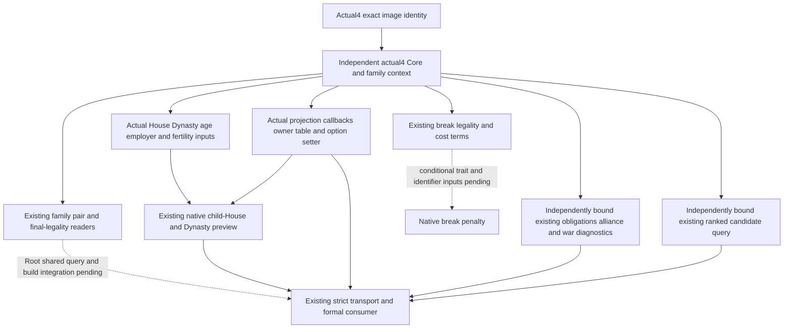

# CK3 1.20.0.4 adopted family query bindings

This migration targets native `1.20.0.4`, Steam `25734779`, SHA-256 `98702F88A547CDE2EAF29A85F93B85F68EE4CF8148336A4F7AFAEB75319DD518`. It restores existing family, marriage and first-heir observations through independent actual4 binders. The existing software DTOs and readers are retained. No older image binder, substitute SHA, uniform address shift, new policy or unadopted loaded-fertility-threshold feature is used.

## Closed native inputs

The finite native context map supplies redirect/constructor/refresh/finalize/validate/destroy callbacks and recipient/intermediary acceptance, cost, trigger, answer and option-setter callbacks. Actual definition lookup/hash/database and its `+0xF30` arrange-definition member are source closed. The frameless highest-tier entry is rooted in an actual mapped call operand. House/Dynasty slots and component layout reuse the shared prisoner collection proof; the additional House63B window and database7B window reuse existing cache where available. Effective fertility uses the actual gate `28BB4C0` and the fully mapped effective-getter proof, retaining extension `+0x1B0` and signed raw cache `+0x2E0`.

The current native child-House preview binds actual parent getter `1375380` and the actual offer-owner vtable `454E470`, derived from the mapped constructor's RIP-relative LEA. Projection independently binds wrapper `2505550`, option reader `3078860`, allied predicate `2911DD0`, pair generator `2C7C480` and owner `454E6F8`. The owner address derives from the mapped UI producer's actual LEA; all eight owner-table entries were then captured once. Existing projection validation and matrilineal selection explicitly choose these actual4 coordinates and prefixes. This is a migration of the existing validation behavior.

The outcome and spouse-producer receipts used by the [relationship migration](family-relationships-12004.md) also close existing age/selector/adult-threshold, grand-wedding/matrilineal option and employer member inputs. Loaded adult thresholds remain observations through their existing slots; they are distinct from the excluded new candidate-fertility scorer threshold.

The independent actual4 `BindFamilySubjectImage` reuses the actual family/value pointers and the existing software child predicate. The shared native `inline_child_relation` proof explicitly reads Family parent slots `+0/+4`, parent full ID `+0x18` and child Family pointer `+0x1A8`. A single32B diagnostic operand window maps old `1C11BB4` to actual `1C11B94` and closes the existing named children collection at Family `+0x38`, data `+0` and count `+0xC`; it adds64B/2physical reads across the frozen images. The diagnostic collection does not replace the actual child-of admission predicate.

The existing ranked candidate query now selects an independent actual4 `BindFamilyRankedImage`. Its native enumerator `1A3BD20`, score filter `1A3C650`, sort/scored initialization and buffer lifecycle callbacks are individually mapped; Strategy/age/cap and typed owner/allocator operands are retained. Candidate initialization is rooted in the actual candidate-owner table's single necessary `+0x20` entry. The scored-row owner `4528110` derives from the uniquely authorized7B constructor LEA at actual `1A3C986`; the scorer body and fertility-threshold branch were not recaptured or adopted as a new feature. Shared Council release and Army row-destruction proofs are reused. This migration preserves the existing native producer, candidate order and acceptance flow; it does not reconstruct the pool or change policy. The ranked topic mailbox explicitly accepts actual4 and selects the new binder. Source receipts and Mermaid are `actual4-ranked/`; added owned cost4670B/20physical reads.

The existing obligations alliance reader now selects `BindFamilyObligationsAllianceImage`. Eight uniquely mapped target/setup/availability/precheck/considering/restriction/range/was-called bodies retain their complete instruction shape and ordered relative/RIP operands. Generic construction, current-allies predicate, participant and War storage use shared Prisoner/Army/family proofs. A277B named War-resolution witness derives the actual fallback slot `5D1DE40`; the necessary34B Realm-vector operand window closes Character `+0x1C0`, Realm `+0x318`, pointer `+0` and count `+0xC`. This preserves the existing readonly current-allies and war-exposure query. Optional C88 text remains explicitly unavailable pending its separate shared description callbacks, while Boolean diagnostics are source implemented. Receipts and source/Mermaid are `actual4-alliance-map/`; owned cost8728B/20physical reads.

The existing bilateral alliance-pair reader also admits the actual4 projection through its source-proved actual4 validator. Its separate historical SHA check previously rejected the new binder before reaching `is_allied`. This small version seam is independent of the sender migration and preserves the existing two-direction read and frame checks.

Exact source trees, Mermaid diagrams and captures are under `Z:/ck3_mod_rewrite_process_assets/g2-migration-20261007/marriage-family/actual4-native/`, `actual4-heir-lineage/`, `actual4-projection-map/` and `capacity-seam/`. Shared Dynasty/member proof is `Z:/ck3_mod_rewrite_process_assets/g2-background-20261007/upstream-build-migration/prisoner/current4-collection/COLLECTION-LAYOUT-LEDGER.json`. The family native child used3331B/22physical reads; lineage used1558B/8; projection used3032B/11. The relationship chain used6663B/9. Shared evidence is reused and its physical cost is not recounted here.

## Existing production integration

The actual4 API exposes `BindFamilyContextImage`, `BindFamilyValuesImage`, `BindFamilyImage`, `BindFamilyProjectionImage`, `BindFamilyLineageImage`, `BindFamilyObligationsBreakImageV1`, `BindFamilySubjectImage`, `BindFamilyRankedImage` and `BindFamilyObligationsAllianceImage`. The existing obligations topic mailbox accepts the exact actual4 descriptor and selects the independent lineage, break-term and alliance binders, then renders its existing serialized result through `Render12004BuildIdentity`. The current actual3 action descriptor remains required for call-ally submission until its existing sender dependency migrates. The source baseline's strict transport already admits exact actual4 identity. Its obligations `kind` remains the existing `.2` software DTO identifier while `Render12004BuildIdentity` renders actual version/SHA; no strict metadata rewrite is required.

The existing native-auto-run family opt-in needs the same readonly `allow_private_family_obligations_query` assignment already supplied by the MCP `--private-family-obligations-query` option. The minimal external recipe is `actual4-strict/RUNTIME-HOOK.patch`; Root performs shared configuration integration and SDK qualification.

The already adopted call-ally action's Python transport now permits the exact frozen actual3 or actual4 identities through the existing build helper and requires the result's version/SHA to match that same source frame. Its wire step/schema/kind, permission, submission and material checks remain unchanged. The native actual4 renderer already renders the existing action receipt's version/SHA. Actual4 native submission still awaits the shared mapped command constructor/copy/queue inputs; this strict metadata delta alone does not restore action execution. Its source tree and patch receipt are `actual4-call-ally-seam/`.

Ordinary marriage sender bindings, optional alliance explanation text and conditional break penalty have independent necessary binding inputs still in progress. Their migration must use actual mapped sources rather than old binders. The ranked native candidate producer and Boolean obligations alliance diagnostics are source implemented; Root qualification remains pending. Source closure does not claim restored runtime behavior. Root owns adapter/bridge/CMake hooks, builds and paused ordinary Robert29829 verification. This packet ran no production import, fixture FIRST, test, build or game contact and claims no new candidate opportunity or natural succession.
