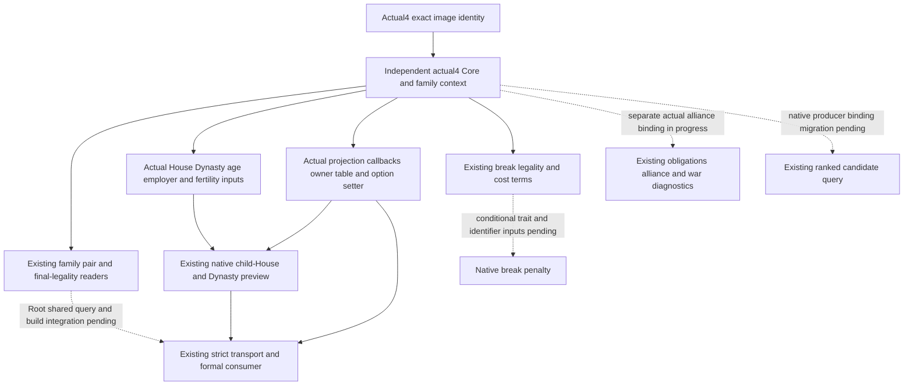

# CK3 1.20.0.4 adopted family query bindings

This migration targets native `1.20.0.4`, Steam `25734779`, SHA-256 `98702F88A547CDE2EAF29A85F93B85F68EE4CF8148336A4F7AFAEB75319DD518`. It restores existing family, marriage and first-heir observations through independent actual4 binders. The existing software DTOs and readers are retained. No older image binder, substitute SHA, uniform address shift, new policy or unadopted loaded-fertility-threshold feature is used.

## Closed native inputs

The finite native context map supplies redirect/constructor/refresh/finalize/validate/destroy callbacks and recipient/intermediary acceptance, cost, trigger, answer and option-setter callbacks. Actual definition lookup/hash/database and its `+0xF30` arrange-definition member are source closed. The frameless highest-tier entry is rooted in an actual mapped call operand. House/Dynasty slots and component layout reuse the shared prisoner collection proof; the additional House63B window and database7B window reuse existing cache where available. Effective fertility uses the actual gate `28BB4C0` and the fully mapped effective-getter proof, retaining extension `+0x1B0` and signed raw cache `+0x2E0`.

The current native child-House preview binds actual parent getter `1375380` and the actual offer-owner vtable `454E470`, derived from the mapped constructor's RIP-relative LEA. Projection independently binds wrapper `2505550`, option reader `3078860`, allied predicate `2911DD0`, pair generator `2C7C480` and owner `454E6F8`. The owner address derives from the mapped UI producer's actual LEA; all eight owner-table entries were then captured once. Existing projection validation and matrilineal selection explicitly choose these actual4 coordinates and prefixes. This is a migration of the existing validation behavior.

The outcome and spouse-producer receipts used by the [relationship migration](family-relationships-12004.md) also close existing age/selector/adult-threshold, grand-wedding/matrilineal option and employer member inputs. Loaded adult thresholds remain observations through their existing slots; they are distinct from the excluded new candidate-fertility scorer threshold.

Exact source trees, Mermaid diagrams and captures are under `Z:/ck3_mod_rewrite_process_assets/g2-migration-20261007/marriage-family/actual4-native/`, `actual4-heir-lineage/`, `actual4-projection-map/` and `capacity-seam/`. Shared Dynasty/member proof is `Z:/ck3_mod_rewrite_process_assets/g2-background-20261007/upstream-build-migration/prisoner/current4-collection/COLLECTION-LAYOUT-LEDGER.json`. The family native child used3331B/22physical reads; lineage used1558B/8; projection used3032B/11. The relationship chain used6663B/9. Shared evidence is reused and its physical cost is not recounted here.

## Existing production integration

The actual4 API exposes `BindFamilyContextImage`, `BindFamilyValuesImage`, `BindFamilyImage`, `BindFamilyProjectionImage`, `BindFamilyLineageImage` and `BindFamilyObligationsBreakImageV1`. The existing obligations topic mailbox now accepts the exact actual4 descriptor and selects the independent lineage and break-term binders, then renders its existing serialized result through `Render12004BuildIdentity`. Its alliance branch awaits the separate actual binder; the current actual3 action descriptor remains required for call-ally submission. The source baseline's strict transport already admits exact actual4 identity. Its obligations `kind` remains the existing `.2` software DTO identifier while `Render12004BuildIdentity` renders actual version/SHA; no strict metadata rewrite is required.

The existing native-auto-run family opt-in needs the same readonly `allow_private_family_obligations_query` assignment already supplied by the MCP `--private-family-obligations-query` option. The minimal external recipe is `actual4-strict/RUNTIME-HOOK.patch`; Root performs shared configuration integration and SDK qualification.

Obligations alliance diagnostics, ranked native candidate production and conditional break penalty have independent necessary binding inputs. Their migration must use actual mapped sources rather than old binders. Source closure of the family basics does not claim these other components are already restored. Root owns adapter/bridge/CMake hooks, builds and paused ordinary Robert29829 verification. This packet ran no production import, fixture FIRST, test, build or game contact and claims no new candidate opportunity or natural succession.
