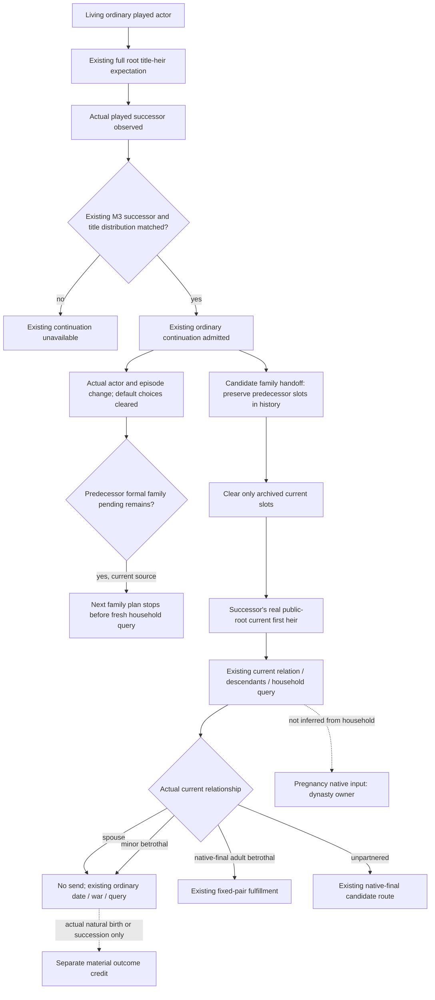

# R77 family opportunity after an ordinary successor episode

Source-first seal on 2026-10-08, before implementation. Parent supplied current
read-only Python source `Z:/gb0` at
`ca3888b11393df33425789532b3b6604d658ff55`; current native source is independently
pinned to `b2797e12...` by Root, and is not read or modified here. Actual build
is CK3 `1.20.0.4`, Steam25734779, SHA
`98702f88a547cde2eaf29a85f93b85f68ee4cf8148336a4f7afaeb75319dd518`.
No new native proof, EXE read/hash, game/SDK/import/test/build is performed.

## Native and episode inputs already available

- The actual4 full CampaignRoot supplies a real positive published revision,
  played actor, primary title's current first heir and per-held-title heir rows.
  `ck3-1.20.0.4-full-campaign-root.md` and the existing M3 transition topic are
  the underlying native/engine input trees. No heir is guessed from an earlier
  title partition or family record.
- Existing current-first-heir relationship query provides bilateral living
  spouse/betrothal IDs. Its same response publishes actual descendant roster
  and qualified age/selector/gated fertility for the role-owned current
  household. Root adopted the prior fresh-observation retention delta.
- Minor fixed betrothals already use native adult measures/runtime thresholds
  in `betrothal_actionability`, then native-final legality, recipient answer,
  costs and actual projected marriage outcome when eligible. No calendar-age
  guess or new adulthood gate is needed.
- A pregnancy revealed notification is not native pregnant state. Current
  native pregnancy belongs to the dynasty lane. Neither sex/age/fertility nor
  children0 supplies it. This package neither duplicates that observer nor
  requires it before the normal date step.
- For a new current first-heir target, use the existing same-frame public-root
  `heir_character_id`; for an actual child outcome use the descendant roster's
  identity/liveness/lineage and known living-Dynasty summary. Historical
  candidates and children are not successor instructions.

## Decisive actual production seam

`native_driver.py:20893` implements the existing
`continue-as-reconciled-successor` action. It checks the observed paused played
successor and a matched retained M3 reconciliation, including successor and
title-distribution checks (20908–20967). Ordinary campaign continuation keeps
the intent at20971–20976, then clears command history and changes actor/episode
at20980–20989. It also clears default arrange-marriage choices at21004–21005.
It does not hand off the durable formal family ledger.

`family_marriage_formal_consumer.py:538` reads that durable ledger from the same
driver `state_dir`. An existing pending row whose `episode_run_id` differs from
the new snapshot returns `selected_step=None` at541–543, before the fresh
current relation query. The fixed-betrothal consumer shares this ledger; its
pending fulfillment actor/episode mismatch similarly returns a handled stop
at134–144. The driver retains its `state_dir` across the admitted succession.

Therefore a deterministically constructible production sequence is:
an unresolved predecessor proposal, an actually admitted matched ordinary
succession, and the next successor family opportunity. The new episode stops
on the old pending slot. This is a source-visible value gap for M7. It is not
reported as an observed Robert failure: parent reports natural succession0,
and no new compound execution is made in this packet.

Existing resolved records alone are already ignored when their source episode
differs (ordinary family line586; fixed-betrothal lines166–168). They must stay
history, and an actual currently partnered heir must not receive another send.
Default player-child marriage behavior and its native choices are unchanged.

## Minimal implementation boundary

Add a family-owned helper that archives exactly the predecessor episode's
pending/resolved slots into the same ledger's `episode_history`, preserving
their full values and existing history. Clear only archived current slots.
Call it in the already admitted ordinary matched continuation, before the
driver changes its episode. It sends no command, queries no native proposal,
changes no recorded material status and does not fabricate a refusal,
acceptance, marriage, birth or cancellation. The next family opportunity can
then use the new current actor/first-heir observation through existing routes.

The helper is not a new continuation permission or wait gate. The caller's
existing M3 admission remains the authority. Legacy rogue lifecycle behavior,
default child selection, proposal send/result logic and resolved same-pair
no-resend semantics are retained. A new unique compound may later prove the
whole driver continuation→ledger→fresh current family path; it is authored
only and FIRST0 here.

Root FIRST02: GREEN, 2026-10-08T05:25:35Z, 4.4433477 seconds. Source d15f2eb67c71e8e53fa416ab119ab8c9a157bc16; one new real Driver/Service compound; original FIRST01 fixture ping RED retained. Evidence: Z:/ck3_mod_rewrite_process_assets/g2-parallel-20261008/family-current-decision32/r77-family-next/prepared-first02/qualification-first02/RESULT.json. Readiness: static-ready; no new actual game succession, birth or saved day.
