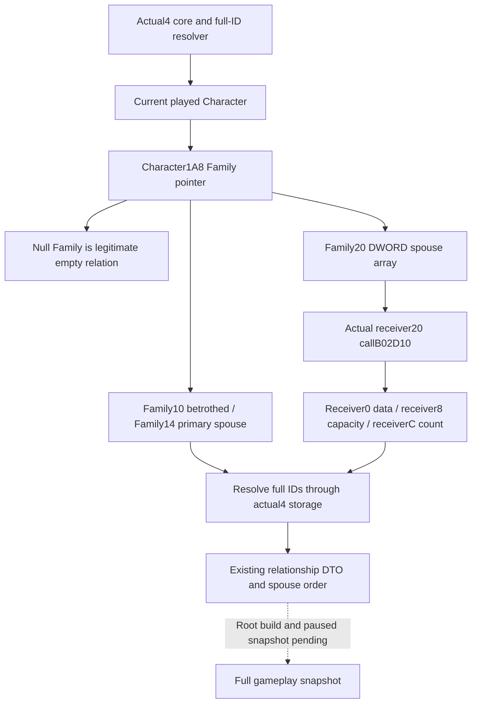

# CK3 1.20.0.4 family relationship observer

Installed actual native `1.20.0.4`, Steam `25734779`, executable `101040248` bytes, SHA-256 `98702F88A547CDE2EAF29A85F93B85F68EE4CF8148336A4F7AFAEB75319DD518`. The canonical PE comparison proves the native version from `.rdata`; generic Windows version metadata is not the game version. This source packet migrates the existing relationship observation needed by the full gameplay snapshot. It adds no proposal, candidate policy or fertility-threshold feature.

The independently mapped `ck3_12004::BindCoreImage` supplies actual core/storage addresses and generation-validating `ResolveCoreCharacter`. The relationship reader retains the existing software DTO, legal empty-family result, valid-full-ID filtering, spouse order and existing count/capacity checks.

## Actual native field proof

| Input | Actual new native source |
| --- | --- |
| Character family pointer `+0x1A8`, Family betrothed `+0x10` | `1B97150..1B971BA`, paired with old `1B97170..1B971DA` |
| Family primary spouse `+0x14` | `1B97200..1B97261`, paired with old `1B97220..1B97281` |
| Family spouse array `+0x20`, DWORD data `+0`, signed count `+0xC` | `137596C..137598F`, paired with old `137598C..13759AF` |
| Family spouse capacity `+0x28` | Actual typed receiver and array kernel below |

Shared field windows and their physical-read ledger are in `Z:/ck3_mod_rewrite_process_assets/g2-background-20261007/upstream-build-migration/full-snapshot-core-fields/FIELD-WINDOW-PAIRS.json` and `FIELD-WINDOW-READ-LEDGER.json`. Exact declared windows fully decode and normalize equal with member/immediate operands retained. They are reused rather than recaptured.

The missing capacity relation was closed through the actual native marriage path. Complete declared instruction spans map old outcome `2503C60` to new `2503C40` (676B), apply `2910B30` to `2910B10` (150B), spouse producer `2910320` to `2910300` (2055B), and Character spouse mutation `28B2D40` to `28B2D20` (332B). Each fully decodes and normalizes equal with ordered relative/RIP edges preserved. This proves individual mapped bodies, not a uniform RVA translation rule.

At new `28B2E38`, RCX loads `[Character(RDI)+0x1A8]`; `28B2E47` adds `0x20`; `28B2E4F` calls the actual DWORD-array kernel `B02D10`. The new237B kernel matches cached old237B instruction shape: `B02D2C` reads `[receiver+8]`, `B02D32` compares it with count, and `B02DB8` writes the grown capacity at `[receiver+8]`. The same receiver has pointer `+0` and count `+0xC`, so spouse-array capacity is actual Family `+0x28`.

Exact bodies, instruction pairs and physical-read receipts are under `Z:/ck3_mod_rewrite_process_assets/g2-migration-20261007/marriage-family/capacity-seam/`. That finite chain read6663B/9times across both frozen images; the old kernel body was reused. Whole-EXE reads, hashes, scans, PE/pdata rereads, allocator expansion, tests, builds and game contacts were zero.

Readiness is source implemented. Root alone performs shared snapshot integration, SDK/build and actual paused Robert29829 qualification. Historical fixtures are not rerun. No next heir, new candidate opportunity or natural succession is claimed.

The rest of the existing family, first-heir, native candidate and obligations query migration is recorded in [adopted family query bindings](family-bindings-12004.md), including the independent actual4 binders and remaining sender/conditional-input boundaries.
