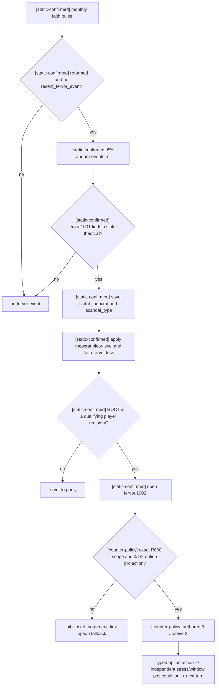

# `fervor.1002` 强制丑闻通知

状态：`static-ready after production B1`; R862 已在该修复下继续同一普通 campaign 100/100 turns，但事件未自然重现；source-reviewed option 的真实动作、物质后置和下一 turn 消费仍待复验。

这个专题只处理 CK3 `1.19.0.6` 普通 campaign 中会阻塞时间推进的精确事件
`fervor.1002`。它不提供 faith、doctrine、tenet、fervor、改宗、宗教改革或
holy order 策略，也不构成宗教能力广告。

## 冻结版本与 R860 帧

- CK3：`1.19.0.6`，`ck3.exe` SHA-256
  `2D00FF3101EF70B566F2FCBAE292F09263199C80E9DC8F139B82D7D96F83DB86`。
- 原版定义：`events/religion_events/fervor_events.txt:633-966`，SHA-256
  `06807E780BFF670DD8319B9A54270952990DD146BC5B069420DFDE3E784B3F63`。
- R860 `native:63` / revision `64` / date raw `53223216` / instance `4`：
  root `31853`；`sinful_theocrat=56125`；另有 `scandal_type:flag`、两个 dummy
  character scope 和 `scoped_primary_title:landed_title`；native `0/1/2` 都
  shown+enabled。
- R860 旧策略因完整 effect preview 不可用而走
  `active_event_degraded_minimal_choice`，按最低索引提交 native `0`。窗口确实消失，
  但 piety/opinion/rival 没有独立后置观测，所以这是已发生的 B1，不是新策略 GREEN。

## 原版触发树

`on_faith_monthly` 在 `common/on_action/religion_on_actions.txt:576-585` 调度
`faith_fervor_events_pulse`。后者在 `:898-910` 要求 faith 没有
`recent_fervor_event`，然后以 `chance_to_happen=6` 选择 `fervor.1001` 或
`fervor.2001`。隐藏事件 `.1001` 在 `fervor_events.txt:57-627` 选择罪恶神职人员和
丑闻类型，并在 `:620-624` 写入 1460 天 cooldown。因此 `.1002` 可在 cooldown
结束后的以后月份再次出现，不能用 `max_occurrences=1`。

弹窗前已经发生的 theocrat piety-level 与 faith-fervor 变化，不属于玩家选择。
`.1002` 的 `immediate` 只用 `show_as_tooltip` 重述它们。

## 三个 authored 选项

| authored / native | 原版效果 | 连续运行判断 |
| --- | --- | --- |
| 1 / 0 | ROOT +100 piety；theocrat 对 ROOT -30 opinion；vengeful 丑闻会建立 rival；部分人格获得 stress | 拒绝：存在持久关系风险，且 R860 的 flag payload 不足以排除 rival |
| 2 / 1 | ROOT -150 prestige、-100 piety；theocrat 对 ROOT +30 opinion；部分人格获得 stress | 拒绝：需要预算/关系权衡，当前事件连续性切片不做该优化 |
| 3 / 2 | 不改变资源、opinion 或 relation；ROOT 获得 base minor stress，另有原版人格调整 | 选择：持久副作用最小的 bounded continuation |

该选择不是原生 AI 等价或全局语义最优。原版三个 option 都没有显式
`ai_chance`。native `2` 的 stress base key 是 `minor_stress_impact_gain=20`；
`just` 使用 medium key，`brave/impatient/wrathful` 使用 minor key。真实 delta 仍受
角色 stress 调整与上限影响。

## Production contract 与 fail-closed 边界

contract 绑定：

- root 必须是当前 played character；`sinful_theocrat` 必须是另一个有效 character；
- saved scopes 必须恰好为 `sinful_theocrat:character`、`scandal_type:flag`、
  `dummy_servant_gender:character`、`dummy_clergy_gender:character`、
  `scoped_primary_title:landed_title`；
- snapshot/rendered option count 必须都是 3，native 顺序必须恰好为 `0,1,2`；
- 三项必须全部 shown+enabled 且非 fallback/cancel；
- 只允许 typed `select-event-option-3`。任何 key/root/window/scope/option 漂移都
  `active_event_registry_contract_blocked`，不得回落到 degraded first option。

R860 的角色 ID、dummy ID、日期与 instance 只保留为 observation，不写入可迁移
contract。`scandal_type` payload 继续 opaque：选择 native `2` 不依赖其具体值，因此
不需要借本修复扩展通用 flag 或宗教观测。

独立物质后置绑定 `played_character.stress_points non_decreasing`。窗口消失只能证明
结构后置；source-reviewed 路线只有在 native `2` 的真实 stress 观测和下一 turn 消费
完成后才能升级为 production-live。

## R862 未重现边界

R862 使用 master `d5fba52c` 从 R861 h981 成对 checkpoint 冷恢复，经正式
`g2_preview_operator.py run -> native_auto_run` 完成 100/100 turns、50 次查询、
50 次 gameplay、16 个 checkpoint，并推进 1,522 游戏日到 h1146。期间自然处理了
`court_chaplain_task.0311/.0312`，但没有出现新的 `fervor.1002`。因此该运行只证明
修复后的普通 campaign 可以继续，不证明本事件 option3/native2 的 live 后置；状态仍为
static-ready/unadvertised。R862 report 与最终 pair 分别为 `EB6FF99B...A3233`、
`442FC751...92AE2` / `B5C18328...2FE01`。
